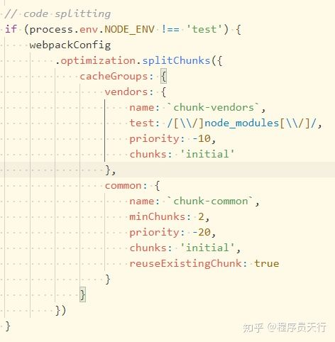

## splitChunks插件配置选项
- chunks选项，决定要提取那些模块。
    - 默认是async-只提取异步加载的模块出来打包到一个文件中
        - 异步加载的模块：通过import('xxxx')或者require(['xxxx'], () => {})加载模块
    - initial:提取同步加载和异步加载模块，如果xxx在项目中异步加载了，也同步加载了，那么xxx这个模块会被提取两次，分别打包到不同的文件中。
        - 同步加载的模块：通过import xxx或者require('xxx')加载的模块
    - all:不管异步加载还是同步加载的模块都提取出来，分别打包到一个文件中
- minSize选项：规定被提取的模块在压缩前的大小最小值，单位为字节，默认为30000，只有超过了30000字节才会被提取
- maxSize选项：把提取出来的模块打包生成的文件大小不能超过maxSize，如果超过了，要对齐进行分割并打包生产新的文件。单位为字节，默认为0，表示不限制大小
- minChunks选项: 表示要被提取的模块最小被引用次数，引用次数超过或者等于minChunks值，才能被提取
- maxSyncRequest选项:最大的按需(异步)加载次数，默认为6
- maxInitiaRequests选项:打包后的入口文件加载时候，还能同时加载js的数量(包括入口文件)默认为4
先说下优先级maxInitialRequests < maxAsyncRequests < maxSize < minSize
- automaticNameDelimiter选项：打包生产的js文件名的分隔符，默认为~
- name选项:打包生成js文件的名称
- cacheGroups选项：**核心重点,配置提取模块的方案**。里面每一项代表一个提取模块的方案。下面是cacheGroups每项中特有的选项，区域选项和外面一致，若cacheGroups每项中有，就按配置的，没有就使用外面配置的
    - test选项：用来匹配要提取的模块的资源路径或名称。值是正则或函数
    - priority选项:方案的优先级，值越大表示提取模块时优先采用此方案。默认为0
    - reuseExistingChunk选项：true/false。为true时，如果当前要提取的模块，在已经在打包生成的js文件中存在，则将重用该模块，而不是把当前要提取的模块打包重新生成新的JS文件
    - ecforce选项：true/false。为true时，忽略minSize, minChunks，maxAsyncRequests和maxInitialRequests外面选项
    - maxInitialRequests(默认是3) 一个入口最大的并发请求数
    - maxAsyncRequests (默认是5) 按需加载的时候最大的并发请求数
    - enforce 告诉 webpack 忽略 splitChunks.minSize, splitChunks.minChunks, splitChunks.maxAsyncRequests and splitChunks.maxInitialRequests，总是为这个缓存组创建 chunks


配置有很多，下面在实际项目中使用SplitChunks,让你更深刻理解这些配置选项

首先了解一下SplitChunks在Vue Cli3中的默认配置。在Vue Cli3源码中这样配置



整理后默认配置如下
```
module.exports = {
    configureWebpack: config => {
        return {
            optimization: {
                splitChunks: {
                    chunks: 'async',
                    minSize: 30000,
                    maxSize: 0,
                    minChunks: 1,
                    maxAsyncRequests: 6,
                    maxInitialRequests: 4, 
                    automaticNameDelimiter: '~',
                    cacheGroups: {
                        vendors: {
                            name: `chunk-vendors`,
                            test: /[\\/]node_modules[\\/]/,
                            priority: -10,
                            chunks: 'initial'
                        },
                        common: {
                            name: `chunk-common`,
                            minChunks: 2,
                            priority: -20,
                            chunks: 'initial',
                            reuseExistingChunk: true
                        }
                    }
                }
            }
        }
    }
}

// 实例二--多页面
pages: {
  index: {
    entry: 'src/views/pc/index.ts',
    chunks: ['vendors', 'chunk-common', 'svg', 'element-ui', 'src', 'uikit', 'sentry', 'html2canvas', 'index'],
  },
  welcome: {
    entry: 'src/views/site/index.ts',
    chunks: ['vendors', 'chunk-common', 'svg', 'element-ui', 'lottie', 'sentry', 'welcome'],
  },
},

configureWebpack: {
    devtool: 'hidden-source-map',
    resolve: {
        alias: {
        'bn.js': path.resolve(process.cwd(), 'node_modules', 'bn.js'),
        },
    },
    performance: {
        hints: false,
    },
    optimization: {
        usedExports: true,
        splitChunks: {
        chunks: 'all',
        minChunks: 1,
        // maxSize: 244 * 1024,
        cacheGroups: {
            'element-ui': {
                name: 'element-ui',
                test: /[\\/]node_modules[\\/]element-ui[\\/]/,
                priority: 2,
                chunks: 'all',
                reuseExistingChunk: true,
                enforce: true,
            },
            uikit: {
                name: 'uikit',
                test: /[\\/]@uikit[\\/]/,
                priority: 1,
                chunks: 'all',
                reuseExistingChunk: true,
                enforce: true,
            },
            src: {
                name: 'src',
                test: /[\\/]@src[\\/]/,
                priority: 1,
                chunks: 'all',
                reuseExistingChunk: true,
                enforce: true,
            },
            sentry: {
                name: 'sentry',
                test: /[\\/]@sentry[\\/]/,
                priority: 1,
                chunks: 'all',
                reuseExistingChunk: true,
                enforce: true,
            },
            html2canvas: {
                name: 'html2canvas',
                test: /[\\/]html2canvas/,
                priority: 1,
                chunks: 'all',
                reuseExistingChunk: true,
                enforce: true,
            },
            lottie: {
                name: 'lottie',
                test: /[\\/]lottie/,
                priority: 1,
                chunks: 'all',
                reuseExistingChunk: true,
                enforce: true,
            },
            svg: {
                name: 'svg',
                test: /\.(svg)$/,
                priority: 1,
                chunks: 'all',
                reuseExistingChunk: true,
                enforce: true,
            },
            // coms: {
            //   name: 'coms',
            //   test: resolve('src'),
            //   priority: 0,
            //   chunks: 'all',
            //   reuseExistingChunk: true,
            //   enforce: true,
            // },
            vendors: {
                name: 'vendors',
                test: /[\\/]node_modules[\\/]/,
                priority: -20,
                chunks: 'all',
                reuseExistingChunk: true,
                enforce: true,
            },
            common: {
                name: 'chunk-common',
                chunks: 'initial',
                minChunks: 2,
                maxInitialRequests: 5,
                minSize: 0,
                priority: -30,
                reuseExistingChunk: true,
            },
        },
        },
    },
    plugins: process.env.VUE_APP_SENTRY_SOURCEMAP
        ? [
            new SentryCliPlugin({
            include: './dist',
            ignoreFile: '.gitignore',
            release: `${process.env.NODE_ENV}-${process.env.VUE_APP_VERSION}`,
            ignore: ['node_modules', 'vue.config.js'],
            configFile: '.sentryclirc',
            urlPrefix: process.env.VUE_APP_PUBLIC_PATH ? process.env.VUE_APP_PUBLIC_PATH : '~/',
            }),
        ]
        : [],
}

```
:::danger
1. coms 放开的话应该是禁止了按需加载
2. common里的chunks: 'initial' 如果是all打包报错，应该是代码内部同步、异步模块依赖问题造成的 改成initial正常,对打包大小会有一定影响
:::

## 总结
用SplitChunks插件来控制Webpack打包生成的js文件的内容的精髓就在于，防止模块被重复打包，拆分过大的js文件，合并零散的js文件。最终的目的就是减少请求资源大小和请求次数。因这两者是互相矛盾的，故要以项目实际的情况去使用SplitChunks插件，需切记中庸之道
## 资料

[splitChunks原文](https://zhuanlan.zhihu.com/p/152097785)

[optimization参考](https://segmentfault.com/a/1190000017066322)

[webpack的optimization配置](https://blog.csdn.net/weixin_43678786/article/details/85788759)


[如何使用 splitChunks 精细控制代码分割](https://juejin.cn/post/6844904103848443912)