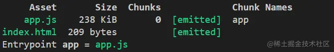

前端小伙伴都知道，Wie了降低包大小，经常会把依赖的前端模块独立打包，比如把vue、vue-router打到一个单独的包vendor中。另外，常会将存在多个路由的复杂页面的每个页面都单独打一个包，只有访问某个页面的时候，再去下载该页面的js包，以此来加快首页的渲染。

无论是react还是vue都提供了完善的工具，帮我们屏蔽了繁琐的配置工作。当我们对代码进行构建时，已经自动帮我们完成了代码的拆分工作。

所以，很多小伙伴并不知道背后到底发生了什么事。至于为什么这么拆分，到底如何控制代码的拆分，更是一头雾水了

## 问题测验
讲解开始之前，大家先看一个问题。如果你已经知道问题的答案，而且明白为什么，就不必往下阅读了。如果不知道答案或者知道答案，但不知道原因。那么，强烈建议阅读本文。
```js
// webpack.config.js
const path = require('path');
const HtmpWebpackPlugin = require('html-webpack-plugin');

module.exports = {
    entry: { app: './src/index.js' },
    output: {
        filename: '[name].js',
        path: path.resolve(__dirname, 'dist')
    }, 
    optimization: {
        splitChunks: {
            chunks: 'all'
        }
    },
    plugins: {
        new HtmlWebpackPlugin()
    }
}
```

```js
// index.js
import "vue"
import(/*webpackChunkName: 'a' */ "./a");
import(/*webpackChunkName: 'b' */ "./b");

// a.js
import "vue-router";
import "./someModule"; // 模块大小大于30kb

// b.js
import "vuex";
import "./someModule"; // 模块大小大于30kb

// someModule.js
// 该模块大小超过30kb
// ...
```
## 代码分割的三种形式
webpack中以下三种常见的代码分割形式：
- 入口起点: 使用entry配置手动的分离代码
- 动态导入: 通过模块的内联函数调用来分离代码
- 防止重复: 使用splitChunks 去重和分离chunk

第一种方式，很简单，只需要在entry里配置多个入口既可
```js
entry: { app: './index.js', app1: './index1.js' }
```
第二种方式，就是在代码中自动将使用 import() 加载的模块分离成独立的包
```js
// ....
import('./a')

// ...
```
第三种方式，是使用 splitChunks 插件，插件分离规则，然后 webpack 自动将满足规则的 chunk 分离，一切都是自动完成的。

前两种拆分方式，很容易理解。本文主要针对第三种方式进行讨论

## splitChunks代码拆分
### splitChunks 默认配置
```js
splitChunks: {
    // 表示选择哪些chunks进行分割，可选值有:async、initial 和 all
    chunks: 'async',
    // 表示新分离出的chunk必须大于等于minSize 默认为30000，约30KB
    minSize: 30000,
    // 表示一个模块至少应被minChunks个chunk所包含才能分割。默认为1
    minChunks: 1,
    // 表示按需加载文件时，并行请求的最大数目。默认为5
    maxAsyncRequests: 5,
    // 表示加载入口文件时，并行请求的最大数目。默认为3。
    maxInitialRequests: 3,
    // 表示拆分出的chunk的名称连接符。默认为~,如chunk~vendors.js
    automaticNameDelimiter: '~',
    // 设置chunk的文件名。默认为true。当为true时，splitChunks基于chunk和cacheGroups的key自动命名。
    name: true,
    // cacheGroups 下可以可以配置多个组，每个组根据test设置条件，符合test条件的模块，就分配到该组。模块可以被多个组引用，但最终会根据priority来决定打包到哪个组中。默认将所有来自 node_modules目录的模块打包至vendors组，将两个以上的chunk所共享的模块打包至default组。
    cacheGroups: {
        vendors: {
            test: /[\\/]node_modules[\\/]/,
            priority: -10
        },
        // 
    default: {
            minChunks: 2,
            priority: -20,
            reuseExistingChunk: true
        }
    }
}
```
以上配置，可以概括为如下4个条件
1. 模块在代码中被复用或者来自node_modules文件夹
2. 模块的体积大于等于30kb（压缩之前）
3. 当按需加载chunks时，并行请求的最大数量不能超过5
4. 页面初始加载时，并行请求的最大数量不能超过3

```js
// index.js
import('./a');

// ....
```
```js
// a.js
import 'vue';
// ...
```
以上代码，在默认配置下的构建结果如下


#### 原因分析
- index.js作为入口文件，属于入口起点手动配置分割代码的情况，因此会独立打包(app.js)
- a.js通过import()进行加载，属于动态导入的情况，因此会独立打包一个包(1.js)
- vue来自node_modules目录，并且大于30kb;将其从a.js拆出后，与a.js并行加载，并行加载的请求数为2，未超过默认的5；vue拆分后，并行加载的入口文件并无增加，未超过默认的3.vue也符合splitChunks的拆分条件，单独打了一个包(2.js)

### 理解chunks
chunks用以告诉splitChunks的作用对象，其可选值有async、initial和all。默认值是async,也就是默认值选取异步加载的chunk进行代码拆分。这个我们在开头的例子里已经验证。这里我们通过两个例子来看一下当chunks的值为initial和all时，打包结果如何。我们将chunks值改为initial
```js
chunks: 'initial'
```
构建结果如下


#### 原因分析
当chunks值为initial时，splitChunks的作用范围变成了非异步加载的初始chunk,例如我们的index就是初始化的时候就存在chunk。而vue模块是在异步加载的chunk a.js中引入的，所以并不会被分离出来

<span style="color: red">chunks扔使用initial，我们对index.js和a.js稍作修改</span>
```js
// index.js
import 'vue'
import('./a')
```
```js
// a.js
console.log('a')
```
构建结果如下


#### 原因分析
vue在index.js直接被引入，而index.js是初始chunk，所以分离出来打到了vendors~app.js中。

能不能让splitChunks既处理初始chunk也处理异步chunk呢？答案是可以的，只需要将chunks改为all
```js
chunks: 'all'
```
对index.js和a.js稍作修改
```js
import 'vue-router';
import('./a');

// a.js
import 'vue';
console.log('a')
```
构建结果如下


#### 原因分析
chunks值为all时，splitChunks的处理范围包括了初始chunk和异步chunk两种场景，因此index.js中的vue-router被分拆到了vendors~app.js中，而异步加载的chunk a.js中的vue被分拆到了3.js中。推荐在开发中将chunks设置为all.

## 理解maxInitialRequests
maxInitialRequests 表示 splitChunks 在拆分chunk后，页面中需要请求的初始chunk数量不超过指定的值。所以初始chunk，值得是页面渲染时，一开始就需要下载的js，区别在于页面加载完成后，通过异步加载的js

对splitChunks 做以下修改，其他使用默认配置
```js
chunks: 'initial',
maxInitialRequests: 1
```
对index.js稍作修改
```js
// index.js
import 'vue'
```
构建结果如下


#### 原因分析
因为 maxInitialRequests 为1, 如果vue从index.js中拆出的话，新创建的chunk作为初始chunk index的前置依赖，是需要在页面初始化的时候就先请求的。那么初始化时的请求数变成了2，因此不满足拆分条件，所以splitChunks没有对index.js进行拆分

### 理解maxAsyncRequests
与 maxInitialRequests相对，maxAsyncRequests表示 splitChunks在拆分chunk后，并行加载的异步chunk数不超过指定的值

对splitChunks做以下修改，其实使用默认配置
```js
maxAsyncRequests: 1
```
对index.js稍作修改
```js
// index.js
import('./a')

// a.js
import 'vue';
console.log('a')
```
构建结果如下


#### 原因分析
因为maxAsyncRequests 为1， 由于a.js是通过import()异步加载的，此时并行的异步请求数是1。如果将vue从a.js中拆出的话，拆出的包也将成为一个异步请求chunk。这样的话，当异步请求a.js的时候，并行请求数有2个。因此，不满足拆分条件。所以splitChuns没有对a.js进行拆分

### 理解minChunks
<span style="color: red">minChunks 表示一个模块至少应被指定个数的chunk所共享才能分割。默认为1</span>

对splitChunks做以下修改，其他使用默认配置
```js
chunks: 'all',
minChunks: 2
```
对index.js稍作修改
```js
// index.js
import 'vue'
```
构建结果如下：


#### 原因分析
因为minChunks为2， 所有只有当vue至少被2个chunk所共享时，才会被拆分出来

#### 思考题
请问如下代码，构建结果是什么
```js
chunks: 'all',
minChunks: 2

// index.js
import 'vue';
import './a'

// a.js
import 'vue';
console.log('a')
```
### 理解cache groups
cacheGroups继承 splitChunks里所有属性的值，如chunks、minSize、minChunks、maxAsyncRequests、maxInitialRequests、automaticNameDelimiter、name ，我们还可以在 cacheGroups 中重新赋值，覆盖 splitChunks 的值。另外，还有一些属性只能在 cacheGroups 中使用：test、priority 、reuseExistingChunk。

通过cacheGroups，我们可以定义自定义chunk组，通过test条件对模块进行过滤，符合条件的模块分配到相同的组。

<span style="color: red">cacheGroups有两个默认的组，一个是vendors，将所有来自node_modules目录的模块；一个default,包含了由两个以上的chunk所共享的模块</span>

首先找到该chunk所属的分组，该例为vendors分组，作如下修改，其他使用默认配置
```js
chunks:'all',
cacheGroups: {
    vendors: {
      test: /[\\/]node_modules[\\/]/,
      name: "customName",
      priority: -10
    }
}

// index.js
import 'vue'
```
构建结果如下


#### 原因分析
vue来自 node_modules目录，，被分配到了默认的 vendors 组中，如果不指定 name 的话，会使用默认的chunk名，这里我们指定了 name，因此最终的chunk名为customName。

模块还可以分配到多个不同的组，但最终会根据 priority 优先级决定打包到哪个 chunk。

新增一个分组
```js
chunks:'all',
cacheGroups: {
    vendors: {
      test: /[\\/]node_modules[\\/]/,
      name: "customName",
      priority: -10
    },
    customGroup: {
      test: /[\\/]node_modules[\\/]/,
      name: "customName1",
      priority: 0
    }
}
```
构建结果


#### 原因分析
虽然vendors和customGroup这两个组的条件都符合，但由于后者的优先级更高，所以最终将vue打包到了customName1.js中


## 资料
[如何使用 splitChunks 精细控制代码分割](https://juejin.cn/post/6844904103848443912#heading-2)