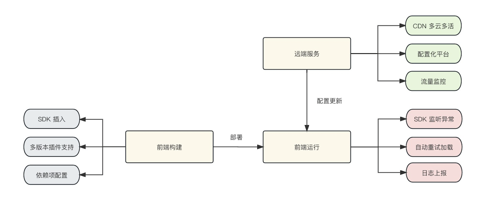
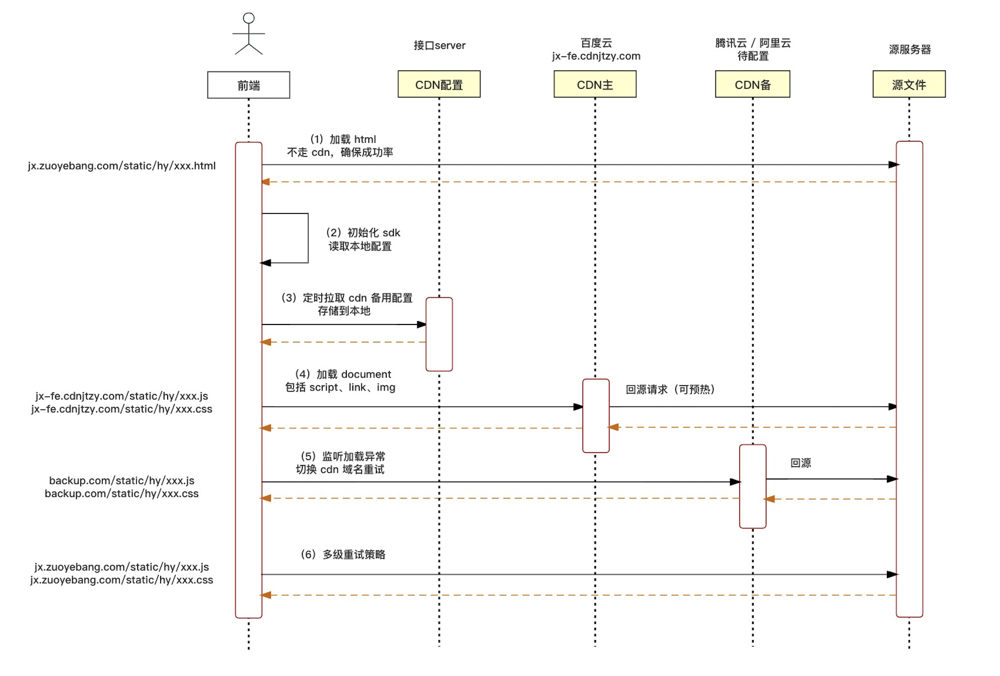
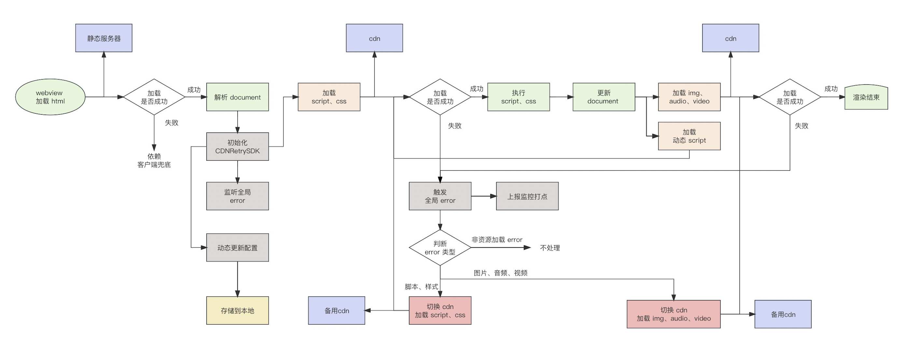

## 调研
方案| 相关文章 | 关键点 | 评估结论
---|---|---|---|---
注入充实脚本| [前端网站容灾-CDN主域重试方案](https://mp.weixin.qq.com/s/EOUxBGQpUChNwXezNP5uFg) | 给html注入重试脚本<br/> 通过onerror触发重试<br/>通过 document.write保证执行顺序 | 可行性较高<br/> 成本可控 <br/>风险低
自定义加载器 | [从0-1:美团侧CDN容灾解决方案](https://tech.meituan.com/2022/01/13/phoenix-cdn.html) | 将标签加载改成xhr加载<br/>loader处理重试、保证执行顺序 <br/>动态域名计算服务 | 可行性中<br/>成本高<br/>风险高
客户端拦截方案||webview拦截js、css 加载<br/>客户端处理重试、保证执行顺序 | 可行性高<br/>成本高<br/>风险高
网关切留|||不考虑
其他| [得物CND域名收敛及多厂商容灾优化实践](https://mp.weixin.qq.com/s/W6k458TyCFHywqUfr7p7cA)<br/>[B站SRE负责人亲述 713事故后的多活容灾建设](https://mp.weixin.qq.com/s/1Z6dqJYlaR9WZM2yoqB_oQ)|纯端方案<br/>服务端方案|不可行

## 方案设计
模块关系视角


网络层视角


浏览器视角


## 具体实现
### 前端工程构建
- 引入插件

    主要支持的插件包括
    - vue-cli插件
        - vue-cli 2.x(依赖webpack 4.x、html-webpack-plugin 3.x)
        - vue-cli 5.x(依赖webpack 5.x、html-webpack-plugin 5.x)
    - webpack 插件
        - webpack 4.x（适用于 vue-cli 4.x）
        - 【DONE】webpack 5.x（适用于 vue-cli 5.x）
        - 【DONE】html-webpack-plugin 3.x（适用于 vue-cli 4.x）
        - 【DONE】html-webpack-plugin 5.x（适用于 vue-cli 5.x）
    - vite插件
        - vite 3.x - 4.x
    - SDK函数
        - retryJS
        - retryCSS
        - 【DONE】retryImg
        - 【DONE】retryAudio
        - 【DONE】retryMedia
- 新增构建配置  
    新增 vue.config.js 配置项 pluginOptions.cdnRetry

    全量拉取
    ```js
    module.export == {
        pluginOptions: {
            cdnRetry: {
                alias: 'CDN_SDK',
                // 配置页面中需要重试的cdn 资源类型，默认值为 js + css; dynamic-js为webbpack中动态导入的js
                types: [
                    'js', 'css', 'dynamic-js', 'img', 'audio', 'video'
                ]
            }
        }
    }
    ```
- 注入SDK代码(插件自动)

    注入SDK逻辑和SDK初始化逻辑，在所有资源顶部注入
    ```html
    <!-- 注入代码到 html 顶部 -->
    <html>
        <head>
            <script>
                class CDNRetrySDK { ...函数逻辑 }
                window.__cdnRetrySDK__ = new CDNRetrySDK()
                window.__cdnRetrySDK__.init({ ...构建配置 })
            </script>
        </head>
        <body></body>
    </html>
    ```
- 注入JS检查代码(插件自动)

    注入JS检查代码,当JS失败时，会使用document.write写入新脚本
    ```html
    <!-- 注入代码到每个 script 后面 -->
    <html>
        <head></head>
        <body>
        <script src="https://cdn-error.com/vue-swiper.js" onerror="javascript:__cdnRetrySDK__.retryJS(this, true)"></script>
        </body>
    </html>
    ```
    > vue-cli 5+上默认引入 webpack 5+ 和 html-webpack-plugin 5+，脚本默认使用defer方式引入，此时无法阻塞js按顺序执行，**插件会自动将 defer 模式降级成 blocking（常规加载方式）**vue 3+上默认使用ESM引入JS，重试脚本也会以module script 方式插入

- 重写 webpack4 动态模块加载函数(插件自动)

    重写 webpack mainTemplate 部分

    重写 vite preload 部分
    ```js
    // 当配置了 dynamic-js 后，会重写 __webpack_require__.e 函数，仅支持 webpack4 + webpack5
    __webpack_require__.e = function requireEnsureWithCDNRetry(chunkId) {
        var promises = [];
    
    
        // JSONP chunk loading for javascript
    
        var installedChunkData = installedChunks[chunkId];
        if(installedChunkData !== 0) { // 0 means "already installed".
    
            // a Promise means "currently loading".
            if(installedChunkData) {
                promises.push(installedChunkData[2]);
            } else {
                ......此处省略代码
    
                script.src = jsonpScriptSrc(chunkId);
    
                // create error before stack unwound to get useful stacktrace later
                var error = new Error();
                onScriptComplete = function (event) {
                    ......此处省略代码
                };
    
                ......此处省略代码
                script.onerror = script.onload = onScriptComplete;
    
                // 新增 sdk 容错逻辑
                if (window.__cdnRetrySDK__) {
                    script.onerror = function() {
                        script.onerror = null;
                        var retry = window.__cdnRetrySDK__.retryJS(script);
                        retry && retry.then(function() {
                            onScriptComplete({ target: script });
                        }).catch(function() {
                            onScriptComplete({ target: script });
                        });
                    };
                };
                document.head.appendChild(script);
            }
        }
        return Promise.all(promises);
    };
    ```
### 逻辑执行
- 主动监听

    初始化后会执行全局监听代码

    ```js
    // 全局监听error事件(捕获阶段)
    window[__on]('error', (err) => {
        const target = err && err.target;
        const tagName = __getTagName(target);
        // 判断是否可重试加载
        if(__canRetry(target)) {
            // 上报资源error
            __reportResourceError(err)
            if (tagName === 'script') {
                __errorScripts.push(target.src) // js为保证执行顺序，不立即处理
            } else if (tagName === 'link') {
                this.retryCSS(target)
            } else if (tagName === 'img') {
                this.retryImg(target)
            } else if (tagName === 'audio') {
                this.retryAudio(target)
            } else if (tagName === 'video') {
                this.retryVideo(target)
            }
        }
    })
    ```
- 主动重试

    - JS资源
        - 加载方式
            - 同步脚本 document script:监听onerror
            - 延迟脚本 defer script:改为同步脚本方式
            - 异步脚本 async script: 不考虑不处理
            - 动态脚本 webpack dynamic script：重写 webpack chunk loader
            - ESM脚本 module script：监听 onerror
        - 加载过程
            - document loading 阶段：document.write，此方式风险较高需要手动控制写入
            - document interactive 阶段：appendChild
            - document complete 阶段：appendChild
        - 重试队列
            - 根据备用 domain 配置，会创建一个重试队列，成功则返回，失败则进行下一次重试
    ```js
    /**
     * 重试加载 js
    * @param {*} target
    * @returns
    */
    retryJS(target, isDocWrite) {
        const src = target.src
        const newUrls = __getBackupUrls(src)
        if (!newUrls) return
    
        return __retryQueue(newUrls, (newSrc) => {
            return new Promise((resolve, reject) => {
                const id = `retry_js_${__retryJSIndex++}`
                const isESM = target.type === 'module'
                const isDefer = target.hasAttribute && target.hasAttribute('defer')
                if (isDocWrite) {
                    document.write(`<script id="${id}" src="${newSrc}" retry><\/script>`)
                    const script = document.getElementById(id)
                    script && __listenRetry(script, src, newSrc, resolve, reject)
                } else {
                    const script = document.createElement('script')
                    script.id = id
                    isESM && (script.type = 'module')
                    isDefer && script.setAttribute('defer', '')
                    __resetSrc(script, src, newSrc, resolve, reject)
                    __appendElem(script, target)
                }
            })
        })
    }
    ```
    - CSS 资源
        - css 同js一致，重试会新建一个link style标签
        - 为保证css解析执行顺序，新的CSS会插入到原来的老的css后面
    - CSS Background
        - 由于css background 不会触发error,此处解决方案为每当重试css插入时，会检查css rules中的backgrouindImage,将旧的替换成新的域名
    ```js
    /**
     * 处理 css background
    * @param {*} newSrc
    */
    const __processStyles = (src, newSrc) => {
        const styleSheets = document.styleSheets
        for (let i in styleSheets) {
            const style = styleSheets[i]
            // 仅处理当前加载的 css
            if (style.href === newSrc) {
                const rules = style.cssRules
                for (let j in rules) {
                    const rule = rules[j]
                    const styleBackgroundImage = rule.style && rule.style.backgroundImage
                    if (styleBackgroundImage && /^url\(/i.test(styleBackgroundImage)) {
                        const host = __getHost(src)
                        const newHost = __getHost(newSrc)
                        const regex = new RegExp(host, 'g')
                        // 替换 css 中的异常域名为新域名
                        rule.style.backgroundImage = styleBackgroundImage.replace(regex, newHost)
                    }
                }
            }
        }
    }
    ```
    - 非 JS、CSS 资源
        - 如果用户配置了该资源类型需要异常重试，会自动重置 src / href 触发 retry
        - audio、video 通过 canplay 事件来回调，其他元素则通过 load 事件

### 更新和缓存备用域名规则

- 拉接口
    - 入参：hosts 当前域名列表，即页面中可能出现的 cdn 域名
    - 出参：备用域名规则，此规则是动态更新的
    - 频率：每日更新，首次初始化立即更新
    - 存储：数据返回后存储到 localStorage
- 读配置
    - 页面打开时会初始化 SDK
    - SDK 会从 localStorage 读取域名替换规则
    - 配置基于页面 HOST 共享，本次写入、下次生效
- 域名替换
    - 基于域名替换规则，支持多级重试
    - 域名预埋
    - 域名是动态的，且更新频率不高，暂不考虑预埋

## 容灾演练

## 监控 & 数据回收