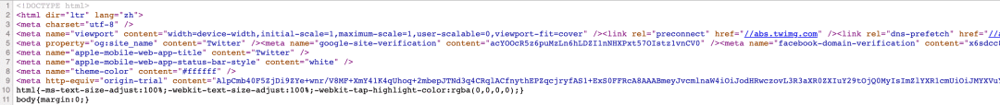
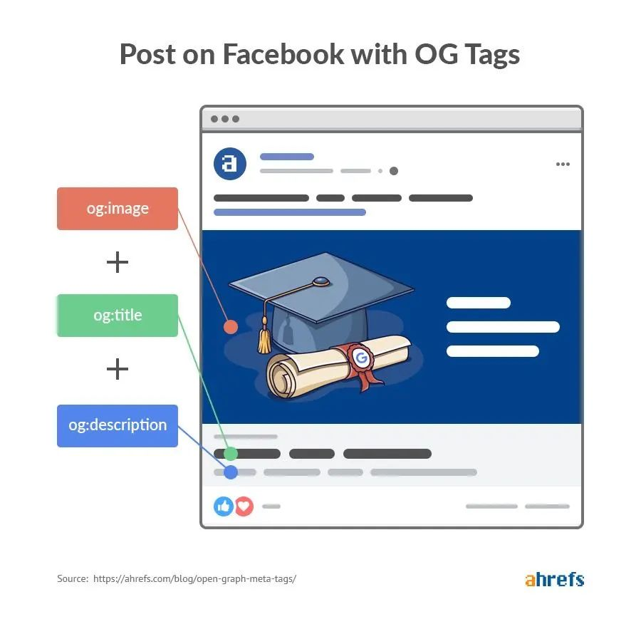
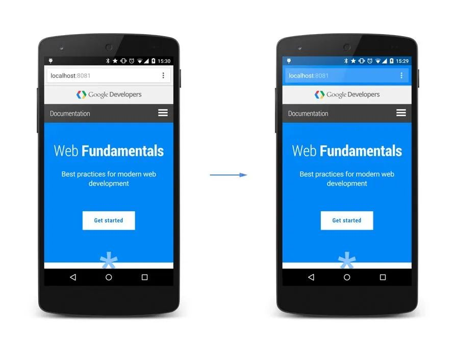
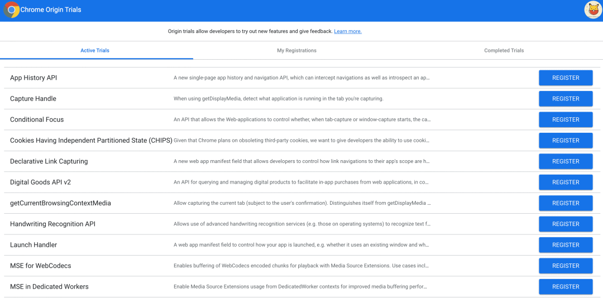

前段时间笔者看到有个老外在查品的时候喜欢问一个问题：请解释Twitter的前十行源码



其实这十来行源码如果真的要我来解释作用的话，那真是要麻了。其中确实有好几个不清楚的地方，所以笔者去具体查了这些代码的作用，今日分享一下

- &lt;!DOCTYPE html&gt;

    这个应该是笔者刚学前端的时候学的知识，这里就直接引用MDN的内容了
    :::tip
    在HTML中，文档类型doctype的声明是必要的。在所有文档的头部，你都将会看到""身影。这个声明的目的是防止浏览器在渲染文档时，奇幻岛我们成为的"怪异模式(兼容模式)"的渲染模式， ""确保浏览器按照最佳的相关规范进行渲染，而不是使用一个不符合规范的渲染模式
    :::
- &lt;html dir="ltr" lang="zh" &gt;

    首先html标签是根元素，所以别的元素都在里面。

    标签上有两个属性
    1. dir： 文档的文本方向，默认是ltr,表示从左到右。对于大部分语言来说都是这个文本方向，但比如阿拉伯问的haul就是从右到左了，使用rtl
    2. lang: 文档于洋，zh表示中文
- &lt;meta charset="utf-8"&gt;

    <span style="color: red">mate标签是文档级元数据元素，charset的作用是指定文档的字符集</span>

- &lt;meta name="viewport" .../&gt;

    这行代码应该大部分读者都了解它的意思。作用是告诉浏览器当前页面的窗口大小以及窗口缩放比例
    - width: 窗口的宽度，默认是device-width,表示设备的宽度
    - initial-scale: 缩放比例，默认是1，表示不缩放
    - maximum-scale: 最大缩放比例，默认是1，表示不缩放
    - user-scalable: 是否允许用户缩放，默认是yes，表示允许。代码中的0表示禁止用户缩放
    - viewport-fit: 多用于适配iPhone刘海屏

- &lt;meta property="og:site_name" content="Twitter" /&gt;

    这是Open Graph(OG)元标签，这个标签作用可能挺多读者不清楚作用

    首先这其实算是一个协议，由Facebook搞的，之前我也发过一篇关于OG的详细文章讲解 ，大家可以看下：[前端必看，连OG都不知道还好意思说自己开发过H5](https://mp.weixin.qq.com/s?__biz=MzAxODE2MjM1MA==&mid=2651594965&idx=2&sn=779d801edc215e08b31ad95f626dce1b&chksm=8022f714b7557e02748b955b7eb1b190e580387f1ea560de723d20c8b2991eb50956ce5874ba&scene=21#wechat_redirect)另外有兴趣的可以阅读下[官方网站](https://ogp.me/)，里面介绍了不少别的字段。

    

- &lt;meta name="apple-mobile-web-app-title" content="Twitter"&gt;

    这行与下一行都是作用在IOS上的，我们在IOS上能把某个网页添加到主屏幕上

    这个代码的作用是显示在屏幕上的书签标题，下一行代码作用是状态栏颜色

- &lt;meta name="theme-color" content="#ffffff" /&gt;

    浏览器将根据content中的内容设定颜色。

    比如说我们设置为蓝色时，此时浏览器颜色表现如下：
    

- &lt;meta http-equiv="origin-trial" content="..." /&gt;

    这应该又是一个鲜为人知的功能，主要是帮助开发者使用实验中的功能。

    这些实验中的功能都是做好但没开放出来的，如果我们想使用这个功能的话就需要用到这个标签了。

    有兴趣的读者可以在这个网站[2]上查看当前可用的实验功能，然后选择自己喜欢的功能并按照提示生成 token，然后再将这个标签填入 HTML 文件中即可启用选中的功能了。

    

    ```css
    html {
        -ms-text-size-adjust: 1
        ...
    }
    ```
    这行就是纯 CSS 相关的内容了。

    - text-size-adjust: 根据设备尺寸自动调整文字大小，这是为1就是不调整，否则对于小屏幕来说字号可能会变得很少导致可读性降低
    - tap-highlight-color: 点击时的高亮颜色，这个应该挺容易才出意思了


## 资料
[原文](https://mp.weixin.qq.com/s/SAHXnKbOV0IGmbEO4Fw1Tw)