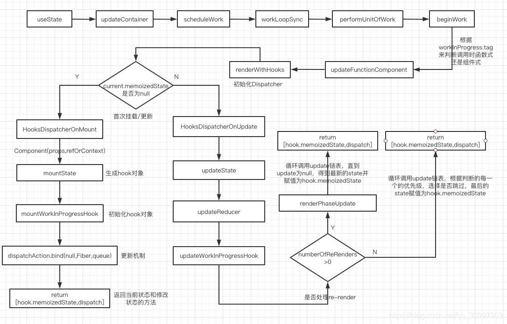

##  关于hook
### 为什么使用hook
在react类组件（class）写法中，有setState和生命周期对状态进行管理，但是在函数组件中不存在这些，故引入hooks（版本：>=16.8），使开发者在非class的情况下使用更多react特性。

以下是实现一个输入框，类组件和函数组件两种写法的对比：

```js
import React from 'react';
export default class Home extends React.Component {
  constructor(props) {
    super(props);
    this.state = {
      name: 'world'
    };
  }
  componentDidMount() {
    console.log('组件挂载后要做的操作')
  }
  componentWillUnmount() {
    console.log('组件卸载要做的操作')
  }
  componentDidUpdate(prevProps, prevState) {
    if (prevState.name !== this.state.name) {
      console.log('组件更新后的操作')
    }
  }
  render() {
    return (
      <div>
        <p>hello {this.state.name}</p>
        <input type="text" placeholder="input new name"
          onChange={(e) => this.setState({ name: e.target.value })}>
        </input>
      </div>
    );
  }
}

import React, { useState, useEffect } from 'react';

export default function Home() {
  const [name, setName] = useState('world');
  return (
    <div>
      <p>hello {name}</p>
      <DemoState />
    </div>
  )
}

function DemoState() {
  const [n1, setN1] = useState(1)
  const [n2, setN2] = useState(2)
  const [n3, setN3] = useState(3)

  useEffect(() => {
    setN1(10)
    setN1(100)
  }, [])
  const handleClick = () => {
    setN2(20)
    setN3(30)
  }
  console.log('demo-state', n1, n2, n3)
  return <button onClick={handleClick}>click</button>
}
```
上述例子中，useState相当于constructor，完成数据的初始化；

useEffect相当于componentDidMount和componentDidUpdate两个生命周期，通过return () => {}的方式解绑生命周期，相当于componentWillUnmount周期，以监听页面滚动为例，通过effect实现监听与解绑如下：

```js
useEffect(() = >{
window.addEventListener(‘scroll’, throttleFunc)
return () = >{
window.removeEventListener(‘scroll’, throttleFunc)
}
}, [])
```
在同一个effect钩子中实现绑定与解绑，使状态的管理更加方便、代码更简洁。

此外还有发生在页面渲染前的useMemo相当于shouldComponentUpdate周期等，具体关系如下表：
class组件|hooks
---|---
shouldComponentUpdate|useMemo
render|函数本身
getDerivedStateFromProps|useState 中的 update
getDerivedStateFromError|无
constructor|useState
componentWillUnmount|useEffect中的return函数
componentDidUpdate|useEffect
componentDidMount|useEffect
componentDidCatch|无

>结论：使用hooks的函数组件，简化了很多代码，不用维护复杂的生命周期，也不用担心this的指向问题。

### 1.2 什么是hook
hooks挂载在Fiber结点上的memoizedState，filber结构如下：
```
FiberNode { 
  memoziedState, 
  type, 
  key,
  tag,
  ...
}
```
memoziedState这个字段很重要，是组件更新的唯一依据。在class组件里，它就是this.state的结构，调用this.setState的时候，其实就是修改了它的数据，数据改变了组件就会重新执行。

也就是说，即使是class组件，也不会主动调用任何生命周期函数，而是在memoziedState改变后，组件重新执行，在执行的过程中才会经过这些周期。

所以，这就解释了函数式组件为什么可以通过hooks改变状态，实际上就是修改了对应fiber节点的memoziedState。

hooks主要有以下特点：

1、无需修改组件结构的情况下复用状态逻辑；

2、可将组件中相互关联的部分拆分成更小的函数，复杂组件将变得更容易理解；

3、每一个组件内的函数(包括事件处理函数，effects，定时器或者api调用等等)会捕获某次渲染中定义的props和state；

4、memo缓存组件 ,useMemo缓存值， useCallback缓存函数；

5、每次render都有自己的props、state和effects。(每一个组件内的函数，包括事件处理函数，effects，定时器或者api调用等等，会捕获某次渲染中定义的props和state)；

6、**更新状态的时候(如setCount(count + 1))，React会重新渲染组件，**每一次渲染都能拿到独立的count状态，这个状态值是函数中的一个常量；

7、没有了显性的生命周期，所有渲染后的执行方法都在useEffect里面统一管理；

8、函数式编程，不需要定义constructor、render、class；

9、某一个组件，方法需不需要渲染、重新执行完全取决于开发者，方便管理。

### 1.3 常见hook
useState、useEffect、useMemo、useCallback、useRef、useContext、useReducer…。

所有的钩子都是为函数引入外部功能，react约定，钩子一律使用use前缀命名。

## 常用hook
### 2.1 useState
示例：

const [stateA, setStateA] = useState(0)

参数是初始state（定义初始state最好给出初始值，方便后期维护， 0/false/’’/[]/{}）。

返回值：一个是当前state，一个是更新state的函数。

useState的实现很简单，只有两行
```js
export function useState<S>(initialState: (() => S) | S) {
  const dispatcher = resolveDispatcher();
  return dispatcher.useState(initialState);
}
```
重点都在dispatcher上，dispatcher通过resolveDispatcher()来获取，这个函数只是将ReactCurrentDispatcher.current的值赋给了dispatcher
```js
function resolveDispatcher() {
  const dispatcher = ReactCurrentDispatcher.current;
  return dispatcher;
}
```
useState挂在dispatcher上，resolveDispatcher() 返回的是 ReactCurrentDispatcher.current，所以useState(xxx)等价于ReactCurrentDispatcher.current.useState(xxx)。

useState（hooks）的具体执行过程如下：

- updateContainer → … → beginWork
- beginWork中会根据当前要执行更新的fiber的tag来判断执行什么，在函数式组件，执行了updateFunctionComponent（判断执行函数式/组件式更新）

首次渲染时，React Fiber 会从 packages/react-reconciler/src/ReactFiberBeginWork.js 中的 beginWork() 开始执行。在beginWork函数中，可以根据workInProgress（是一个Fiber节点）上的tag值来走不通的方法加载或更新组件，如下：

```js
function beginWork(current: Fiber | null, workInProgress: Fiber, renderExpirationTime: ExpirationTime, ) : Fiber | null {
	
	
	switch (workInProgress.tag) {
		
	case IndeterminateComponent:
		{
			const elementType = workInProgress.elementType;
			
			return mountIndeterminateComponent(current, workInProgress, elementType, renderExpirationTime, );
		}
		
	case FunctionComponent:
		{
			const Component = workInProgress.type;
			const unresolvedProps = workInProgress.pendingProps;
			const resolvedProps = workInProgress.elementType === Component ? unresolvedProps: resolveDefaultProps(Component, unresolvedProps);
			
			return updateFunctionComponent(current, workInProgress, Component, resolvedProps, renderExpirationTime, );
		}
		
	case ClassComponent:
		{
			
		}
	}
}
```
- 在updateFunctionComponent中，对hooks的处理如下

    ```js
    nextChildren = renderWithHooks(
        current,
        workInProgress,
        Component,
        nextProps,
        context,
        renderExpirationTime,
    );
    ```
    所以，React Hooks 的渲染核心是renderWithHooks，在renderWithHooks函数中，初始化了Dispatcher。
    ```js
    export function renderWithHooks < Props, SecondArg > (current: Fiber | null, workInProgress: Fiber, 
                Component: (p: Props, arg: SecondArg) = >any, props: Props, secondArg: SecondArg, nextRenderLanes: Lanes, ) : any {

        
        ReactCurrentDispatcher.current =
        current === null || current.memoizedState === null
            ? HooksDispatcherOnMount
            : HooksDispatcherOnUpdate;

        
        const HooksDispatcherOnMount: Dispatcher = {
            readContext,
            
            useCallback: mountCallback,
            useContext: readContext,
            useEffect: mountEffect,
            useMemo: mountMemo,

            useState: mountState,
            
        };

        
        const HooksDispatcherOnUpdate: Dispatcher = {
            readContext,
            
            useCallback: updateCallback,
            useContext: readContext,
            useEffect: updateEffect,
            useMemo: updateMemo,
            useRef: updateRef,
            useState: updateState,
            
        };
    }
    ```
- 在renderWithHooks中，会先根据fiber的memoizedState是否为null，来判断是否已经初始化。因为memoizedState在函数式组件中是存放hooks的。是则mount，否则update（判断是否执行过，没有则挂载，有则更新）
- 在mount（挂载）时，函数式组件执行，ReactCurrentDispatcher.current为HooksDispatcherOnMount，被调用，会初始化hooks链表、initialState、dispatch函数，并返回。这里就完成了useState的初始化，后续函数式组件继续执行，完成渲染返回。（首次渲染过程）
- 在update（更新）时，函数式组件执行，ReactCurrentDispatcher.current为HooksDispatcherOnUpdate，被调用，updateWorkInProgressHook用于获取当前work的Hook。然后根据numberOfReRenders 是否大于0来判断是否处理re-render状态：是的话，执行renderPhaseUpdates，获取第一个update，然后循环执行，获取新的state，直到下一个update为null；否的话，获取update链表的第一个update，进行循环，判断update的优先级是否需要更新，对于优先级高的进行更新。（更新过程）
- 结果返回当前状态和修改状态的方法
以挂载为例，生成一个hook对象（mountState），并对hook对象进行初始化（mountWorkInProgressHook），具体如下：