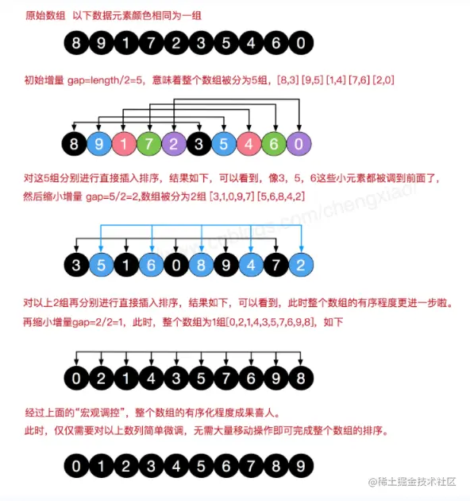
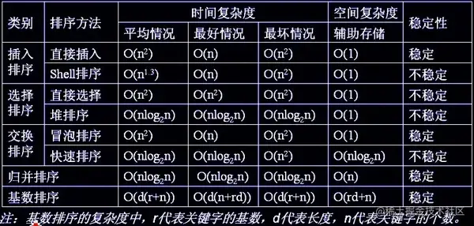

## 手写Object.create
```js
// 将闯入的对象作为原型
Object.prototype._create = function(proto) {
    let Fn = function() {};
    Fn.prototype = proto;
    return new Fn();
}
```
## 手写instanceof
instanceof运算符用于判断构造函数的prototype属性是否出现在对象的原型链中的任意位置
```js
function myInstanceof(left, right) {
    let proto = Object.getPrototypeOf(left); // 获取对象的原型
    let prototype = right.prototype; // 获取构造函数的prototype对象
    // 判断构造函数的prototype对象是否在对象的原型上
    while(true) {
        if(!proto) return false;
        if(proto === prototype) return true;
        proto = Object.getPrototypeOf(proto);
    }
}
```
## 手写New
1. 首先创建一个新的空对象
2. 设置原型，将对象的原型设置为函数的prototype对象
3. 让函数的this指向这个对象，执行构造函数的代码(为这个新对象添加属性)
4. 判断函数的返回值类型，如果是值类型，返回创建的对象。如果是引用类型，就返回这个引用类型的对象
```js
function myNew(fn, ...args) {
    // 判断参数是否是一个函数
    if(typeof fn !== 'function') {
        return console.log('type error')
    }
    // 创建一个对象
    const obj = Object.create(fn.prototype);
    const value = fn.apply(fn, args);
    return value instanceof Object ? value : obj;
    // var obj = new Object();
    // var result = Person.apply(obj, args);
    // obj.__proto__ = Person.prototype;
}
```
## 手写Promise简易版
```js
class MyPromise {
    constructor(fn) {
        this.callbacks = [];
        const resolve = value => {
            this.data = value;
            while(this.callbacks.length) {
                let cb = this.callbacks.shift();
                cb(value);
            }
        }
        fn(resolve);
    }
    then(onResolvedCallback) {
        return new MyPromise(resolve => {
            this.callbacks.push(() => {
                const res = onResolvedCallback(this.data);
                if(res instanceof MyPromise) {
                    res.then(resolve);
                } else {
                    resolve(res);
                }
            })
        })
    }
}
new MyPromise((resolve) => {
  setTimeout(() => {
    resolve(1)
  }, 1000)
}).then((res) => {
    console.log(res)
    return new MyPromise((resolve) => {
      setTimeout(() => {
        resolve(2)
      }, 1000)
    })
}).then(res =>{console.log(res)})
```
### Promise.all
```js
MyPromise.all = function(promisesList) {
    return new MyPromise((resolve, reject) => {
        if(!Array.isArray(promiseList)) return reject(new Error('必须是数组'));
        if(!promisesList.length) return resolve([]);
        let arr = [];
        let count = 0;
        for(let i = 0, len = promisesList.length; i < len; i++) {
            Promise.resolve(promise).then(result => {
                count++;
                arr[i] = result;
                if(count === len) resolve(arr);
            })
        }
    }).catch(err => reject(err))
}
```
### Promise.race
```js
MyPromise.race = function(promiseList) {
    return new MyPromise((resolve, reject) => {
        for(let promise of promiseList) {
            promise.then(resolve, reject);
        }
    })
}
```
## 防抖和节流
:::tip
<span style="color: red">**函数防抖是指在事件被触发n秒后在执行回调，如果在这n秒内时间又被触发，则重新计时**。这可以使用在一些点击请求上，避免因为用户多次点击后向后端发送多次请求.</span>

函数节流是指规定一个单位时间，在这个单位时间内，只能有一次触发事件的回调函数执行，如果在同一个单位时间内某事件被触发多次，只有一次生效。节流可以使用在scroll函数的事件监听上，通过节流来降低事件调用的频率
:::

```js
// 防抖
function debounce(fn, delay) {
    let timer = null;
    return function(...args) {
        timer && clearTimeout(timer);
        timer = setTimeout(() => {
            fn.apply(this, args);
        }, delay)
    }
}
// 节流
function throttle(fn, delay) {
    let timer = +new Date(); // 声明初始时间
    return function(...args) { // 获取参数
        let newTimer = +new Date(); // 获取触发事件的时间 
        if(newTimer - timer >= delay) { // 时间判断，是否满足条件
            fn.apply(this, args); // 调用需要执行的函数，修改this值，并且传入参数
            timer = +new Date(); // 重置初始事件
        }
    }
}
```
## 手写call函数
```js
Function.prototype.myCall = function(context, ...args) {
    let ctx = context || window;
    let func = Symbol();
    ctx[func] = this;
    args = args ? args : [];
    let res = args.length > 0 ? ctx[func](...args) : ctx[func]()
    delete ctx[func];
    return res;
}
```
[call的实现](/front-end/interview/#call的实现)

## 手写bind实现
[手写bind实现](/front-end/interview/#bind的实现)

## 函数柯里化的实现
函数柯里化指的是一种将使用多个参数的一个函数转换成一些列使用一个函数的的技术
```js
function curry(fn, ...args) {
    return fn.length <= args.length ? fn(...args) : curry.bind(null, fn, ...args);
}
```
## 手写AJAX请求
```js
const SERVER_URL = '/server';
let xhr = new XMLHttpRequest();
xhr.open('GET', SERVER_URL, true);
xhr.onreadystatechange = function() {
    if(this.readyState !== 4) return;
    // 请求成功
    if(this.state === 200) {
        handle(this.response);
    } else {
        console.error(this.statusText);
    }
}
// 设置请求失败时的监听函数
xhr.onerror = function() {
    console.error(this.statusText);
}
// 设置请求头信息
xhr.responseType = 'json';
xhr.setRequestHeader('Accept', 'application/json');
// 发送http请求
xhr.send(null)
```
## 使用Promise封装AJAX请求
```js
// promise封装实现
function getJSON(url) {
    let promise = new Promise((resolve, reject) => {
        let xhr = new XMLHttpRequest();
        xhr.open('GET', url, true);
        xhr.onreadystatechange = function() {
            if(this.readyState !== 4) return;
            if(this.status === 200) {
                resolve(this.response);
            } else {
                reject(new Error(this.statusText))
            }
        }
        xhr.onerror = function() {
            reject(new Error(this.statusText))
        }
        // 设置响应的数据类型
        xhr.responseType = 'json';
        // 设置请求头信息
        xhr.setRequestHeader('Accept', 'application/json');
        xhr.send(null)
    })
    return promise;
}
```
## 深拷贝
[深拷贝](/front-end/JavaScript/object-constructor-zdeepclone.html#实现深拷贝)

[大厂coding--基础手写](/front-end/interview/coding3.html#基础手写)
```js
function deepCopy(target, map) {
    if(!target || typeof target !== 'object') return null;
    if(!map) {
        map = new Map();
        map.set(target, true);
    }
    let result = Array.isArray(target) ? [] : {};
    Object.keys(target).forEach(property => {
        if(typeof target[property] !== 'object') {
            result[property] = target[property]
        } else {
            if(map.has(target[property])) {
                result[property] = undefined;
            } else {
                map.set(target[property], true);
                result[property] = deepCopy(target[property], map);
            }
        }
    })
    return result;
}
```
## 手写打乱数组的顺序的方法
[洗牌数组](/front-end/interview/coding.html#如何实现一个数组的洗牌函数)
```js
let arr = [1,2,3,4,5,6,7,8,9,10,11,12];
for(let i = 0; i < arr.length; i++) {
    const randomIndex = Math.round(Math.random() * (arr.length - 1 - i)) + i;
    [arr[i], arr[randomIndex]] = [arr[randomIndex], arr[i]];
}
console.log(arr)
```
## 实现数组的扁平化
```js
let arr = [1, [2, [3,4,5]]];
function flatten(arr) {
    let result = [];
    for(let i = 0; i < arr.length; i++) {
        if(Array.isArray(arr[i])) {
            result = result.concat(flatten(arr[i]));
        } else {
            result.push(arr[i]);
        }
    }
    return result;
}
flatten(arr); // [1,2,3,4,5]
```
## 实现数组的flat方法
```js
function _flat(arr, depth) {
    if(!Array.isArray(arr) || depth <= 0) return arr;
    return arr.reduce((prev, cur) => {
        if(Array.isArray(cur)) {
            return prev.concat(_flat(cur, depth - 1));
        } else {
            return prev.concat(cur)
        }
    }, [])
}
```
## 实现数组的filter方法
```js
Array.prototype._filter = function(fn) {
    if(typeof fn !== 'function') {
        throw Error('参数必须是一个函数');
    }
    let res = [];
    for(let i = 0, len = this.length; i < len; i++) {
        fn(this[i]) && res.push(this[i]);
    }
    return res;
}
```
## 实现数组的map方法
```js
Array.prototype._map = function(fn) {
    if(typeof fn !== 'function') {
        throw Error('参数必须是一个函数');
    }
    let res = [];
    for(let i = 0, len = this.length; i < len; i++) {
        res.push(fn(this[i]));
    }
    return res;
} 
```
## 实现add(1)(2)(3)(4)
```js
function fn() {
    let result = [];
    function add(...args) {
        result  [...result, ...args];
        return add;
    }
    add.toString = () => result.reduce((sum, k) => sum + k, 0);
    return add;
}
let add = fn();
// let add2 = fn();
console.log(+add2(1, 2, 3)(4)) // --->10

// 另一种
function add(...args) {
    let f = (...rest) => add(...rest, ...args);
    f.toString = () => args.reduce((a, b) =>  a + b, 0);
    return f;
}
const x = add()
console.log(+x(1)(2))
```
参数固定的情况下，不需要+号，可以根据参数长度来判断返回值
```js
function currying(fn, length) {
    length = length || fn.length;
    return function(...args) {
        return args.length >= length // 当前传递进来的参数的长度与length长度进行比较
        ? fn.apply(this, args) // 把最后一组实参传给为赋值的形参,此时所有形参都已赋值,并调用fn函数
        : currying(fn.bind(this, ...args), length - args.length)
    }
}
function fn(a, b, c, d) {
    return a + b + c + d
}
const add = currying(fn)
console.log(add(4)(3)(1)(2)) //10
add(1, 3)(4)(2) //10
add(1)(3, 4, 2) //10
```
## 用Promise实现图片的异步加载
```js
let imageAsync = url => {
    return new Promise((resolve, reject) => {
        let img = new Image();
        img.src = url;
        img.onload = () => {
            console.log('图片请求成功，此处进行通用操作');
            resolve(image);
        }
        img.error = err => {
            console.log('失败，此处进行失败的通用逻辑');
            reject(err);
        }
    })
}
imgageAsync('url').then(() => {
    console.log('加载成功');
}).catch(error => {
    console.log('加载失败')
})
```
## 手写发布-订阅模式
```js
class EventEmiter {
    // 1. 定义事件容器，用来装事件数组
    let handlers = {};
    // 2. 添加事件方法，参数：事件名 事件方法
    addEventListener(type, handler) {
        if(!this.handlers[type]){
            this.handlers[type] = [];
        } else {
            this.handlers[type].push(handler);
        }
    }
    // 3. 触发事件，参数：事件名，事件参数
    dispatchEvent(type, params) {
        if(!this.handlers[type]) {
            return new Error('该事件为注册')
        }
        this.handlers[type].forEach(handler => {
            handler(...params);
        })
    }
    // 4. 时间移除，参数：事件名 要删除时间，若无第二个参数则删除该事件的订阅和发布
    removeEventListener(type, handler) {
        if(!this.handlers[type]) {
            return new Error('事件无效');
        }
        if(!handler) {
            // 移除事件
            delete this.handlers[type]
        } else {
            const index = this.handler[type].findIndex(el => el === handler);
            if (index === -1) {
                return new Error('无该绑定事件')
            }
            // 移除事件
            this.handlers[type].splice(index, 1)
            if (this.handlers[type].length === 0) {
                delete this.handlers[type]
            }
        }
    }
}
```
## 实现路由(简易版)
```js
// hash路由
class Route {
    constructor() {
        // 路由存储对象
        this.routes = {};
        // 当前hash
        this.currentHash = '';
        // 绑定this,避免监听时this指向改变
        this.freshRoute = this.freshRoute.bind(this);
        // 监听
        window.addEventListener('load', this.freshRoute, false);
        window.addEventListener('hashchange', this.freshRoute, false);
    }
    // 村塾
    storeRoute(path, cb) {
        this.routes[path] = cb || function() {};
    }
    // 更新
    freshRoute() {
        this.currentHash = location.hash.slice(1) || '/';
        this.routes[this.currentHash]();
    }
}
```
## 使用setTimout实现setInterver
[setTimeout模拟实现setInterval](/front-end/interview/dachang2.html#简单)
```js
function mySetInterval(fn, timeout) {
    // 控制器，控制定时器是否继续执行
    var timer = {
        flag: true
    }
    // 设置递归函数，模拟定时器执行
    function interval() {
        if(timer.flag) {
            fn();
            setTimeout(interval, timeout);
        }
    }
    // 启动定时器
    setTimeout(interval, timeout);
    // 返回控制器
    return timer;
}
```
## 使用setInterval实现setTimeout
```js
function mySetTimeout(fn, t) {
    const timer = setInterval(() => {
        clearInterval(timer);
        fn();
    }, t)
}
mySetTimeout(() => {
    console.log('hoho')
}, 1000)
```
## 实现JSONP
```js
// 动态加载js文件
function addScript(src) {
    let script = document.createElement('script');
    script.src = src;
    script.type = 'text/javascript';
    document.body.appendChild(script);
}

addScript("http://xxx.xxx.com/xxx.js?callback=handleRes");
// 设置一个全局的callback函数来接受回调结果
function handleRes(res) {
    console.log(res);
}
// 回调函数返回的数据格式
handleRes({a: 1, b: 2})
```
## 提取出url里的参数并转成对象
```js
function getUrlParams(url) {
    let res = /([^?&=])=([^?&=])+/g;
    let obj = {};
    url.replace(reg, function() {
        obj[arguments[1]] = arguments[2];
    })
    // 或者
    const search = location.search;
    search.repalce(/([^?&=])=([^?&=])+/g, (m, $1, $2) => {obj[$1] = decodeURIComponent($2)});
    return obj;
}
let url = 'https://www.junjin.cn?a=1&b=2'
console.log(getUrlParams(url)) // { a: 1, b: 2 }
```
## 请写至少三种数组去重的方法？（原生js）
```js
// 利用filter
function unique(arr) {
    return arr.filter((item, index, arr) => {
        return arr.indexOf(item, 0) === index;
    })
}
var arr = [1,1,'true','true',true,true,15,15,false,false, undefined,undefined, null,null, NaN, NaN,'NaN', 0, 0, 'a', 'a',{},{}];
console.log(unique(arr))

// 利用ES6去重
function unique(arr) {
    return Array.from(new Set(arr));
}

// 利用for嵌套for,然后splice去重
function unique(arr) {
    for(let i = 0; i < arr.length; i++) {
        for(let j = i + 1; j < arr.length; j++) {
            if(arr[i] === arr[j]) {
                arr.splice(j, 1);
                j--;
            }
        }
    }
    return arr;
}
```
## 算法基础
### 时间&空间复杂度
- 复杂度是数量级(方便记忆、推广)，不是具体数字
- 常见复杂度大小比较:O(n^2) > o(nlogn) > o(n) > o(logn) > o(1)

#### 时间复杂度
常见时间复杂度对应关系
- O(n ^ 2)：2层循环(嵌套循环)
- O(nlogn)：快速排序(循环+二分)
- O(n)：1层循环
- O(logn)： 二分

#### 空间复杂度
常见空间复杂度对应关系:
- O(n)：传入一个数组，处理过程生成一个新的数组的大小和传入输入一致

### 八大数据结构
1. 栈

    栈是一个后进先出的数据结构，Javascript中没有栈，但是可以用Array实现栈的所有功能
    ```js
    // 数组实现栈数据结构
    const stack = [];

    // 入栈
    stack.push(0);
    stack.push(1);
    stack.push(2);

    // 出栈
    const popVal = stack.pop(); // popVal 为2
    ```
    **使用场景**
    - 场景一：[十进制转二进制](/front-end/Code/concept-xsummary.html#数据结构)
    - 场景二: [有效小括号](/front-end/Code/#字符串有效性检查)
    - 场景三：函数调用堆栈

2. 队列

    队列是一个先进先出的数据结构。Javascript中没有队列，但是可以用Array实现队列的所有功能
    ```js
    // 数组实现队列数据结构
    const queue = [];

    // 入队
    queue.push(0);
    queue.push(1);
    queue.push(2);

    // 出队
    const shiftVal = queue.shift(); // 0
    ```
    **使用场景**
    - 场景一:日常测核酸队列
    - 场景二：JS异步中的任务队列
    - 场景三: [计算最近请求次数](/front-end/Code/concept-xsummary.html#数据结构)
    ```js
    const RecentCounter = function() {
        this.q = [];
    }
    RecentCounter.prototype.ping = function(t) {
        if(!t) return null;
        this.q.push(t);
        while(this.q[0] < t - 3000) {
            this.q.shift();
        }
        return this.q.length;
    }
    // 输入 inputs = [[],[1],[100],[3001],[3002]] 请求间隔为 3000ms
    // 输出 outputs = [null,1,2,3,3]   
    ```
3. 链表

    链表是多个元素组成的列表，元素存储不连续，用next指针连在一起。Javascript中没有链表，但是可以用Object模拟链表

    **使用场景**
    - 场景一:JS中的原型链
    - 场景二:使用链表指针获取JSON的节点值

4. 集合

    集合是一个无序且唯一的数据结构。ES6中有集合:Set,集合常用操作:去重、判断某个元素是否在集合中、求交集
    ```js
    // 去重
    let arr = [1,2,1,2];
    let arr2 = [...new Set(arr)];

    // 判断元素是否在结合中
    let set = new Set(arr);
    let has = set.has(3); // false

    // 求交集
    let set2 = new Set([2,3]);
    let set3 = new Set([...set].filter(x => set2.has(x)))
    ```
    **使用场景**
    - 场景一：[求交集、差集](/front-end/Code/#两个数组的交集)

5. 字典(哈希)

    字典也是一种存储唯一值的数据结构，但它以键值对的形式存储。ES6中字典名为Map
    ```js
    // 字典
    const map = new Map();

    // 增
    map.set('key1', 'value1');
    map.set('key2', 'value2');
    map.set('key3', 'value3');

    // 删
    map.delete('key3');
    // map.clear()

    // 改
    map.set('key2', 'value222')

    //查
    map.get('key2')
    ```
6. 树

    树是一种分层的数据模型。前端常见的树包括:DOM、树、级联选择、树形控件...。Javascript中没有树，但是可以通过Object和Array构件数。树的常用操作:深度/广度优先遍历，先中后序遍历

7. 图

    图是网络结构的抽象模型,是一组由边连接的节点。图可以表示任何二元关系，比如道路、航班。JS中没有图，但是可以通过Object和Array构件图。图的表示法：临接矩阵、临接表、关联矩阵

    **使用场景**
    - 场景一:道路
    - 场景二:航班
8. 堆

    堆是一种特殊的完全二叉树。所有的节点都大于等于(最大堆)或小于等于(最小堆)它的子节点。由于堆的特殊结构，我们可以用数组表示堆

## 排序方法
[常见算法及算法思想](/front-end/Code/concept-xsummary.html#常见算法及算法思想)
### 冒泡排序
比较两个记录键值的大小,如果这两个记录键值的大小出现逆序，则交换这两个记录

每遍历一个元素，都会把之前的所有相邻的元素都两两比较一遍，即便是已经排序好的元素
```js
// [1,3,4,2] -> [1,2,3,4] -> [1,2,3,4]
let n = 0;
function bubbleSort(arr) {
    for(let i = 0; i < arr.length; i++) {
        for(let j = i; j > 0; j--) {
            n++;
            if(arr[j] < arr[j - 1]) {
                [arr[j], arr[j - 1]] = [arr[j - 1], arr[j]];
            }
        }
    }
    return arr;
}
```
### 插入排序
第i(i 大于等于1)个记录进行插入操作，R1,R2...是排序号的有序数列，取出第i个元素，在序列中找到一个合适的位置并将它插入到该位置即可

```js
function insertSort(arr) {
    for(let i = 1; i < arr.length; i++) {
        let j = i - 1;
        if(arr[i] < arr[j]) {
            let temp = arr[i];
            while(j >= 0 && temp < arr[j]) {
                arr[j + 1] = arr[j];
                j--;
            }
            arr[j + 1] = temp;
        }
    }
    return arr;
}
//[1,3,4,2] ->[1,3,4,4]->[1,3,3,4]->[1,2,3,4]
//i=3 temp=2 j=2 arr[j]=4 arr[3]=4 [1,3,4,4]； j=1 arr[2]=3 [1,3,3,4]； j=0  [1,2,3,4]
```
### 希尔排序
算法先将要排序的一组数按某个增量d(n / 2,n为要排序数的个数)分成若干组，每组中记录的小标相差d,对每组中全部元素进行插入排序，然后在用一个较小的增量(d/2)对他进行分组，在每组中在进行直接插入排序。当增量减到1时，进行直接插入排序后，排序完成
```js
function hillSort(arr) {
    let len = arr.length;
    for(let gap = parseInt(len / 2); gap >= 1; gap = parseInt(gap /2)) {
        for(let i = gap; i < len; i++) {
            if(arr[i] < arr[i - gap]) {
                let temp = arr[i];
                let j = i - gap;
                while(j >= 0 && arr[j] > temp){
                    arr[j+gap] = arr[j];
                    j -= gap;
                }
                arr[j+gap] = temp\
            }
        }
    }
    return arr;
}
```


### 选择排序

### 快排
[快排](/front-end/Code/#快排)
```js
function quickSort(arr) {
    if(arr.length <= 1) return arr;
    let left = [];
    let right = [];
    let pivotIndex = Math.floor(arr.length / 2);
    let pivot = arr.splice(pivotIndex, 1)[0];
    for(let i = 0; i < arr.length; i++) {
        if(arr[i] < pivot) {
            left.push(arr[i])
        } else {
            right.push(arr[i])
        }
    }
    return quickSort(left).concat([pivot], quickSort(right))
}
```
### 个排序算法的稳定性，时间复杂度，空间复杂度


对于 JS 来说，数组长度大于 10 会采用快排，否则使用插入排序。选择插入排序是因为虽然时间复杂度很差，但是在数据 量很小的情况下和 O(N * logN) 相差无几，然而插入排序需要的常数时间很小，所以相对别的排序来说更快。

## JS为递归优化斐波那契数列
[递归](/front-end/Code/concept-dfs2.html#闭包缓存)
正常斐波那契
```js
const Fibonacci = n => {
    if(n <= 1) return 1;
    return Fibonacci(n - 1) + Fibonacci(n - 2)
}
Fibonacci(10) // 89
Fibonacci(40) // 165580141 计算缓慢有延迟了
Fibonacci(100) // 栈溢出，无法得到结果复制代码
```
尾递归优化
```js
const Fibonacci = (n, sum1 = 1, sum2 = 1) => {
    if (n <= 1) return sum2;
    return Fibonacci(n - 1, sum2, sum1 + sum2)
}
console.log(Fibonacci(10) )
```
尾递归优化可以在数量较大的计算中，可以起到很好的作用


## 资料
[2022年我的面试万字总结（代码篇）](https://juejin.cn/post/7151221875224346637)