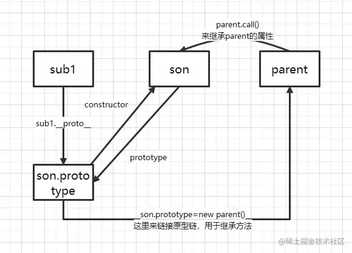
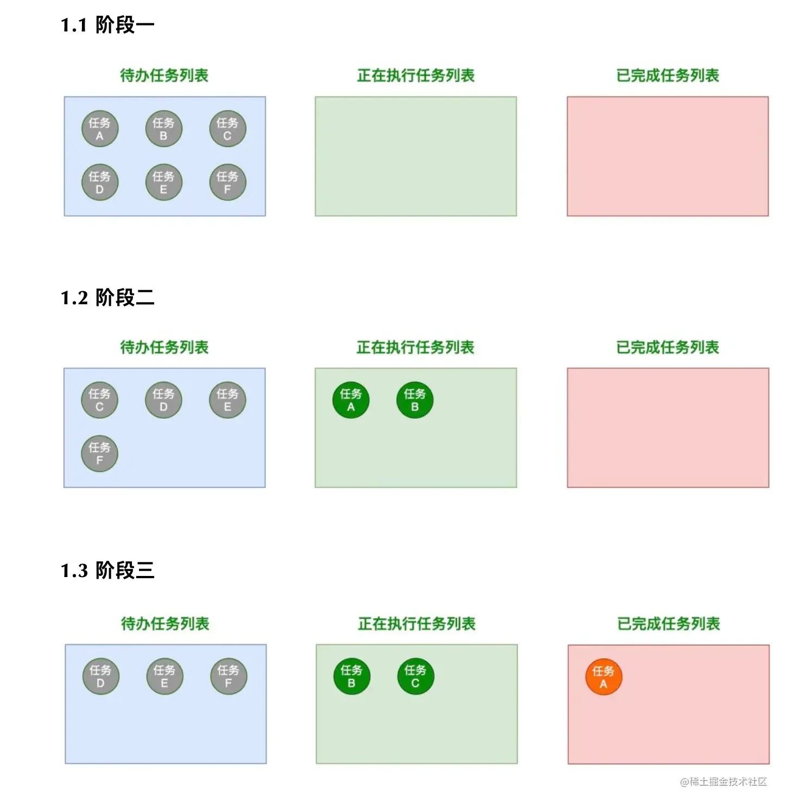

## 基础手写
### 全排列
要求以数组的形式返回字符串参数的所有排列组合

注意：
1. <span style="color: red">字符串参数中的字符无重复且仅包含小写字符</span>
2. <span style="color: red">返回的排列组合数组不区分顺序</span>
```js
const _permute = string => {
    const result = [];
    const dfs = path => {
        if(path.length === string.length) {
            result.push(path);
            return;
        }
        for(let i = 0; i < string.length; i++) {
            if(map.get(string[i])) continue;
            map.set(string[i], true);
            path += string[i];
            dfs(path);
            path = path.substring(0, path.length - 1);
            map.set(string[i], false);
        }
    }
    const map = new Map();
    dfs('');
    return result;
}
console.log(_permute('abc')) // [ 'abc', 'acb', 'bac', 'bca', 'cab', 'cba' ]
```
[6种算法思想](/front-end/Code/stady-01-1.html#资料)

[抖音电商面试](/front-end/interview/record-zijie01.html#二面)
### instanceof
- 如果target为基本数据类型直接返回false
- 判断Fn.prototype 是否在target的隐式原型链上
```js
const _instanceof = (target, fn) => {
    if((typeof target !== 'object' && typeof target !== 'function') || target === null) {
        return false;
    }
    let proto = target.__proto__;
    while(true) {
        if(proto === null) return false;
        if(proto === Fn.prototype) return true;
        proto = proto.__proto__;
    }
}
function A() {};
const a = new A();
console.log(_instanceof(a, A)); // true;
console.log(_instanceof(1, A)); // false;
```
[instaceof实现](/front-end/interview/#instanceof的实现)

### Array.prototype.map
- map中exc接受三个参数，分别是:元素值、元素下标和原数组
- map返回的是一个新的数组，地址也不一样
```js
// 这里不能直接使用箭头函数，否则无法访问到this
Array.prototype._map = function(exc) {
    let result = [];
    this.forEach((item, index, arr) => {
        result[index] = exc(item, index, arr);
    })
    return result;
    // return this.reduce((acc, item, index, arr) => {
    //     return acc.concat([exc(item, index, arr)])
    // }, [])
}
const a = new Array(2).fill(2);
console.log(a.map((item, index, arr) => item * index + 1)); // [1,3]
console.log(a._map((item, index, arr) => item * index + 1)); // [1, 3]
```
### Array.prototype.filter 
- filter中的exc接受三个参数,与map一致，主要实现的是数组的过滤功能，会根据exc函数的返回值来判断是否"留下"改值
- filter返回的是一个新数组，地址不一致
```js
Array.prototype._filter = function(exc) {
    const result = [];
    this.forEach((item, index, arr) => {
        if(exc(item,index, arr)) {
            result.push(item);
        }
    })
    return result;
}
const b = [1, 3, 4, 5, 6, 2, 5, 1, 8, 20]
console.log(b._filter(item => item % 2 === 0)) // [ 4, 6, 2, 8, 20 ]
```
### Array.prototype.reduce
- reduce 接受两个参数，第一个为exc函数，第二个值为初始化，如果不传默认为0
- reduce 最终会返回一个值，当然不一定是Number类型的，取决于你是怎么计算的，每次的结果都会作为下次exc中的第一个参数
```js
Array.prototype._reduce = function(exc, initial = 0) {
    let result = initial;
    this.forEach(item => {
        result = exc(result, item);
    })
    return result;
}
const b = [1, 3, 4, 5, 6, 2, 5, 1, 8, 20]
console.log(b.reduce((pre, cur) => pre + cur, 0)); // 55
console.log(b._reduce((pre, cur) => pre + cur, 0))
```
[reduce实现](/front-end/JavaScript/a-es5-reduce.html#如何实现一个reduce)

### Object.create
[MDN](https://developer.mozilla.org/zh-CN/docs/Web/JavaScript/Reference/Global_Objects/Object/create) Object.create()方法用于创建一个新对象，使用现有的对象来作为新创建对象的原型(prototype);
```js
Object.prototype._create = function(proto) {
    const Fn = function() {};
    Fn.prototype = proto;
    return new Fn();
}
function A() {};
const obj = Object.create(A);
const obj2 = Object._create(A);
console.log(obj.__proto__ === A); // true
console.log(obj2.__proto__ === A); // true;
```
### Function.prototype.call
call()方法使用一个指定的this值和单独给出的一个或多个参数来调用函数
```js
Function.prototype._call = function(ctx, ...args) {
    // 如果不为空，则需要进行对象包装
    const o = ctx == undefined ? window : Object(ctx);
    // 给ctx添加独一无二的属性
    const key = Symbol();
    o[key] = this;
    // 执行函数，得到返回结束
    const result = o[key](...args);
    delete o[key];
    return result;
}
const obj = {
    name: '11',
    func() {
        console.log(this.name);
    }
}
const obj2 = {name: '22'};
obj.func(); // 11;
obj.func.call(obj2); // 22
obj.func._call(obj2); // 22;
```
[call实现](/front-end/interview/#call的实现)

### Function.prototype.bind
bind()方法创建一个新的函数，在bind()被调用时,这个新函数的this被指定为bind()的第一个参数，而其余参数将作为新函数的参数，供调用时使用
```js
const obj = {
    name: '11',
    func() {
        console.log(this.name);
    }
}
Function.prototype._bind = function(ctx, ...args) {
    // 获取函数体
    const _self = this;
    // 用一个新函数包裹，避免立即执行
    const bindFn = (...reset) => {
        return _self.call(ctx, ...args, ...reset);
    }
    return bindFn;
}
const obj2 = { name: '22' };
obj.func(); // 11;
const fn = obj.func.bind(obj2);
const fn2 = obj.func._bind(obj2);
fn(); // 22
fn2(); // 22
```
[call实现](/front-end/interview/#bind的实现)

[JS中call、apply、bind方法详解](/front-end/JavaScript/base0-bind-call-apply.html#apply、call)

### New关键字
new 运算符创建一个用户定义的对象类型的实例或具有构造函数的内置对象实例
```js
const _new = function(constructor) {
    // 创建一个空对象
    const obj = {};
    // 原型链挂载
    obj.__proto__ = constructor.prototype;
    // 将obj 赋值给构造体中的this，并且返回结果
    const result = constructor.call(obj); 
    // 如果返回对象不为一个对象直则直接返回刚才创建的对象
    return typeof result === 'object' && result !== null ? result : obj;
}
```
[new 对象过程](/front-end/JavaScript/tips-object.html)

### 浅拷贝
```js
const _shallowClone = target => {
    // 基本数据类型直接返回
    if(typeof target === 'object' && target !== null) {
        // 获取target的构造体
        const constructor = target.constructor;
        // 如果构造体为以下几种类型直接返回
        if(/^(Function|RegExp|Date|Map|Set)$/i.test(constructor.name)) return target;
        // 判断是否是一个数组
        const cloneTarget = Array.isArray(target) ? [] : {};
        for(prop in target) {
            // 只拷贝其自身属性
            if(target.hasOwnProperty(prop)) {
                cloneTarget[prop] = target[prop];
            }
        }
        return cloneTarget;
    } else {
        return target;
    }
}
```
### 深拷贝--重要
实现思路和浅拷贝一致，只不过需要注意几点
- 函数 正则 日期 ES6新对象 等不是直接返回其地址，而是重新创建
- 需要避免出现循环引用的情况
```js
const _completeDeepClone = (target, map = new WeekMap()) => {
    // 基本数据类型， 直接返回
    if(typeof target !== 'object' || target === null) return target;
    // 函数 正则 日期 ES6新对象，执行构造体，返回新的对象
    const constructor = target.constructor;
    if(/^(Function|RegExp|Date|Map|Set)$/i.test(constructor.name)) return new constructor(target);
    // map标记每一个出现过的属性，避免循环引用
    if(map.get(target)) return map.get(target);
    map.set(target, true);
    const cloneTarget = Array.isArray(target) ? [] : {};
    for(prop in target) {
        if(target.hasOwnProperty(prop)) {
            cloneTarget[prop] = _completeDeepClone(target[prop], map);
        }
    }
    return cloneTarget
}
```
[JS深拷贝&循环引用](/front-end/JavaScript/object-constructor-zdeepclone.html)

### 寄生组合式继承

```js
function Parent(name) {
    this.name = name;
}
Parent.prototype.getName = function() {
    return this.name;
}
function Son(name, age) {
    // 这里其实就等于this.name = name;
    Parent.call(this, name);
    this.age = age;
}
Son.prototype.getAge = function() {
    return this.age;
}
Son.prototype.__proto__ = Object.create(Parent.prototype); // 为什么是__proto__ 而不是直接Son.prototype= x 主要是是因为上面的Son.prototype.getAge() = function() {...}

const son1 = new Son('shao', 20);
console.log(son1.getName()); // shao
console.log(son1.getAge()); // 20
```
[寄生组合式继承](/front-end/JavaScript/base0-object-prototype.html#继承)

### 发布订阅者模式
```js
class EventEmitter {
    constructor() {
        this.events = {};
    }
    on(name, callback) {
        if(!this.events[name]) {
            this.events[name] = [callback];
        } else {
            this.events[name].push(callback);
        }
    }
    emit(name, ...args) {
        if(!this.events[name]) return;
        this.events[name] && this.events[name].forEach(cb => cb(...args));
    }
    off(name, callback) {
        if(!this.events[name]) return;
        if(!callback) {
            // 如果没有callback，就删掉整个事件
            this.events[name] = undefined;
        }
        this.events[name] = this.events[name].filter(item => item !== callback)
    }
}
```
[发布和订阅者模式](/front-end/JavaScript/model-design-index.html#发布订阅者模式)

### 观察者模式
```js
class Observerd {
    constructor() {
        // 我要看看到底有多少人在观察俺
        this.observerList = [];
    }
    addObserver(observer) {
        // 添加一个观察俺的人
        this.observerList.push(observer);
    }
    notify() {
        // 我要闹点动静,所有观察者都会知道这个消息，具体怎么做就算他们自己的事情了
        this.observerList.forEach(observer => observer.update())
    }
}
class Observer {
    constructor(doSome) {
        // 观察到小白鼠有动静之后，观察者做的事情
        this.doSome = doSome;
    }
    update() {
        console.log(this.doSome);
    }
}
const ob1 = new Observer('我是ob1，我观察到小白鼠有反应了，太饿了，我得去吃个饭了')
const ob2 = new Observer('我是ob2，我观察到小白鼠有反应了，我要继续工作！')
const xiaoBaiShu = new Observerd()
xiaoBaiShu.addObserver(ob1)
xiaoBaiShu.addObserver(ob2)
xiaoBaiShu.notify() // .... .... 
```
<span style="color: red">怎么理解发布订阅者和观察者的区别呢？</span>

- <mark>其实发布订阅者模式只有一个中间者,好像啥事情都需要它亲自来做。而且仔细观察的话，发布订阅者模式会存在一个事件名和事件的对应关系，今天可以不发天气预报，只有订阅了天气预报的才会被通知，订阅了"kfc疯狂星期四"闹钟事件不会触被提醒</mark>
- <mark>而观察者模式，等被观察者发出了一点动静(执行了notify)，所有观察者都会被通知</mark>

[观察者vs 发布订阅者](/front-end/JavaScript/model-design-sub.html#观察者模式)

### 节流
节流函数(throttle)就是让事件处理函数(handler)在大于等于执行周期时才能执行，周期之内不执行，即事件一直被触发，那么事件将会按每小段固定事件一次的频率执行。
```js
function throttle(fn, delay = 300) {
    let isThrottling = false;
    return function(...args) {
        if(!isThrottling) {
            isThrottling = true;
            setTimeout(() => {
                isThrottling = false;
                fn.apply(this, args);
            }, delay)
        }
    }
}
```
### 防抖
事件响应函数在一段时间后才执行，如果这段时间内再次调用，则重新计算执行时间
```js
const debounce = (fn, delay = 300) => {
    let timer = null;
    return function(...args) {
        clearTimeout(timer)
        timer = setTimeout(fn, delay);
    }
}
```
### once 函数
函数返回结果会被缓存下来，只会计算一次
```js
const f = (x) => x;
const onceF = once(f);
onceF(3); // 3
onceF(4); // 3

const once = fn => {
    let res, isFirst = true;
    return function(...args) {
        if(!isFirst) return res;
        res = fn.call(this, ...args);
        isFirst = false;
        return res;;
    }
}
```
### 累加函数应用
```js
function sum(...args) {
    let params = args;
    const _sum = (...newArgs) => {
        if(newArgs.length === 0) {
            return params.reduce((pre, cur) => pre + cur, 0)
        } else {
            params = [...params, ...newArgs];
            return _sum;
        }
    }   
    return _sum;
}
console.log(sum(1,2)(3)()); // 6
console.log(sum(1)(2)(3)()) // 6
console.log(sum(1, 2, 4)(4)()) // 11
```
## 进阶
### 实现repeat方法
```js
function repeat(fn, times, delay) {
    return async function(...args) {
        for(let i = 0; i < times; i++) {
            await new Promise((resolve, reject) => {
                setTimeout(() => {
                    fn.call(this, ...args);
                    resolve();
                }, delay)
            })
        }
    }
}
const repeatFn = repeat(console.log, 4, 1000);
repeatFn('hello')
```
### 实现Promise.all/race/allSettled/any
- Promise身上的这些方法返回的都是一个promise
- Promise.resolve接受一个Promise，若非promise则将其变成功状态的promise
```js
// 有一个失败则返回失败的结果，全部成功返回全成功的数组
Promise.all = function(promiseList = []) {
    return new Promise((resolve, reject) => {
        let result = [];
        let count = 0;
        if(promiseList.length === 0) {
            resolve(result);
            return;
        }
        for(let i = 0; i < promiseList.length; i++) {
            Promise.resolve(promiseList[i]).then(res => {
                result[i] = res;
                count++;
                // 不能直接通过result.length进行比较，因为会存在下标大的先赋值
                // 例如i = 3 第一个返回结果，此时数组变为[empty,empty, empty,res]
                if(count === promiseList.length) {
                    resolve(result);
                }
            }).catch(e => {
                reject(e);
            }) 
        }
    })
}
// 返回第一个成功或失败的结果
Promise.race = function(promiseList = []) {
    return new Promise((resolve, reject) => {
        if(promiseList.length === 0) return resolve([]);
        for(let i = 0; i < promiseList.length; i++) {
            Promise.resolve(promiseList[i]).then(res => {
                resolve(res);
            }).catch(e => {
                reject(e);
            })
        }
    })
}
// 无论成功与否都返回，但会添加一个status字段用于标记成功/失败
Promise.allSettled = function(promiseList = []) {
    return new Promise((resolve, reject) => {
        const result = [];
        let count = 0;
        const addRes = (i, data) => {
            result[i] = data;
            count++;
            if(count === promiseList.length) {
                resolve(result);
            }
        }
        if(promiseList.length === 0) return resolve(result);
        for(let i = 0; i < promiseList.length; i++) {
            Promise.resolve(promiseList[i]).then(res => {
                addRes(i, { status: 'fulfilled', data: res} );
            }).catch(e => {
                addRes(i, { status: 'rejected', data: e })
            })
        }
    })
}
// AggregateError,当多个错误需要包装在一个错误中时,该对象表示一个错误
// 和Promise.all相反，全部失败返回失败的结果数组，有一个成功则返回成功结果
Promise.any = function(promiseList = []) {
    return new Promise((resolve, reject) => {
        if(promiseList.length === 0) return resolve([]);
        let count = 0;
        const result = [];
        for(let i = 0; i < promiseList.length; i++) {
            Promise.resolve(promiseList[i]).then(res => {
                resolve(res);
            }).catch(e => {
                count++;
                result[i] = e;
                if(count === promiseList.length) {
                    reject(new AggregateError(result))
                }
            })
        }
    })
}
```
### 整数千分位加逗号
```js
// 1234567 -> 1,234,567
function toThousands(num) {
    num = num.toString();
    let result = '';
    while(num.length > 3) {
        result = ',' + num.substring(num.length - 3) + result;
        num = num.substring(0, num.length - 3);
    }
    result = num + result;
    return result;

    // return num.replace(/(?=(\B\d{3})+$)/g, ',')
}
```
### 洗牌算法
有几张牌，用js来进行乱序排序，要保持公平性
```js
const shuffle = arr => {
    // 不影响员原来的数组
    const result = [...arr];
    for(let i = result.length; i > 0; i--) {
        // 随机从[0, i - 1]产生一个index, 将i- 1于index对应数组进行交换
        const index = Math.floor(Math.random() * i);
        [result[index], result[i - 1]] = [result[i - 1], result[i]];
    }
    return result;
}
const arr = [1,2,3,4,5];
console.log(shuffle(arr)); // [ 3, 1, 2, 5, 4 ]
console.log(shuffle(arr)) // [ 2, 3, 5, 1, 4 ]
console.log(shuffle(arr)) // [ 4, 2, 3, 1, 5 ]
console.log(shuffle(arr)) // [ 5, 4, 2, 3, 1 ]
```
### a == 1 && a == 2 && a == 3
如何让a == 1 && a == 2 && a == 3 返回true呢
- 方案一

    利用隐式转换会调用valueOf()
    ```js
    const a = {
        value: 1,
        valueOf() {
            return this.value++;
        }
    }
    console.log(a == 1 && a == 2 && a == 3)
    ```
- 方案二

    <span style="color: red">在对象valueOf函数不存在的情况下会调用toString方法</span>
    ```js
    const a = {
        value: 1,
        toString() {
            return this.value++;
        }
    }
    console.log(a == 1 && a == 2 && a == 3)
    ```
- 方案三

    利用Object.defineProperty在全局window上挂载一个a属性
    ```js
    let _a = 1;
    object.defineProperty(window, 'a', {
        get() {
            return _a++;
        }
    })
    console.log(a == 1 && a == 2 && a == 3)
    ```
### 手写LRU
LRU是Least Recently Used的缩写，即最近最少使用,是一种常用的[页面置换算法](https://baike.baidu.com/item/%E9%A1%B5%E9%9D%A2%E7%BD%AE%E6%8D%A2%E7%AE%97%E6%B3%95/7626091?fromModule=lemma_inlink),选择最近最久未使用的页面予以淘汰。该算法赋予了每个页面一个访问字段，用来记录一个页面自上次被访问以来所经历的时间t，当须淘汰一个页面时，选择页面中其t值最大的，即最近最少最少的页面予以淘汰
```js
var LRUCache = function(capacity) {
    this.map = new Map();
    this.capacity = capacity;
}
LRUCache.prototype.get = function(key) {
    if(this.map.get(key)) {
        let value = this.map.get(key);
        // 更新存储问题
        this.map.delete(key);
        this.map.set(key, value);
        return value;
    } else {
        return -1;
    }
}
LRUCache.prototype.put = function(key, value) {
    if(this.map.get(key)) {
        this.map.delete(key);
    }
    this.map.set(key, value);
    if(this.map.size > this.capacity) {
        this.map.delete(this.map.keys().next().value)
    }
}
```
## 更上一层楼
### Generator
先看看下面输出的内容
```js
async function getResult() {
    await new Promise((resolve, reject) => {
        setTimeout(() => {
            resolve(1);
            console.log(1)
        }, 1000)
    })
    await new Promise((resolve, reject) => {
        setTimeout(() => {
            resolve(2);
            console.log(2);
        }, 500);
    })
    await new Promise((resolve, reject) => {
        setTimeout(() => {
            resolve(3);
            console.log(3);
        }, 100);
    })
}
getResult()
// 1 2 3 
```
那如何使用 Es6 中的 generator 实现类似的效果呢 ？
```js
function* getResult(params) {
    yield new Promise((resolve, reject) => {
        setTimeout(() => {
            resolve(1);
            console.log(1);
        }, 1000);
    })
    yield new Promise((resolve, reject) => {
        setTimeout(() => {
            resolve(2);
            console.log(2);
        }, 500);
    })
    yield new Promise((resolve, reject) => {
        setTimeout(() => {
            resolve(3);
            console.log(3);
        }, 100);
    })
}
const gen = getResult()
// gen.next().value 就是每一次 yield 之后返回的 Promise
// gen.next() = {value: yeild 返回的数据,done: 迭代器是否走完}
gen.next().value.then(() => {
    gen.next().value.then(() => {
        gen.next();
    });
});// 依次打印 1 2 3
```
将gen.next()封装一层，让其自己能够实现递归调用
```js
const gen = getResult()
function co(g) {
    const nextObj = g.next();
    // 递归停止条件:当迭代器迭代到最后一个yeild
    if(nextObj.done) {
        return;
    }
    nextObj.value.then(() => {
        co(g);
    })
}
co(gen);
```
### async-pool
JS控制并发请求，[参考文章](https://mp.weixin.qq.com/s/yWOPoef9ixuSBWApZQhjIg)



async-pool的基本使用
```js
const timeout = i => new Promise(resolve =>  setTimeout(() =>resolve(i), i));
await asyncPool(2, [1000, 5000, 3000, 2000], timeout)
```
asyncPool 这个函数接受三个参数

- poolLimit（数字类型）：表示限制的并发数；
- array（数组类型）：表示任务数组；
- iteratorFn（函数类型）：表示迭代函数，用于实现对每个任务项进行处理，该函数会返回一个 Promise 对象或异步函数。

这里提醒一下，promise.then 中的函数执行是一异步的，而赋值是同步的
```js
const a = Promise.resolve().then(() => console.log(a));
// 等价于 此时a等于一个pending状态的promise
const a = Promise.resolve().then();
a.then(() => {
    console.log(a)
})
```
手写代码，这部分可能会多花点时间，可以拷贝代码多调试几次就知道了
```js
async function asyncPool(poolLimit, array, iteratorFn) {
    const ret = []; // 存储所有的异步任务
    const executing = []; // 存储正在执行的异步任务
    for(const item of array) {
        // 调用iteratorFn函数创建异步任务
        const p = Promise.resolve().then(() => iteratorFn(item, array));
        ret.push(p); // 保存新的异步任务

        // 当poolLimit值小于或等于总任务个数时，进行并发控制
        if(poolLimit <= array.length) {
            // 当任务完成后，从正在执行的任务数组中移除已完成的任务
            const e = p.then(() => executing.splice(executing.indexOf(e), 1));
            executing.push(e); // 保存正在执行的异步任务
            if(executing.length >= poolLimit) {
                await Promise.race(executing); // 等待较快的任务执行完成
            }
        }
    }
    return Promise.all(ret);
}
const timeout = i => new Promise(resolve => setTimeout(() => { console.log(i); resolve(i) }, i))
// 当然，limit <= 0的时候，我们可以理解为值允许一个请求存在
asyncPool(2, [1000, 5000, 3000, 2000], timeout).then(res => {
    console.log(res)
})
```

## 资料
[精进Javascript](https://juejin.cn/post/7137961562794852383#heading-11)