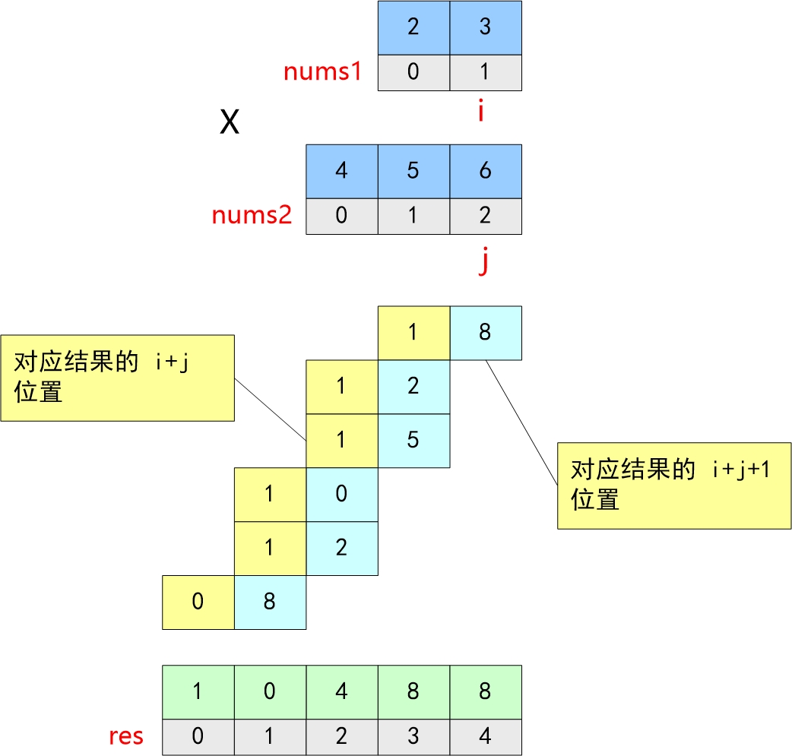

[JavaScript-Algorithms](https://github.com/sisterAn/JavaScript-Algorithms)

## 数组
### N数之和
请用算法实现，从给定的无需、不重复的数组A中，取出N个数，使其相加和为M。并给出算法的时间、空间复杂度，如：

```JS
// var arr = [1, 4, 7, 11, 9, 8, 10, 6];
// var N = 3;
// var M = 27;

// Result:
// [7, 11, 9], [11, 10, 6], [9, 8, 10]

function numSum(nums, n, m, arr = [], ans = [], index = 0) {
    if(arr.length === n) return arr.reduce((a, b) =>  a + b, 0) === m && ans.push([...arr]);
    for(let i = index; i < nums.length; i++) {
        arr.push(nums[i]);
        numSum(num, n, m, arr, ans, i + 1);
        arr.pop();
    }
    return ans;
}
console.log(numSum([1, 4, 7, 11, 9, 8, 10, 6], 3, 27))
```
> 回溯的时间复杂度一般是O(n*n!)

### 编写一个函数计算多个数组的交集
```js
const getIntersection = (...arrs) => {
    return Array.from(new Set(arrs.reduce((acc, cur) => {
        return cur.filter(x => acc.includes(x));
    })))
}
```
### 有效三角形的个数
给定一个包含非负整数的数组，你的任务是统计其中可以组成三角形三条边的三元组个数。

```js
输入: [2,2,3,4]
输出: 3
解释:
有效的组合是: 
2,3,4 (使用第一个 2)
2,3,4 (使用第二个 2)
2,2,3
```
- 数组长度不超过1000。
- 数组里整数的范围为 [0, 1000]。
```js
// 解题思路： 先数组排序，排序完后，固定最长的边，利用双指针法判断其余边
// 以 nums[nums.length - 1] 作为最长的边 nums[k] （ k = nums.length - 1 ）
// 以 nums[i] 作为最短边，以 nums[nums.length - 2] 作为第二个数 nums[j] （ j = nums.length - 2 ）
let triangleNumber = function(nums) {
    let len = nums.length;
    let count = 0;
    if(!nums || len < 3) return count;
    nums.sort((a, b) => a - b);
    for(let k = len - 1; k >= 0; k--) {
        let i = 0; j = k - 1;
        while(i < j) {
            if(nums[i] + nums[j] > nums[k]) {
                count += j - i;
                j--;
            } else {
                i++;
            }
        }
    }
    return count;
}
```
## 字符串
### 字符串相乘
- 常规解法

    从右向左遍历乘数，将乘数的每一位与被乘数相乘得到对应结果，再将每次得到的结果累加

    另外,当乘数的每一位与被乘数高位(非最低位)相乘的时候，注意低位补'0'
    ```js
    let multiply = function(num1, num2) {
        if(num1 === '0' || num2 === '0') return '0';
        // 用于保存计算结果
        let res = '0';
        // num2 逐位与num1相乘
        for(let i = num2.length - 1; i >= 0; i--) {
            let carry = 0;
            // 保存num2第i位数字与num1相乘的结果
            let temp = '';
            // 补 0
            for(let j = 0; j < num2.length - 1 - i; j++) {
                temp += '0';
            }
            let n2 = num2.charAt(i) - '0';
            // num2的第i位数字 n2 与num1相乘
            for(let j = num1.length - 1; j >= 0 || carry !=0; j--) {
                let n1 = j < 0 ? 0 : num1.charAt(j) - '0';
                let product = (n1 * n2 + carry) % 10;
                temp += product;
                carry = Math.floor((n1 * n2 + carry) / 10);
            }
            // 将当前结果与新结算的结果求和作为新的结果
            res = addString(res, Array.prototype.slice.call(temp).reverse().join(''));
        }
        return res;
    }
    // 字符串、大数相加
    let addStrings = function(num1, num2) {
        let a = num1.length, b = num2.length, result = '', temp = 0;
        while(a || b) {
            a ? temp += +num1[--a] : '';
            b ? temp += +num2[--b] : '';

            result = temp % 10 + result;
            if(temp > 9) temp = 1;
            else temp = 0;
        }
        if(temp) result = 1 + result;
        return result;
    }
    ```
    复杂度分析：

    时间复杂度：O(max(m*n , n * n))

    空间复杂度：O(m+n)

- 竖式相乘

    两个数M和N相乘的结果可以由**M乘上N的每一位数的和得到**，如下图
    

    - 计算num1依次乘上num2的每一位的和
    - 把得到的所有和按对应的位置累加在一起，就可以得到 num1 * num2的结果
    ```js
    let mutiply = (num1, num2) => {
        if (num1 === '0' || num2 === '0') return '0'
        // 用于保存计算结果
        let res = []
        // 从个位数开始逐位相乘
        for (let i = 0; i < num1.length; i++) {
            // num1尾元素
            let temp1 = +num1[num1.length - 1 - i]
            for (let j = 0; j < num2.length; j++) {
                // num2尾元素
                let temp2 = +num2[num2.length - 1 - j]

                // 判断结果集索引位置是否有值
                let pos = res[i + j] ? res[i + j] + temp1 * temp2 : temp1 * temp2
                // 赋值给当前索引位置
                res[i + j] = pos % 10
                // 是否进位 这样简化res去除不必要的'0'
                pos > 10 &&
                    (res[i + j + 1] = res[i + j + 1]
                        ? res[i + j + 1] + Math.floor(pos / 10)
                        : Math.floor(pos / 10))
            }
        }
        return res.reverse().join('')
    }
    }
    ```
    时间复杂度：O(m * n)

    空间复杂度：O(m + n)


### 字符串转换整数
实现一个atoi函数，使其能将字符串转换成整数

首先，该函数会根据需要丢弃无用的开头空格字符，直到寻找到第一个非空格的字符为止。接下来的转换规则如下:

如果第一个非空字符为正或者负号时，则将该符号与之后面尽可能多的连续数字字符组合起来，形成一个有符号整数。

假如第一个非空字符是数字，则直接将其与之后连续的数字字符组合起来，形成一个整数。
该字符串在有效的整数部分之后也可能会存在多余的字符，那么这些字符可以被忽略，它们对函数不应该造成影响。

注意：假如该字符串中的第一个非空格字符不是一个有效整数字符、字符串为空或字符串仅包含空白字符时，则你的函数不需要进行转换，即无法进行有效转换。

在任何情况下，若函数不能进行有效的转换时，请返回 0 。
```js
// 输入: "42"
// 输出: 42
const tranStr2Int = (str) => {
	let arr = str.split(/\s+/)
	let INT_MAX = Math.pow(2, 31) - 1
	let INT_MIN = Math.pow(2, -31)
	for (let index = 0; index < arr.length; index++) {
		if (arr[index] === '') continue
		if (isNaN(index)) return 0
		if (parseInt(arr[index]) > INT_MAX) return INT_MAX
		if (parseInt(arr[index]) < INT_MIN) return INT_MIN
		return parseInt(arr[index])
	}
}
console.log(tranStr2Int('32'))
```
## 栈
### 字节&leetcode155：最小栈（包含getMin函数的栈）
设计一个支持push，pop，top操作，并能在常数时间内检索到最小元素的栈
- push(x)---将元素x推入栈中
- pop()---删除栈顶元素
- top()---获取栈顶元素
- getMin()--检索栈中的最小元素
```js
// MinStack minStack = new MinStack();
// minStack.push(-2);
// minStack.push(0);
// minStack.push(-3);
// minStack.getMin();   --> 返回 -3.
// minStack.pop();
// minStack.top();      --> 返回 0.
// minStack.getMin();   --> 返回 -2.

class MinStack {
    constructor() {
        this.length = 0;
        this.content = [];
        this.mins = [];
    }
    push(val) {
        const curMin = this.mins[this.length - 1] != undefined ? this.mins[this.length - 1] : Infinity;
        this.content[this.length++] = val;
        this.mins[this.length - 1] = Math.min(curMin, val);
    }
    pop() {
        return this.content[--this.length]
    }
    top() {
        return this.content[this.length - 1];
    }
    getMin() {
        return this.mins[this.length - 1]
    }
}
```
[字节&leetcode155：最小栈（包含getMin函数的栈）](https://github.com/sisterAn/JavaScript-Algorithms/issues/23)
### 图解腾讯&哔哩哔哩&leetcode20：有效的括号
[有效括号](https://github.com/sisterAn/JavaScript-Algorithms/issues/25)

[字符串有效性检查](/front-end/Code/#字符串有效性检查)
### 删除字符串中的所有相邻的重复项--两个重复项
给出由小写字母组成的字符串 S ，重复项删除操作 会选择两个相邻且相同的字母，并删除它们。

在 S 上反复执行重复项删除操作，直到无法继续删除。

在完成所有重复项删除操作后返回最终的字符串。答案保证唯一。
```js
// 输入："abbaca"
// 输出："ca"
// 解释：
// 例如，在 "abbaca" 中，我们可以删除 "bb" 由于两字母相邻且相同，这是此时唯一可以执行删除操作的重复项。之后我们得到字符串 "aaca"，其中又只有 "aa" 可以执行重复项删除操作，所以最后的字符串为 "ca"。
const removeDuplicates = S => {
    let stack = []
    for(c of S) {
        let prev = stack.pop()
        if(prev !== c) {
            stack.push(prev)
            stack.push(c)
        }
    }
    return stack.join('')

    // 第二种实现
    let stack = [S[0]];
    for(let i = 1; i < S.length; i++) {
        if(S[i] === stack[stack.length - 1]) {
            stack.pop();
        } else {
            stack.push(S[i]);
        }
    }
    return stack.join('')
}
```
### leetcode1209：删除字符串中的所有相邻重复项 II #27
给你一个字符串 s，「k 倍重复项删除操作」将会从 s 中选择 k 个相邻且相等的字母，并删除它们，使被删去的字符串的左侧和右侧连在一起。

你需要对 s 重复进行无限次这样的删除操作，直到无法继续为止。

在执行完所有删除操作后，返回最终得到的字符串。

本题答案保证唯一。

```js
// 输入：s = "abcd", k = 2
// 输出："abcd"
// 解释：没有要删除的内容。

// 输入：s = "deeedbbcccbdaa", k = 3
// 输出："aa"
// 解释： 
// 先删除 "eee" 和 "ccc"，得到 "ddbbbdaa"
// 再删除 "bbb"，得到 "dddaa"
// 最后删除 "ddd"，得到 "aa"

// 原理上题是一样的，不过昨天的题是一次入栈一个，今天是k个。那我们就让它每次入栈 k-1 个，站头的 k-1 个元素的第一个如果与当前准备入栈的元素相同，则代表k个元素是一样的，则无需入栈。
const removeDupLicates = (s, k) => {
    let stack = [];
    for(let c of s) {
        let prev = stack.pop();
        if(!prev || prev[0] !== c) {
            stack.push(prev);
            stack.push(c);
        } else if(prev.length < k - 1) {
            stack.push(prev + c)
        }
    }
    return stack.join('')
}
```
### 删除字符串中出现次数 >= 2 次的相邻字符
```js
// 输入："abbbaca"
// 输出："ca"
// 解释："abbbaca" => "aaca"=>"ca"
// 时间复杂度: O(n), n 为字符的个数
// 空间复杂度: O(n), 栈所用的空间
function removeDuplicate(s) {
    let stack = [];
    let i = 0; 
    while(i < s.length) {
        let top = stack[stack.length - 1];
        let next = s[i];
        if(next === top) {
            // 字符串中出现了相邻字符 1.移除栈顶字符 2.移动指针，指向下一个不同的字符
            stack.pop();
            while(s[i] === top) i += 1;
        } else {
            stack.push(next);
            i += 1;
        }
    }
    return stack.join('')
}
```
### 删除字符串两端相同字符后的最短长度
```js
输入：s = "ca"
输出：2
解释：你没法删除任何一个字符，所以字符串长度仍然保持不变。

输入：s = "cabaabac"
输出：0
解释：最优操作序列为：
- 选择前缀 "c" 和后缀 "c" 并删除它们，得到 s = "abaaba" 。
- 选择前缀 "a" 和后缀 "a" 并删除它们，得到 s = "baab" 。
- 选择前缀 "b" 和后缀 "b" 并删除它们，得到 s = "aa" 。
- 选择前缀 "a" 和后缀 "a" 并删除它们，得到 s = "" 。

输入：s = "aabccabba"
输出：3
解释：最优操作序列为：
- 选择前缀 "aa" 和后缀 "a" 并删除它们，得到 s = "bccabb" 。
- 选择前缀 "b" 和后缀 "bb" 并删除它们，得到 s = "cca" 。
```
```js
const minimumLength = s => {
    let n = s.length;
    let left = 0;
    let right = n - 1;
    while(left < right && s[left] === s[right]) {
        let c = s[left];
        while(left <= right && s[left] === c) {
            left++;
        }
        while(left <= right && s[right] === c) {
            right--;
        }
    }
    return right - left + 1
}
```

## 队列
### 用两个栈实现队列
用两个栈实现一个队列。队列的声明如下，请实现它的两个函数 appendTail 和 deleteHead ，分别完成在队列尾部插入整数和在队列头部删除整数的功能。(若队列中没有元素，deleteHead 操作返回 -1 )
```js
// 输入：
// ["CQueue","appendTail","deleteHead","deleteHead"]
// [[],[3],[],[]]
// 输出：[null,null,3,-1]
var CQueue = function() {
    this.stack1 = [];
    this.stack2 = [];
}
CQueue.prototype.appendTail = function(value) {
    this.stack1.push(value);
}
CQueue.prototype.deleteHead = function() {
    if(this.stack2.length) {
        return this.stack2.pop();
    } else if(this.stack1.length) {
        while(this.stack1.length) {
            this.stack2.push(this.stack1.pop());
        }
        return this.stack2.pop();
    } else {
        return -1;
    }
}
```

### leetcode239：滑动窗口最大值问题
[leetcode239：滑动窗口最大值问题](/front-end/Code/#数组-长度为k的最大子数组)

### 字节&leetcode151：翻转字符串里的单词
[leetcode151：翻转字符串里的单词](https://github.com/sisterAn/JavaScript-Algorithms/issues/18)

### 字节&Leetcode3：无重复字符的最长子串
[无重复字符的最长子串--单指针](/front-end/Code/#无重复字符的最长子串-单指针)

## 哈希表
### leetcode380：常数时间插入、删除和获取随机元素
设计一个支持在平均 时间复杂度 O(1) 下，执行以下操作的数据结构。

- insert(val) ：当元素 val 不存在时，向集合中插入该项。
- remove(val) ：元素 val 存在时，从集合中移除该项。
- getRandom ：随机返回现有集合中的一项。每个元素应该有 相同的概率 被返回。
```js
// 初始化一个空的集合。
RandomizedSet randomSet = new RandomizedSet();
// 向集合中插入 1 。返回 true 表示 1 被成功地插入。
randomSet.insert(1);
// 返回 false ，表示集合中不存在 2 。
randomSet.remove(2);
// 向集合中插入 2 。返回 true 。集合现在包含 [1,2] 。
randomSet.insert(2);
// getRandom 应随机返回 1 或 2 。
randomSet.getRandom();
// 从集合中移除 1 ，返回 true 。集合现在包含 [2] 。
randomSet.remove(1);
// 2 已在集合中，所以返回 false 。
randomSet.insert(2);
// 由于 2 是集合中唯一的数字，getRandom 总是返回 2 。
randomSet.getRandom();
```
```js
// 解答一：Map + 数组
const RandomizedSet = function() {
    this.map = new Map();
    this.values = [];
}
RandomizedSet.prototype.insert = function(val) {
    // 存在
    if(this.map.has(val)) {
        return false;
    }
    // 不存在
    this.map.set(val, this.values.length);
    this.values.push(val);
    return true;
}
RandomizedSet.prototype.remove = function() {
    // 不存在
    if(!this.map.has(val)) {
        return false
    } 
    const index = this.map.get(val)
    // 存在且为最后一个元素
    if(index === this.values.length - 1) {
        this.values.pop()
        this.map.delete(val)
    } else { // 存在不为最后一个元素
        const lastValue = this.values.pop()
        this.values[index] = lastValue
        this.map.set(lastValue, index)
        this.map.delete(val)
    }
    return true
}
RandomizedSet.prototype.getRandom = function(){
    const length = this.values.length
    const random = Math.floor(Math.random() * length)
    return this.values[random];
}
// 解答二:也可以使用Set
const RandomizedSet = function() {
    this.set = new Set();
}
RandomizedSet.prototype.insert = function(val) {
    if(this.set.has(val)) {
        return false;
    }
    this.set.add(val);
    return true;
}
RandomizedSet.prototype.remove = function(val) {
    if(!this.sethas(val)) {
        return false;
    }
    this.set.delete(val);
    return true;
}
RandomizedSet.prototype.getRandom = function() {
    const random = parseInt(Math.random() * (this.set.zize));
    return [...this.set][random]
}
```

## 链表
### 编写一个程序，找到两个单链表相交的起始节点
```js
// 解法一：标记法
const getIntersectionNode = function(headA, headB) {
    while(headA) {
        headA.flag = true;
        headA = headA.next;
    }
    while(headB) {
        if(headB.flag) return headB;
        headB = headB.next;
    }
    return null;
}
// 双指针
const getIntersectionNode = (headA, headB) => {
    let pA = headA, pB = headB;
    while(pA || pB) {
        if(pA === pB) return pA;
        pA = pA ? pA.next : headB;
        pB = pB ? pB.next : headA;
    }
    return null;
}
```
## 二叉树

## 堆
看到这个动态数组获取中位数问题，不要太激动，这太适合使用堆了，考察的就是堆的经典应用：中位数问题，详情可查看 [前端进阶算法9](https://github.com/sisterAn/JavaScript-Algorithms/issues/60)：看完这篇，再也不怕堆排序、Top K、中位数问题面试了

[JS数据结构与常用算法-堆](front-end/Code/concept-xsummary.html#_8-堆-重要)


### 腾讯&字节等：最小的k个数

### leetcode347：前 K 个高频元素

### 字节&leetcode215：数组中的第K个最大元素
[数组中的第K个最大元素](/front-end/Code/#数组中的第k个最大元素)

### 剑指Offer&leetcode295：数据流的中位数
中位数是有序列表中间的数。如果列表长度是偶数，中位数则是中间两个数的平均值。

例如，

[2,3,4] 的中位数是 3

[2,3] 的中位数是 (2 + 3) / 2 = 2.5

设计一个支持以下两种操作的数据结构：

void addNum(int num) - 从数据流中添加一个整数到数据结构中。
double findMedian() - 返回目前所有元素的中位数。
```js
addNum(1)
addNum(2)
findMedian() -> 1.5
addNum(3) 
findMedian() -> 2
```
<span style="color: red">**利用堆**</span>

这里需要维护两个堆
- 大顶堆:用来存取前n / 2个小元素，如果n为奇数，则用来存取前 Math.floor(n / 2) + 1个元素
- 小顶堆: 用来存取后 n / 2 个小元素

那么，根据题目要求，中位数就为

- n为奇数:中位数是大顶堆的堆顶元素
- n为偶数: 中位数是大顶堆的堆顶元素 与小顶堆的堆顶元素的平均值

当数组为动态数组时,每当数组中插入一个元素时，都需要如何调整堆呢？

当插入完成后，如果大顶堆、小顶堆的元素个数不满足我们以上的要求，我们就需要不断的将大顶堆的堆顶元素或小顶堆的堆顶元素移动到另一个堆中，知道满足要求
```js
// 其中小顶堆定义
// 小顶堆
let MinHeap = function() {
    let heap = [,]
    // 堆中元素数量
    this.getSize = ()=> heap.length - 1
    // 插入
    this.insert = (key) => {
        heap.push(key)
        // 获取存储位置
        let i = heap.length-1
        while (Math.floor(i/2) > 0 && heap[i] < heap[Math.floor(i/2)]) {  
            swap(heap, i, Math.floor(i/2)); // 交换 
            i = Math.floor(i/2); 
        }
    }
    // 删除堆头并返回
    this.removeHead = () => {
        if(heap.length > 1) {
            if(heap.length === 2) return heap.pop()
            let num = heap[1]
            heap[1] = heap.pop()
            heapify(1)
            return num
        }
        return null
    }
    // 获取堆头
    this.getHead = () => {
        return heap.length > 1 ? heap[1]:null
    }
    // 堆化
    let heapify = (i) => {
        let k = heap.length-1
        // 自上而下式堆化
        while(true) {
            let minIndex = i
            if(2*i <= k && heap[2*i] < heap[i]) {
                minIndex = 2*i
            }
            if(2*i+1 <= k && heap[2*i+1] < heap[minIndex]) {
                minIndex = 2*i+1
            }
            if(minIndex !== i) {
                swap(heap, i, minIndex)
                i = minIndex
            } else {
                break
            }
        }
    } 
    let swap = (arr, i, j) => {
        let temp = arr[i]
        arr[i] = arr[j]
        arr[j] = temp
    }
}

// 大顶堆定义
// 大顶堆
let MaxHeap = function() {
    let heap = [,]
    // 堆中元素数量
    this.getSize = () => heap.length - 1
    // 插入大顶堆
    this.insert = (key) => {
        heap.push(key)
        // 获取存储位置
        let i = heap.length-1
        while (Math.floor(i/2) > 0 && heap[i] > heap[Math.floor(i/2)]) {  
            swap(heap, i, Math.floor(i/2)); // 交换 
            i = Math.floor(i/2); 
        }
    }
    // 获取堆头
    this.getHead = () => {
        return heap.length > 1 ? heap[1]:null
    }
    // 删除堆头并返回
    this.removeHead = () => {
        if(heap.length > 1) {
            if(heap.length === 2) return heap.pop()
            let num = heap[1]
            heap[1] = heap.pop()
            heapify(1)
            return num
        }
        return null
    }
    // 堆化
    let heapify = (i) => {
        let k = heap.length-1
        // 自上而下式堆化
        while(true) {
            let maxIndex = i
            if(2*i <= k && heap[2*i] > heap[i]) {
                maxIndex = 2*i
            }
            if(2*i+1 <= k && heap[2*i+1] > heap[maxIndex]) {
                maxIndex = 2*i+1
            }
            if(maxIndex !== i) {
                swap(heap, i, maxIndex)
                i = maxIndex
            } else {
                break
            }
        }
    } 
    let swap = (arr, i, j) => {
        let temp = arr[i]
        arr[i] = arr[j]
        arr[j] = temp
    }
}

// 代码实现
let MedianFinder = function() {
    // 大顶堆，用来保存前 n/2 小的元素
    this.lowHeap = new MaxHeap()
    // 小顶堆，用来保存后 n/2 小的元素
    this.hightHeap = new MinHeap()
};
// 插入元素
MedianFinder.prototype.addNum = function(num) {
    // 如果大顶堆为空或大顶堆堆顶元素小于num，则插入大顶堆
    // 否则插入到小顶堆中
    if(!this.lowHeap.getSize() || num < this.lowHeap.getHead()) {
        // 比大顶堆的堆顶小，插入到大顶堆中
        this.lowHeap.insert(num)
    } else {
        // 比小顶堆的堆顶大，插入到小顶堆中
        this.hightHeap.insert(num)
    }

    // 比较大小顶堆的是否依然保持平衡
    if(this.lowHeap.getSize() - this.hightHeap.getSize() > 1) {
        // 大顶堆往小顶堆迁移
        this.hightHeap.insert(this.lowHeap.removeHead())
    }
    if(this.hightHeap.getSize() > this.lowHeap.getSize()) {
        // 小顶堆向大顶堆迁移
        this.lowHeap.insert(this.hightHeap.removeHead())
    }
};
// 获取中位数
MedianFinder.prototype.findMedian = function() {
    if(this.lowHeap.getSize() && this.lowHeap.getSize() === this.hightHeap.getSize()) {
        return (this.lowHeap.getHead() + this.hightHeap.getHead())/2
    }
    return this.lowHeap.getHead()
};
var medianfinder = new MedianFinder();
medianfinder.addNum(1)
medianfinder.addNum(2)
console.log(medianfinder.findMedian())
medianfinder.addNum(3) 
console.log(medianfinder.findMedian())
```
## 图
[判断是否有环](/front-end/Code/stady-DAG.html#判断有向图是否有环)

### leetcode997：找到小镇的法官
在一个小镇里，按从 1 到 N 标记了 N 个人。传言称，这些人中有一个是小镇上的秘密法官。

如果小镇的法官真的存在，那么：

小镇的法官不相信任何人。
每个人（除了小镇法官外）都信任小镇的法官。
只有一个人同时满足属性 1 和属性 2 。
给定数组 trust ，该数组由信任对 trust[i] = [a, b] 组成，表示标记为 a 的人信任标记为 b 的人。

如果小镇存在秘密法官并且可以确定他的身份，请返回该法官的标记。否则，返回 -1 。
```js
// 输入：N = 2, trust = [[1,2]]
// 输出：2

// 输入：N = 3, trust = [[1,3],[2,3]]
// 输出：3

// 输入：N = 3, trust = [[1,3],[2,3],[3,1]]
// 输出：-1

// 输入：N = 3, trust = [[1,2],[2,3]]
// 输出：-1

// 本题是一道典型的有向图问题，不理解图的可以看这篇：[初学者应该了解的数据结构 ]Graph(https://mp.weixin.qq.com/s/L8Dui7gJdUdOTmrYCg_wmQ),寻找法官即是寻找入度为N - 1,出度为0的点
let findJudge = function(N, trust) {
    // 构造0-N个节点的图
    let graph = Array.from({length: N + 1}, () => ({ outDegree: 0, inDegree: 0}));
    trust.forEach(([a, b]) => {
        graph[a].outDegree++;
        graph[b].inDegree++;
    })
    return graph.findIndex(({outDegree, inDegree}, index) => {
        // 剔除0
        return index !=0 && outDegree === 0 && inDegree === N - 1
    })
}

// 另一种解法--- 其实法官也是唯一一个出入度差值为N - 1,所以这里可以简化为寻找出入度差值为N - 1
let findJudge = function(N, trust) {
    let graph = Array(N + 1).fill(0);
    // 出度加-
    // 入度减一
    trust.forEach(([a, b]) => {
        graph[a]--;
        graph[b]++
    })
    return graph.findIndex((node, index) => {
        // 剔除0
        return index != 0 && node === N - 1;
    })
}
```
### 课程表
[课程表](/front-end/Code/#拓扑-课程表)
```js
let canFinish = function(numCourses, prerequisites) {
    // 如果没有先决条件，即所有的课程均没有依赖关系
    // 直接返回true
    if(prerequisites.length === 0) return true;
    // 维护入度表
    let inDegree = new Array(numCourses).fill(0);
    // 维护邻接表
    let adj = new Map();

    for(let e of prerequisites) {
        inDegree[e[0]]++;
        if(!adj.has(e[1])) adj.set(e[1], []);
        let vEdge = adj.get(e[1]);
        vEdge.push(e[0]);
    }

    let queue = [];
    // 首先加入入度为0的节点
    for(let i = 0; i < numCourses; i++) {
        if(inDegree[i] === 0) {
            queue.push(i);
        }
    }
    while(queue.length) {
        // 从队首移除
        let v = queue.shift();
        // 出队一门课程
        numCourses--;
        if(!adj.has(v)) continue;
        // 遍历当前出队节点的所有临接节点
        for(let w of adj.get(v)) {
            inDegree[w]--;
            if(inDegree[w] === 0) {
                queue.push(w);
            }
        }
    }
    return numCourses === 0;
}
```
### 寻找图中是否存在路径
有一个具有 n 个顶点的 双向 图，其中每个顶点标记从 0 到 n - 1（包含 0 和 n - 1）。图中的边用一个二维整数数组 edges 表示，其中 edges[i] = [ui, vi] 表示顶点 ui 和顶点 vi 之间的双向边。 每个顶点对由 最多一条 边连接，并且没有顶点存在与自身相连的边。

请你确定是否存在从顶点 source 开始，到顶点 destination 结束的 有效路径 。

给你数组 edges 和整数 n、source 和 destination，如果从 source 到 destination 存在 有效路径 ，则返回 true，否则返回 false 。
```js
输入：n = 3, edges = [[0,1],[1,2],[2,0]], source = 0, destination = 2
输出：true
解释：存在由顶点 0 到顶点 2 的路径:
- 0 → 1 → 2 
- 0 → 2
```
解答
```js
// 方法一:广度优先搜索
var validPath = (n, edges, source, destination) => {
    const adj = new Array(n).fill(0).map(() => new Array());
    for(const edge of edges) {
        const x = edge[0], y = edge[1];
        adj[x].push(y);
        adj[y].push(x);
    }
    const visited = new Array(n).fill(false);
    const queue = [source];
    visited[source] = true;
    while(queue.length) {
        const vertex = queue.shift();
        if(vertex === destination) break;
        for(const next of adj[vertex]) {
            if(!visited[next]) {
                queue.push(next);
                visited[next] = true;
            }
        }
    }
    return visited[destination]
}
// 深度优先搜索
const validPath = (n, edges, source, destination) => {
    const adj = new Array(n).fill(0).map(() => new Array());
    for(const edge of edges) {
        const x = edge[0], y = edge[1];
        adj[x].push(y);
        adj[y].push(x);
    }
    const visited = new Array(n).fill(0);
    return dfs(source, destination, adj, visited);
}
const dfs = (srouce, destination, adj, visited) => {
    if(souce === destination) return true;
    visited[source] = true;
    for(const next of adj[source]) {
        if(!visited[next] && dfs(next, destination, adj, visited)) {
            return true;
        }
    }
    return false;
}
```
[力扣-寻找图中是否存在路径](https://leetcode.cn/problems/find-if-path-exists-in-graph/solutions/2024085/xun-zhao-tu-zhong-shi-fou-cun-zai-lu-jin-d0q0/?languageTags=javascript)

### 剑指Offer&Bigo：旋转矩阵
[转置矩阵--有些区别可以参考](/front-end/Code/#转置矩阵)

给你一幅由 N × N 矩阵表示的图像，其中每个像素的大小为 4 字节。请你设计一种算法，将图像旋转 90 度。

不占用额外内存空间能否做到？
```js
// 给定 matrix = 
// [
//   [1,2,3],
//   [4,5,6],
//   [7,8,9]
// ],

// 原地旋转输入矩阵，使其变为:
// [
//   [7,4,1],
//   [8,5,2],
//   [9,6,3]
// ]

思路： 按对角线反转后再逐行倒序

[                     
    [1,2,3],     
    [4,5,6],     =>   
    [7,8,9]
]

[
    [1,4,7],     
    [2,5,8],     =>   
    [3,6,9]
]

[
    [7,4,1],     
    [8,5,2],     =>   
    [9,6,3]
]
```
```js
let rotate = function (matrix) {
    let n = matrix.length;
    // 对角线反转 
    for(let i = 0; i < n; i++) {
        for(let j = 0; j < i; j++) {
            swap(matrix, [i, j], [j, i])
        }
    }
    // 中线左右反转
    for(let i = 0; i < n; i++) {
        for(let j = 0; j < n / 2; j++) {
            swap(matrix, [i, j], [i, n - 1 - j])
        }
    }
    function swap(matrix, [x1, y1], [x2, y2]) {
        const temp = matrix[x1][y1];
        matrix[x1][y1] = matrix[x2][y2];
        matrix[x2][y2] = temp;
    }
    return matrix
}
```
### 腾讯&leetcode：螺旋矩阵 II--生成
[螺旋矩阵](/front-end/Code/#螺旋矩阵)
```js
const generatreMatrix = n => {
    // 定义一个二维数组进行数据保存
    let result = Array.from(Array(n), (_, i)=> Array(n));
    let left = 0;
    let right = n - 1;
    let top = 0;
    let bottom = n - 1;
    let current = 1, max = n * n;
    while(current <= max) {
        // 上面从左到右
        for(let i = left; i <= right; i++) {
            result[top][i] = current++;
        }
        top++;
        // 右边从上到下
        for(let i = top; i <= bottom; i++) {
            result[i][right] = current++;
        }
        right--;
        // 下边从右到左
        for(let i = right; i >= left; i--) {
            result[bottom][i] = current++;
        }
        bottom--;
        // 左边从下到上
        for(let i = bottom; i >= top; i--) {
            result[i][left] = current++;
        }
        left++;
    }
    return result;
}
```
## 排序算法
### 腾讯&字节：介绍一下快排原理以及时间复杂度，并实现一个快排

### 字节&阿里&网易&leetcode384：打乱数组（洗牌算法）

### 阿里五面：说下希尔排序的过程？ 希尔排序的时间复杂度和空间复杂度又是多少？

### 腾讯&leetcode148：排序链表

### 字节算法题：扑克牌问题（反向推导题）

### 腾讯&leetcode611：有效三角形的个数--- 同上有效三角形个数
```js
let triangleNumber = function(nums) {
    if(!nums || nums.length < 3) return 0;
    nums.sort((a, b) => a - b);
    for(let k = nums.length - 1; k > 1; j--) {
        let i = 0, j = k - 1;
        while(i < j) {
            if(nums[i] + nums[j] > nums[k]) {
                count += j - i;
                j--;
            } else {
                i++;
            }
        }
    }
    return count;
}
```

## 查找算法
### 腾讯：简述二分查找算法与时间复杂度，并实现一个二分查找算法

### 腾讯&字节&leetcode34：在排序数组中查找元素的第一个和最后一个位置
给定一个按照升序排列的整数数组 nums ，和一个目标值 target 。找出给定目标值在数组中的开始位置和结束位置。

你的算法时间复杂度必须是 O(logn) 级别。

如果数组中不存在目标值，返回 [-1, -1] 。
```js
// 输入: nums = [5,7,7,8,8,10], target = 8
// 输出: [3,4]

// 解答一：findIndex、lastIndexOf
// findIndex()方法回来数组中满足提供的测试函数的第一个元素的索引，若没有找到对应元素返回-1
// lastIndexOf()方法返回指定元素(也即有效的Javascript值或变量)在数组中的最后一个索引，若不存在返回-1

// 解答二：二分查找
let searchRange = function(nums, target) {
    return [leftSearch(nums, target), rightSearch(nums, target)]
}
let leftSearch = function(nums, target) {
    let low = 0;
    let high = nums.length - 1;
    while(low <= high) {
        let mid = Math.floor((low + high) / 2);
        if(nums[mid] < target) {
            low = mid + 1;
        } else if(nums[mid] > target) {
            high = mid - 1;
        } else if(nums[mid] === target) {
            // 这里不返回，继续收缩左侧边界
            high = mid - 1;
        }
    }
    // 最后检查low是否越界或者命中
    if(low >= nums.length || nums[low] !== target) return -1;
    return low;
}
let rightSearch = function(nums, target) {
    let low = 0;
    let high = nums.length - 1;
    while(low <= high) {
        let mid = (low + high)  >> 1;
        if(nums[mid] < target) {
            low = mid + 1;
        } else if(nums[mid] > target) {
            high = mid - 1;
        } else if(nums[mid] === target) {
            low = mid + 1;
        }
    }
    if (high < 0 || nums[high] != target) return -1;
    return high;
}
```
### 腾讯&leetcode230：二叉搜索树中第K小的元素
给定一个二叉搜索树，编写一个函数 kthSmallest 来查找其中第 k 个最小的元素。

说明：
你可以假设 k 总是有效的，1 ≤ k ≤ 二叉搜索树元素个数。
```js
输入: root = [3,1,4,null,2], k = 1
   3
  / \
 1   4
  \
   2
输出: 1
```
```js
// 递归
const kthSmallest = (root, k) => {
    let res = null;
    const inorderTraverseNode = node => {
        if(root && k > 0) {
            // 先遍历左子树
            inorderTraverseNode(node.left);
            if(--k === 0) {
                res = node.val;
                return;
            }
            inorderTraverseNode(node.right);
        }
    }
    inorderTraverseNode(root);
    return res;
}
// 迭代
const kthSmallest = (root, k) => {
    let stack = [];
    let node = root;
    while(stack.length) {
        while(node) {
            stack.push(node);
            node = node.left;
        }
        node = stack.pop();
        if(--k === 0) {
            return node.val;
        }
        node = node.right;
    }
    return null;
}
```
### 腾讯&leetcode875：爱吃香蕉的珂珂
珂珂喜欢吃香蕉。这里有 N 堆香蕉，第 i 堆中有 piles[i] 根香蕉。警卫已经离开了，将在 H 小时后回来。

珂珂可以决定她吃香蕉的速度 K （单位：根/小时）。每个小时，她将会选择一堆香蕉，从中吃掉 K 根。如果这堆香蕉少于 K 根，她将吃掉这堆的所有香蕉，然后这一小时内不会再吃更多的香蕉。

珂珂喜欢慢慢吃，但仍然想在警卫回来前吃掉所有的香蕉。

返回她可以在 H 小时内吃掉所有香蕉的最小速度 K（K 为整数）。

```js
输入: piles = [3,6,7,11], H = 8
输出: 4

输入: piles = [30,11,23,4,20], H = 5
输出: 30

输入: piles = [30,11,23,4,20], H = 6
输出: 23
```
```js
// 二分查找
/**
 * 二分查找也成为折半查找
*/
const minEatingSpeed = (piles, H) => {
    // 计算堆中香蕉最大值
    let maxVal = Math.max.apply(null, piles)
    
    // 速度最小的时候，耗时最长
    let low = 1;
    let high = maxVal;
    while(low < high) {
        let mid = (low + high) >> 1;
        if(calculateTime(piles, mid) > H) {
            // 耗时太多，说明速度太慢了，进入下一轮搜索
            low = mid + 1;
        } else {
            high = mid;
        }
    }
    return low;
}
// 计算吃掉香蕉所需的总耗时
const calculateTime = (piles, speed) => {
    let times = 0;
    for(let pile of piles) {
        // 向上取整
        times += Math.ceil(pipe / speed);
    }
    return times;
}
```
### 袋子里最少数目的球
给你一个整数数组 nums ，其中 nums[i] 表示第 i 个袋子里球的数目。同时给你一个整数 maxOperations 。
你可以进行如下操作至多 maxOperations 次：

选择任意一个袋子，并将袋子里的球分到 2 个新的袋子中，每个袋子里都有 正整数 个球。
比方说，一个袋子里有 5 个球，你可以把它们分到两个新袋子里，分别有 1 个和 4 个球，或者分别有 2 个和 3 个球。
你的开销是单个袋子里球数目的 最大值 ，你想要 最小化 开销。

请你返回进行上述操作后的最小开销。
```js
输入：nums = [9], maxOperations = 2
输出：3
解释：
- 将装有 9 个球的袋子分成装有 6 个和 3 个球的袋子。[9] -> [6,3] 。
- 将装有 6 个球的袋子分成装有 3 个和 3 个球的袋子。[6,3] -> [3,3,3] 。
装有最多球的袋子里装有 3 个球，所以开销为 3 并返回 3 。

输入：nums = [2,4,8,2], maxOperations = 4
输出：2
解释：
- 将装有 8 个球的袋子分成装有 4 个和 4 个球的袋子。[2,4,8,2] -> [2,4,4,4,2] 。
- 将装有 4 个球的袋子分成装有 2 个和 2 个球的袋子。[2,4,4,4,2] -> [2,2,2,4,4,2] 。
- 将装有 4 个球的袋子分成装有 2 个和 2 个球的袋子。[2,2,2,4,4,2] -> [2,2,2,2,2,4,2] 。
- 将装有 4 个球的袋子分成装有 2 个和 2 个球的袋子。[2,2,2,2,2,4,2] -> [2,2,2,2,2,2,2,2] 。
装有最多球的袋子里装有 2 个球，所以开销为 2 并返回 2 。
```
<span style="color: red">**遇到，最大最小之类的描述，就是经典二分了。这里给出两道相似的例题：**</span>

- [最大化最小磁力1920分](https://leetcode.cn/problems/magnetic-force-between-two-balls/)

- [最大最小甜度2029分](https://leetcode.cn/problems/divide-chocolate/)
```js
// 本题二分的思路就是二分单个袋子里面的球的个数的最大值，也就是袋子容量，然后判断此次的操作数有没有大于最大操作数

// 如果大于最大操作数，违法了。那么我们就减少操作数即可，减少操作数对应就是增加单个袋子容量

// 如果小于等于最大操作数，合法。因此我们可以增大操作数，或者保持不变，那么对应就是减少单个袋子容量
var mininumnSize = (nums, maxOperations) => {
    let left = 1;
    let right = _.max(nums);
    let ans = 0;
    while(left <= right) {
        const y = Math.floor((left + right) / 2);
        let ops = 0;
        for(const x of nums) {
            ops += Math.floor((x - 1) / y);
        }
        if(ops <= maxOperations) {
            ans = y;
            right = y - 1;
        } else {
            left = y + 1;
        }
    }
    return ans; 
}
```
## 贪心算法
[贪心算法](/front-end/Code/concept-greed.html)
### 移除石子的最大得分
你正在玩一个单人游戏，面前放置着大小分别为 a​​​​​​、b 和 c​​​​​​ 的 三堆 石子。

每回合你都要从两个 不同的非空堆 中取出一颗石子，并在得分上加 1 分。当存在 两个或更多 的空堆时，游戏停止。

给你三个整数 a 、b 和 c ，返回可以得到的 最大分数 。
```js
输入：a = 2, b = 4, c = 6
输出：6
解释：石子起始状态是 (2, 4, 6) ，最优的一组操作是：
- 从第一和第三堆取，石子状态现在是 (1, 4, 5)
- 从第一和第三堆取，石子状态现在是 (0, 4, 4)
- 从第二和第三堆取，石子状态现在是 (0, 3, 3)
- 从第二和第三堆取，石子状态现在是 (0, 2, 2)
- 从第二和第三堆取，石子状态现在是 (0, 1, 1)
- 从第二和第三堆取，石子状态现在是 (0, 0, 0)
总分：6 分 。

输入：a = 4, b = 4, c = 6
输出：7
解释：石子起始状态是 (4, 4, 6) ，最优的一组操作是：
- 从第一和第二堆取，石子状态现在是 (3, 3, 6)
- 从第一和第三堆取，石子状态现在是 (2, 3, 5)
- 从第一和第三堆取，石子状态现在是 (1, 3, 4)
- 从第一和第三堆取，石子状态现在是 (0, 3, 3)
- 从第二和第三堆取，石子状态现在是 (0, 2, 2)
- 从第二和第三堆取，石子状态现在是 (0, 1, 1)
- 从第二和第三堆取，石子状态现在是 (0, 0, 0)
总分：7 分 。
```
```js
// 贪心
const maximumScore = function(a, b, c) {
    const sum = a + b + c;
    const maxVal = Math.max(Math.max(a, b), c);
    return Math.min(sum - maxVal, Math.floor(sum / 2));
}
```
[移除石子的最大得分](https://leetcode.cn/problems/maximum-score-from-removing-stones/description/?languageTags=javascript)

## 回溯算法

## 动态规划

## 编程题

## 手写源码

## 基础题