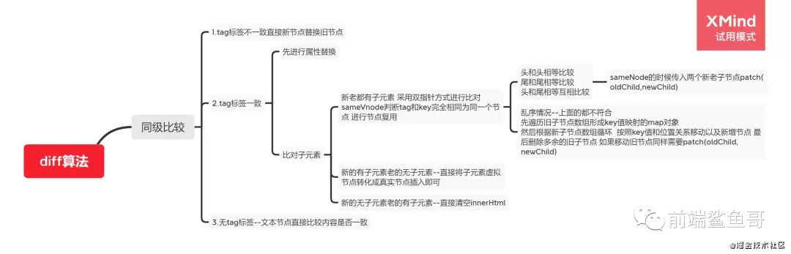

:::tip
setTiemout(fn, 0)的含义是，指定某个任务在主线程最早可得的空闲时间执行，也就是说，尽可能早的执行。它在任务队列的尾部添加一个事件，因此要等到同步任务和任务队列现有的时间都处理完了才会得到执行。
HTML5标准规定了setTimeout的第二个参数的最小值(最短间隔)，不得低于4毫秒，如果低于这个值，就会自动增加。在此之前，老版本的浏览器都将最短间隔设置为10毫秒。另外对于那些DOM的变动(尤其涉及到页面重新渲染的部分)，通常不会立即执行，而是每16毫秒执行一次。这时使用requestAnimationFrame()的效果要好于setTimeout();
:::

## 简单
### 从输入一个URL地址到浏览器完成渲染的真个过程
这个问题属于老生常谈的经典问题了，下面给出面试简单版作答
1. 浏览器地址栏输入URL并回车
2. 浏览器查找当前URL是否存在缓存，并比较缓存是否过期
3. DNS解析URL对应的IP
4. 根据IP建立TCP连接(三次握手)
5. 发送http请求
6. 服务器处理请求，浏览器接受HTTP响应
7. 浏览器解析并渲染页面
8. 关闭TCP连接

```
1. css加载不会阻塞DOM树的解析
2. css加载会阻塞DOM树的渲染
3. css加载会阻塞后面js的执行
```
### 什么是事件代理(事件委托)有什么好处
事件委托的原理:不给每个子节点单独设置事件监听器，而是设置在其父节点上，然后利用冒泡原理设置每个子节点

优点：
- 减少内存消耗和dom操作，提高性能。 在Javascript中，添加到页面上的是事件处理程序数量将直接关系到页面的整体运行性能，因为需要不断操作dom，那么引起浏览器重绘和回流的可能也就越多，页面交互的事件也就变得越长，这也就是为什么要**减少dom操作的原因**。每个事件处理函数，都是一个对象，多一个事件处理函数，内存中就会多占用一部分空间。如果要用事件委托，就会将所有的操作放到js程序里里，只对她的父级进行操作，与dom的操作只需要交互一次，这样就能大大减少与dom的交互次数，提高性能
- 动态绑定事件  因为事件绑定在父级元素，所以新增的元素也能触发事件

### addEventListener默认是捕获还是冒泡

默认是冒泡

addEventListener第三个参数默认是false代表执行事件冒泡行为

当为true执行事件捕获行为

### css的渲染从合成是什么？浏览器如何创建新的渲染层
在DOM树中每个节点都会对应一个渲染对象(RenderObject)，当它们的渲染对象处于相同的坐标空间(z轴空间)时,就会形成一个RenderLayers，也就是渲染层。渲染层将保证页面元素以正确的顺序堆叠，这时候就会出现**层合成(composite)**，从而正确处理透明元素和重叠元素的显示。对于有位置重叠元素的页面，这个过程尤其重要，因为一旦图层的合并顺序出错，就会导致元素显示异常。

浏览器如何创建新的渲染层
- 根元素 document
- 有明确的定位属性(relative、fixed、sticky、absolute)
- opacity < 1
- 有css fliter属性
- 有css mask属性
- 有css mix-blend-mode属性且值部位normal
- 有css transform属性且值不为none
- backface-visibility属性为hidden
- 有css refection属性
- 有css column-count属性且值不为auto或者有css column-width属性且值部位auto
- 当前有对于opacity/transform、fliter/backdrop-fiter应用动画
- overflow部位visible

> 注意，不少人会将这些**合成层的条件和渲染层产生的条件**混淆，这两种条件非阿生在两个不同的层处理环节，是完全不一样的，具体看[这篇文章](https://blog.csdn.net/weixin_38129930/article/details/102675221)

### webpack Plugin和Loader的区别

- Loader
    用于对模块源码的转换,loader描述了webpack如何处理非javascript模块，并且在build中引入这些依赖。load可以将文件从不同的语言(如TypeScript)转换为Javascript，或者将内联图像转换为 dataURL.比如：CSS-Loader,Style-Loader等
- Plugin
    目的在于解决loader无法实现的其他事，它直接作用于webpack，扩展了它的功能。在webpack运行的生命周期中会广播出许多事件，plugin可以监听这些事件，在合适时机通过webpack提供的API改变输出结果。插件的范围包括，从打包优化和压缩，一直到重新定义环境中的变量。插件接口功能及其强大，可以用来处理各种各样的任务

>webpack 相关知识可以看鲨鱼哥这篇文章 前端进阶高薪必看-Webpack 篇 说的很通俗易懂 基本应对简单的面试足够了

### apply call bind区别
- 三者都可以改变函数的this对象指向
- 三者第一个参数都是this要指向的对象，如果没有这个参数或参数为undefined或者null, 则默认指向全局window
- 三者都可以传参，但是apply是数组，而call是参数列表，且apply和call是一次性传入参数，而bind可以分为多次传入
- bind是返回绑定this之后的函数，便于稍后调用；apply、call则是理解执行
- bind()会返回一个新的函数，如果这个返回的新的函数作为构造函数创建一个新的对象，那么此时this不再指向传入给bind的第一个参数，而是指向new创建的实例

### 举出闭包使用场景运用的例子
比如常见的防抖和节流
```js
function debounce(fn, delay = 300) {
    let timer; // 
    return function() {
        const args = arguments;
        if (timer) {
            clearTimeout(timer);
        }
        timer = setTiemout(() => {
            fn.apply(this, args);
        }, delay)
    }
}
```
使用闭包可以在Javascript中模拟块级作用域
```js
function outputNumbers(count) {
    (function() {
        for (var i= 0; i < count; i++) {
            alert(i);
        }
    })(i)
    alert(i); // 导致错误
}
```
闭包可以用于在对象中创建私有变量
```js
var aaa = (function() {
    var a = 1;
    function bbb(){
        a++;
        console.log(a);
    }
    function ccc() {
        a++;
        console.log(a);
    }
    return {
        b: bbb, // json结构
        c: ccc
    }
})()
console.log(aaa.a); // undefined;
aaa.b(); // 2
aaa.c(); // 3
```
### css优先级是怎么计算的
- 第一优先级: !important会覆盖页面内任何位置的元素样式
- 内联样式，如style="color: green", 权值1000
- id选择器，如#app 权值0100，
- 类、伪类、属性选择器，如.foo,:first-child,div[class="foo"],权值0010
- 标签、伪元素选择器，如div::first-line,权值0001
- 通配符、子类选择器、兄弟选择器，如*，>, +, 权值0000
- 继承的样式没有权值

### 事件循环相关题目--必考(一般是代码输出顺序判断)
```js
setTimeout(function() {
    console.log(1)
}, 0);
async function async1() {
    console.log('2');
    const data = await async2();
    console.log('3');
    return data;
}
async function async2() {
    return new Promise(resolve => {
        console.log(4);
        resolve('async2的结果');
    }).then(data => {
        console.log('5');
        return data;
    })
}
async1().then(data => {
    console.log(6);
    console.log(data);
})
new Promise(function(reoslve) {
    console.log('7');
}).then(function() {
    console.log('8')
})
// 2 4 7 5 3 6 async2的结果 Promise {<pending>} 1
```
输出结果： 2，4，7，5，3，6， async2的结果 1
> <span style="color:red">注意！我在最后一个 Promise 埋了个坑 我没有调用 resolve 方法 这个是在面试美团的时候遇到了 当时自己没看清楚 以为都是一样的套路 最后面试官说不对 找了半天才发现是这个坑 哈哈----**promise默认返回一个promise2**</span>

### http状态码204 301 302 304 400 401 403 404含义
- http状态码204(无内容) 服务器成功处理了请求，但没有返回任何内容
- http状态码301(永久移动) 请求的网页已永久移动到新位置。服务器返回此响应(对GET或HEAD请求的响应)时，会自动将请求者转移到新位置
- http状态码302(临时移动) 服务器目前从不同位置的网页响应请求，但请求者应继续使用原有位置进行以后的请求。
- http状态码304(未修改) 自从上次请求后，请求的网页未修改过。服务器返回此响应时，不会返回网页内容
- http状态码400(错误请求) 服务器不理解请求的语法(一般为参数错误)
- http状态码401(未授权) 请求要求身份验证。对于需要登录的网页，服务器可能返回此响应。
- http状态码403(禁止) 服务器拒绝请求(一般为客户端的用户权限不够)
- http状态码404(未找到) 服务器找不到请求网页

### htt2.0 做了那些赶紧 3.0呢？

http2.0特性如下
- 二进制分帧传输
- 头部压缩
- 服务端推送
- 多路复用

HTTP3.0 相对于HTTP2.0是一种脱胎换骨的改变!

HTTP协议是应用层协议，都是建立在传输层之上。我们也都知道传输层上面不只有TCP协议，还有另外一个强大的协议UDP协议，2.0和1.0都是基于TCP的，因此都会有TCP带来的硬伤以及局限性。而HTTP3.0则是建立在UDP的基础上。所以其与HTTP2.0之间有质的不同

HTTP3.0特性如下
- 连接迁移
- 无队头阻塞
- 自定义的拥塞控制
- 前头安全和前向纠错
> 建议大家详细看看这篇文章[Http2.0 的一些思考以及 Http3.0 的优势](https://blog.csdn.net/m0_60360320/article/details/119812431)

### position有那些值，作用分别是什么？
- static

    static(没有定位)是position的默认值，元素处于正常的文档流中，会忽略let、top、right、bottom和z-index属性

- relative

    relative(相对定位)是指给元素设置相对于原本位置的定位，元素并不脱离文档流，因此元素原本的位置会被保留，其他的元素位置不会受到影响

    使用场景：子元素相对于父元素进行定位

- absolute(绝对定位)是指给元素设置绝对的定位，相对定位的对象可以分为两种情况
    - 设置了absolute的元素如果存在有祖先元素设置了position属性为relative或者absolute，则这时元素的定位对象为此已设置position属性的祖先元素
    - 如果没有设置了position属性的祖先元素，则此时相对于body进行定位。**使用场景**：跟随图标，图表使用不依赖定位父级的absolute和margin属性进行定位，这样，当文本的字符个数改变时，图表的位置可以自适应
- fixed可以简单说fixed是特殊版的absolute，fixed元素总是相对于body定位的，**使用场景**:侧边栏或者广告图

- inherit继承父元素的position属性，但需要注意的IE8以及以前的版本都不支持inherit属性

- sticky设置了sticky的元素，在屏幕范围(viewport)时改元素的位置并不收到定位影响(设置是top、left等属性无效)，当改元素的位置将要移出偏移范围时，定位又会编程fixed，根据设置的left、top等属性成固定位置的效果。当元素在容器中被滚动超过指定的偏移值时，元素在容器内固定在指定位置。亦即如果你设置了 top: 50px，那么在 sticky 元素到达距离相对定位的元素顶部 50px 的位置时固定，不再向上移动（相当于此时 fixed 定位）。**使用场景**跟随窗口

### vue组件通讯方式有哪些方法
- props和emit父组件向子组件是通过prop传递的，子组件传递数据给父组件是通过emit触发事件来传递的
- parent,children获取当前组件的父组件和当前组件的子组件
- attrs和listeners A->B->C。Vue 2.4 开始提供了和listeners 来解决这个问题
- 父组件中通过 provide 来提供变量，然后在子组件中通过 inject 来注入变量。(官方不推荐在实际业务中使用，但是写组件库时很常用)
- $refs 获取组件实例
- envetBus 兄弟组件数据传递 这种情况下可以使用事件总线的方式
- vuex 状态管理

### Vue响应式原理

整体思路是数据劫持+观察者模式

对象内部通过defineReactive方法，使用Object.defineProperty将属性进行劫持(只会劫持已经存在的属性)，数组则是通过重写数组的方法来实现。当页面使用对应属性时，每个属性都拥有自己的dep属性，存放他所依赖的watcher(收集依赖)，当属性变化后悔通过自己对应的watcher去更新(派发更新)

相关代码
```js
class Observer{
    // 观测值
    constructor(value) {
        this.walk(value);
    }
    walk(data) {
        let keys = Object.keys(data);
        for (let i = 0; i < keys.length; i++) {
            let key = keys[i];
            let value = data[key];
            defineReactive(data, key, value);
        }
    }
}
// Object.defineProperty数据劫持核心 兼容新在ie9以及以上
function defineReactive(data, key, value) {
    observe(value);
    / --如果value还是一个对象会继续走一遍odefineReactive 层层遍历一直到value不是对象才停止
    //   思考？如果Vue数据嵌套层级过深 >>性能会受影响
    Object.defineProperty(data, key, {
        get(){
            console.log('获取值')；
            // 需要做依赖收集过程
            return value;
        },
        set(newValue) {
            if (newValue === value)  return;
            console.log('设置值');
            // 需要做派发更新过程
            value = newValue；
        }
    })
}
export function observe(value) {
    // 如果传递过来的是对象或者数组，进行属性劫持
    if(
        Object.prototype.toString.call(value) === '[object Object]' ||
        Array.isArray(value)
    ) {
        return new Observer(value);
    }
}
```

### Vue nextTick原理
nextTick中的回到是在下次DOM更新循环结束之后执行的延迟回调.在修改数据之后立即使用这个方法，获取更新后的DOM。主要思路就是采用微任务优先的方式调用异步方法去执行nextTick包装的方法

```js
let callbacks = [];
let pedding = false;
function flushCallbacks() {
    pending = false; // 把标志还原为false
    // 一次执行回调
    for(let i = 0; i < callbacks.length; i++) {
        callbacks[i]()
    }
}
let timerFunc; // 定义异步方法，采用优雅降级
if(typeof Promise !== 'undefined') {
    // 如果支持promise
    const p = Promise.resolve();
    timerFunc = () => {
        p.then(flushCallbaskc);
    }
} else if (typeof MutationObserver !== 'undefined') {
    // MutationObserver 主要是监听dom变化 也是一个异步方法
    let counter = 1;
    const observer = new MutationObserver(flushCallbacks);
    const textNode = document.createTextNode(String(counter));
    observer.observe(textNode, {
        characterData: true,
    });
    timerFunc = () => {
        counter = (counter + 1) % 2;
        textNode.data = String(counter);
    }
} else if (typeof setImmediate !== 'undefined') {
    // 如果前面都不支持，判断setImmediate
    timerFunc = () => {
        setImmediate(flushCallbacks);
    }
} else {
    // 最后降级采用setTimeout
    timerFunc = () => {
        setTimeout(flushCallbacks, 0);
    }
}

exports function nextTick(cb) {
    // 除了渲染watcher 还有用户自己手动调用的nextTick， 一起被收集到数组
    callbacks.push(cb);
    if (!pending) {
        // 如果多次调用nextTick， 只会执行一次异步，等异步队列清空之后再把标志变为false
        pending = true;
        timerFunc();
    }
}
```

### Vue diff原理


### 路由原理history和hash两种路由方式的特点

#### hash模式
- location.hash的值实际就是URL中#后面的东西，它的特点在于：hash虽然出现在url中，但不会被包含在HTTP请求中，对后端完全没有影响，因此改变hash不会重新加载页面

- 可以为hash的改变添加监听事件
    ```
    window.addEventListener('hashChange', funcRef, false);
    ```
    每次改变hash,都会在浏览器的访问历史中增加一个记录利用hash的以上特点，就可以来实现前端路由"更新视图但不重新请求页面"的功能

> 特点：兼容信号但是不美观

#### history模式

利用HTML History Interface中新增的pushState()和replaceState()方法。

这两个方法应用于浏览器的历史记录站，在当前已有的back、forward、go的基础上，他们提提供了对历史记录进行修改的功能。这两个方法有个共同点:当调用他们修改浏览器历史记录栈后，虽然当前URL改变了，但是浏览器不会刷新页面，这就为单页应用前端路由更新路由但是不重新请求页面提供了基础
> 特点，虽然美观，但是刷新会出现404需要后端进行配置

### 手写bind
```js
// bind实现要复杂一点， 因为要考虑的情况比较多，还要涉及到参数合并
Function.prototype.myBind = function(context, ...args){
    if (!context || context === null) {
        context = window;
    }
    // 创建唯一的key值， 作为我们构造的context内部方法名
    let fn = Symbol();
    context[fn] = this;
    let _this = this;
    // bind情况要复杂一点
    const result = function(...innerArgs) {
        // 第一种情况 :若是将 bind 绑定之后的函数当作构造函数，通过 new 操作符使用，则不绑定传入的 this，而是将 this 指向实例化出来的对象
        // 此时由于new操作符作用  this指向result实例对象  而result又继承自传入的_this 根据原型链知识可得出以下结论
        // this.__proto__ === result.prototype   //this instanceof result =>true
        // this.__proto__.__proto__ === result.prototype.__proto__ === _this.prototype; //this instanceof _this =>true
        if (this instanceof _this === true) {
            // 此时this指向指向result的实例  这时候不需要改变this指向
            this[fn] = _this;
            this[fn](...[...args, ...innerArgs]);
            dele this[fn];
        } else {
            // 如果只是作为普通函数调用  那就很简单了 直接改变this指向为传入的context
            context[fn](...[...args, ...innerArgs]);
            delete context[fn];
        }
    }
    // 如果绑定的是构造函数 那么需要继承构造函数原型属性和方法
    // 实现继承的方式: 使用Object.create
    result.prototype = Object.create(this.prototype);
    return result;
}

//用法如下

// function Person(name, age) {
//   console.log(name); //'我是参数传进来的name'
//   console.log(age); //'我是参数传进来的age'
//   console.log(this); //构造函数this指向实例对象
// }
// // 构造函数原型的方法
// Person.prototype.say = function() {
//   console.log(123);
// }
// let obj = {
//   objName: '我是obj传进来的name',
//   objAge: '我是obj传进来的age'
// }
// // 普通函数
// function normalFun(name, age) {
//   console.log(name);   //'我是参数传进来的name'
//   console.log(age);   //'我是参数传进来的age'
//   console.log(this); //普通函数this指向绑定bind的第一个参数 也就是例子中的obj
//   console.log(this.objName); //'我是obj传进来的name'
//   console.log(this.objAge); //'我是obj传进来的age'
// }

// 先测试作为构造函数调用
// let bindFun = Person.myBind(obj, '我是参数传进来的name')
// let a = new bindFun('我是参数传进来的age')
// a.say() //123

// 再测试作为普通函数调用
// let bindFun = normalFun.myBind(obj, '我是参数传进来的name')
//  bindFun('我是参数传进来的age')
```
### 手写promise.all 和race
```js
static all(promiseArr) {
    let result = [];
    // 声明一个计数器，每个promise返回就加1
    let count = 0;
    return new myPromise((resolve, reject) => {
        for (let i = 0; i < promiseArr.length; i++) {
            Promise.resolve(promiseArr[i]).then(res => {
                // 这里不能直接push数组，因为要控制顺序一一对应
                result[i] = res;
                count++;
                // 只有全部的promise执行成功之后才resolve出去
                if(count === promiseArr.length) {
                    resolve(result);
                }
            }, err => {
                reject(err);
            })
        }
    })
}

static race(promiseArr) {
    return new Promise((resolve, reject) => {
        for (let i = 0; i< promiseArr.length; i++) {
            Promise.resolve(promise[i]).then(res => {
                resolve(res);
            }, err => {
                reject(err);
            })
        }
    })
}
```
### 实现一个寄生组合式继承
```js
funtion Parent(name) {
    this.name = name;
    this.say = () => {
        console.log(111);
    }
}
Parent.prototype.play = () => {
    console.log(222);
}
function Children(name) {
    Parent.call(this);
    this.name = name;
}
Child.prototype = Object.creaete(Parent.prototype);
Chile.prototype.constructor = Children;
```
### new操作符
```js
function myNew(fn, ...args) {
    let obj = Object.create(fn.prototype);
    let res = fn.apply(obj, ...args);
    if(res && (typeof res === 'object') || type res === 'function') {
        return res;
    }
    return obj
}
```
### setTimeout模拟实现setInterval
```js
function mySetInterval(fn, time = 1000) {
    let timer = null,
        isClear = false;
    function interval() {
        if (isClear) {
            isClear = false;
            clearTimeout(timer);
            return;
        }
        fn();
        timer = setTimeout(interval, time);
    }
    timer = setTimeout(interval, time);
    return () => {
        isClear = true;
    }
}
// let a = mySettimeout(() => {
//   console.log(111);
// }, 1000)
// let cancel = mySettimeout(() => {
//   console.log(222)
// }, 1000)
// cancel()
```
### 发布订阅者模式
```js
class EventEmitter {
  constructor() {
    this.events = {};
  }
  // 实现订阅
  on(type, callBack) {
    if (!this.events[type]) {
      this.events[type] = [callBack];
    } else {
      this.events[type].push(callBack);
    }
  }
  // 删除订阅
  off(type, callBack) {
    if (!this.events[type]) return;
    this.events[type] = this.events[type].filter((item) => {
      return item !== callBack;
    });
  }
  // 只执行一次订阅事件
  once(type, callBack) {
    function fn() {
      callBack();
      this.off(type, fn);
    }
    this.on(type, fn);
  }
  // 触发事件
  emit(type, ...rest) {
    this.events[type] &&
      this.events[type].forEach((fn) => fn.apply(this, rest));
  }
}
// 使用如下
// const event = new EventEmitter();

// const handle = (...rest) => {
//   console.log(rest);
// };

// event.on("click", handle);

// event.emit("click", 1, 2, 3, 4);

// event.off("click", handle);

// event.emit("click", 1, 2);

// event.once("dbClick", () => {
//   console.log(123456);
// });
// event.emit("dbClick");
// event.emit("dbClick");
```
### 函数防抖和节流
```js
// 防抖
function debounce(fn, delay = 300) {
  //默认300毫秒
  let timer;
  return function () {
    const args = arguments;
    if (timer) {
      clearTimeout(timer);
    }
    timer = setTimeout(() => {
      fn.apply(this, args); // 改变this指向为调用debounce所指的对象
    }, delay);
  };
}

window.addEventListener(
  "scroll",
  debounce(() => {
    console.log(111);
  }, 1000)
);

// 节流
// 设置一个标志
function throttle(fn, delay) {
  let flag = true;
  return () => {
    if (!flag) return;
    flag = false;
    timer = setTimeout(() => {
      fn();
      flag = true;
    }, delay);
  };
}

window.addEventListener(
  "scroll",
  throttle(() => {
    console.log(111);
  }, 1000)
);
```
### 将虚拟DOM转成真是DOM
```js
{
  tag: 'DIV',
  attrs:{
  id:'app'
  },
  children: [
    {
      tag: 'SPAN',
      children: [
        { tag: 'A', children: [] }
      ]
    },
    {
      tag: 'SPAN',
      children: [
        { tag: 'A', children: [] },
        { tag: 'A', children: [] }
      ]
    }
  ]
}
// 把上诉虚拟Dom转化成下方真实Dom
<div id="app">
  <span>
    <a></a>
  </span>
  <span>
    <a></a>
    <a></a>
  </span>
</div>
```
答案
```js
// 真正的渲染函数
function _render(vnode) {
    // 如果是数字类型转化成字符串
    if(typeof vnode === 'number') {
        vnode = String(vnode);
    }
    // 字符串类型直接就是文本节点
    if(typeof vnode === 'string') {
        return document.createTextNode(vnode);
    }
    // 普通DOM
    const dom = document.createElement(vnode.tag);
    if (vnode.attrs) {
        // 遍历属性
        Object.keys(vnode.attrs).forEach(key => {
            const value = vnode.attrs[key];
            dom.setAttribute(key, value);
        })
    }
    // 子数组进行递归操作
    vnode.children.forEach(child => dom.appendChild(_render(child)));
    return dom
}
```
### 实现一个对象的flatten方法（阿里）
```js
const obj = {
 a: {
        b: 1,
        c: 2,
        d: {e: 5}
    },
 b: [1, 3, {a: 2, b: 3}],
 c: 3
}

flatten(obj) 结果返回如下
// {
//  'a.b': 1,
//  'a.c': 2,
//  'a.d.e': 5,
//  'b[0]': 1,
//  'b[1]': 3,
//  'b[2].a': 2,
//  'b[2].b': 3
//   c: 3
// }
```
答案
```js
function isObject(val) {
    return typeof val === 'object' && val !== null;
}
function flatten(obj) {
    if (!isObject(obj)) {
        return;
    }
    let res = {};
    const dfs = (cur, prefix) => {
        if (isObject(cur)) {
            if (Array.isArray(cur)) {
                cur.forEach((item, index) => {
                    dfs(item, `${prefix}[${index}]`);
                })
            } else {
                for (let k in cur) {
                    dfs(cur[k], `${prefix}${prefix ? '.' : ''}${k}`);
                }
            }
        } else {
            res[prefix] = cur;
        }
    }
    dfs(obj, '');
    return res;
}
flatten();
```
### 判断括号字符串是否有效
```
给定一个只包括 '('，')'，'{'，'}'，'['，']' 的字符串 s ，判断字符串是否有效。

有效字符串需满足：

    左括号必须用相同类型的右括号闭合。
    左括号必须以正确的顺序闭合。

示例 1：

输入：s = "()"
输出：true

示例 2：

输入：s = "()[]{}"
输出：true

示例 3：

输入：s = "(]"
输出：false
```
答案
```js
const isValid = function(s) {
    if (s.length % 2 === 1) {
        return false;
    }
    const regObj = {
        '{': '}',
        '[':']',
        '(': ')'
    }
    let stack = [];
    for (let i = 0; i < s.length; i++) {
        if (s[i] === '{' || s[i] === '(' || s[i] === '[') {
            stack.push(s[i]);
        } else {
            const cur = stack.pop();
            if (s[i] !== regObj[cur]) {
                return false;
            }
        }
    }
    if (stack.length) {
        return false;
    }
    return true;
}
// 第二种
const isValid = function(s) {
    let stack = [];
    for (let val of s) {
        if (val === '(') stack.push(')');
        else if (val === '{') stack.push('}');
        else if (val === '[') stack.push(']');
        else if (stack.length === 0 || val !== stack.pop) return false;
    }
    return stack.length === 0;
}
```
### 查找数组公共前缀
```
编写一个函数来查找字符串数组中的最长公共前缀。
如果不存在公共前缀，返回空字符串 ""。

示例 1：

输入：strs = ["flower","flow","flight"]
输出："fl"

示例 2：

输入：strs = ["dog","racecar","car"]
输出：""
解释：输入不存在公共前缀
```
答案
```js
const longCommonPrefix = function(nums) {
    if(nums.length === 0) return '';
    if (nums.length === 1) return num[0];
    return nums.reduce((a, b) => {
        let res = '';
        for (var i = 0; i < a.length; i++) {
            if (a[i] === b[i]) {
                res += a[i];
            } else {
                return res;
            }
        }
        return res;
    }, nums[0])
}
// 第二种
const longestCommonPrefix = function(strs) {
    const str = strs[0];
    let index = 0;
    while(index < str.length) {
        const strCur = str.slice(0, index + 1);
        for (let i = 0; i < strs.length; i++) {
            if (!strs[i] || !strs[i].startsWidth(strCur)) {
                return str.slice(0, index);
            }
        }
        index++;
    }
    return str;
}
// 第三种
const longestCommonPrefix = strs => {
    if (strs === undefined || strs.length === 0) return '';
    return strs.reduce((a, b) => {
        let i = 0;
        while(a[i] && b[i] && a[i] === b[i]) i++;
        return a.slice(0, i)
    }, strs[0])
}
```
[最长公共前缀](/front-end/Code/stady-02.html#找规律)
### 字符串最长的不重复子串
```
给定一个字符串 s ，请你找出其中不含有重复字符的 最长子串 的长度。


示例 1:

输入: s = "abcabcbb"
输出: 3
解释: 因为无重复字符的最长子串是 "abc"，所以其长度为 3。

示例 2:

输入: s = "bbbbb"
输出: 1
解释: 因为无重复字符的最长子串是 "b"，所以其长度为 1。

示例 3:

输入: s = "pwwkew"
输出: 3
解释: 因为无重复字符的最长子串是 "wke"，所以其长度为 3。
     请注意，你的答案必须是 子串 的长度，"pwke" 是一个子序列，不是子串。

示例 4:

输入: s = ""
输出: 0
```
答案
```js
const lengthOfLongestSubstring = function(str) {
    if (!str.length) return 0;
    let tempStr = '';
    let maxStrlen = 0;
    let len = str.length;
    let left = 0;
    for (let i = 0; i < len; i++) {
        if (tempStr.indexOf(str[i]) !=== -1) {
            left += (str.slice(left, i).indexOf(str[i])) + 1;
            continue;
        }
        tempStr = str.slice(left, i + 1);
        maxStrlen = Math.max(maxStrlen, tempStr.length);
    }
    return maxStrlen;
}
// 第二种 快慢指针
const lengthOfLongestSubstring = function(s) {
    if (s.length === 0) return 0;
    let left = 0;
    let right = 1;
    let max = 0;
    while(right <= s.length) {
        let lr = s.slice(left, right);
        const index = lr.indexOf(s[right]);
        if (index > -1) {
            left = index + left + 1;
        } else {
            lr = s.slice(left, right + 1);
            max = Math.max(max, lr.length);
        }
        right++;
    }
    return max;
}
```
### 如何找到数组中第一个没有出现的最小正整数
```
给你一个未排序的整数数组 nums ，请你找出其中没有出现的最小的正整数。
请你实现时间复杂度为 O(n) 并且只使用常数级别额外空间的解决方案。

示例 1：

输入：nums = [1,2,0]
输出：3

示例 2：

输入：nums = [3,4,-1,1]
输出：2

示例 3：

输入：nums = [7,8,9,11,12]
输出：1
```
答案
```js
function fn(nums) {
    let result = 0;
    while(nums.includes(result)) {
        result++;
    }
    return result;
}
// 第一版 O(n^2)
const firstMissingPositive = (nums) => {
    let i = 0; 
    let res = 1;
    while(i < nums.length) {
        if (nums[i] === res) {
            res++;
            i = 0;
        } else {
            i++;
        }
    }
    return res;
}
// 第二版 时间空间均为O(n)
const firstMissingPositive = (nums) => {
  const set = new Set();
  for (let i = 0; i < nums.length; i++) {
    set.add(nums[i]);
  }
  for (let i = 1; i <= nums.length + 1; i++) {
    if (!set.has(i)) {
      return i;
    }
  }
};
// 第三版 时间负责度为O(N) 并且只使用常数级别空间
const firstMissingPositive = (nums) => {
  for (let i = 0; i < nums.length; i++) {
    while (
      nums[i] >= 1 &&
      nums[i] <= nums.length && // 对1~nums.length范围内的元素进行安排
      nums[nums[i] - 1] !== nums[i] // 已经出现在理想位置的，就不用交换
    ) {
      const temp = nums[nums[i] - 1]; // 交换
      nums[nums[i] - 1] = nums[i];
      nums[i] = temp;
    }
  }
  // 现在期待的是 [1,2,3,...]，如果遍历到不是放着该放的元素
  for (let i = 0; i < nums.length; i++) {
    if (nums[i] != i + 1) {
      return i + 1;
    }
  }
  return nums.length + 1; // 发现元素 1~nums.length 占满了数组，一个没缺
};
```
### 怎么在制定数据源里面生成一个长度为n的不重复的随机数组，能有几种方法，时间复杂度多少
```js
function getTenNum(testArray, n) {
    let hash = {};
    let result = [];
    let ranNum = n;
    while(ranNum > 0) {
        const ran = Math.floor(Math.random() * testArray.length);
        if (!hash[ran]) {
            hash[ran] = true;
            result.push(ran);
            ranNum--;
        }
    }
    return result;
}
const testArray = [1, 2, 3, 4, 5, 6, 7, 8, 9, 10, 11, 12, 13, 14];
const resArr = getTenNum(testArray, 10);
```
## 中等
### webpack有哪些优化手段
优化构建速度 优化使用体验，优化打包速度

### css怎么开启硬件加速(GPU加速)
浏览器在处理下面的css的时候，会使用GPU渲染
- transform(当3d变换的样式出现时会使用GPU加速);
- opacity
- filter
- will-change
:::tip
采用transform: translateZ(0)
采用transform: translate3d(0, 0, 0)
使用css的will-change属性，will-change可以设置为opacity、transform、top、left、bottom、right。

注意！层爆炸，由于某些原因可能导致产生大量不在预期内的合成层，虽然有浏览器的层压缩机制，但是也有很多无法进行压缩的情况，这就可能出现层爆炸的现象（简单理解就是，很多不需要提升为合成层的元素因为某些不当操作成为了合成层）。解决层爆炸的问题，最佳方案是打破 overlap 的条件，也就是说让其他元素不要和合成层元素重叠。简单直接的方式：使用 3D 硬件加速提升动画性能时，最好给元素增加一个 z-index 属性，人为干扰合成的排序，可以有效减少创建不必要的合成层，提升渲染性能，移动端优化效果尤为明显。
:::
### 常用设计模式有哪些并距离使用场景
- 工厂模式-传入参数即可创建实例
    虚拟DOM根据参数的不同返回基础标签的Vnode和组件Vnode
- 单例模式-整个程序有且仅有一个实例
    vux和vue-router的插件注册方法install判断如果系统存在实例就直接返回
- 发布-订阅模式(vue事件机制)
- 观察者模式(响应时数据原理)
- 装饰器模式(@装饰器用法)
- 策略模式 策略模式指对象有某个行为，但是在不同的场景中，该行为有不同的实现方案 比如选项的合并策略

### 浏览器缓存策略是怎样的(强缓存、协商缓存)具体是什么过程
### htts加密过程是怎么样的
使用了对称加密和非对称加密混合方式
### flex:1是那些属性组成的
flex实际上是flex-grow、flex-shrink和flex-basis三个属性的缩写。

flex-grow：定义项目的放大比例
```
默认为0，即 即使存在剩余空间，也不会放大;
所有项目的flex-grow为1，等分剩余空间(自动放大占位)
flex-grow为n的项目，占据的空间(放大的比例)是flex-grow为1的n倍
```
lex-shrink：定义项目的缩小比例；
```
默认为1，即 如果空间不足，该项目将缩小；
所有项目的flex-shrink为1：当空间不足时，缩小的比例相同；
flex-shrink为0：空间不足时，该项目不会缩小；
flex-shrink为n的项目，空间不足时缩小的比例是flex-shrink为1的n倍。
```

flex-basis：定义在分配多余空间之前，项目占据的主轴空间（main size），浏览器根据此属性计算主轴是否有多余空间
```
默认值为auto，即 项目原本大小；
设置后项目将占据固定空间。
```

### 304是什么意思，一般什么场景出现，命中强缓存返回什么状态码
**协商缓存命中返回404**

这种方式使用到了headers请求头里的两个字段，Last-Modified && if-last-Since。服务器通过响应头Last-Modified告知浏览器，资源最后修改；

Last-Modified: Thu, 20 Jun 2019 15:58:05 GMT

当再次请求该资源时，浏览器需要在次向服务器确认，资源是否过去，其中的凭证就是请求头if-modified-since，值为上次请求响应头last-modifien字段中的值

If-Modified-Since: Thu, 20 Jun 2019 15:58:05 GMT

浏览器在发送请求的时候服务器会检查请求头 request header 里面的 If-modified-Since，如果最后修改时间相同则返回 304，否则给返回头(response header)添加 last-Modified 并且返回数据(response body)。

另外，浏览器在发送请求的时候服务器会检查请求头(request header)里面的 if-none-match 的值与当前文件的内容通过 hash 算法（例如 nodejs: cryto.createHash('sha1')）生成的内容摘要字符对比，相同则直接返回 304，否则给返回头(response header)添加 etag 属性为当前的内容摘要字符，并且返回内容。

综上总结为：
```
请求头last-modified的日期与响应头的last-modified一致
请求头if-none-match的hash与响应头的etag一致
这两种情况会返回Status Code: 304
```

**强缓存命中返回200** 200 (from cache)

### Vue.extend实现
```js
import {mergeOptions} = from '../utils/index';
export default function initExtend(vue) {
    let cid = 0; // 组件的唯一标识
    // 创建子类继承vue父类 便于属性扩展
    Vue.extend = function(extendOptions) {
        // 创建子类的构造函数， 并且调用初始化方法
        const Sub = function VueComponent(options) {
            this._init(options); // 调用vue初始化方法
        }
        Sub.cid = cid++;
        Sub.prototype = Object.creatr(this.prototype);
        Sub.prototype.constructor = Sub;
        Sub.options = mergeOptions(this.options, extendOptions);
        return Sub;
    }
}
```

### tree shaking是什么？原理是什么
Tree shaking是一种通过清除多余代码方式来优化项目打包体积的技术。

Tree shaking的原理是什么

ES6 Module引入静态分析，故而编译的时候正确判断到底加载了那些模块

静态分析程序流，判断那些模块和变量未被使用或引用，进而删除对应的代码

**commonjs和ES6的肿莫的引入区别**

Commonjs是一种模块规范，最初被应用于Nodejs,成为Nodejs的模块规范。运行在浏览器端的Javascript由于缺少累死的规范，在ES6出来之前，前端也实现了一套相同的模块规范(例如:AMD),用来对前端模块进行管理。在ES6起，引入了一套新的ES6 Module规范，在语言标准的层面上实现了模块功能，而且实现的相当简单，有望成为浏览器和服务器通用的模块解决方案。目前浏览器对ES6 Module兼容不太友好，我们平时在webpakc中使用的export 和import，会经过Babel转换为CommonJS规范，在使用差别有
- Commonjs模块输出的是一个值的拷贝，ES6模块输出的是指的引用
- Commonjs是运行时加载，ES6是编译时输出的接口(静态编译)
- Commonjs是单个值导出，ES6 Module 可以导出多个
- Commonjs是动态语法可以写在判断里  ES6 Module静态语法只能写在顶层
- Commonjs的this是当前模块，ES Module的this是undefined

### RAF和RIC是什么
- <span style="color: red">requestAnimationFrame: 告诉浏览器在下次重绘之前执行传入的回调函数(通常是操纵DOM，更新动画函数);由于是每帧执行一次,那结果就是每秒的执行次数与浏览器刷新次数一样，通常是60次</span>
- <span style="color: red">requestIdleCallback: 会在浏览器空闲时间执行回调，也就是允许开发人员在主事件循环中执行低优先级任务，而不影响一些延迟关键事件。如果有多个回调，会按照先进先出原则执行，但是当传入了timeout，为了避免超时，有可能会打乱这个顺序</span>

## 困难
### ES6的let实现原理
```js
var funcs = [];
for (let i = 0; i < 10; i++) {
    funcs[i] = function() {
        console.log(i);
    }
}
funcs[0]();
```
babel编译之后的ES5代码
```js
var funcs = [];
function _loop = function(i) {
    func[i] = function() {
        console.log(i);
    }
}
for (var i = 0; i < 10; i++) {
    _loop(i)
}
funcs[0]();
```
其实我们根据 babel 编译之后的结果可以看得出来 let 是借助闭包和函数作用域来实现块级作用域的效果的 在不同的情况下 let 的编译结果是不一样的

cosnt实现
```js
var const_customer = function(param, value) {
    // 目前是在浏览器端测试全局对象window,如果是在node环境全局对象global
    var _grobal = window;

    var KEY_WORD = ['const', 'let', 'var', 'class', 'return']; // 关键字列表不全
    var REG_NUMBER = '^[1-9][0-9]*([.][0-9]+)?$|0'; // 数字正则表达式
    var _reg = new RegExp(REG_NUMBER);

    // 检测键值是否存在并且被支持
    if(!param || _reg.test(parsetFloat(param)) || KEY_WORD.indexOf(param) > -1) {
        throw new Error(`Unexpected token: ${param}`);
    }

    // 检测是否被定义
    if(_global.hasOwnProperty(param)) {
        throw new Error(`${param} has already been declared`);
    }

    _global[param] = value;
    Object.defineProperty(_global, param, {
        enumberable: false,
        configurable: false,
        get: function() {
            return value;
        },
        set: function() {
            // 检测赋值异常
            if(_glabal.hasOwnProperty(param)) {
                throw new Error(`${param} is read-only`);
            } else {
                return value;
            }
        }
    })
}
const_customer('TEST', "test_value"); 
console.log(TEST) // test_value
const_customer('TEST', "test_value"); // TEST has already been declared !
TEST = "TEST"; // Uncaught Error: TEST is read-only!
```

[ES6语法中常量声明（const）的实现原理](https://cloud.tencent.com/developer/article/1520097)

### 前端性能定位以及优化指标

前端性能优化 已经是老生常谈的一项技术了，很多人说起性能优化偷偷是到，但是真正对于性能分析定位和性能指标这块却一知半解，所以这道题虽然和性能相关，但是考察点在于平常项目中如何进行性能分析和定位
1. 我们可以从前端性能监控-埋点以及window.performance相关api去回答
2. 也可以从西能你分析工具Performance和Lighthouse
3. 还可以从性能指标LCP FCP FID CIS去招收

### 5分钟撸一个前端性能分析工具
前端性能优化之谈谈同性性能指标以及上报策略

前端性能优化指标+ 检测工具

## 资料
[原文](https://mp.weixin.qq.com/s/6SCpcyZk45IzcqEsY4n4ow)

[setTimeout时间设置为0详细解析](https://www.jb51.net/article/136335.htm)

[css加载会造成阻塞吗](https://www.cnblogs.com/chenjg/p/7126822.html)