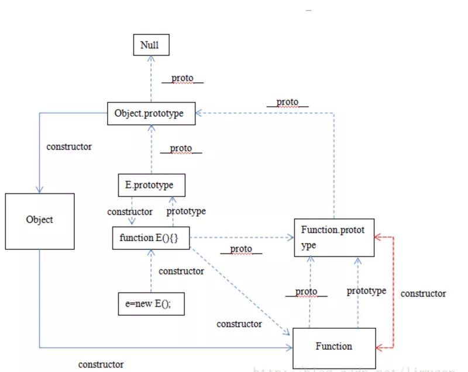

## 简单题
### 什么是防抖和节流？有什么区别？如何实现

### 防抖
>触发高频时间后n秒内函数只执行一次，如果n秒内高频事件再次触发，则重新计算时间

思路
> 每次触发时都取消之前的延时方法
```js
// 1
let debounce = function(func, delay) {
    let timer = null;
    return function() {
        clearTimeout(timer);
        timer = setTimeout(func, delay)
    }
}
// 1 this指向调用它的element
function debounce(fn) {
    let timer = null; // 创建一个标记用来存放定时器的返回值
    return function() {
        clearTimeout(timer); // 每当用户输入的时候就把前一个setTimeout clear掉
        timer = setTimeout(() => {
            fn.apply(this, arguments);
        }, 500);
    }
}
function sayHi() {
    console.log('防抖成功')
}
var inp = document.getElementById('inp');
inp.addEventListener('click', debounce(sayHi));
```
### 节流
> 高频事件触发，但在n秒内只会执行一次，所以节流会稀释函数的执行频率

思路
> 每次触发事件时都盘山当前是否有等待的延时函数
```js
// 1
function throttle(func, delay) {
    let timer = null;
    return function() {
        if (timer) return false;
        timer = setTimeout(() => {
            func();
            timer = null;
        }, delay)
    }
}
// 2
function throttle(fn) {
    let canRun = true; // 通过闭包保存一个标记
    return function() {
        if (!canRun) return; // 在函数开头判断标记是否为true，不为true则return
        canRun = false; // 立即设置为true
        setTimeout(() => {
            fn.apply(this, arguments); 
            canRun = true;
        }, 500);
    }
}
function asyHi(e) {
    console.log(e.target.innerWidth, e.target.innerHeight);
}
```

### get请求传参长度的误区、get和post请求在缓存方面的区别

**误区：我们经常说get请求参数的大小有限制，而post请求的参数大小是无限制的**

实际上HTTP协议从未规定GET/POST的请求长度限制是多少。对get请求参数的限制是来源于浏览器或web服务器，浏览器或web服务器限制了url长度。为了明确这个概念，我们必须再次强调下面几点:

- <span style="color: blue">HTTP协议未规定GET和POST的长度限制</span>
- <span style="color: blue">GET的最大长度是因为浏览器或web服务器限制了uri长度</span>
- <span style="color: blue">不同的浏览器和web服务器，限制的长度不一样</span>
- <span style="color: blue">要支持IE,则对打长度为2083byte，若只支持chrome,则最大长度8182byte</span>

补充一下get和post在缓存方面的区别
- get请求类似于查找的过程，用户获取数据，可以不用每次都与数据库连接，所以可以使用缓存。
- post不同，post做的一般是修改和删除的工作，所以必须与数据库交互，所以不能使用缓存，因此get请求适用于请求缓存。

### 模块化发展历程

可从IIFE、AMD、CMD、CommonJS、UMD、webpack(require.ensure)、ES Module这几个角度考虑

模块化主要是用来抽离公共代码，隔离作用域，避免冲突等。

**IIFE:**使用自执行函数来编写模块化，特点：**在一个单独的函数作用域中执行代码，避免变量冲突**
```js
(function() {
    return {
        data: []
    }
})()
```
**AMD:**使用requireJS来编写模块化，特点**依赖必须声明好**
```js
define('./index.js', function(code) {
    // code 就是index.js 返回的内容
})
```
**CMD:**使用seaJS来编写模块化，特点:**支持动态引入依赖文件**
```js
define(function(require, exports, module) {
    var indexCode = require('./index.js');
})
```
**CommonJS:**nodejs自带的模块化
```js
var fs = require('fs');
```
**UMD:**兼容AMD,Commonjs模块化的语法

**webpack(require.ensure):**webpack2.x版本中的代码分割

**ES Module：**ES6引入的模块化，支持import来引入另一个js
```js
import a from 'a';
```

### <span style="color:red">npm模块安装机制，为什么输入npm install就可以自动安装对应的模块</span>

npm模块安装机制
- 发出npm install 命令
- 查询node_module目录中之后是否存在指定模块
    - npm向registry查询模块压缩包的地址
    - 下载压缩包，存放在根目录下的.npm目录里
    - 解压压缩包到当前项目的node_module目录
    - 若存在，不在重新安装
    - 若不存在

npm实现原理

输入npm install命令并敲下回车后，会经理如下几个阶段(以npm 5.5.1为例)
- <span style="color: blue">执行工程自身preinstall</span>

    当前npm工程如果定义了preinstall钩子此时会被执行

- <span style="color: blue">确定首层依赖模块</span>

    首先需要做的是确定工程中的首层依赖，也就是dependencies和devDependencies属性中直接指定的模块(假设此时没有添加npm install参数)

    工程本身是整颗依赖树的根节点，每个首层依赖模块都是根节点下面的一棵子树，npm会开启多进程从每个首层依赖模块开始逐步寻找更深层级的节点
- <span style="color: blue">获取模块</span>

    获取模块是一个递归的过程，分为以下几步
    - 获取模块信息。
    - 获取模块实体
    - 查找该模块的依赖，如果有依赖则回到第一步，如果没有则停止
- <span style="color: blue">模块扁平化</span>
- <span style="color: blue">安装模块</span>

    这一步将会更新工程中的node_modules，并执行模块总的生命周期函数(按照preinstall、install、postinstall的顺序)
- <span style="color: blue">执行工程自身的生命周期</span>

    当前npm工程如果定义了钩子此时会被执行(按照install、postinstall、prepublish、prepare的顺序)

    最后易卜生生成或者更新版本描述文件，npm install 完成

### ES5的继承和ES6的继承有什么区别

ES5的继承通过prototype或者构造函数机制来实现，**ES5的继承实质上是先创建子类的实例对象，然后再将父类的方法添加到this上(Parent.apply(this))**

ES6的继承机制完全不同，**实质上是先创建父类的实例对象this(所以必须先调用父类的super()方法)，然后在用子类的构造函数修改this**

具体的：ES6通过class关键字定义类，里面有构造方法，类之间通过extends关键字实现继承。子类必须在constructor方法中调用super方法，否则新建实例报错。因为子类没有自己的this对象，而是继承父类的this对象，然后对其加工。如果不调用super方法。子类得不到this对象。

ps：super关键字指代父类的实例，即父类的this对象。在子类构造函数中，调用super后，才可以使用this关键字否则报错

```js
function Sub(name){
    this.name = name;
}
Sub.prototype.test = function() {console.log(name)};
function Parent(name) {
    Sub.apply(this, arguments);
}
Parent.prototype = Object.create(Sub.prototype);
Parent.prototype.constructor = Parent

class A{}
class B extends A{}

```

### setTimeout、Promise、Async/Await的区别

[参考答案](https://gongchenghuigch.github.io/2019/09/14/awat/)
    
### 定时器的执行顺序或机制
因为js是单线程的，浏览器遇到setTimeout或者setInterval会先执行完当前的代码块，在此之前会把定时器推入浏览器的执行时间队列里面，等到浏览器执行完当前代码之后会看一下时间队列厘有没有任务，有的话才执行定时器的代码。所以即使把定时器的时间设置为0还是会先执行当前的代码
```js
function test(){
    var aa = 0;
    var testSet = setInterval(function(){
        aa++;
        console.log(123);
        if(aa<10){
            clearInterval(testSet);
        }
    },20);
  var testSet1 = setTimeout(function(){
    console.log(321)
  },1000);
  for(var i=0;i<10;i++){
    console.log( test );
  }
}
test()
```
输出结果
```js
test // 10次
undefined // test程序没有返回值 如果return 1 返回1
123 
321
```
### [1,2,3].map(parseInt)输出是什么为什么？
输出：**[1, NaN, NaN]**

- 首先让我们回顾一下,map函数的第一个参数callback
    ```js
    var new_array = arr.map(function callback(currentValue[, index[, array]]){
        // return element for new_array
    }[, this.args])
    ```
    这个callback一共接受三个参数，其中第一个参数代表当前被处理的元素，而第二个参数代表该元素的索引。第三个参数当前数组
- 而parseInt则用来解析字符串的，使字符串成为基数的整数
    ```js
    parseInt(string, radix)
    ```
    接收两个参数，第一个表示被处理的值(字符串)，第二个表示解析时的基数
- 了解这两个函数后，我们可以模拟一下运行情况
    1. parseInt(1, 0) // radix为0时，且string参数部位0x和0开头，按照10为基数进行处理，这个时候返回1
    2. parseInt(2, 1) // 基数是1(1进制)表示的数中，所以无法解析，返回NaN
    3. parseInt(3, 2)// 基数是2(2进制)表示数中，最大值小于2 所以无法即系，返回NAN
- map函数返回的是一个数组，所以最后结果为[1, NAN, NAN]

### Doctype作用?严格模式和混杂模式如何区分，他们有何意义
Doctype声明于文档最前面，告诉浏览器以何种方式来渲染页面，这里有两种模式，严格模式和混杂模式
- 严格模式的排版和JS运作模式是以该浏览器支持的最高标准进行的
- 混杂模式，向后兼容。模拟老式浏览器，防止浏览器无法兼容页面。

如何区分
1. 如果文档包含严格的DOCTYPE，那么它一般以严格模式呈现(**严格DTD---严格模式**)
2. 包含过渡 DTD 和 URI 的 DOCTYPE ，也以严格模式呈现，但有过渡 DTD 而没有 URI （统一资源标识符，就是声明最后的地址）会导致页面以混杂模式呈现。（**有 URI 的过渡 DTD ——严格模式；没有 URI 的过渡 DTD ——混杂模式**） 
3. DOCTYPE 不存在或形式不正确会导致文档以混杂模式呈现。（**DTD不存在或者格式不正确——混杂模式**）
4. HTML5 没有 DTD ，因此也就没有严格模式与混杂模式的区别，HTML5 有相对宽松的语法，实现时，已经尽可能大的实现了向后兼容。（**HTML5 没有严格和混杂之分**）

[Doctype作用？严格模式与混杂模式如何区分？它们有何差异？](https://www.cnblogs.com/wuqiutong/p/5986191.html)

[HTML--DTD](https://zhuanlan.zhihu.com/p/86079104)

### fetch发送2次请求的原因
**fetch发送post请求的时候，总是发送2次，第一次状态码是204 第二次才成功？**

原因很简单，因为你用fetch的post请求的时候，导致fetch第一次发送了一个options请求，询问服务器是否支持修改的请求头，如果服务器支持，则在第二次中发送真正的请求

## HTTP、浏览器对象
### HTTPS握手过程中，客户端如何验证证书的合法性
- 首先什么是HTTP协议
    http协议是超文本传输协议，位于tcp/ip四层模型中的应用层；通过请求/响应的方式在客户端和服务器之间进行通信;但是缺少安全性，http协议信息传输是通过明文的方式传输，不做任何加密，相当于在网络上裸奔；容易被中间人恶意篡改，这种行为叫做中间人攻击
- 加密通信
    为了安全性，双方可以使用对称加密的方式key进行信息交流，但是这种方式对称密钥也会被拦截，也不够安全，进而还是存在中间人攻击风险

    于是又想出来另一种方式，使用非对称加密的方式；使用公钥/私钥加解密；通信方A发起通信并携带自己的公钥，接收方B通过公钥来解密对称密钥；然后发送给发起方A；A通过私钥解密；双发接下来通过对称密钥来进行加密通信；但是这种方式还是存在一种安全性；中间人虽然不知道发起方A的私钥，但是可以做到偷天幻日，将拦截发起方的公钥key；并将自己的一对公/私钥的公钥发送给B，接收方B并不知道公钥已经被偷偷换过；按照之前的流程，B通过公钥加密自己生产的对称加密密钥key2发送给A

    这次通信再次被中间人拦截，尽管后面的通信，两者还是用key2通信，但是中间人已经掌握了key2,可以轻松的加解密，还是存在被中间人攻击风险

- 解决困境：权威证书颁发机构CA来解决
    - 制作证书：作为服务端的A，首先把自己公钥key1发送证书颁发机构，向证书颁发机构申请证书;证书颁发机构有一套自己的公私钥，CA通过自己的私钥来加密key1，并且通过服务端网址等信息生成一个证书签名，证书签名同样适用证书的私钥进行加密，制作完成后，机构将证书发给A
    - 校验证书真伪：当B向服务端A发起请求通信的时候，A不在直接返回自己的公钥，而是返回一个证书

说明:各大浏览器和操作系统已经维护了所有的证书机构的名称和公钥。B只需要知道那个权威机构发的证书，使用对应的机构的公钥，就可以解密处证书签名；接下来B使用同样的规则，生成自己的证书签名，如果两个签名一直说明证书有效；

签名验证成功后，B就可以再次利用机构的公钥，解密出A的公钥keY1，接下来操作之前流程一样了

- 中间人是否会拦截放假证书到B呢

    因为证书的签名由服务端网址等信息生成的，并且通过第三方结构的私钥加密中间人无法篡改，所以最关键的问题是证书签名的政委
- https主要的思想是在http基础上增加了ssl安全层，即以上认证过程

### TCP三次握手和四次挥手
三次握手之所以是三次是保证client和server均让对方知道自己的接收和发送能力没问题而保证的最小次数。

第一次client => server 只能server判断出client具备发送能力
第二次 server => client client就可以判断出server具备发送和接受能力。此时client还需让server知道自己接收能力没问题于是就有了第三次
第三次 client => server 双方均保证了自己的接收和发送能力没有问题

其中，为了保证后续的握手是为了应答上一个握手，每次握手都会带一个标识 seq，后续的ACK都会对这个seq进行加一来进行确认。

### img irame script来发送跨域请求有什么优缺点
- iframe
    优点:跨域完毕之后DOM操作和互相之间的Javascript调用都没有问题的

    缺点: 1.若结果要以URL参数传递，这就意味着在结果数据量很大的时候需要分割传递，巨烦。2.还有一个iframe本身带来的，母页面和iframe本身的交互有安全限制
- script
    优点：可以直接返回json格式数据，方便处理

    缺点: 只接受get请求方式
- 图片ping
    优点：可以访问任何url，一般用来点击追踪，做页面分析常用的方法

    缺点：不能访问响应问题，只能监听是否响应
### http和https的区别
http传输的数据是未加密的，也就是明文的，网景公司设置了SSL协议来对http协议传输的数据进行加密处理，简单来说https协议是有http和ssl协议构建的可以进行加密传输和身份认证的网络协议，比http协议安全性更高，主要区别如下
- https协议需要ca证书，费用较高
- http是超文本传输协议，信息是明文传输，https是具有安全性的ssl加密传输协议
- 使用不同的连接方式，端口也不同，一般http是80端口 https的端口是443
- http的连接很简单，是无状态；https协议是有ssl+http协议构建的可以进行加密纯属，身份认证的网络协议，比http协议安全

### 什么是BOM，有哪些常用的BOM属性
Bom是浏览器对象

**Location对象**
- location.href--返回或设置当前文档的URL
- locaiton.search-返回URL中查询字符串部分。例如 http://www.dreamdu.com/dreamd... 返回包括(?)后面的内容?id=5&name=dreamdu
- location.hash-返回URL#后面的内容，如果没有#,返回空
- location.host-返回URL中的域名部分，例如www.dreamdu.com
- location.hostname-返回URL中的主域名部分，例如dreamdu.com
- location.pathname-返回URL的域名后的部门，例如http://www.deamdu.com/xhtml返回/xhmlt
- location.port- 返回URL中的端口部门
- location.protocal-返回URL中的协议部门
- location.assign-返回当前文档的url
- location.replace()-设置当前文档的URL，并且在history对象的地址列表中移除这个URL location.replace(url);
- locaton.reload()-重载当前页面
**history**
- histroy.go()--前进或者后退指定的页面数
- history.go(num);history.back()-后退一页
- history.forward()-前进一页
**Navigator对象**
- navigator.userAgent-返回用户代理头的字符串表示(就是包含浏览器版本信息等的字符串)
- navigator.cookieEnabled-返回浏览器是否支持cookie

### Cookie、sessionStorage、localStorage的区别
共同点：都保存在浏览器端，并且是同源的
- Cookie:cookie数据始终在同源的http请求中携带(即使不需要)，即cookie在浏览器和服务器间来回传递。而sessionStorage和localstorage不会自动把数据发给服务器，仅在本地保存。cookie数据还有路径概念，可以限制cookie只属于某个路径下，存储的大小只有4K左右(key:可以在浏览器和服务器来回传递，存储容量小，只有大约4k左右)
- sessionstorage：本身就是一个回话过程，关闭浏览器后消息，session为一个回话，当页面不同即使在同一个页面打开两次，也被视为一次回话
- localStorage:同源窗口都会共享，并且不会失效，不管窗口或浏览器关闭与否都会始终有效

补充一下cookie的作用
- 保存用户登录装填
- 追踪用户行为
- 定制页面

### Cookie如何方法XSS攻击
XSS是指攻击者在返回的HTML中javascript脚本，为了减轻这些攻击，需要在HTTP头部配上，set-cookie：
- httponly-这个属性可以防止XSS,它会禁止JavaScript脚本来访问cookie
- secure-这个属性告诉浏览器仅在请求为http时候发送cookie
> HttpOnly 就是只在 http 会话中传递得意思，也就是说 js 不可见的
结果应该是这样的：set-cookie....

[Cookie中的HttpOnly详解](https://www.cnblogs.com/grefr/p/6088111.html)

### 浏览器和Node事件循环的区别
其中一个主要的区别在于浏览器的event loop和nodejs的event loop在处理异步时间的顺序是不同意的，nodejs中有micro event；其中Promise属于micro event该异步事件的处理顺序就和浏览器不同。nodejsv11.0以上，这两者顺序就相同了
```js
function test() {
    console.log('start');
    setTimeout(() => {
        console.log('children2');
        Promise.resolve().then(() => console.log('children2-1'))
    }, 0);
    setTimeout(() => {
        cosnole.log('children3');
        Promise.resolve().then(() => console.log('children3-1'));
    }, 0)
    Promise.resolve().then(() => console.log('children1'));
    console.log('en')
}
// 以上代码在node11以下版本的执行结果(先执行所有的宏任务，再执行微任务)
// start
// end
// children1
// children2
// children3
// children2-1
// children3-1

// 以上代码在node11及浏览器的执行结果(顺序执行宏任务和微任务)
// start
// end
// children1
// children2
// children2-1
// children3
// children3-1
```
### 简述HTTPS中间人攻击
https协议由http+ssl协议构成，具体的连接过程可参考SSL或者TSL握手概述

中间人攻击过程如下
1. 服务器向客户端发送公钥
2. 攻击者截获公钥，保留在自己受伤
3. 然后攻击者生成一个自己伪造的公钥，发送给客户端
4. 客户端收到伪造的公钥后，生成加密的hash值发送服务器
5. 攻击者获取加密的hash，用自己的私钥解密得到真密钥
6. 同事生成假的假的加密hash值，发送给服务器
7. 服务器用私钥解密获取的假密钥
8. 服务器用假密钥加密传输信息

方法方法
1. 服务器在发送浏览器的公钥中加入ca证书，浏览器可以验证ca证书的有效性

### 说几条web前端优化策略

1. 减少HTTP请求数
    这条策略基本所有前端人都知道，而且也是最重要最有效的。都说要减少HTTP请求，那请求多了到底会怎么样呢？首先每个请求都是有成本的，即包含时间成本也包含资源成本。一个完整的请求都需要经过DNS寻址、与服务器建立连接、接收数据这样一个漫长而复杂的过程。时间成本就是用户需要看到或者感受到这个资源是必须要等着这个过程结束的，资源上由于每个请求都需要携带数据，因此每个请求都需要占用带宽。

    另外，由于浏览器进行并发请求数是有上限的，因此请求数多了以后，浏览器需要分批进行请求，因此会增加用户的等待时间，会给用户造成站点速度慢这样一个印象，即使可能用户看到第一屏的资源已经请求完了，但是浏览器的进度条会一直存在。减少HTTP请求数主要途径包括：
2. 从设计实现层面简化页面
    如果你的页面像百度首页一样简单，那么接下来的规则基本上都用不到了。保持页面简洁、减少资源的使用是最直接的，如果不是这样，你的页面需要华丽的皮肤，则继续阅读下面的内容
3. 合理设置HTTP缓存
    缓存的力量是强大的，恰当的缓存设置可以大大减少HTTP请求。以有啊首页为例，当浏览器没有缓存的时候一共会发出78个请求，共600多K数据，而当访问即浏览器已缓存之后访问则仅有10个请求，工20多K数据(这里需要说明的是，如果直接F5刷新页面的话效果是不一样的，这种情况下请求数还是一样，不过被缓存资源的请求服务器是304响应，只有Header没有Body，可以节省带宽)
4. 资源合并和压缩
    如果可以的话，尽可能的将外部的脚本、样式进行合并，多个合为一个。另外CSS、Javascript、Image都可以用相应的工具进行压缩，压缩后往往能剩下不少空间
5. CSS Sprites
    合并css图片，减少请求数的又一个方法
6. Inline Images
    使用data:URL scheme的方式将图片嵌入到页面或CSS中，如果不考虑资源管理上的问题的话，不失为一个好办法。如果是嵌入页面的话换来的是增大了页面体积，而且无法利用浏览器缓存。使用在CSS中的图片则更为理想一些
7. Lazy Load Images
    这条策略实际上并不一定能减少HTTP请求数，但是却能在某些条件下或者页面刚加载时减少HTTP请求数。对于图片而言，在页面刚加载的时候可以只 加载第一屏，当用户继续往后滚屏的时候才加载后续的图片。这样一来，假如用户只对第一屏的内容感兴趣时，那剩余的图片请求就都节省了。有啊首页曾经的做法 是在加载的时候把第一屏之后的图片地址缓存在Textarea标签中，待用户往下滚屏的时候才“惰性”加载。

### 了解浏览器的重绘和回流导致的性能问题

重绘和回流是渲染步骤的一小节，但是这两个步骤对于性能影响很大
- 重绘是当节点需要更改外观而不会影响布局的，比如改变color就被叫做重绘
- 回流是布局或几何属性需要改变就称为回流

回流必定会发生重绘，重绘不一定会引发回流。回流所需的成本比重绘高的多，改变深层次的节点很可能导致父节点的一些列回流

所以一下几个动作可能会导致性能问题
- 改变window大小
- 改变字体
- 添加或者删除样式
- 文字改变
- 定位或者浮动
- 盒模型

很多人不知道的是，重绘和回流其实和Event Loop有关
1. <span style="color: red">每次Event Loop执行完Microtasks,会判断document是否需要更新。因为浏览器60HZ的刷新率，每16ms才会更新一次。(1000/ 60)</span>
2. <span style="color: red">然后判断是否有resize或者scroll，有的话就触发事件，所以resize和scroll时间也至少16ms才会触发一次，并且自带节流功能</span>
3. <span style="color: red"> 判断是否触发了media query</span>
4. <span style="color: red">更新动画并发发送事件</span>
5. <span style="color: red">判断是否有全屏操作事件</span>
6. <span style="color: red">执行 requestAnimationFrame回调</span>
7. <span style="color: red">执行 IntersectionObserver回调，该方法用于判断元素是否可见，可以用于懒加载上，但是兼容性不好</span>
8. <span style="color: red">更新界面</span>
9. <span style="color: red">以上就是一帧中可能会做的事情，如果在一帧中有空闲时间，就会执行requestIdleCallback回调</span>

**减少重绘和回流**
- 使用translate替代top
    ```js
    <div class="test"></div>
    <style>
        .test{
            position:absolute;
            top: 10px;
            width: 100px;
            height: 100px;
            background: red;
        }
    </style>
    <script>
        setTimeout(() => {
            // 引起回流
            document.querySelected('.test').style.top = '100px';
        })
    </script>
    ```
- 使用visibity替换display:none因为牵着只会引起重绘，后者会引发回流(改变了布局)
    把DOM离线后修改，比如：先把DOM给display:none(有一次Reflow)，然后你修改100次，然后再把它显示出来

    不要把DOM节点的属性值放在一个循环里当成循环里的变量
    ```js
    for(let i = 0;i< 1000; i++) {
        // 获取offsetTop会导致回流，因为需要去获取正确的值
        console.log(document.querySelector('.test').style.offsetTop)
    }
    ```
- 不要使用table布局，可能很小的一个小改动会造成整个table的重新布局
- 动画实现的速度的选择，动画速度越快，回流次数越多，也可以选择使用requestAnimationFrame
- CSS选择符从右往左匹配查找，避免DOM深度过审
- 将频繁运行的动画变为图层，图层能够阻止该节点回流影响别的元素，比如对于video标签，浏览器会自动改节点变为图层

## React/Vue
### React/vue为什么要在列表组件写key，其作用是什么
vue和react都是采用diff算法来对比新旧虚拟节点，从而更新节点。在vue的diff函数中(建议先了解一下diff算法过程)

在交叉对比中，当新节点跟纠结点**头尾交叉对比**没有结果时，会根据新节点的key对对比旧节点数组中的key，从而找到相应旧节点(这里对应的是一个key=>index的map映射)。如果没找到就认为是新增节点。而如果没有key，那么就会采用遍历查找的方式去找到对应的旧节点。一种一个map映射，一种遍历查找。相比而言map映射速度更快

vue源码
```js
// vue项目 src/core/vdom/patch.js -488行
// 以下是为了阅读星进行格式化的代码

// oldCh是一个旧虚拟节点数组
if(isUndef(oldKeyToIdex)) {
    oldKeyToIdx = createKeyToOldIdex(oldCh, oldStartIdx, oldEndIdx);
}
if(isDef(newStartVnode.key)) {
    //map方式
    idxInOld = oldKeyToIdx[newStartVnode.key]
} else {
    // 遍历方式获取
    idxInOld = findIdxInOld(newStartVnode, oldCh, oldStartIdx, oldEndIdx)
}

// 创建map函数
function createToOldIdex(children, beginIdx, endIdx) {
    let i, key;
    const map = {};
    for (i = beginIdex; i <= endIdx; ++i) {
        key = children[i].key;
        if (isDef(key)) map[key] = i;
    }
    return map
}
//遍历寻找
// sameVnode 是对比新旧节点是否相同的函数
 function findIdxInOld (node, oldCh, start, end) {
    for (let i = start; i < end; i++) {
      const c = oldCh[i]
      
      if (isDef(c) && sameVnode(node, c)) return i
    }
  }
```
### React中setState什么时候同步，什么时候异步的？
在React中,**如果是由React引发的事件处理(比如通过onclick引发的事件处理)，调用setState不会同步更新this.state，除此之外的setState调用会同步执行this.state**.所谓"除此之外"，指的是绕过React通过addEventListener直接添加的时间处理函数，还有通过setTimeout/setInterval产生的异步调用

原因：在React的setState函数实现中，会根据一个变量isBatchingUpdates判断是直接更新this.setState还是放到队列中回头再说，而isBatchingUpdates默认是false,也就表示setState会同步更新this.state，但是，**有一个函数batchedUpdates，这个函数会把isBatchingUpdates修改为true,而当React在调用事件处理函数之前就会调用这个batchedUpdates，造成的后果，就是由React控制的事件处理过程setState不会同步更新this.state**

```js
class Example extends React.Component {
    constructor() {
        super();
        this.state = {
            val: 0
        }
    }
    componentDidMount() {
        this.setState({val: this.state.val + 1});
        console.log(this.state.val); // 第1次log

        this.setState({val: this.state.val + 1});
        console.log(this.state.val) // 第二次log

        setTimeout(() => {
            this.setState({val: this.state.val + 1});
            console.log(this.state.val); // 第三次log

            this.setState({val: this.state.val + 1});
            console.log(this.state.val); // 第4次
        }, 0)
    }
}

1. 第一次和第二次都是在react自身的生命周期内，触发时isBatchingUpdates为true，所以并不会直接执行更新state，而是加入了dirtyComponents，所以打印你获取的都是更新前的状态0
2. 两次setState时，获取到的this.state.val都是0，所以执行时都是将0设置为1，在react内部会被合并，只执行一次。设置完成后state.val值为1.
3. setTimeout中的代码，触发时isBatchingUpdates为false，所以能够直接更新，所以连着输出2，3
```
### 为什么虚拟DOM会提高性能
虚拟DOM相当于在js和真实dom中间加了一个缓存，利用dom diff算法避免了没有必要的dom操作，从而提高性能

具体步骤如下

用JavaScript对象结构表示DOM树的结构;然后用这个树构建一个真正的DOM树，查到文档中

当状态变更的时候，重新构造一颗新的对象树。然后用新的树和旧的树进行比较，记录两棵树差异

把2所记录的差异应用到步骤1所构建的真正的DOM树上视图就更新了

## CSS
### 比较opacity:0、visibily:hidden、display:none优劣和使用场景
结构：

display:none-会让元素完全从渲染树中消失，渲染的时候不占据任何空间，不能点击

visibility:hidden-不会让元素从渲染树消息，渲染元素继续占据空间，只是内容不可见，不能点击

opacity:0-不会让元素从渲染树消失，渲染元素继续占据空间 只是内容不可见，可以点击

继承：

display:none和opacity：0--是非继承属性，子孙节点消失由于元素从渲染树消息造成的，通过修改资讯节点属性无法显示

visibily:hidden--是继承属性，子孙节点消失由于继承了hidden,通过visibility:visible可以让子孙节点显示

性能

display:none--修改元素会造成文档回流，读屏器不会读取display:none元素内容，性能消耗大

visibility:hidden--修改元素只会造成元素重绘，性能消耗少，读屏器肚脐visibility：hidden元素内容

opacity:修改元素会造成重绘，性能消耗较少

### 清楚浮动有哪些？比价好的哪一种
常用的一般分三种.clearfix,clear:both,overflow:hidden

比较好是.clearfix，伪元素万金油版本呢，后两者有局限性
```css
.clearfix:after {
    visibility: hidden;
    display: block;
    font-size: 0;
    content: '';
    clear:both;
    height: 0;
}
!--
为毛没有 zoom ,_height 这些,IE6,7这类需要 csshack 不再我们考虑之内了
.clearfix 还有另外一种写法,
-->

.clearfix:before, .clearfix:after {
    content:"";
    display:table;
}
.clearfix:after{
    clear:both;
    overflow:hidden;
}
.clearfix{
    zoom:1;
}
<!--
用display:table 是为了避免外边距margin重叠导致的margin塌陷,
内部元素默认会成为 table-cell 单元格的形式
-->
```
clear:both:若是用在同一个容器内相邻元素上,那是贼好的,有时候在容器外就有些问题了, 比如相邻容器的包裹层元素塌陷

overflow:hidden:这种若是用在同个容器内,可以形成 BFC避免浮动造成的元素塌陷

### 如何水平居中一个元素
- 如果需要居中元素为常规流中inline元素，为父元素设置text-align: center即可实现
- 如果需要居中元素为常规流中block元素
    - 为元素设置宽度
    - 设置左右margin为auto
    - IE6下父元素上设置text-align:center,在给元素恢复需要的值

- 定位

## Javascript
### JS有几种数据类型，其中基本类型有哪些？
- Boolean
- Null
- Undefined
- Number
- String
- Symbol
- Object

(ES6之前)其中5中为基本类型:string,number,boolean,null, undefined
ES6出来的Symbol也是原始数据类型，表示独一无二的值
Object为引用类型(范围挺大)包括数组、函数

### Promise构造函数是同步执行还是异步执行，那么thnen方法呢
```js
const promise = new Promise((resolve, reject) => {
    console.log(1);
    resolve();
    cosnole.log(2);
})
promise.then(() => {
    console.log(3)
})
console.log(4);

输出
1
2
4
3
promise构造函数是同步执行的，then方法是异步执行的
Promise new的时候会立即执行里面的代码 then是微任务，会在本次任务执行完的时候执行，setTimeout是宏任务，会在下次任务执行的时候执行
```

### JS的四种设计模式
**工厂模式**
```js
function createPerson(name, age, sex) {
    var obj = new Object();
    obj.name = name;
    obj.age = age;
    obj.sex = sex;
    obj.sayName = function() {
        return this.name;
    }
    return obj;
}
var p1 = new createPerson('longgen', 28, '男');
var p2 = new createPerson('tugenhua', 27, '女');
onsole.log(p1.name); // longen
console.log(p1.age);  // 28
console.log(p1.sex);  // 男
console.log(p1.sayName()); // longen

console.log(p2.name);  // tugenhua
console.log(p2.age);   // 27
console.log(p2.sex);   // 女
console.log(p2.sayName()); // tugenhua  
```
**单例模式**
```js
var Singleton = function(name) {
    this.name = name;
}
Singleton.prototype.getName = function() {
    return this.name;
}
// 获取实例对象
var getInstance = (function() {
    var instance = null;
    return function(name) {
        if (!instance) {
            instance new Singleton(name);
        }
        return instalce;
    }
})();
// 测试单体模式的实例,所以a===b
var a = getInstance("aa");
var b = getInstance("bb");  
```
**沙箱模式**

将一些函数放到自执行函数里面，但要用闭包暴露接口，用变量接收暴露的接口，在调用里面的值，否则无法使用里面的值
```js
let sandboxModel = (function() {
    function sayName() {};
    funtion saySex(){}
    return {
        sayName: sayName,
        sayAge: sayAge,
    }
})
```
**发布订阅者模式**
```js
var shoeObj = {}; // 定义发布者
shoeObj.list = []; // 缓存列表 存放订阅者回调函数

// 增加订阅者
shoeObj.listen = function(fn) {
    shoeObj.list.push(fn); //订阅消息添加到缓存列表
}
// 发布消息
shoeObj.trigger = function() {
    for (var i = 0, fn; fn = this.list[i++]) {
        fn.apply(this, arguments); // 第一个参数只是改变fn的this
    }
}
 // 小红订阅如下消息
shoeObj.listen(function(color, size) {
    console.log("颜色是：" + color);
    console.log("尺码是：" + size);
});

// 小花订阅如下消息
shoeObj.listen(function(color, size) {
    console.log("再次打印颜色是：" + color);
    console.log("再次打印尺码是：" + size);
});
shoeObj.trigger("红色", 40);
shoeObj.trigger("黑色", 42);  
```
### 列举出集中创建实例的方法
1. 字面量
    ```js
    let obj = {name: '张三'}
    ```
2. Object构造函数创建
    ```js
    let obj = new Object();
    Obj.name = '张三'
    ```
3. 使用工厂模式创建对象
    ```js
    function createPerson(name) {
        var o = new Object();
        o.name = name;
        return obj;
    }
    var person1 = createPerson('张三')
    ```
4. 构造函数创建对象
    ```js
    function Person(name) {
        this.name = name;
    }
    var person1 = new Person('张三')
    ```
### 简述一下前端事件流
HTML中与javascript交互是通过事件驱动来实现的，例如鼠标点击事件onclick、页面滚动事件onscroll事件，可以向文档中的元素添加事件监听器来预定事件。想要知道这些事件在什么时候进行调用，就需要了解事件流的概念

什么是事件流：事件流描述的是从页面中接收事件的顺序，DOM2级事件流包括以下几个阶段
- 事件捕获阶段
- 处于目标阶段
- 事件冒泡阶段

addEventListener：是DOM2级事件新增的指定事件处理程序操作，这个方法接受3个参数：要处理的事件名、作为事件处理程序的函数和一个布尔值。最后这个布尔值参数如果是true，表示在捕获阶段事件处理程序；如果是false，表示在冒泡阶段调用事件处理程序

IE只支持事件冒泡

### Function.__proto__(getPrototypeOf)是什么
获取一个对象的原型，再chrome中可以通过__proto__的形式，或者在ES6中可以通过Object.getPrototypeOf的形式

那么Function.__proto__是什么？
```js
Function.__proto__ === Object.prototype // false;
Function.__proto__ === Function.prototype // true
```
那么我们发现Function的原型也是Function



### 简述一下原型/构造函数/实例
- 原型(prototype)：一个简单的对象，用于实现对象的属性继承。可以简单的理解成对象的爹。在Firefox和Chrome中，每个Javascript对象都包含一个__proto__(非标准)的属性指向它爹(该对象的原型)，可obj.__proto__进行访问
- 构造函数：可以通过new来新建一个对象的函数
- 实例：通过构造函数和new创建出来的对象，便是实例，实例通过__proto___指向原型，通过constructor指向构造函数

```js
const instance = new Object;
const prototype = Object.prototype

实例.__proto__ === 原型
原型.constructor === 构造函数

构造函数.prototype === 原型
// 这条线其实是是基于原型进行获取的，可以理解成一条基于原型的映射线
// 例如: 
// const o = new Object()
// o.constructor === Object   --> true
// o.__proto__ = null;
// o.constructor === Object   --> false
实例.constructor === 构造函数
```

## 程序阅读题
### 下面程序输出什么
```js
funtion sayHi() {
    console.log(name);
    console.log(age);
    var name = 'LYDIA';
    let age = 21;
}
sayHi
```
在函数中，我们首先使用val关键字声明了name变量。这意味着变量在创建阶段会被提升(javascript会在创建阶段为其分配内存空间),默认值为undefined,直到我们实际执行到该变量的行，我们还没为name变量赋值，所以它仍保持undeined的值

<span style="color: red">使用let关键(const)申明的变量也会存在变量提升，但是与val不同，初始化没有提升。在我们声明(初始化)他们之前，他们不可以访问，这就成为暂时死去，当我们在声明变量之前尝试访问变量，javascript会抛出一个referenceError；</span>

关于let的是否存在变量提升，我们何以用下面的例子来验证：
```js
let name =  ConardLi 
{
  console.log(name) // Uncaught ReferenceError: name is not defined
  let name =  code秘密花园 
}
```
let变量如果不存在变量提升，console.log(name)就会输出ConardLi，结果却抛出了ReferenceError，那么这很好的说明了，let也存在变量提升，但是它存在一个“暂时死区”，在变量未初始化或赋值前不允许访问。

变量的复制分为三个阶段
- <span style="color: red">创建变量，在内存中开辟空间</span>
- <span style="color: red">初始化变量，变量初始化为undefined</span>
- <span style="color: red">真正赋值</span>

关于let、val和function
- <span style="color: red">**let的创建过程被提升了，但是初始化没有提升**</span>
- <span style="color: red">**val的创建和初始化都被提升了**</span>
- <span style="color: red">**function的创建、初始化、赋值都被提升了**</span>
### 下面代码输出的是什么
```js
var a = 10;
(function() {
    console.log(a);
    a = 5;
    console.log(window.a);
    var a = 20
    cosnole.log(a)
})()
``` 
依次输出：undefined=>10=>20
```
在立即执行函数中，var a = 20; 语句定义了一个局部变量 a，由于js的变量声明提升机制，局部变量a的声明会被提升至立即执行函数的函数体最上方，且由于这样的提升并不包括赋值，因此第一条打印语句会打印undefined，最后一条语句会打印20。

由于变量声明提升，a = 5; 这条语句执行时，局部的变量a已经声明，因此它产生的效果是对局部的变量a赋值，此时window.a 依旧是最开始赋值的10，
```
### 下面的输出结果是什么？
```js
class Chameleon {
  static colorChange(newColor) {
    this.newColor = newColor;
  }

  constructor({ newColor = "green" } = {}) {
    this.newColor = newColor;
  }
}

const freddie = new Chameleon({ newColor: "purple" });
freddie.colorChange("orange");
```
- A: orange
- B: purple
- C: green
- D: TypeError

colorChange方法是静态的。<span style="color: red">静态方法仅在创建它们的构造函数中存在，并且不能传递给任何子级。由于freddie是一个子级对象，函数不会传递，所以在freddie实例上不存在freddie方法：抛出TypeError。</span>

### 下面代码中什么时候会输出1？
```js
var a = ?;
if(a == 1 && a == 2 && a == 3){
     conso.log(1);
}

```
> 因为==会进行隐式类型转换，所以我们重写toString方法就可以了
```js
var a = {
    i: 1,
    toString() {
        return a.i++;
    }
}
if( a == 1 && a == 2 && a == 3 ) {
  console.log(1);
}
```
### 下面的代码输出的结果是什么？
```js
var a = {n: 1};
var b = a;
a.x = a = {a: 2};
```
undefined

{n: 2}

首先，a和b同时引用了{n:1}对象，接着执行到a.x = a = {a:2}语句，尽管赋值是从右到左的没错，但是.的优先级比=要高，所以这里首先执行a.x,相当于为a(或b)所指向的{n:1}对象赋值了一个新的属性x,即此时对象将变为{n:1,x: undefined}。之后按照正常情况，从右到左进行赋值，此时执行a = {n:2}的时候， a的引用改变，指向了新对象{n: 2},而b依然指向的是旧对象。之后执行a.x = {n:2}的时候，并不会重新解析一遍a，而是沿着最初解析的a.x的时候a,也就是旧对象，故此旧对象x的值{n:2},旧对象为{a:1,x:{n:2}},它被b引用者

后面输出a.x的时候，又要解析a了，此时候a是指向新对象的a，而这个新对象是没有x属性的，故访问时候输出undefined；而访问b.x的时候，将输出就对象x的值 即{n:2}

### 下面代码的输出是什么?
```js
function checkAge(data) {
  if (data === { age: 18 }) {
    console.log("You are an adult!");
  } else if (data == { age: 18 }) {
    console.log("You are still an adult.");
  } else {
    console.log(`Hmm.. You don t have an age I guess`);
  }
}

checkAge({ age: 18 });
```
>Hmm.. You don t have an age I guess

在比较相等性，原始类型通过它们的值进行比较，而对象通过它们的引用进行比较。JavaScript检查对象是否具有对内存中相同位置的引用。

我们作为参数传递的对象和我们用于检查相等性的对象在内存中位于不同位置，所以它们的引用是不同的。

这就是为什么{ age: 18 } === { age: 18 }和 { age: 18 } == { age: 18 }返回 false的原因。

### 下面代码的输出是什么?
```js
const obj = { 1: "a", 2: "b", 3: "c" };
const set = new Set([1, 2, 3, 4, 5]);

obj.hasOwnProperty("1");
obj.hasOwnProperty(1);
set.has("1");
set.has(1);

```

> true true false true

所有对象键（不包括Symbols）都会被存储为字符串，即使你没有给定字符串类型的键。这就是为什么obj.hasOwnProperty（ 1 ）也返回true。

上面的说法不适用于Set。在我们的Set中没有“1”：set.has（ 1 ）返回false。它有数字类型1，set.has（1）返回true。

### 下面代码的输出结果是什么？
```js
function Foo() {
    Foo.a = function() {
        console.log(1)
    }
    this.a = function() {
        console.log(2)
    }
}
Foo.prototype.a = function() {
    console.log(3)
}
Foo.a = function() {
    console.log(4)
}
Foo.a();
let obj = new Foo();
obj.a();
Foo.a();
```
> 4 2 1
```js
function Foo() {
    Foo.a = function() {
        console.log(1)
    }
    this.a = function() {
        console.log(2)
    }
}
// 以上只是 Foo 的构建方法，没有产生实例，此刻也没有执行

Foo.prototype.a = function() {
    console.log(3)
}
// 现在在 Foo 上挂载了原型方法 a ，方法输出值为 3

Foo.a = function() {
    console.log(4)
}
// 现在在 Foo 上挂载了直接方法 a ，输出值为 4

Foo.a();
// 立刻执行了 Foo 上的 a 方法，也就是刚刚定义的，所以
// # 输出 4
```


## 资料
[原文](https://mp.weixin.qq.com/s/Zq0wn-yYJgCb6TfmETjuVw)