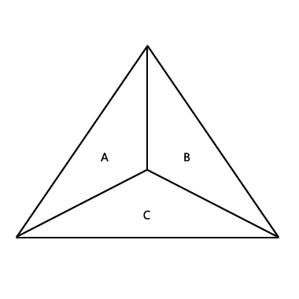

## 第一种

可以通过 Barycentric coordinate system （重心坐标）去处理。
参考链接：[https://en.wikipedia.org/wiki...](https://en.wikipedia.org/wiki...)

设要测试的点为 (x0, y0)，三角形三点分别为 (x1, y1)，(x2, y2)，(x3, y3)

根据重心坐标的定义：

```
x0 = a * x1 + b * x2  + c * x3
y0 = a * y1 + b * y2 + c * y3
a + b + c = 1
```

其中 a b c 分别为三个系数。当且仅当 a b c 均大于等于 0 且小于等于 1 时，点 (x0, y0) 在由点 (x1, y1)、点 (x2, y2) 和点 (x3, y3) 构成的三角形内。

由上面的定义可得出 a b c 的解：

```
a = ((y2 - y3)*(x0 - x3) + (x3 - x2)*(y0 - y3)) / ((y2 - y3)*(x1 - x3) + (x3 - x2)*(y1 - y3))
b = ((y3 - y1)*(x0 - x3) + (x1 - x3)*(y0 - y3)) / ((y2 - y3)*(x1 - x3) + (x3 - x2)*(y1 - y3))
c = 1 - a - b
```
写成 JS 方法：
```
function pointInTriangle(x0, y0, x1, y1, x2, y2, x3, y3) {
  var divisor = (y2 - y3)*(x1 - x3) + (x3 - x2)*(y1 - y3);
  var a = ((y2 - y3)*(x0 - x3) + (x3 - x2)*(y0 - y3)) / divisor;
  var b = ((y3 - y1)*(x0 - x3) + (x1 - x3)*(y0 - y3)) / divisor;
  var c = 1 - a - b;

  return a >= 0 && a <= 1 && b >= 0 && b <= 1 && c >= 0 && c <= 1
}
```

## 第二种
一开始想到用到图片[热区](https://www.runoob.com/tags/tag-area.html)做，可是后来发现热区做有问题，有一个按钮不能点击，调了层级顺序后可以点击，但是另外一个按钮又不能点击了,于是决定模拟一个三角形热区功能。

首先:

判断鼠标坐标是否在三角形内有很多种方法，比较简单的是面积法，即把一个大三角形(T)按照鼠标当前的点连接三个顶点，分成三分(A、B、C),然后三个小三角形面积想加等于原来那个大三角形面积，得出公式:T = A + B + C。但是JS有误差，所以用Math.abs(A + B + C - T) < 0.0001 减小误差。



如何求三角形面积？

1. 首先要求得三条边的边长a, b, c，然后在另p = (a + b + c) / 2;
2. 套用求三角形面积公式算出三角形面积S: 即 S = Math.sqrt(p * (p - a) * (p - b) * (p - c))

现在还不知道三条边的边长，但是三角形三个顶点是已知的，那么可以用任意两点求得距离，算出三条边长。

已知任意两点p1(x1, y1)、p(x2,y2)的坐标如何求边上

x轴坐标之差的平方加上Y轴坐标之差的平法，然后对其值开根号就是两点间的距离。

得出公式

L = Math.sqrt((x1 - x2) * (x1 - x2) + (y1 - y2) * (y1 - y2))

至此即可求出三角形的面积，再根据鼠标当前位置算出大三角形跟三个小三角形的面积，即可判断出此点是否在三角形内。

下面提供示例：

此方法已封装好直接调用即可

onTriangle(obj, x1, y1, x2, y2, x3, y3, inFn, outFn, clickFn)

obj为要判断的对象，x1、y1、x2、y2、x3、y3为三角形三个顶点的坐标，inFn为鼠标移入时的函数，outFn为鼠标移出时的函数，clickFn为鼠标点击时的函数。


## 参考文档
[js怎么判断一个点在三角形内](https://segmentfault.com/q/1010000009698222)

[js判断鼠标是否在三角形内内](https://www.cnblogs.com/baie/archive/2012/08/23/2652918.html)