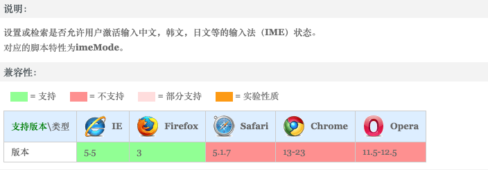

## 语法

zoom: auto | normal | active | inactive | disabled

默认值: auto

适用于: 所有出入文本框

继承性 无

## 取值

auto: 不影响IME的状态

normal: 正常的IME状态

active: 指定所有使用ime输入的字符。即激活本地语言输入法。用户仍可以撤销激活ime

inactive: 指定所有不使用ime输入的字符。即激活非本地语言。用户仍可以撤销激活ime

disabled: 完全金庸ime。用于有焦点的控件(如输入框)，用户不可以激活ime



```
<!DOCTYPE html>
<html lang="zh-cn">
<head>
<meta charset="utf-8" />
<title>ime-mode_CSS参考手册_web前端开发参考手册系列</title>
<style>
#test{
	padding:50px;
	font:14px/1.231 georgia,宋体,arial,verdana,helvetica,sans-serif;
}
#test fieldset{
	margin:0;
	padding:10px;
	border-radius:5px;
}
#test fieldset legend{
	padding:3px 6px;
	border-radius:3px;
	background:#ddd;
}
#test ul{
	list-style:none;
	margin:0;
	padding:0;
}
#test li{
	padding:5px 10px;
}
#test .writebox{
	position:relative;
	overflow:visible;
	outline:none;
	width:200px;
	padding:4px 3px 5px;
    border:1px solid #999;
    border-radius:3px;
    box-shadow:1px 1px 2px rgba(0,0,0,.2) inset;
    background-color:#FFFFFF;
	color:#666666;
	font:14px/1.231 georgia,宋体,arial,verdana,helvetica,sans-serif;
}
#test .writebox:hover{
	border-color:#777;
	box-shadow:1px 1px 2px rgba(0,0,0,.4) inset;
}
#test .writebox:focus{
	border-color:#666;
	box-shadow:0 0 5px rgba(0,0,0,.5);
}
.auto{
	ime-mode:auto;
}
.normal{
	ime-mode:normal;
}
.active{
	ime-mode:active;
}
.inactive{
	ime-mode:inactive;
}
.disabled{
	ime-mode:disabled;
}
.title{
	font:bold 16px/1.5 georgia,simsun,sans-serif;
}
</style>
</head>
<body>
<h1 class="title">在下列输入框输入试试每个值的作用：</h1>
<form id="test" action="#" method="post">
	<fieldset>
		<legend>简单的表单</legend>
		<ul>
			<li><label>auto：<input type="text" class="writebox auto" /></label></li>
			<li><label>normal：<input type="text" class="writebox normal" /></label></li>
			<li><label>active：<input type="text" class="writebox active" /></label></li>
			<li><label>inactive：<input type="text" class="writebox inactive" /></label></li>
			<li><label>disabled：<input type="text" class="writebox disabled" /></label></li>
		</ul>
	</fieldset>
</form>
</body>
</html>
```

## 参考文档
[w3cHTML css3 ime-mode](http://www.w3chtml.com/css3/properties/user-interface/ime-mode.html)

[cssime-mode属性使用的具体详解](https://www.gxlcms.com/css-258491.html)

[实时监控文本框变化](https://www.cnblogs.com/cathsfz/archive/2011/05/29/2062382.html)