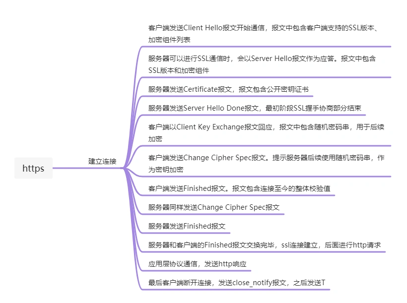

## 字节(北京)
### 一面
1. HTTPS建立连接过程

2. [http缓存，强缓存时cache-control字符集是什么？](https://developer.mozilla.org/zh-CN/docs/Web/HTTP/Headers/Cache-Control)
    - public-- 表明响应可以被任何对象(包括：发送请求的客户端，代理服务器等)缓存，即使是通常不可缓存的内容(例如：1.改响应没有max-age指令或Expires消息头，2该响应对应的请求方法是POST)\
    - private--表明响应只能被单个用户缓存，不能作为共享缓存(即代理服务器不能缓存它)。私有缓存可以缓存响应内容，比如：对应用户的本地浏览器
    - no-catch--在发布缓存副本之前，强制要求缓存把请求提交给原始服务器进行验证(协商缓存验证)
    - no-store -- 缓存不应存储有关客户端请求或服务器响应的任何内容，即不是用任何缓存
3. <span style="color: blue">深拷贝的实现，如果遇到function怎么办，需要判断类型，对于基础类型，直接赋值，对于复杂类型则需要递归处理，并同时设置map，避免嵌套。对于function可以通过new Function('return ' + fn.toString())的方式拷贝</span>
4. webpack有用过哪些loader、webpack做过哪些优化loader:babel-loader、ts-loader、style-loader、css-loader、less-loader优化：提取公共代码、代码分割、代码压缩、按需加载、预加载
5. 微前端问题，设计思路，遇到哪些问题，如何做样式隔离。<span style="color: blue">公共路由的设计采用路由分层的方式，将路由划分为四层，第一层用来区分iframe还是微应用，第二层用来区分具体的app页面名称由此在配置表中拿到具体的配置信息，第三层为子应用的路由，第四层为自应用的参数。由此实现基座与微应用的路由共享</span>

    - 样式隔离，一是通过qiankun自身提供的样式沙箱{ sandbox: {experimentalStyleIsolation:true}},二是vue组件样式使用scoped，三是顶层样式增加私有类名；面试官反馈说，iframe还是微应用对于用户来说是无感的，配置表区分iframe还是微应用即可，不必多占一层路由

6. 为什么要使用composition-api首先因为业务性质需要兼容ie所以项目使用vue2通过使用@vue/composition-api方式使用新特性。转变以往的vue选项式开发，为更贴近函数式的代码开发。使原本关联逻辑分散在各个选项中，组件代码庞大的问题得到解决，提高代码的易读性、可维护性。同时通过抽取hook实现逻辑复用，提升效率。相较于mixin具有隐式依赖等缺点，更具有可用性
7. 两数之和
    ```js
    const twoSum = (nums, target) => {
        let map = {};
        for (let i = 0; i < nums.length; i++) {
            let num = nums[i];
            if (num in map) {
                return [map[num], i]
            } else {
                map[target - num] = i;
            }
        }
    }
    ```
8. 版本号排序
    ```js
    const versionSort = versions => {
        return versions.sort((a, b) => {
            let arr1 = a.split('.');
            let arr2 = b.split('.');
            let i = 0;
            while(true) {
                const s1 = arr[i];
                const s2 = arr[i++];
                if (s1 === undefined || s1 === undefined) {
                    return arr1.length - arr1.length;
                }
                if (s2 === s1) continue;
                return s2 - s1;
            }
        })
    }

    // 第二种
    const versionSort = versions => {
        return versions.sort((a, b) => {
            const arr1 = a.split('.');
            const arr2 = b.split('.');
            while(arr1.length || arr2.length) {
                const A = arr.shift() || 0;
                const B = arr.shift() || -;
                if (A - B !== 0) {
                    return A - B;
                }
            }
        })
    }
    ```
### 二面
1. HTTP消息包头有哪些字段Accept系列、Catch-Control、Cookie、Host等等
2. webpack与rollup的区别，webpack大而全，功能全面配置完善，同时loader与plugin非常丰富。并且具有devserver方法开发调试，rollup小而美，相较没有webpack万神但是同样体积更小速度更快。类似压缩等基础功能也要通过插件实现，更适合做一些工具库的打包处理
3. <span style="color: red">介绍一下你写的webpack loader，工具为了兼容vue2/vue3两个版本，核心代码是完全相同的，差异只是在vue特性api的引入上，vue2从@vue/composition-api引入，vue3从vue中引入，所以loader做的事情就是在构建vue2版本的时候将import {***} from 'vue' 替换为 import {***} from '@/vue/composition-api'</span>

4. 实现具有并发限制的promise.all
    ```js
    function promiseTask(taskList, maxNum) {
        return new Promise((resolve, reject) => {
            let runCount = 0;
            let complated = 0;
            const taskNum = taskList.length;
            const resArr = [];
            let current = 0;
            function handler() {
                if (runCount >= maxNum) return;
                const a = taskNum - complated;
                const b = maxNum - runCount;
                const arr = taskList.splice(0, a > b ? b : a);
                arr.forEach((task, index) => {
                    const d = current + index;
                    task.then(res => {
                        console.log(current, index, res);
                        resArr[current] = res;
                    }, reason => {
                        resArr[current] = reason;
                    }).finally(() => {
                        complated++;
                        runCount--;
                        if (complated === taskNum) {
                            resolve(resArr);
                        }
                        handler();
                    })
                })
                current += taskList.length;
            }
            handler();
        })
    }
    ```
### 三面
1. 合并两个递增链表

## 华为
### 机试题
1. 输入一个正整数，输出它的两个素数因子，比如没有输出-1 -1
2. 输入两个数组，分别从两个数组中取出一个元素相加，和作为一个元素，求K个这样的元素的最小和。坐标完全相同，属于同一个元素
3. 输入一个n*m的多维数组，输出一个字符串，按顺序将字符串中的每一个字符在数组中查找，要求查找位置必须相邻，且每一个元素只能使用一次。输出字符串在数组中的坐标 

### 一面
1. http请求头有哪些字段Accept系列、Cache-control、Cookie、Host等等
2. http请求触发catch的原因可能有哪些 拦截器捕获其他异常，比如204,请求处理函数执行异常，返回资源异常(不符合接口定义)
3. 302/304什么含义  302临时重定向 304资源未修改，使用缓存
4. leetcode 452

### 二面
1. http1 和http2的区别 头部压缩 服务端推送 二进制格式 多路复用
2. 讲一下loader和plugin webpack的loader主要是用来处理特定的文件，进行转换plugin通过webpack提供的构建钩子可以事先loader无法实现的功能，比如devserver,代码分割等。
3. extenral通过extenrals选线，可以将依赖从输出的bundle中移除，并保持资源引入
4. 计算岛屿周长
    ```js
    // 给定一个 row x col 的二维网格地图 grid ，其中：grid[i][j] = 1 表示陆地， grid[i][j] = 0 表示水域。
    // 网格中的格子 水平和垂直 方向相连（对角线方向不相连）。整个网格被水完全包围，但其中恰好有一个岛屿（或者说，一个或多个表示陆地的格子相连组成的岛屿）。
    // 岛屿中没有“湖”（“湖” 指水域在岛屿内部且不和岛屿周围的水相连）。格子是边长为 1 的正方形。网格为长方形，且宽度和高度均不超过 100 。计算这个岛屿的周长。
    // 示例1：输入：grid = [[0,1,0,0],[1,1,1,0],[0,1,0,0],[1,1,0,0]]
    // 输出：16
    // 解释：它的周长是上面图片中的 16 个黄色的边
    // 示例2：输入：grid = [[1]]
    // 输出：4

    function search(grid) {
        let res = 0;
        grid.forEach((line, i) => {
            line.forEach((item, j) => {
                if (item === 1) {
                    dp(i, j)
                }
            })
        })
        function dp(i, j) {
            if (i === 0 || grid[i - 1][j] === 0) {
                res++
            }
            if (i + 1 === grid.length || grid[i + 1][j] == 0) {
                res++;
            }
            if (j === 0 || grid[i][j - 1] === 0) {
                res++;
            }
            if (j + 1 === grid[0][1].length || grid[i][j + 1] === 0) {
                res++;
            }
        }
        return res;
    }
    ```

## 字节
### 一面
1. tcp和udp的区别和使用场景
2. quic基于udp怎么保证可靠性---前向纠错，包的重复发送
3. 同源策略和跨域方案
4. vue双向绑定原理
5. redux和mbox的区别和使用场景
6. typeof可以判断那些类型
7. 实现一个bind函数
    ```js
    const myBind = (context, ...args) => {
        let fn = this;
        args = args.length ? args : [];
        return function newFn(...newArgs) {
            if(this instanceof newFn) {
                return new fn(...args, ...newArgs)
            }
            return fn.apply(this, [...args, ...newArgs])
        }
    }
    ```
8. 求数组里最大连续项的和(最大序数和)
    ```js
    const maxSumArray = nums => {
        let maxSum = nums[0], cur = 0;
        nums.forEach(x => {
            cur = Math.max(x + cur, x);
            maxSum = Math.max(cur, maxSum)
        })
        return maxSum
    }
    ```
### 二面
1. 怎么优化h5的加载速度
2. js bridge通信原理？
3. 怎么实现js bridge跨多个app公用
4. grpc相比http优势
5. rpc的调用流程？前端怎么调用grpc的
6. 怎么做DNS预解析？
7. 怎么实现移动端布局
8. 求一个数组的子项的和，要求这些子项在数组中的位置不是连续的
9. 常用的react hooks方法
10. useState怎么做缓存的
11. 怎么解决useState闭包的问题

### 三面
1. 做过哪些公共组件？DatePicker怎么实现的？难点在那里？
2. 组件封装有哪些原则
3. 有没有了解过拖拽 觉得它有哪些难点
4. 有没有做过优化相关，webpack做了哪些优化
5. cache-loader和hard-source-webpack-plugin的区别是什么？
