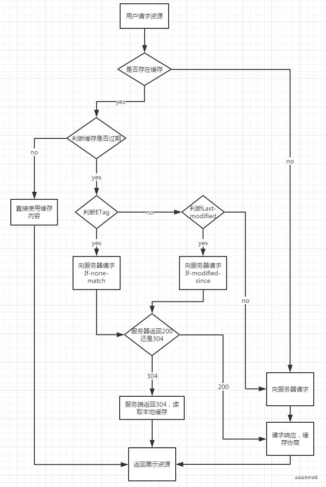

## 一面
1. leetcode第112题， [路径总和](/front-end/Code/three.html#路径总和)

  ```js
  const hasPathSum = (root, sum) => {
    if (root === null) { // 遍历到null节点
      return false;
    }
    if (root.left === null && root.right === null) { // 遍历到叶子节点
      return sum - root.val === 0; // 如果满足这个就返回true，否则返回false
    }
    //不是上面情况，则拆成两个子树的问题，其中一个true就行
    return hasPathSum(root.left, sum - root.val) || hasPathSum(root.right, sum - root.val)
  }
  ```
2. 你知道的数组API

  方法| 作用| 是否影响原数组
  ---|---|---
  push | 在数组后添加元素，返回长度 | ✅
  pop | 删除数组最后一项，返回被删除项 | ✅
  shift | 删除数组第一项，返回删除项 | ✅
  unshift | 数组开头添加元素，返回长度 | ✅
  reverse | 反转数组，返回数组 | ✅
  sort | 排序数组，返回数组 | ✅
  splice | 截取数组，返回被截取的部分 | ✅
  join | 将数组转为字符串，返回字符 | ❌
  concat | 连接数组 | ❌
  map | 相同规则处理数组项，返回新数组 | ❌
  forEach | 遍历数组 | ❌
  filter | 过滤数组项，返回符合条件的数组 | ❌
  every | 每一项符合规则才返回true | ❌
  some | 只要一项符合规则才返回true | ❌
  reduce | 接受上一个return和数组下一项 | ❌
  flat | 数组扁平化 | ❌
  slice | 截取数组，返回被截取区间 | ❌

3. 实现reduce 

  ```js
  Array.prototype.reduce = Array.prototype.reduce || function(fn, initialValue) {
    let arr = this;
    let base = typeof initialValue === 'undefined' ? arr[0] : initialValue;
    let startPoint = typeof initialValue === 'undefined' ? 1 : 0;
    arr.slice(startPoint).forEach((val, index) => {
      base = fn(base, val, index + startPoint, arr);
    })
    retrun base;
  }

  // 第二种实现
  Array.prototype.sx_reduce = function(callback, ...args) {
    let start = 0, base;
    if (args.length) {
      base = args[0]
    } else {
      base = this[0];
      start = 1;
    }
    this.slice(start).forEach((val, index) => {
      base = fn(base, val, index + startPoint, this);
    })
    retrun base;
  }
  ```

4. 将一下HTTP缓存

  

5. vue与react区别和优劣
  - vue2 对ts支持较差，vue3已解决
  - vue2对jsx支持较差，vue3已解决
  - vue和react都是单向数据流
  - vue多用模板templeate react多用jsx
  - vue和react都用虚拟dom和diff算法
  - vue是双向绑定，react是单向绑定
  - vue和react都倡导组件化开发
  - vue和react都支持服务端渲染
  - vue2的状态管理工具是vuex，vue3用pinia，react用redux、mbox、recoil
  - vue的diff算法比react更高效
  - react的写法更贴近js原生

6. hooks、react中class组件和函数组件的区别

  - class组件：state和props都是固定地址
  - 函数组件：state和props每次都随着渲染更新而更新

7. 前端性能优化
  - 列表优化：懒加载，[虚拟列表](/front-end/Log/optimize-virtual-list.html)，分页
  - 重绘重排：合并修改、requestAnimationFrame、[will-change](/front-end/Css/css-will-change.html)
  - 提交优化：防抖
  - 网络优化：控制并发，取消重复请求，合并请求，http缓存
  - webpack优化：代码压缩，gzip，CND，代码分割，合理设置hash,图片转base64

## 二面
1. 算法

  ```
  fn([['a', 'b'], ['n', 'm'], ['0', '1']]) 
  => ['an0', 'am0', 'an1', 'am1', 'bn0', 'bm0', 'bn1', 'bm0']
  ```
  解答：
  ```js
  const fn = arr => {
    const length = arr.length;
    const res = [];
    const dfs = (items, str = '', index = 1) => {
      if (index > length) {
        res.push(str);
      } else {
        for (const item of items) {
          dfs(arr[index], str + item, index + 1);
        }
      }
    }
    dfs(arr[0]);
    return res;
  }
  ```
  [电话号码的字母组合](https://leetcode-cn.com/problems/letter-combinations-of-a-phone-number/solution/shou-hua-tu-jie-liang-chong-jie-fa-dfshui-su-bfsya/)
  
2. 手写

  ```js
  u.console('breakfast').setTimeout(3000)
  .console('lunch').setTimeout(3000)
  .console('dinner')
  ```
  解答,[参考](/front-end/JavaScript/tips-chained.html)
  ```js
  clas U {
    constructor() {
      this.tasks = [];
      setTimeout(() => {
        this.next();
      })
    }
    next() {
      const task = this.tasks.shift();
      task && task();
    }
    console(str) {
      const task = () => {
        console.log(str);
        this.next();
      }
      this.tasks.push(task);
      return this;
    }
    setTimeout(delay) {
      const task = () => {
        setTimeout(() => {
          this.next();
        }, delay)
      }
      this.tasks.push(task);
      return this;
    }
  }
  ```

3. 事件代理是什么

  当子元素都需要绑定相同的事件的时候，这个时候可以把事件直接绑定在父元素上，并通过target对象来判断执行不同的子元素操作，这样可以大大减少绑定事件，减少DOM操作，提高性能

4. e.target和e.currentTarget的区别

  - e.target：触发事件的元素
  - e.currentTarget:事件所绑定的元素

5. 写一个事件代理函数，需要判断child是parent的子节点

  ```js
  function proxy(event, cb, parent, child) {
    parent[event] = function(e) {
      if (parent.contains(child) && e.target === child) {
        cb.call(this)
      }
    }
  }
  ```

6. 看代码说结果

  ```js
  var length = 10;

  function fn() {
    return this.length + 1;
  }
  var obj1 = {
    length: 5,
    test1: function () {
      return fn()
    }
  }
  obj1.test2 = fn;
  obj1.test1.call() // 11
  obj1.test1() // 11
  obj1.test2.call() // 11
  obj1.test2() // 6
  ```

7. 从浏览器输入Url到页面渲染发生了什么

  - 网络阶段：构建请求行、查询强缓存、DNS解析、建立TCPU连接、发送HTTP请求、响应请求
  - 解析阶段：解析html、构建dom树、计算样式、生成布局树
  - 渲染阶段：生成图层树、生成绘制列表、生成图块，优先选择视口附近的图块生成位图数据、展示内容

8. Tcp和Udp的区别
  - 基于连接和无连接
  - 对系统资源要求(Tcp较多，UDP少)
  - Udp程序结构较简单
  - 流模式和数据包模式
  - Tcp数据保证正确性，UDP可能丢包
  - TCP保证数据顺序，UDP不保证

## 资料
[原文](https://mp.weixin.qq.com/s/zCbMPMYM7gd_-EGEyTaTbw)