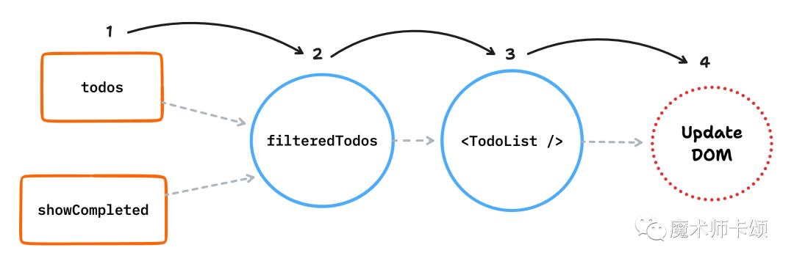
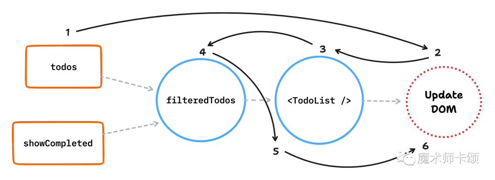
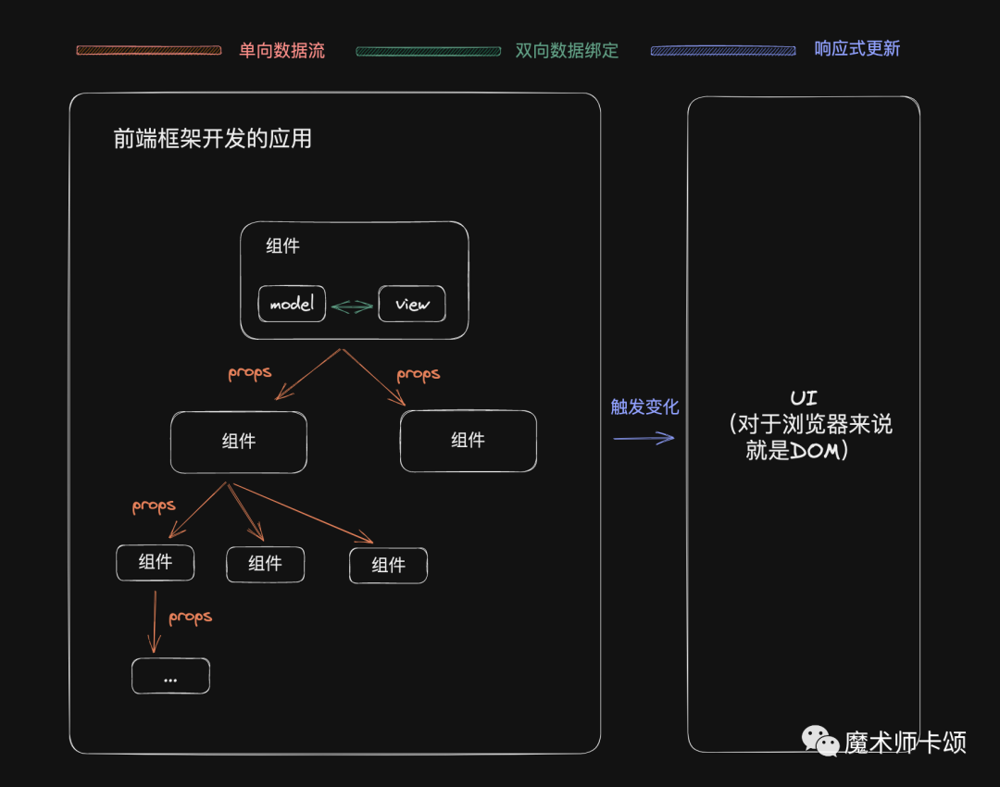

有3个容易混淆的前端框架概念
1. 响应式更新
2. 单向数据流
3. 双向数据绑定

在继续阅读本文前，读者可以思考下是否明确知道三者的含义。

这三者之所以容易混淆，是因为他们虽然同属前端框架范畴内的概念，但又不是同一抽象层级的概念，不好直接比较。

本文会从3个抽象层级入手讲解这三者的区别。

## 响应式更新
响应式更新也叫细粒度更新。同时，最近前端圈比较火的Signal这一概念描述的也是响应式更新

<span style="color: red">笼统的来讲，响应式更新描述的是状态与UI之间的关系，即状态变化如何映射到UI变化</span>

考虑如下例子
```js
function TodoApp() {
    const [todos, setTodos] = useState(
        [{ text: 'sleep', completed: false }]
    )

    const [showCompleted, setShowCompleted] = useState(false);

    const filteredTodos = useMemo(() => {
        return todos.filter(todos => !todo.completed || showCompleted)
    }, [todos, showCompleted])
    
    return (
        <TodoList todos={filteredTodos}/>
    )
}
```
在TodoApp组件中，定义了两个状态：
- 待办事项todos
- 是否展示完成的事项 showCompleted
以及根据上述状态派生出的状态filteredTodos。最终，返回&lt;TodoList/&gt;组件

如果todos状态变化，UI该如何变化？即 我们如何知道状态变化的影响范围？这是，有两个思路
- 推(push)
- 拉(pull)

### 推的原理
我们可以从变化的状态(例子中为todos)出发，根据状态的派生管理，一路推下去



在例子中：
1. todos变化
2. filteredTodos由todos派生而来，变化传导到他这里
3. &lt;TodoList/&gt;组件依赖了filteredTodos，变化传导到他这里
4. 确定了todos变化的最终影响范围后，更新对应UI

这就建立了 **状态与UI之间的关系**

除了「推」之外，还有一种被称为「拉」的方式。

### 拉的原理
同样的例子，我们也能建立 状态与可能的UI变化的关系，在反过来推到UI变化的方位



在例子中
1. todos变化
2. 可能有UI变化(因为建立了 状态与可能的UI变化关系)
3. UI与&lt;TodoList/&gt;组件相关，判断它是否变化
4. &lt;TodoList/&gt;组件依赖filteredTodos，filteredTodos由todos而来，所以filteredTodos是变化的
5. 既然filteredTodos变化了，那么&lt;TodoList/&gt;组件可能变化
6. 计算变化的影响范围，更新UI

<span style="color: red">在主流框架中，React的更新以推为主，Vue、Preact、Solid.js等更逗框架使用拉的方式</span>

本文聊的「响应式更新」就是「拉」这种方式的一种实现。

## 单向数据流
我们可以发现，不管是推还是拉，他们都需要计算变化的影响范围，即一个状态变化后，究竟有多少组件会收影响

那么，从框架作者的绝对出发，是希望增加一些约束，来减少 计算影响范围 这一过程的复杂度

同样，从框架使用者的角度出发，也希望增加一些约束，当 计算影响范围 出 bug后，更容易排查问题。

**这就有了 单向数据流**

<span style="color: red">单向数据流是一条约定，他规定了当状态变化后，变化产生的影响只会从上往下传递</span>

考虑如下例子
```js
function Parent() {
    const [num] = useState(0);
    return <Child data = {num}/>
}
function Child({data}) {
  const isEven = data % 2 === 0;
  return <GrandChild data={isEven}/>;
}

function GrandChild({data}) {
  return <p>{data}</p>;
}
```

&lt;Parent/&gt;组件的状态num作为props传给&lt;Child/&gt;组件，再作为props传给&lt;GrandChild/&gt;组件，整个过程只能自上而下。

<span style="color: red">单向数据流 并不是实现前端框架必须遵循的原则，他的存在主要是为了减少开发者的心智负担，让状态变化后，计算影响范围这一过程可控<span>

## 双向数据绑定
当本文开篇聊响应式更新时，讨论的是状态与UI的关系，这是将框架作为一个整体来讨论，抽象层级比较高

当我们继续聊到单向数据流时，讨论的是状态变化的影响范围在组件间单向扩散，这是组件与组件的关系，抽象层级下降了一级

接下来我们要讨论的双向数据绑定，讨论的是单个组件内发生的事。

<span style="color: blue">双向数据绑定是状态+改变状态后触发的回调相结合的语法糖</span>

> 这里不讨论框架语境下语法糖一词是否完全准确

比较指明的双向数据绑定实现，比如vue中的v-model语法
```js
<input v-model="data"/>
```
相当于如下状态+事件回调的组合：
```js
<input @input="onInput" :value="vlaue"/>
```

## 总结
我们可以用一张图概括本文介绍的3个概念之间的关系：



概括起来主要是两点：

- 他们都是前端框架范畴内的概念
- 他们属于不同抽象层级的概念

其中：

- 「双向数据绑定」描述的是「组件内逻辑与视图的关系」
- 「单向数据流」描述的是「组件之间的关系」
- 「响应式更新」描述的是「状态与UI之间的关系」


## [原文](https://mp.weixin.qq.com/s/SEquFWzQyDiFtHq_thvXlA)