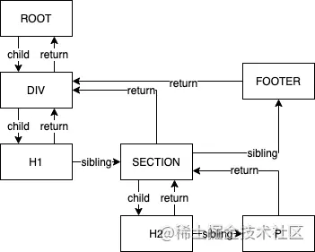

## JSX与虚拟DOM
我们从React官方文档开头最基本的一段Hello World代码入手
```js
ReactDOM.render(
    <h1>Hello, world!</h1>
    document.getElementById('root')
)
```
这段代码的意思是通过ReactDOM.render()方法将h1包裹的JSX元素渲染到id为"root"的HTML元素上。

除了在JS中早已熟知的document.getElementById()方法外，这代代码还包含两个知识点

- 以h1标签包裹的JSX元素
- ReactDOM.render()方法

而这两个知识点则对应着React中要解决的核心问题
- <span style="color: red">为何以及如何使用(JSX表示的)虚拟DOM?</span>
- <span style="color: red">如何对虚拟DOM进行处理，使其高效的渲染出来？</span>

### 1.1 虚拟DOM是什么？为何要使用虚拟DOM？
<span style="color: blue">虚拟DOM其实就是用Javascript对象表示的一个DOM节点，内部包含了节点的tag,props和children。</span>

为何使用虚拟DOM?<span style="color: blue">因为直接操作真实DOM繁琐且低效，通过虚拟DOM，将一部分昂贵的浏览器重绘工作转移到相对廉价的存储和计算资源上</span>

### 1.2 如何将JSX转换为虚拟DOM？
通过babel可以将JSX编译为特定的Javascript对象，示例代码如下
```js
// JSX
const e = (
    <div id="root">
        <h1 className="title">Title</h1>
    </div>
)

// babel编译结果(React17之前)，注意子元素的嵌套结构
var e = React.createElement(
    "div", 
    { id: "root" },
    React.createElement(
        "h1",
        { className: "title" },
        "Title"
    )
)
// React17之后编译结果有所区别，创建节点的方法由react导出，但基本原理大同小异
```
### 1.3 如何将虚拟DOM渲染出来
从上一节babel编辑结果可以看出，虚拟DOM中包含了创建DOM所需的各种信息，对于首次渲染，直接依照这些信息创建DOM节点即可。

但虚拟DOM的真正价值在于"更新"：<span style="color: blue">当一个list中某些项发生了变化，或删除或增加了若干项，如何通过对比前后的虚拟DOM树，最小化的更新真实虚拟DOM。</span>这就是React的核心目标

## React Diffing
"Diffing"即"找不同"，就是解决上文引出的React的核心目标---如何通过对比新旧虚拟DOM树，以最小的操作次数下将旧DOM树转换为新DOM树。

<span style="color: red">在算法领域中，两棵树的转换目前最优的算法复杂度为O(n ** 3), n为节点个数。</span>这意味着当书上有1000个元素时，需要10亿次比较，显然远远不够搞笑

React在基于以下两个假设的基础上，提出了一套复杂度为O(n)的启发式算法
1. <span style="color: blue">不同类型(即标签名、组件名)的元素会产生不同的树.</span>
2. <span style="color: blue">通过设置key属性来标识一组同级子元素在渲染前后是否保持不变</span>

在实践中，以上两个假设在绝大多数场景下成立

### 2.1 Diffling算法描述
- 不同类型的元素/组件

    当元素的标签或组件名发生变化，直接卸载并替换以此元素作为根节点的整个子树

- 同一类型的元素

    当元素的标签相同时，React保留此DOM节点，仅对比和更新有改变的属性，如className、title等，然后递归对比其子节点。

    对于style属性，React会继续深入对比，仅更新有改变的属性，如color、fontSize等。

- 同一类型的组件

    当组件的props更新时，组件实例保持不变，React调用组件的componentWillReceiveProps()、componentWillUpdate()和componentDidUpdate()声明周期方法，并执行render()方法

    Diffing算法会递归比对新旧render()执行结果

- 对子节点的递归

    当一组同级子节点(列表)的末尾添加了新的子节点时，上述Diffing算法的开销比较小;但当新元素被插入到列表开头时，Diffing算法只能按顺序依次对比并重建从新元素开始的后续所有子节点，造成极大的开销浪费。

    <span style="color: blue">解决方案是为一组列表项添加key属性，这样React就可以方便的对比处插入或删除项了</span>

    关于key属性，应稳定、可预测且在列表内唯一(无需全局唯一)，如果数据有ID的话直接使用此ID作为key，或者利用数据中的一部分字段哈希出一个key值。

    避免使用数组索引值作为key，因为当插入或者删除元素后，之后的元素和索引值的对应关系都会发生错乱，导致错误的比对结果

    避免使用不稳定的key(如随机数)，因为每次渲染都会发生改变，从而导致列表项被不必要的重建

### 递归的Diffing
在1.2节中的虚拟DOM对象中可以得知：<span style="color: blue">虚拟DOM树的每个节点通过children属性构成一个嵌套的树结构,这意味着要以递归的形式遍历和比较新旧虚拟DOM树</span>

<span style="color: red">2.1节的策略解决了Diffing算法的时间复杂度的问题，但我们还面临着另外一个重大的性能问题---浏览器的渲染线程和JS的执行线程是互斥的，这意味着DOM节点过多时，虚拟DOM树的构建和处理会长时间占用主线程，使得一些需要高优先级处理的操作如用户输入、平滑动画等被阻塞，严重影响使用体验</span>

#### 时间切片(Time Slice)
为了解决浏览器主线程的阻塞问题，引出<span style="color: blue">**时间切片**的策略---将整个工作流程分解成小的工作单元，并在浏览器空闲时交由浏览器执行这些工作单元，每个执行单元执行完毕后，浏览器都可以选择中断渲染并处理其他需要更高优先级处理的工作</span>

浏览器中提供了requestIdleCallback方法实现此功能，将待调用的函数加入执行队列，浏览器将在不影响关键事件处理的情况下逐个调用

<span style="color: red">考虑到浏览器的兼容性以及requestIdleCallback方法的不稳定性,React自己实现了专门用于React的类似requestIdleCallback且功能更完备的**Scheduler**来实现空闲时触发回调，并提供了多种优先级供任务设置。</span>

### 递归与时间切片
时间切片策略要求我们将虚拟DOM的更新操作分解为小的工作单元，同时具备一下特性
- 可暂停、可回复的更新
- 可跳过的重复性、覆盖性更新
- 具备优先级的更新

对于递归形式的程序来说，这些是难以实现。于是就需要一个处于递归形式的虚拟DOM树上层的数据结构，来辅助完成这些特性。

这就是React16引入的重构后的算法和兴---Fiber.

## 3. Fiber

<span style="color: blue">从概念上来说，Fiber就是重构后的虚拟DOM节点，一个Fiber就是一个JS对象。</span>

<span style="color: blue">Fiber节点之间构成单向链表结构，以实现前文提到的几个特性：更新可暂停/回复、可跳过、可设优先级</span>

### 3.1 Fiber节点
一个Fiber节点就是一个JS对象，其中的关键属性可分类列举如下

- 结构信息(构成链表的指针属性)
    - return:父节点
    - child:第一个子节点
    - sibling：右侧第一个兄弟节点
    - alternate:本节点在相邻更新时的状态，用于比较节点前后的变化，3.3详述
- 组件信息
    - tag:组件创建类型，如FunctionComponent、ClassComponent、HostComponent等
    - key:即key属性
    - type: 组件类型，Function/Class组件的type就是对应的Function/Class本身，Host组件的type就是对应元素的TagName
    - stateNode:对应的真实DOM节点
- 本次更新的props和state相关信息
    - pendingProps、memoizedProps
    - memoizedState
    - dependencies
    - updateQueue
- 更新标记
    - effectTag：节点更新类型，如替换、更新、删除等
    - nextEffect/firstEffect/lastEffect
- 优先级相关:lanes、childrenLanes

### 3.2Fiber树
前文说到，Fiber节点通过return, child和sibling属性构成单向链表结构，为了与DOM树对应，习惯上仍称其为『树』

如一个DOM树
```html
<div>
    <h1>Title</h1>
    <section>
        <h2>Section</h2>
        <p>Content</p>
    </section>
    <footer>Footer</footer>
</div>
```
其section节点的Fiber可表示为
```js
const sectionFiber = {
	key: "SECTION_KEY",
	child: h2Fiber,
	sibling: footerFiber,
	return: divFiber,
	alternate: oldSectionFiber,  
	...otherFiberProps,
}
```
整体Fiber结构


### 3.3Fiber架构
基于Fiber构成的虚拟DOM树就是Fiber架构

在3.1节中我们介绍过，在Fiber节点中有一个重要的属性alternate，单词意为"备用"。

实际上，在React中最多会同事存在两棵Fiber树：
- 当前显示在屏幕上、已经构建完成的Fiber树称为"Current Fiber Tree"，我们将其中的Fiber节点简写为currFiber
- 当前正在构建的Fiber树称为"WorkInProgress Fiber Tree"，我们将其Fiber节点简写为"wipFiber"

而这两棵树中节点的alternate属性互相指向对象树中的对应节点，即：currFiber.alternate === wipFiber;wipFiber.alternate === currFber;他们用于对比更新前后的节点以决定如何更新此节点

在React中，整个应用的根节点为fiberRoot,当wipFiber树构建完成后，fiberRoot.current将从currFiber树的根节点切换为wipFiber的根节点，以完成更新操作。

### 3.1 基于Fiber的调用--时间切片
在2.2节我们讨论了采用拆分工作单元并以时间切片的方式执行，以避免阻塞主线程。在Fiber架构下，每个Fiber节点就是一个工作单元。

在以下示例代码中，我们使用浏览器提供的requestIdleCallback方法演示这个过程，它会在浏览器空闲时执行一个workLoop、处理一个Fiber节点，然后可以根据实际情况继续执行或暂停等待执行下一个workLoop

```js
function workLoop(deadline) {
    let shouldYidle = false;
    while(nextUnitOfWork && !shouldYield) {
        // 处理一个Fiber节点，返回下一个Fiber节点，想见3.3节
        nextUnitOfWork = preformUnitOfWork(nextUnitOfWork);
            // 暂停处理的演示: 当时间不足时取消循环处理过程
        shouldYield = deadline.timeRemaining() < 1;
    }
      // 当执行完毕(不存在下一个执行单元), 提交整个DOM树
    if (!nextUnitOfWork && wipRoot) {
        commitRoot();
    }
    requestIdleCallback(workLoop);
    }
}
requestIdleCallback(workLoop)
```

### 3.2 对Fiber节点的处理顺序--DFS
由前文我们可知，<span style="color: orange">Fiber节点通过return child sibling三个属性相互连接,整体构成一个单向链表结构，其调度方式就是深度优先遍历</span>

1. <span style="color: blue">以wipFiber树的Root节点作为第一个执行单元</span>
2. <span style="color: blue">若当前执行单元存在child节点，则将child节点作为下一个执行单元;</span>
3. <span style="color: blue">重复2,直至当前执行单元无child;</span>
4. <span style="color: blue">若当前执行单元存在sibling节点，则将sibling节点作为下一个执行单元，并回到2;</span>
5. <span style="color: blue">若当前执行单元无child且无sibling，返回到父节点，并回到4;</span>
6. <span style="color: blue">重复5，直至回到Root节点，执行完毕，将fiberRoot.current只为wipFiber树的根节点。</span>

<span style="color: blue">以上步骤说明，Fiber节点通过 child->sibling->return 的顺序进行深度优先遍历"处理"，而后更新Fiber树。那么如何"处理"Fiber节点呢？</span>

### 3.3 对Fiber节点的处理过程
<span style="color: orange">对Fiber节点的处理就是执行一个 performUnitOfWork 方法,它接收一个将要处理的Fiber节点，然后完成一下工作：</span>

- <span style="color: blue">完善构建Fiber节点:创建DOM并获取children</span>

    - 对于HostComponent和ClassComponent,根据Fiber中的相关属性，创建DOM节点并赋给Fiber.stateNode属性
    - 对于FunctionComponent,直接通过函数调用获取其children：Fiber.type(Fiber.props)
    ```js
    // 执行工作单元，并返回下一个工作单元
    function performUnitOfWork(fiber) {
        // 构建当前节点的fiber
        const isFunctionComponent = fiber.type instanceof Function;
        if (isFunctionComponent) {
            updateFunctionComponent(fiber);
        } else {
            updateHostComponent(fiber);
        }

        // 处理子节点，构建Fiber树
        const elements = fiber.props.children;
        reconcileChildren(fiber, elements);

        // TODO:返回下一个执行单元
        // fiber.child || fiber.sibling || fiber.return
    }

    // Class/Host组件：创建DOM
    function updateHostComponent(fiber) {
        if (!fiber.dom) {
            fiber.dom = createDom(fiber);
        }
        reconcileChildren(fiber, fiber.props.children);
    }

    // 更新Function组件,Function组件需要从返回值获取子组件
    // 注意：Function组件无DOM
    function updateFunctionComponent(fiber) {
        // 初始化hooks
        wipFiber = fiber;
        hookIndex = 0;
        fiber.hooks = [];
        const children = [fiber.type(fiber.props)]; // Function组件返回children
        reconcileChildren(fiber, children);
    }
    // TODO: reconcileChildren 处理子节点，见第三步
    ```

- <span style="color: blue">通过Fiber.alternate获取oldFiber，即上一次更新后的Fiber值，然后在下一步中构建和Diff当前Fiber的children.</span>

    ```js
    function reconcileChildren(wipFiber, elements) {
        let oldFiber = wipFiber.alternate && wipFiber.alternate.child;
        // ...
    }
    ```

- <span style="color: blue">构建 children Fibers,对于每个子Fiber,同步得完成一下工作</span>

    - 构建Fiber链表：为每个子元素创建Fiber，并将父Fiber的child属性指向第一个子Fiber，然后按顺序将子Fiber的sibling属性指向下一个子Fiber
    - 对比(Diffing)新旧Fiber节点的type props key等属性，确定节点是可以直接复用、替换、更新还是删除，需要更新的Fiber节点在其effectTag属性中打上Updata placement PlacementAndUpdate Deletion等标记，以在提交更新阶段进行处理

- <span style="color: blue">按DFS顺序返回一下工作单元</span>,示例代码如下

    ```js
    if (fiber.child) {
        return fiber.child;
    }
    let nextFiber = fiber;
    while (nextFiber) {
        if (nextFiber.sibling) {
        return nextFiber.sibling;
        }
        nextFiber = nextFiber.parent;
    }
    ```
    当DFS过程回到根节点时，表明本次更新的wipFiber树构建完成，进入下一步的提交更新阶段

### 3.4 提交更新阶段
在进入本阶段时，新的Fiber树已构建完成，需要进行替换、更新或删除的Fiber节点也在其effectTag中进行了标记， 所以本阶段第一个工作就是根据 effectTag 操作真实DOM.

为了避免从头再遍历Fiber树寻找具有 effectTag 属性的Fiber, 在上一步Fiber树的构建过程中保存了一条需要更新的Fiber节点的单向链表 effectList , 并将此链表的头节点存储在Fiber树根节点的 firstEffect 属性中, 同时这些Fiber节点的 updateQueue 属性中也保存了需要更新的 props .

除了更新真实DOM外, 在提交更新阶段还需要在特定阶段调用和处理生命周期方法、执行Hooks操作, 本文不再详述.

在此参考了 pomb.us/build-your-… 中提供的 useState Hook的实现代码, 有助于理解在执行 setState 方法后都发生了什么:


## 学习方法总结

在我的学习过程中, 第一个重要的资料是 [Build Your Own React](https://pomb.us/build-your-own-react/), 它以最基础的原理和方法实现了一个最小可用的React. 我也建议相关学习者从此网站入手, 一步一步动手实现它. 我自己大约用了四个小时完成学习, 之后又用了一些时间来测试和Debug, 整个流程是循序渐进的, 所以我建议周末专门抽出一天时间集中完成. 最终的实现代码可以参考 [Github: didact](https://github.com/pomber/didact).

第二个重要资料是一本在线电子书 [React技术揭秘](https://react.iamkasong.com/), 在 build-your-own-react 中使用最基本的方法实现了React的功能, 这本电子书就是从源码角度解读了React真正的实现方法. 有了上一步实现React的过程, 学习这本电子书还是比较水到渠成的, 其最有价值之处是很多地方可以直接链接到React的源码相关位置, 所以顺着本书去研究源码也是很好的学习方式.

## 资料
[图解react](https://7kms.github.io/react-illustration-series/main/macro-structure)

[React核心原理浅析](https://juejin.cn/post/6987197729046790175)