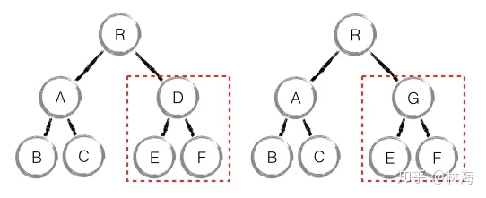

## 前言
经常我们在各类文章中都看到react将diff的复杂度从O(n^3)优化为O(n)，那么传统的O(n^3)到底是如何得到的呢？react又是如何将其优化为O(n)呢？

## 传统diff算法
传统的diff算法计算一棵树变成另一颗树所需要的最少步骤的复杂度为O(n^3)，如何得到？

- <span style="color: blue">旧树上的一个节点，它要跟新树上的所有节点对比(复杂度为O(n))</span>
- <span style="color: blue">如果这个节点在新树上没有找到，那么这个节点将被删除，同时会从新树中遍历找几个节点去填补(复杂度增加到O(n^2))</span>
- <span style="color: blue">旧树上的所有节点都会走这个流程(复杂度增加到O(n^3))</span>

```js
// 伪代码
const oldNodes = ['a', 'b', 'c', 'd', 'e'];
const newNodes = ['a', 'c', 'f', 'd', 'e'];
for(let i = 0; i < oldNodes.length; i++) { // 复杂度O(n)
    for(let j = 0; j < newNodes.length; j++) { // 复杂度O(n ^2)
        // 旧节点在新节点中比对
        if(未找到) {
            for(let k = 0; k < newNodes.length; k++) {
                // 寻找填补项
            }
        }
    }
}
```
有一篇论文专门讲述diff算法：[diff论文](https://link.zhihu.com/?target=https%3A//grfia.dlsi.ua.es/ml/algorithms/references/editsurvey_bille.pdf)

## React diff
React diff制定的三个策略
- <span style="color: blue">Web UI中的DOM节点跨层级的移动特别少,可以忽略不计(tree diff)</span>
- <span style="color: blue">拥有相同类的两个组件将会生成相似的树形结构，拥有不同类的两个组件将会生成不同的属性结构(Component diff);</span>
- <span style="color: blue">对于同一层级的一组子节点，我们可以通过唯一的key进行区分(element diff)</span>

### tree diff
基于策略一，react对树的算法进行分层比较优化，两棵树只会对处在同一层级的节点进行比较


按照策略一忽略了跨层级之间的移动操作，react tree diff只会对相同颜色内的DOM节点进行比对，当发现某一层级的节点已经不存在了，则该节点及其所有子节点都会被完全删除掉，不会进行进一步的比对，这样只需要对树遍历一次便能完成整个DOM树的比较，复杂度变为了O(n)。

> 根据上面的规则，在开发组件时，保持稳定的DOM结构会有助于性能的提升。例如，可以通过visibility属性控制元素的显示与隐藏，而不是display.

### component diff
- <span style="color: blue">组件类型没有发生变化，继续比较Virtual DOM tree;</span>
- <span style="color: blue">组件类型发生变化，则将该组件视为dirty component,并重新创建新的组件，包括所有的子节点，替换改组件</span>
- <span style="color: blue">对于同一类型的组件，有可能Virtual DOM并不会有任何变化，那么可以通过shouldComponentUpdate来判断组件是否需要进行diff</span>



> 如上图中组件D变更为组件G时,虽然他们的结构很相似，但是因为组件类型不同，react diff会重新创建一个新的组件G来替换整个组件D，并且E、F也会重新创建，不会重复组件D的。

### element diff
当节点处于同一层级时，react提供了三种节点操作方式：INSERT_MARKUP(插入)、MOVE_EXISTING(移动)、REMOVE_NODE(删除)

- <span style="color: blue">INSERT_MARKUP，新节点不在原集合中，需要对新节点执行插入操作</span>
- <span style="color: blue">MOVE_EXISTING,新老集合中都有某个节点，但是所处位置不同，可以复用老节点，需要对节点进行移动操作</span>
- <span style="color: blue">REMOVE_NODE,老集合中有节点在，新集合中不存在，或者某一属性不一致，则需要执行删除操作</span>

> 针对element diff react提供了一个优化策略，同一层级的同组子节点,添加唯一key进行区分，这也算节点能否复用的前提。

### 无key示例


> 老集合中包含节点:A、B、C、D，更新后的新集合中包含节点:B、A、D、C，此时新老集合进行diff差异化对比，发现B !=A,则创建并插入B至新集合，删除老集合A；以此类推，创建并插入A、D和C，删除B、C和D

### 有key示例


下面我们看看具体的diff流程
> lastIndex表示访问过的节点在老集合中的最大索引位置，这是一个初始化为0的动态值

- <span style="color: blue">遍历到B，B不做移动，lastIndex = 1</span>
- <span style="color: blue">遍历到E，发现旧集合中不存在，则创建E并放在新集合对应的位置，lastIndex = 1;</span>
- <span style="color: blue">遍历到C，不满足index < lastIndex,C不动，lastIndex =2;</span>
- <span style="color: blue">遍历到A，满足index < lastIndex,A移动到对应的位置，lastIndex = 2</span>
- <span style="color: blue">当完成新集合中所有节点diff时,最后还需要对老集合进行遍历，判断是否存在新集合中没有，但老集合中扔存在的节点，发现这样的节点D，因此删除节点D，至此diff全部完成</span>

### diff算法不足


> 因为D节点在老集合里面的index 是最大的，使得A、B、C三个节点都会 index < lastindex，从而导致A、B、C都会去做移动操作。另外这只是极端情况，现实的场景中包含很多类似的情况。可以考虑倒着循环。

### react diff算法的复杂度为什么是O(n)
原因在于React采用了三个策略，限制了很多情况，不会做过于复杂的计算。所有的比较都在同级比较，只需要一次循环就能完成所有操作

[参考文章](https://zhuanlan.zhihu.com/p/103187276)

### react diff的key值用数组的索引会有上面问题？

**react官方解释**

我们强烈推荐，每次只要你构建动态列表的时候，都要指定一个合适的key。如果你没有找到一个合适的key，那么你就需要考虑重新整理你的数据结构，这样才能有合适的key。

如果你没有指定任何 key，React 会发出警告，并且会把数组的索引当作默认的 key。但是如果想要对列表进行重新排序、新增、删除操作时，把数组索引作为 key 是有问题的。显式地使用 key={i} 来指定 key 确实会消除警告，但是仍然和数组索引存在同样的问题，所以大多数情况下最好不要这么做。

**会带来什么问题？**

当用数组的下标作为key值时，会导致显示错位问题。在对数组进行删除，插入时，由于数组的下标是动态的，删除、插入最终都会体验在末尾元素

## 资料
[React 和 Vue 的 diff 时间复杂度O(n^3) 和 O(n) 是如何计算出来的](https://jishuin.proginn.com/p/763bfbd4ec42)

[react diff算法](https://segmentfault.com/a/1190000040363567)

[React 和 Vue 的 diff 时间复杂度从 O(n^3) 优化到 O(n) ，那么 O(n^3) 和 O(n) 是如何计算出来的？](https://github.com/Advanced-Frontend/Daily-Interview-Question/issues/151)