**2161 天！**
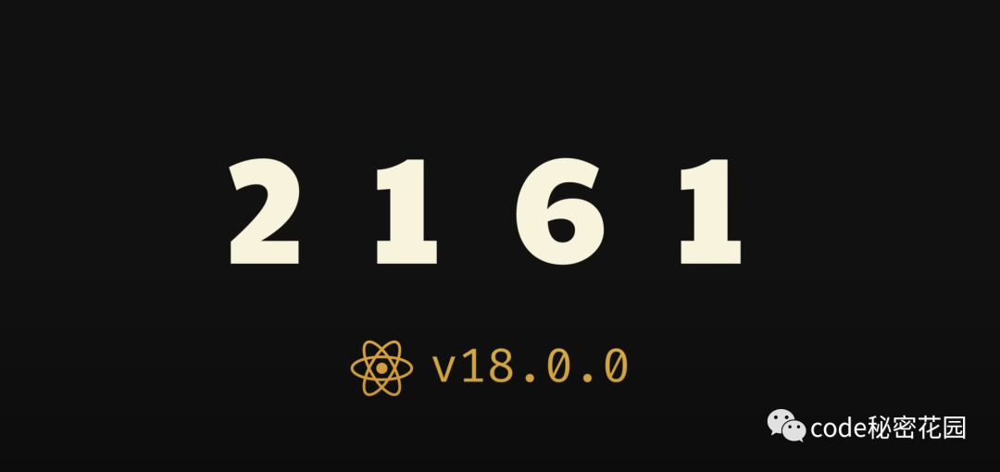
这是React团队从计划为React增加**并发渲染**的能力，到React18可用版本发布所花费的时间。

为啥中间花费了这么长的时间？中间又发生了哪些有趣的故事？我们回到 2016 年，来回顾一下  **React 并发渲染**  诞生的过程！

在[React运行时优化方案的演进](/source-react/react-03-01.html)一文中，我们从技术细节到实现原理的角度详细解读了React并发渲染的演进。但是技术细节太多，很多小伙伴读起来比较困难，今天这篇文章会以更轻松的方式带大家看整体的演进之路，不会涉及太多的技术性，读起来更简单，相信看完这篇文章在去看之前会有不一样的理解

## 浏览器瓶颈
早在2016年，React就已经开始在前端界爆火了。React团队始终有一个目标，就是给基于React而构建的上百万个网站提供最好的性能体验！！

但是性能提升最大的瓶颈，不一定和React本身有关。而是与React建立在的语言Javascript，以及Javascript所在的浏览器环境有关

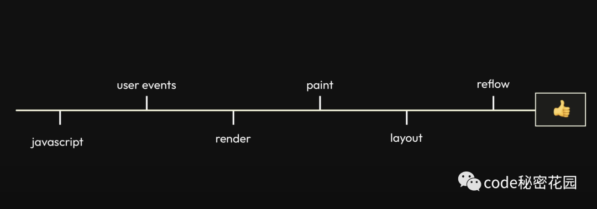

浏览器会在一个主线程里处理所有的Javascript代码、用户事件、渲染、布局、绘制以及重排。

通常情况下，他们互不干扰，相互运行的挺和谐的，但是如果一个不小心，就可能导致问题

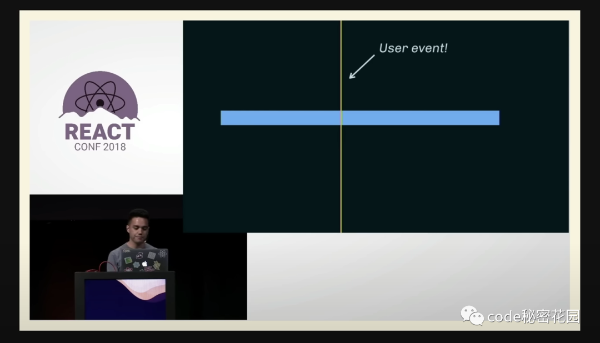

:::tip
React现在是同步的，意味着当你更新组件时，React会同步处理这些更新，它会在一个主线程上持续工作，直到所有更新完成。所以问题在于，用户事件也会在主线程触发，如果此时React正在渲染更新，同时用户尝试以同步的方式输入一些内容，React会等待正在执行的所有渲染完成后才去处理用户事件---React Conf 2018
:::

## Fiber诞生
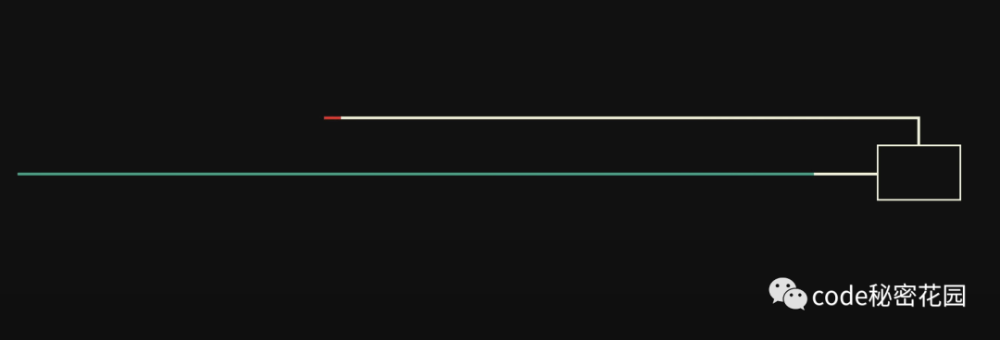

所以，如果问题在于渲染阻塞了主线程，那我们不能在另一个线程去完成渲染工作吗？比如webworker

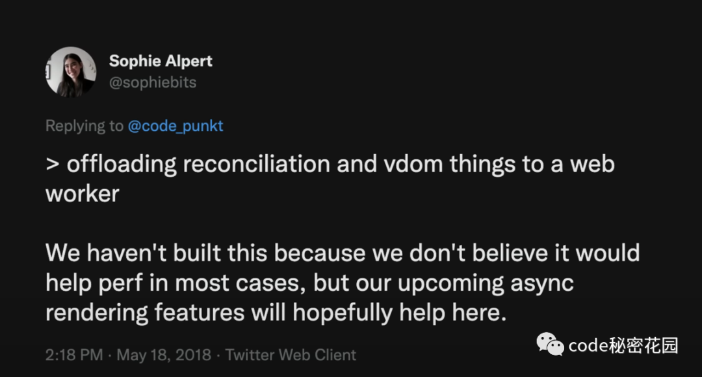

但实际上这并不是React想要的，React想要的是一种让当前的渲染工作变得更灵活的方案

:::tip
我们有一些IO的工作，然后是一些CPU的工作，在理想状况下，我们应该能够并行执行其中一些工作，这不是一个性能问题，这基本上是一个调度问题了--React Cong 2017
:::

React 团队发现，他们可以通过某种方式来优化 React，以便可以区分低优先级和高优先级的工作。

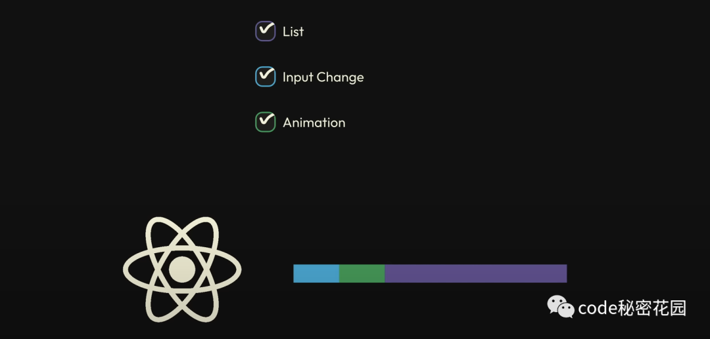

例如，用户输入和动画渲染属于高优先级任务，我们可以让React拥有这些任务之前互相切换的能力。

理论上，通过这种方式，每个React应用的体验都可以得到提升，因为React总是最优先考虑最重要的工作。

这就是React团队这段时间做的事情，他们将其命名为React Fiber

Fiber 并没有被作为一个新的框架，而是作为一个主要的 React 版本：React 16 推出来了。

它让 React 具有了异步可中断的能力。

## 异步渲染
2017 年初，React 现在看起来更聪明一点了，它能够优先处理一些工作，并且能中断当前渲染。

但是这个能力只能说是半成品，另外还有一个非常困难的事情是找到一个公共API，让React开发者以一种不会完全破坏当前React生态的方式使用这些能力。

解决这个问题的第一部分，是摆脱掉可能会对新的异步可中断渲染的能力起到副作用的部分

在新的架构中，一个组件的渲染被分为两个阶段：第一个阶段（也叫做 render 阶段）是可以被 React 打断的，一旦被打断，这阶段所做的所有事情都被废弃，当 React 处理完紧急的事情回来，依然会重新渲染这个组件，这时候第一阶段的工作会重做一遍。两个阶段的分界点，**就是 render 函数。render 函数之前的所有生命周期函数（包括 render )都属于第一阶段**。

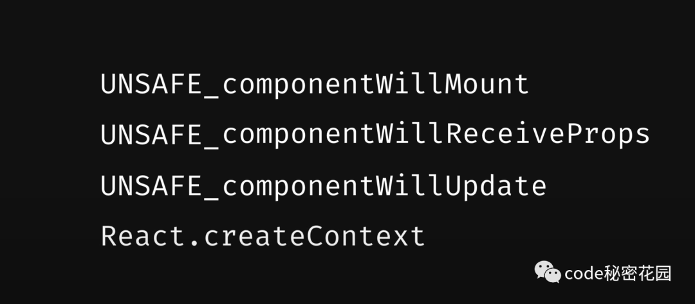

如果我们在这些声明周期中引入了副作用，被重复执行，就可能会给我们的程序带来了不可预估的问题，所以到了 React v16.3，React 干脆引入了一个新的生命周期函数 getDerivedStateFromProps，这个生命周期是静态方法，在里面根本不能通过this访问当前组件，输入只能通过参数，对组件的渲染影响只能通过返回值

同时，React 团队开始将这种新的模式称为 — **async rending**。

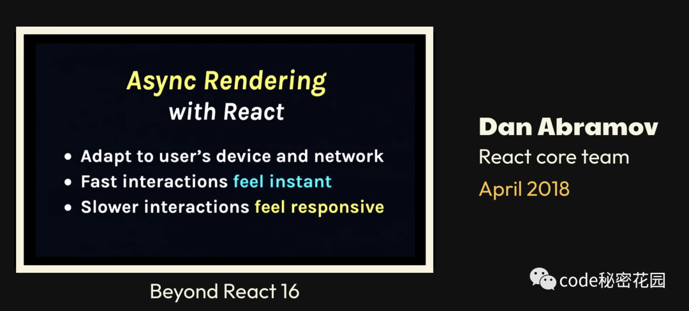

:::tip
这里最大的问题不是性能，而是调度，所以我们必须考虑调度，所以我们称这些新的能力为 async rending。我们的目标是可以让程序开发者适应设备和网速等用户限制，让交互体验变得更好。— React Conf 2018
:::

## Hooks
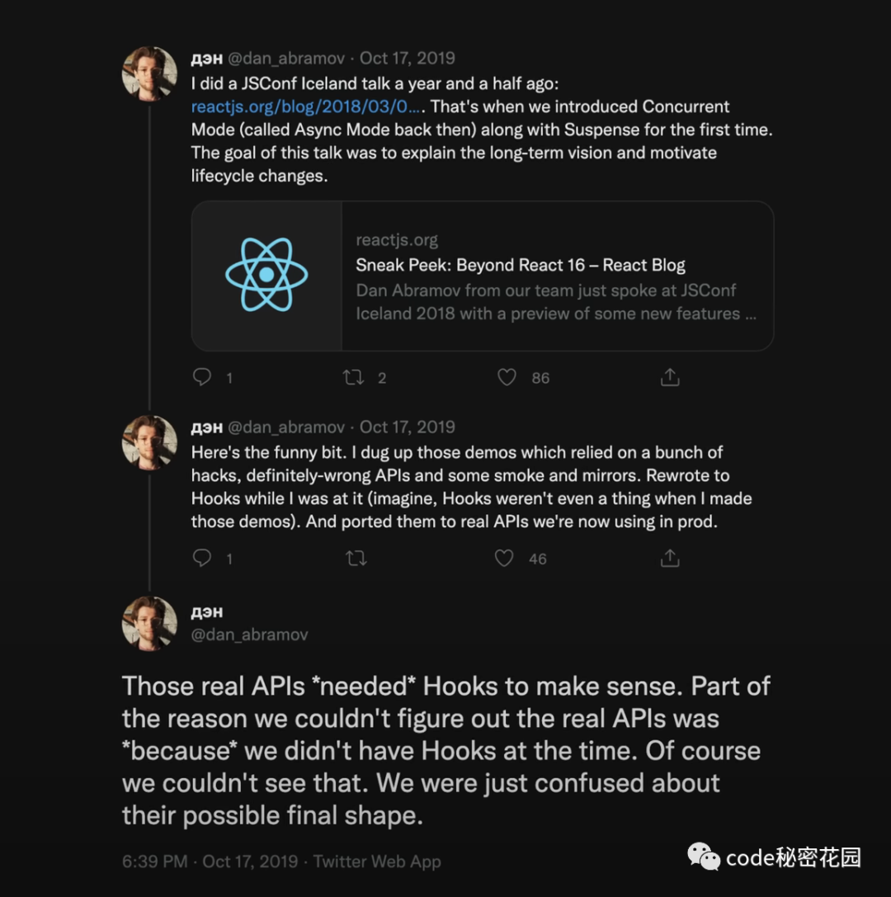

然而，一年后，dan 继续表示：React 缺少了一些让调度工作更简单的东西，这就是 Hooks。

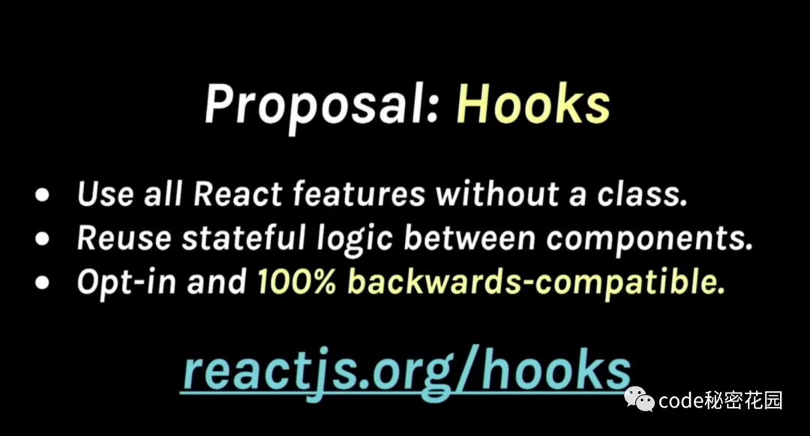

Hooks于2018年十月在React comp中发布，它是React自发布以来最大的变化

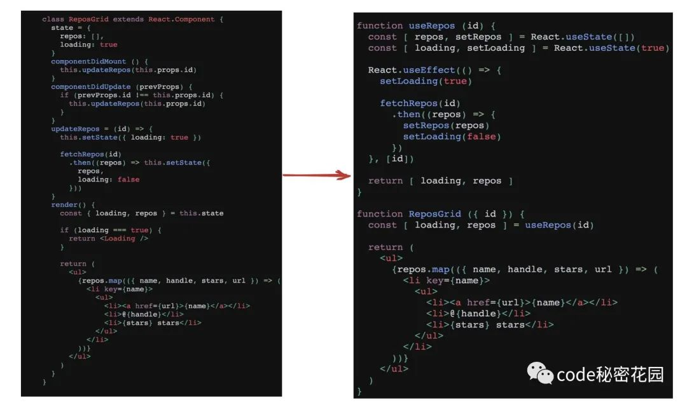

Hooks最初的重点在于它可以让你用函数式写法替代类来创建React组件。

但实际上他们带来的收益更多，你可以更好的进行代码复用、组合、设置默认值，另外还有比较重要的一点，Hooks可以更自然的编写出和异步渲染更兼容的代码

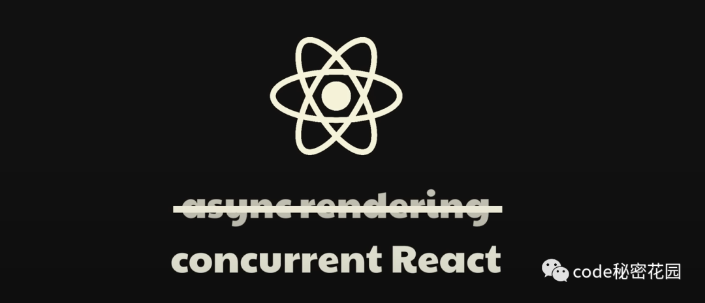

## concurrent React
然后在这个阶段我们还解锁了一个新名字：concurrent React。

:::tip
async 是一个非常广泛的术语，它可以描述很多内容，我们认为 concurrent React 这个词更恰当一点。 concurrent React  可以同时处理多个任务，并且根据这些任务的优先级在它们之间切换；它可以让渲染树进行部分渲染，而不将最终结果提交给 DOM; 并且，最重要的， concurrent React 不会阻塞主线程。— React Conf 2018
:::

## concurrent mode
然而，这种说法并没有持续多久，很快它就会 concurrent mode 替代了。

事件来到了 2019 年，我们终于得到了一些可以拿出来用的东西，concurrent React 正式更名为  concurrent mode 。

:::tip
concurrent mode 让React应用程序可以中断比较大的低优先级任务，以专注更更高优先级的事情(例如响应用户输入事件)
:::

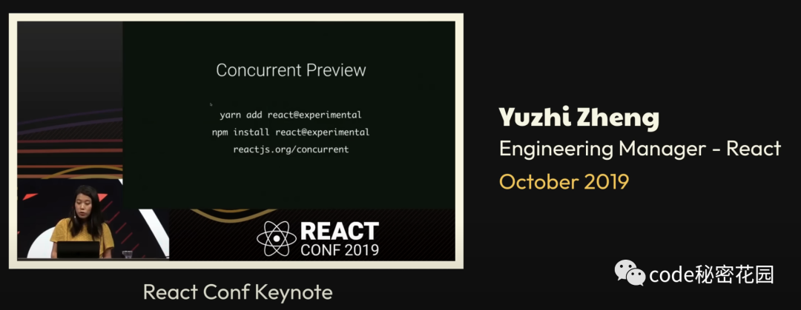

> concurrent mode 现在已经可以在实验模式下使用了  — React Conf 2019

不容易，搞了三年了，用户终于有一些可以使用的东西了。。。

但是，它是最终版本的 API 吗？不是！它已经可以在生产环境使用了吗？不能！

但是，concurrent mode 让我们终于可以在程序里面去体验一下了，我们可以在实验模式下开启，这样我们就可以看到并发渲染的性能优势了。

但是，实际上，想法很美好，我们仍然受到了升级策略的限制。

## 升级策略
React 在以前是不可以多版本共存的，这意味着我们只能在一些 DEMO 项目和新项目中看到这种提升，如果我们想在已经存在的大型应用程序里面去用，就需要一个更好的升级策略。

React 17 就是用来解决这个问题的，它在一年后的 2020 年 8 月发布。

React 17 允许我们在同一个应用程序里允许多个版本的 React，这让我们可以在大型项目里采用增量升级策略，你可以将程序的部分升级到 React 18。

然而，它实际起到的作用也没有那么好，因为渐进式的升级策略也无法做到更精细的控制。

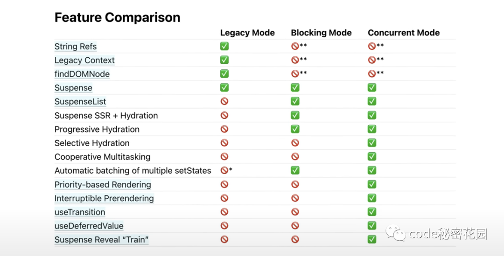

React 团队还另外提供了一种称之为 blocking mode 的模式，是处于旧的模式和新的并发渲染模式之间的混合模式。

怎么说呢？也是个弱鸡的策略，没有达到预想的效果，React 团队在后续的一段时间收到了大量的用户反馈。

## concurrent features

这时，距离 React 宣布新的架构开始，已经过去了 5 年的时间，在收到了大量的反馈后，React 团队又做出了改变，这次，似乎来到这最终的解决方案？

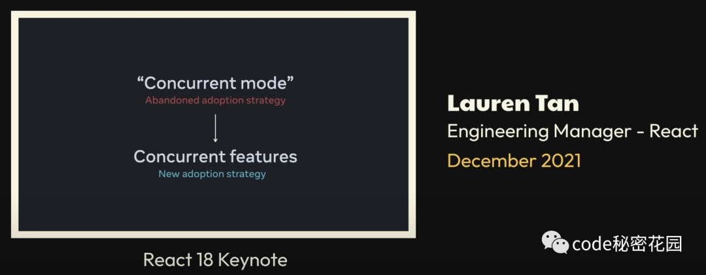

:::tip
在聆听了大量的用户反馈后，我们很高兴的分享 — concurrent mode 在 React 18 中消失掉了，它被逐步采用的渐进式策略取代，你可以按照自己的节奏采用并发渲染。— React Conf 2021
:::

concurrent features — 这个名字很明显，因为无法做到直接全面升级并发渲染，React 希望提供给我们一些特性让我们去选择性的启用并发渲染。

在这种模式下，你可以让程序特定的部分启用并发渲染。

### useDeferredValue
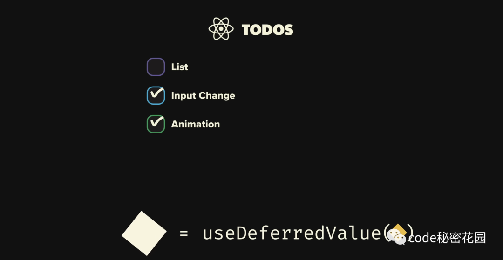

我们需要通过一些api，让我们在整个渲染过程中确定工作的优先级，拥有可中断的能力，首先我们来看看useDeferredValue,它可以让我们去标记整个具有状态的优先级

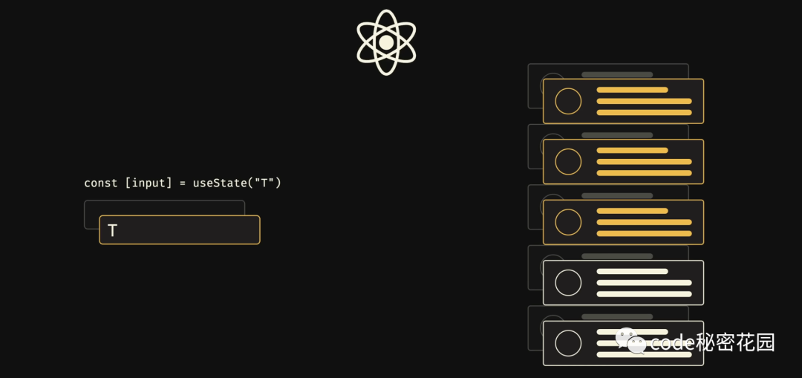

比如我们现在有这样的场景，用户输入了一些搜索关键字后，我们需要将搜索到的数据渲染到下面的详情里，如果这个处理比较耗时，那么连续的用户输入会有卡顿的感觉。实际上，我们希望的是用户的输入能得到快速的响应，但是下面详情的渲染多等待一会其实无所谓。

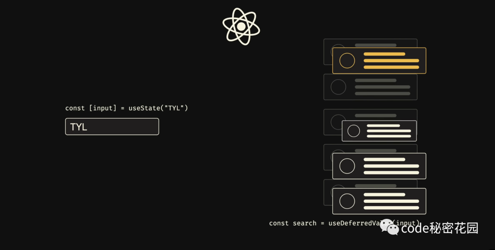

这时，我们可以通过 useDeferredValue 创建一个 deferredText，真正的意思是 deferredText 的渲染被标记为了低优先级，用户输入已经不会有卡顿的感觉了。

### startTransition
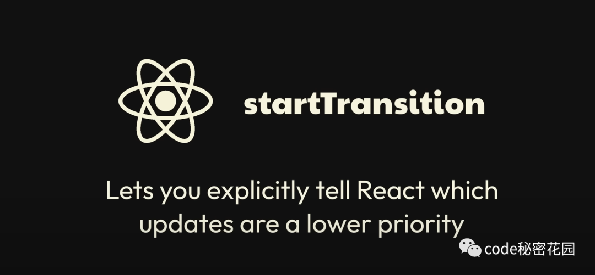

useDeferredValue是让我们标记哪些具体的状态拥有更低的优先级，而startTrasition可以明确告诉React哪些更新具有更低的优先级

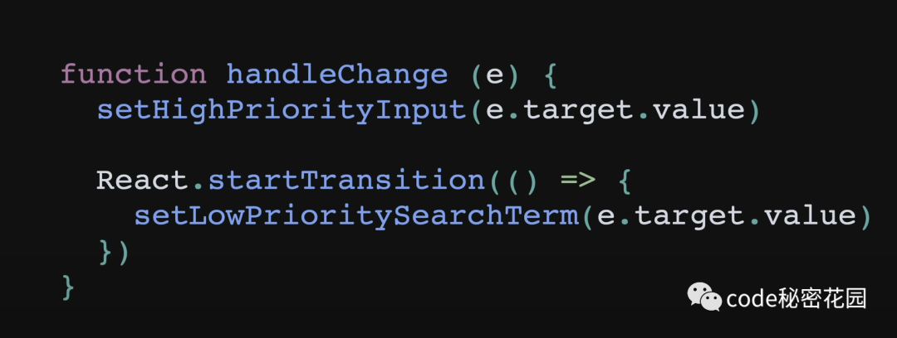

当有一些更新被包裹在 startTransition 下时，React 将已较低的优先级去处理这些更新，从而优先去处理像用户输入这样更高优先级的更新。

### Suspense
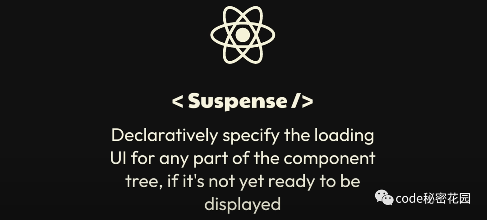

另外你可能还会经常听到一个词是Suspense，它的目标是让我们在React组件中读取远程数据像使用props和state这样简单。

&lt;Suspense&gt;是一个 React 组件，如果组件树有一些位置还没准备好，它可以让你以声明的方式控制这部分渲染的 UI。

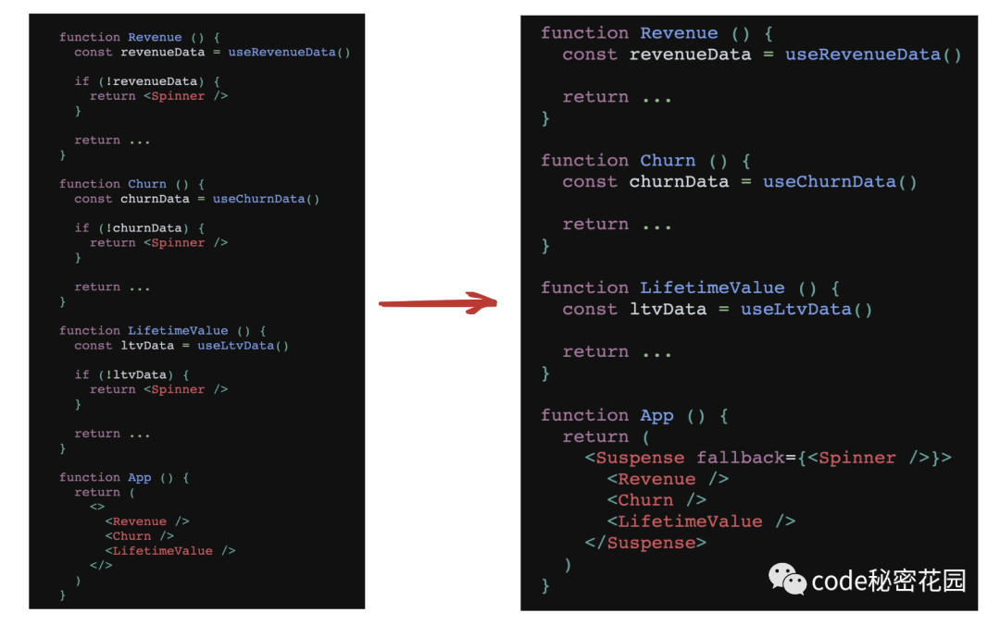

它可以让我们将左侧这样代码简化成右侧这样，让你可以在 React 组件中以同步代码的写法编写异步代码。

## React 18 是最终版本吗
React 官方在官网中提到，大多数情况下我们都不会和这些并发渲染的 API 直接交互，这让我们很难判断 React 18 究竟是不是一个革命性的版本。

不管怎么说，它是一个历时两千多天的、我们期待已久的巨大里程碑。

你认为它是 React 并发渲染的最终版本吗？

