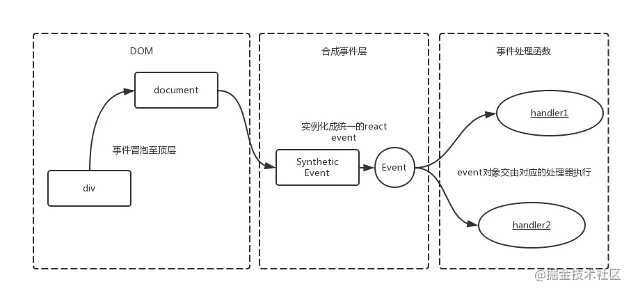

## React合成事件
### 为什么有合成事件的抽象
如果DOM上绑定了过多的事件处理函数，整个页面响应以及内存占用可能都会受到影响。React为了避免这类DOM事件滥用，同事屏蔽底层不同浏览器之间的事件系统差异，实现了一个中间层-SyntheticEvent

### 原理
React中，如果需要绑定事件，我们常常在jsx中怎么写：
```
<div onClick={this.onClick}>
  React事件
</div>
```
原理大致如下

React并不是将click事件绑在该div的真实DOM上，而是在document处监听所有支持的事件，当事件发生并冒泡至document处时，React将事件内容封装并交由真正的处理函数处理

以上面代码为例，整个事件生命周期示例如下



其中，由于event对象是复用的,事件处理函数执行完后，属性会被清空，所以event的属性无法被异步访问。详情请查阅[event-pooling](https://reactjs.org/docs/events.html#event-pooling)。

## 如何在React中使用原生事件
虽然React封装了几乎所有的原生事件，但诸如
- Modal开启以后点空白区域需要关闭Modal
- 引入了一些以原生事件实现的第三方库，并且相互之间需要交互

等等场景时,不得不使用原生事件来进行业务逻辑处理。

**由于原生事件需要绑定在真实DOM上，所以一般是在componentDidMount阶段/ref的函数执行阶段进行绑定操作，在componentWillUnmount阶段进行解绑操作以避免内存泄露**

```
class Demo extends React.PureComponent {
    componentDidMount() {
        const $this = ReactDOM.findDOMNode(this);
        $this.addEventListener('click', this.onDOMClick, false);
    }
    onDOMClick = evt => {
        // ....
    }
    render() {
        return (
            <div>Demo</div>
        )
    }
}
```
## 合成事件和原生事件混合使用
如果业务场景中需要混用合成事件和原生事件，那使用过程中需要注意一下几点

### 响应顺序
先看个例子
```
class Demo extends React.PureComponent {
    componentDidMount() {
        const $this = ReactDOM.findDOMNode(this)
        $this.addEventListener('click', this.onDOMClick, false)
    }

    onDOMClick = evt => {
        console.log('dom event')
    }
    
    onClick = evt => {
        console.log('react event')
    }

    render() {
        return (
            <div onClick={this.onClick}>Demo</div>
        )
    }
}
```
我们来分析一下：首先DOM事件监听器被执行，然后事件继续冒泡至document，合成事件监听器再被执行。

即，最终控制台输出为：

```
dom event react event
```
### 阻止冒泡
那，如果在onDOMClick中调用evt.stopPropagation()呢？

由于DOM事件被阻止冒泡了，无法达到document，所以合成事件自然不会被触发，控制台输出就变成了

```
dom event
```

简单的例子都比较容易理解，例子在复杂一些
```
class Demo extends React.PureComponent {
    componentDidMount() {
        const $parent = ReactDOM.findDOMNode(this)
        const $child = $parent.querySelector('.child')
        
        $parent.addEventListener('click', this.onParentDOMClick, false)
        $child.addEventListener('click', this.onChildDOMClick, false)
    }

    onParentDOMClick = evt => {
        console.log('parent dom event')
    }
    
    onChildDOMClick = evt => {
        console.log('child dom event')
    }    
    
    onParentClick = evt => {
        console.log('parent react event')
    }

    onChildClick = evt => {
        console.log('child react event')
    }

    render() {
        return (
            <div onClick={this.onParentClick}>
                <div className="child" onClick={this.onChildClick}>
                    Demo
                </div>
            </div>
        )
    }
}
```
如果在onChildClick中调用evt.stopPropagtion()，则控制台输出变为：

```
child dom event 
parent dom event
child react event
```
这样的结果是因为React给合成事件封装的stopPropagation函数在调用时给自己加了个isPropagationStopped的标记来确定后续监听器是否执行,源码如下
```
// https://github.com/facebook/react/blob/v15.6.1/src/renderers/shared/stack/event/EventPluginUtils.js
for (var i = 0; i < dispatchListeners.length; i++) {
  if (event.isPropagationStopped()) {
    break;
  }
  // Listeners and Instances are two parallel arrays that are always in sync.
  if (dispatchListeners[i](event, dispatchInstances[i])) {
    return dispatchInstances[i];
  }
}
```
### nativeEvent在React事件体系中的尴尬位置
有人或许有疑问，虽然响应顺序上合成事件晚于原生事件，那在合成事件中是否可以影响原生事件的监听器执行呢？答案是(几乎)不可能......

我们知道，React事件监听器中获得的入参并不是浏览器原生事件，原生事件可以通过evt.nativeEvent来获取。但令人尴尬的是，nativeEvent的作用非常小

### stopPropagation
在使用者的期望中，stopPropagation是用来阻止当前DOM的原生事件冒泡

但通过上一节合成事件的原理可知，实际上该方法被调用时，实际作用是在DOM最外层阻止冒泡，并不符合预期。

### stopImmediatePropagation
stopImmediatePropagation常常在多个第三方库混用时，用来阻止多个事件监听器中的非必要执行。

但React体系中，一个组件只能绑定一个同类型的事件监听器(重复定义时,后面的监听器会覆盖之前的)，所以合成事件甚至都不去封装stopImmediatePropagation。

事实上nativeEvent的stopImmediaePropagation只能阻止绑定在document上的事件监听器。此外，由于[事件绑定的顺序问题](https://developer.mozilla.org/zh-CN/docs/Web/API/Event/stopImmediatePropagation),需要注意，如果是在react-dom.js加载钱绑定的document时间,stopImmediatePropagation也无法阻止
## 结论
1. 合成事件的监听器是统一注册在document上的，且仅有冒泡阶段。所以原生时间的监听器响应总是比合成时间的监听器早
2. 阻止原生事件的冒泡后，会阻止合成事件的监听器执行
3. 合成事件的nativeEvent在文本场景中 没毛用


## 资料
[React合成时间和DOM原生时间混用须知](https://juejin.cn/post/6844903502729183239)
