本文将会全面总结所有的React Api，包含组件类、工具类、生命周期、react-hooks、react-dom五大模块，并配带示例，帮助大家更好的掌握，如有不全、不对的地方欢迎大家指出

在正式开始之前，一起来看看
- React v18中对react-dom做了那些改动，增加了那些新的hooks?
- useRef除了获取元素的节点信息，还能做什么？
- 为什么会有Children.map?它与不同的遍历有和不同
- 类组件的生命周期在不同的版本是怎么变化的
- 子元素如何渲染到父元素上面的
- ...

## 前言
附上一张今天的学习图谱～

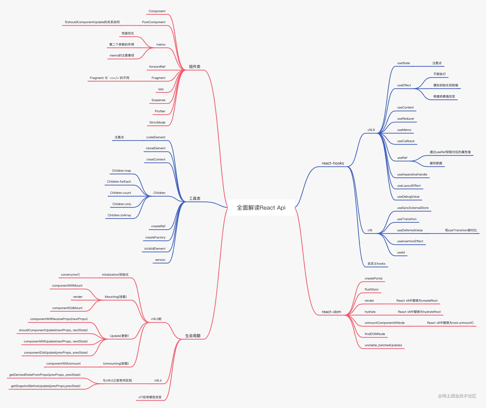

## 组件类
### Component
在React中提供了两种形式，一种是类组件，另一种是函数式组件，而在类组件组件中需要使用Component继承，这个组件没有什么好讲的，我们可以看看源码？

文件位置 packages/react/src/ReactBaseClasses.js
```js
function Component(props, context, updater) {
    this.props = props;
    this.context = context;
    this.refs = emptyObject;
    this.updater = updater || ReactNoopUpdateQueue;
}
Component.prototype.isReactComponent = {}
```
可以看出Component进行一些初始化的工作，updater保存着更新组件的方法

### 1. PureComponent
<span style="color: red">**PureComponent：会对props和state进行浅比较，跳过不必要的更新，提高组件性能**</span>

可以说PureComponent和Component基本完全一致，但PureComponent会浅比较，也就是较少render渲染的次数，所以PureComponent一般用于性能优化

举个例子
```js
import { PureComponent } from 'react';
import { Button } from 'antd-mobile';

class Index extends PureComponent {
    constructor(props) {
        super(props);
        this.state = {
            data: {
                number: 0
            }
        }
    }
    render() {
        const { data } = this.state;
        return <div style={{padding: 20}}>
            <div>数字：{data.number}</div>
            <Button color="primary" onClick={() => {
                const { data } = this.state;
                data.number++;
                this.setState({ data })
            }}>数字加1</Button>
        </div>
    }
}
export default index;
```


可以发现，当我们点击按钮的时候，数字并没有刷新，这是因为PureComponent会比较两次的data对象，它会认为这种写法并没有改变原先的data，所以不会改变

我们只需要
```js
this.setState({ data: { ...data }})
```
这样就可以解决这个问题了

#### 与shouldComponentUpdate的关系如何
在生命周期中有一个shouldComponentUpdate()函数，那么它能改变PureComponent吗？

其实是可以的，shouldComponentUpdate()如果被定义，就会对新旧props、state进行shallowEqual(浅比较)比较，新旧一旦不一致，便会触发update

也可以这么理解：<span style="color: blue">PureComponent通过自带的props和state的浅比较实现了ShouldComponentUpdate()，这点是Component不具备的</span>

<span style="color: red">PureComponent可能会因深层的数据不一致而产生错误的否定判断，从而导致ShouldComponentUpdate结果返回false，界面得不到更新，要谨慎使用</span>

### memo
memo:结合了PureComponent纯组件和ShouldComponentUpdate功能，会对传入的props进行一次对比，然后根据第二个函数返回值来进一步判断哪些props需要更新

<span style="color: red">要注意memo是一个高阶组件，函数式组件和类组件都可以使用</span>

memo接受两个参数
- 第一个参数: 组件本身，也就是要优化的组件
- 第二个参数: (pre,next) => boolean
    - pre:之前的数据
    - next: 现在的数据

    返回一个布尔值，若为true则不更新，为false则更新
#### 性能优化
看个🌰
```js
import React, { Component } from 'react';
import { Button } from 'antd-mobile';

const Child = () => {
    return <div>
        {console.log('子组件渲染')}
        大家好，我是小杜杜~
    </div>
}

class Index extends Component {
    constructor(props) {
        super(props);
        this.state = {
            flag: true
        }
    }
    render() {
        const { flag } = this.state;
        return <div style={{padding: 20}}>
            <Child/>
            <Button
                color="primary"
                onClick = {() => this.setState({ flag: !flag })}
            >状态切换{JSON.stringify(flag)}</Button>
        </div>
    }
}
export default Index;
```
在上述代码中，我们设置一个子组件，也就是Child和一个按钮，按钮的效果是切换flag的状态，可以看出flag和Child之间没有任何关系，那么在切换状态的时候，Child会刷新吗？

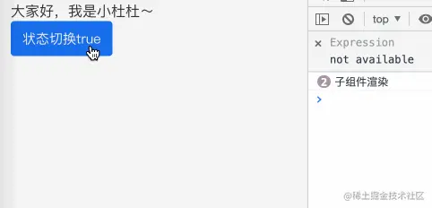

可以看出，在我们切换状态的时候，Child实际上也会刷新，我们肯定不希望组件做无关的刷新，那么我们加上memo来看看效果

```js
const HOCChild = memo(Child, (pre, next) => {
    return true;
})
```

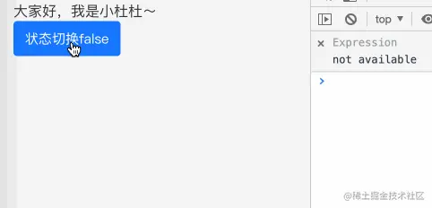

可以看出，加上memo后，Child不会在做无关的渲染，从而达到 **性能优化** 的作用

#### 第二个参数的作用
🌰：
```js
import React, { Component, memo } from 'react';
import { Button } from 'antd-mobile';

const child = ({number} => {
    return <div>
        {console.log('子组件渲染')}
        大家好，我是小肚肚~
        <p>传递的数字: {number}</p>
    </div>;
})
const HOCChild = memo(Child, (pre, next) => {
    if(pre.number === next.number) return true;
    if(next.number < 7)  return false;
    return true;
})

class Index extends Component { 
    constructor(props) {
        super(props);
        this.state = {
            flag: true,
            number: 1
        }
    }
    render() {
        const { flag, number } = this.state;
        return <div style={{padding: 20}}>
            <HOCChild number = {number}>
            <Button
                color="primary" 
                onClick={() => this.setState({ flag: !flag})}
            >状态切换{JSON.stringify(flag)}</Button>
            <Button
                color="primary"
                style={{marginLeft: 8}} 
                onClick={() => this.setState({ number: number + 1})}
            >数字加一：{number}</Button>
        </div>
    }
}
```
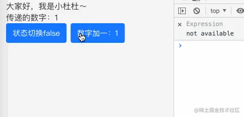

当数字小宇7，才会触发Child的更新，通过返回的布尔值来控制

#### memo的注意事项
React.memo和PureComponent的区别

- **<span style="color: red">服务对象不同：PureComponent服务于类组件，React.memo既可以服务类组件,也可以服务于函数式组件，useMemo服务于函数式组件</span>**
- **<span style="color:red">针对的对象不同：PureComponent针对的是props和state，React.memo只能针对props来决定是否渲染</span>**


这里还有个小的注意点: memo的第二个参数的返回值与shouldComponentUpdate的返回值相反的，经常会弄混，还要多多注意

- <span style="color: red">memo：返回true组件不渲染，返回false组件重新渲染</span>
- <span style="color: red">shouldComponentUpdate：返回true组件渲染，返回false不渲染</span>

### forwardRef
<span style="color: blue">forwardRef：引用传递，是一种通过组件向子组件自动传递引用ref的技术。</span>对于应用者的大多数组件没什么作用，但对于一些重复使用的组件，可能还用。

听完介绍是不是感觉云里雾里，官方对forwardRef介绍的也很少，我们来看看转发的问题

**<span style="color: red">在React中，React不允许ref通过props传递，因为ref是组件中固定存在的，在组件调用的过程中，会被特殊处理，而forwardRef就是为了解决这件事而诞生的，让ref可以通过props传递</span>**

举个🌰，父组件想要获取孙组件上的信息，我们直接用ref传递会怎么样

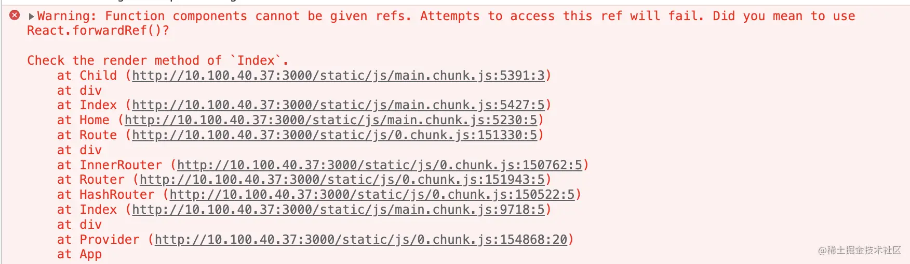

接下来看看利用forwardRef来转发下ref，就可以解决这个问题了
```js
import React, { Component } from 'react';

const Son = ({sonRef}) => {
    return <div>
        <p>孙组件</p>
        <p ref={sonRef}>大家好，我是小杜杜</p>
    </div>
}
const Child = ({ childRef }) => {
    return <div>
        <div>子组件</div>
        <Son sonRef={childRef}/>
    </div>
}

const ForwardRef = forwardRef((props, ref) => <Child childRef={ref}, {...props}/>)

class Index extends Component {
    constructor(props) {
        super(props);
    }
    node = null;

    componentDidMount() {
        console.log(this.node);
    }
    render() {
        return <div style={{padding: 20}}>
            <div>父组件</div>
            <ForwardRef ref={node => this.node = node} />
        </div>
    }
}
```
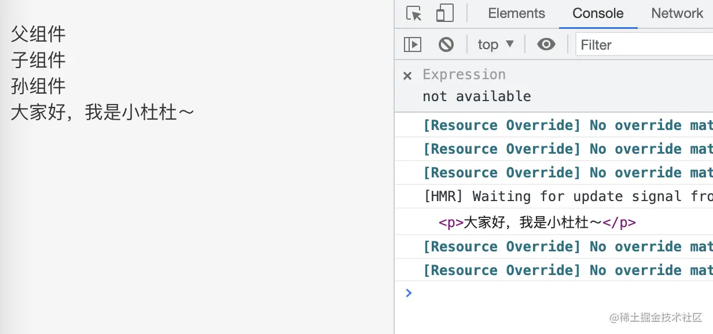

如此一来就解决了不能在react组件中传递ref的问题，至于复用的组件可能会用到，目前也没思路用forwardRef干吗，就当熟悉了

### Fragment
在React中，组件是不允许返回多个节点的
```js
return <p>我是小杜杜</p>
           <p>React</p>
           <p>Vue</p>
```
我们想要解决这种情况需要为此套一个容器，如&lt;div&gt;&lt;/div&gt;
```js
return <div>
    <p>我是小杜杜</p>
    <p>React</p>
    <p>Vue</p>
</div>
```
<span style="color: red">但这样做，无疑会多增加一个节点，所以在**16.0后，官方推出了Fragment碎片概念，能够让一个组件返回多个元素，『React.Framengt等价于&lt;&gt;&lt;/&gt;』**</span>
```js
return <React.Fragment>
    <p>我是小杜杜</p>
    <p>React</p>
    <p>Vue</p>
</React.Fragment>
```
可以看到React.Fragment 实际上是没有节点的

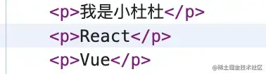

另外，react中支持数组的返回，像这样
```js
return [
    <p key="1">我是小肚肚</p>
    <p key="2">React</p>
    <p key="3">Vue</p>
]
```
<span style="color: blue">我们在进行数组遍历的时候，React都会在底层处理，在外面嵌套了一个React.Fragment</span>

### Fragment 与&lt;&gt;&lt;/&gt; 的不同
我们都知道&lt;&gt;&lt;/&gt;是&lt;Fragment&gt;&lt;/Fragment&gt;的简写，从原则上来说是一致的，那么你知道他们又什么不同吗？

<span style="color: red">实际上，Fragment 这个组件可以赋值 key，也就是索引，<></>不能赋值</span>，应用在遍历数组上，有感兴趣的同学可以试一试～

### Lazy
<span style="color: blue">lazy：允许你定义一个动态加载组件，这样有助于缩减bundle的体积，并延迟加载在初次渲染时未用到的组件，也就是懒加载组件(高阶
组件)</span>

lazy接收一个函数，这个函数需要动态调用import() 如
```js
const LazyChild = lazy(() => import('./child'));
```
那么 import('./child')是一个怎样的类型呢？

实际上lazy必须接受一个函数，并且需要返回一个Promise,并且需要resolve一个defualt一个React组件，除此之外，lazy必须配合Suspense一起使用

举个🌰：我加入了setTimeout方便看到更好的效果

```js
import React, { Component, Suspense, lazy } from 'react';
import Child from './child';
import { Button, DotLoading } from 'antd-mobile';

const LazyChild = lazy(() => new Promise(res => {
    setTimeout(() => {
        res({
            default: () => <Child />
        })
    }, 1000)
}))

class Index extends Component {
    constructor(props) {
        super(props);
        this.state = {
            show: false
        }
    }
    render() {
        const { show } = this.state;
        return <div style={{padding: 20}}>
            <Button color='primary' onClick = {() => this.setState({ show: true})}>
                渲染
            </Button>
            {
                show && <Suspense fallback={<div><DotLoading color='primary'/>加载中</div>}>
                    <LazyChild/>
                </Suspense>
            }
        </div>
    }
}
export default Index;
```
Child文件
```js
import React, { useEffect } from 'react';
import img from './img.jpeg';

const Index = () => {
    useEffect(() =>{
        console.log('照片渲染')
    }, [])
    return <div>
  
</div>
}
export default Index;
```

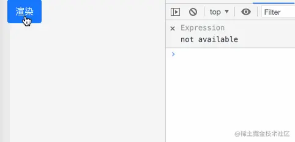

### Suspense
<span style="color:blue">Suspense:让组件等待某个异步组件操作；直到该异步组件操作结束即可渲染</span>

与上面lazy中的案例一样，两者需要配合使用，其中fallback为等待时渲染的样式

Suspense和lazy可以用于等待照片、脚本和一些异步的情况。

### Profiler
<span style="color: blue">Profiler：这个组件用于性能检测，可以检测一次react组件渲染时的性能开销</span>

此组件有两个参数
- id：标识Profiler的唯一性
- onRender：回调函数，用于渲染完成，参数在下面讲解
```js
// 🌰
import React, { Component, Profiler } from 'react';

export default Index
```
让我们来看看打印的是什么

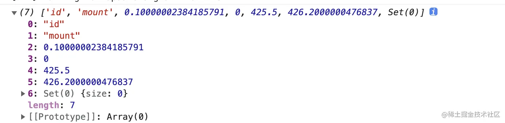

- id：Profiler树的id
- phase：mount挂载，update渲染
- actualDuration：更新 committed 花费的渲染时间
- baseDuration：渲染整颗子树需要的时间
- startTime：更新开始渲染的时间
- commitTime：更新 committed 的时间
- interactions：本次更新的 interactions 的集合

需要注意的是，这个组件应该在需要的时候去使用，虽然Profiler是一个轻量级的，但也会带来负担

### StrictMode
StrictMode：严格模式，是一种用于突出显示应用程序中潜在问题的工具

与Fragment一样，StrictMode也不会出现在UI层面，只是会检查和警告

可以看一下官方的示例：
```js
import React from 'react';

function ExampleApplication() {
  return (
    <div>
      <Header />
      <React.StrictMode>        <div>
          <ComponentOne />
          <ComponentTwo />
        </div>
      </React.StrictMode>      <Footer />
    </div>
  );
}
```
上述代码中只会对ComponentOne和ComponentTwo进行检查
主要有以下帮助：

- [识别具有不安全生命周期的组件](https://reactjs.org/docs/strict-mode.html#identifying-unsafe-lifecycles)
- [关于旧版字符串引用 API 使用的警告](https://reactjs.org/docs/strict-mode.html#warning-about-legacy-string-ref-api-usage)
- [关于不推荐使用 findDOMNode 的警告](https://reactjs.org/docs/strict-mode.html#warning-about-deprecated-finddomnode-usage)
- [检测意外的副作用](https://reactjs.org/docs/strict-mode.html#detecting-unexpected-side-effects)
- [检测遗留上下文 API](https://reactjs.org/docs/strict-mode.html#detecting-legacy-context-api)
- [确保可重用状态](https://reactjs.org/docs/strict-mode.html#ensuring-reusable-state)

## 工具类
### createElement
JSX会被编译成React.createElement的形式，然后被babel编译

结构：

React.createElement(type, [props], [...children]) 共有三个参数
- type:原生组件的话是标签的字符串，如div，如果是react自定义组件，则会传入组件
- [ptops]：对象，dom类中的属性，组件的props
- [...children]：其他参数，会依次排序

举个栗子
```js
class Info extends React.Component {
    render() {
        return (
            <div>
                Hi, 我是小肚肚
                <p>欢迎</p>
                <Childrend>我是子组件</Childrend>
            </div>
        )
    }
}
```
上面代码会被解释为
```js
class Info extends React.Component {
    render() {
        return React.createElement(
            'div',
            null, 
            "Hi, 我是小肚肚"，
            React.createElement('p', null, '欢迎')， // 原生标签
            React.createElement(
                Children, // 自定义组件
                null, // 属性
                '我是子组件' // Children文本内容
            )
        )
    }
}
```
#### 注意点
- JSX的结构实际上和React.createElement写法一致，只是用JSX更加简单、方便
- 经过React.createElement的包裹，最终会形成 $$typeof = Symbol(react.element)对象，对象保存了react.element的信息

### cloneElement
<span style="color: blue">cloneElement: 克隆并返回一个新的React元素</span>

结构：
```js
React.createElement(type, [props], [...children])
```
React.cloneElement()几乎等同于
```js
<element.type {...element.props} {...props}>
    {children}
</element>
```
举个🌰：
```js
import React from 'react';

const Child = () => {
    const children = React.cloneElement(<div>大家好，我是小肚肚</div>， {name: '小肚肚'});
    console.log(children);
    return <div>{children}</div>;
}

const Index = () => {
    return <div style={{padding: 20}}>
        <Child/>
    </div>;
}
```
打印下children来看看：

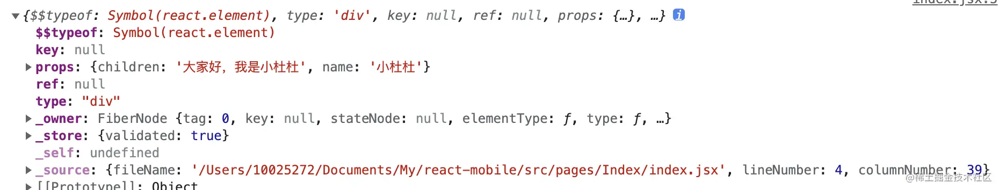

其实是可以看到传递的name的，也就是说可以通过React.cloneElement方法去对组件进行一些赋能

### createContext
<span style="color: blue">createContext: 相信大家对这个API很熟悉，用于传递上下文。createContext会创建一个Context对象，用Provider的value来传递值，用Consumer接受value</span>

实现一个父传孙的小🌰
```js
import React, { useState } from 'react';

const Context = React.createContext();

const Child = () => {
    return <Context.Consumer>
        {value => <Son {...value} />}
    </Context.Consumer>
}

const Son = props => {
     return <>
    <div>大家好，我是{props.name}</div>
    <div>幸运数字是：{props.number}</div>
  </>
}

const Index = () => {
    const [data, _] = useState({
        name: '小肚肚'，
        number: 7
    })

    return <div style={{padding: 20}}>
        <Context.Provider value={data}>
            <Child />
        </Context.Provider>
    </div>
}

export default Index;
```


> 注意：如果Consumer上一级一直没有Provider，则会引用defaultValue作为value.
> 只有当组件缩出的树中没有匹配到Provider时，其defaultValue参数才会生效

### Children
<span style="color: blue">Children：提供处理this.props.children不透明数据结构的使用程序</span>

那么什么是不透明数据呢？

先来看个🌰
```js
import React, { Component } from 'react';

const Child = ({children}) => {
    console.log(children);
    return children;
}

const Index = () => {
    return <div style={{padding: 20}}>
        <Child>
            <p>大家好，我是小肚肚！</p>
            <p>大家好，我是小肚肚！</p>
            <p>大家好，我是小肚肚！</p>
            <p>Hello~</p>
        </Child>
    </div>;
}
export default Index
```
打印children
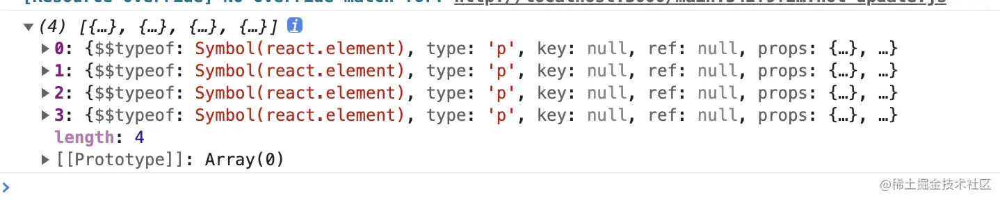

我们可以看到每个节点都打印出来了，这种情况属于透明的，但我们要是遍历看看
```js
<Child>
{
    [1,2,3].map(item => <p key={item}>大家好，我是小杜杜</p>)
}
</Child>
```
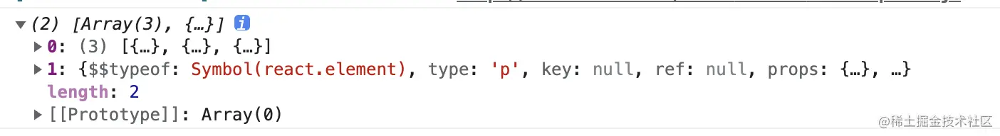

<span style="color: red">却发现我们遍历的三个元素被包裹了一层，这种数据被称为**不透明**，我们想要处理这种数据，就要依赖React.children来解决</span>

- Children.map

    Children.map:遍历，并返回一个数组，针对上面的情况，我们可以通过这个方法将数据遍历会原先的
    ```js
    const Child = ({children}) => {
        const res = React.Children.map(children, item=> item}
        console.log(res);
        return res;
    }
    ```
    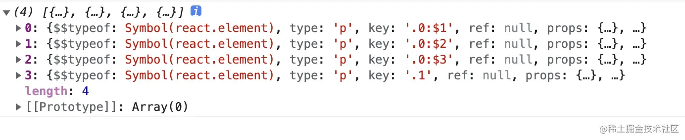

- Children.forEach

    Children.forEach:与Children.map类似,不同的是Children.forEach并不会返回值，而是停留在遍历阶段
    ```js
    const Child = ({children}) => {
        React.Children.forEach(children, item=> console.log(item));
        return children;
    }
    ```
    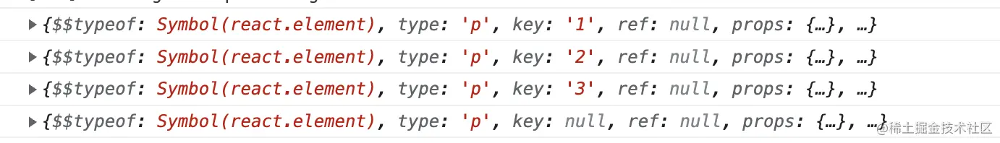

- Children.count

    Chilren.count: 返回Child内的总个数，等于回调传递给maip或forEach将被调用的次数，如
    ```js
    const Child = ({children}) => {
        const res = React.Children.count(children);
        console.log(res); // 4
        retnrun children
    }
    ```
- Children.only

    Chilren.only: 验证Child是否只有一个元素，如果是，则正常返回，如果不是，则会报错
    ```js
    const Child = ({children}) => {
        console.log(React.Children.only(children))
        return children
    }
    ```
- Children.toArray

    Chilren.toArray:以平面数组的形式返回children不透明数据结构，每个子元素都分配有键

    如果你想在你的渲染方法中操作子元素的集合，特别是如果你想this.props.children在传递它之前重新排序或者切片，还是很有用的

    在原先的例子上在加一次来看看
    ```js
    import React from 'react';

    const Child = ({children}) => {
        console.log('原来的数据：', 'children');
        const res = React.Children.toArray(children);
        console.log('扁平后的数据', res)
        return res;
    }

    const Index = () => {
        return <div style={{padding: 20}}>
            <Child>
                {
                    [1,2,3].map(item => [5,6].map(ele => <p key={`${item}-${ele}`}>大家好，我是小杜杜</p>))
                }
            </Child>
        </div>;
    }
    export default Index
    ```
    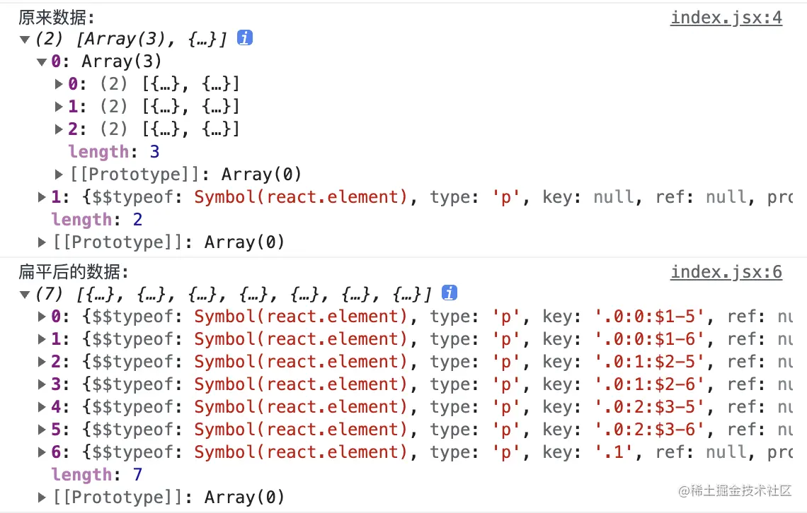

    <span style="color: red">这里需要注意key，经过Children.toArray处理后，会给原本的key添加前缀，以使的每个元素key的范围都限定在此函数如参数组的对象内</span>

### createRef
<span style="color: blue">createRef：创建一个ref对象，获取节点信息，直接举例子</span>

```js
import React, { Component } from 'react';

class Index extends React.Component {
    constructor(props) {
        super(props);
    }
    node = React.createRef();

    componentDidMount() {
        console.log(this.node)
    }
    render() {
        return <div ref={this.node}>节点信息</div>;
    }
}
export default Index;
```
这个有点鸡肋，因为我们可以直接从ref上获取到值，没有必要通过createRef去获取，像这样
```js
import React, {Component} from 'react';

class Index extends Component {
    constructor(props) {
        super(props);
    }
    node = null;

    componentDidMount() {
        console.log(this.node)
    }
    render() {
        return <div ref={(node) => this.node = node} > 节点信息 </div>
    }
}
export default Index;
```
### createFactory
<span style="color: blue">createFactory:返回一个生成给定类型的React元素的函数</span>

接受一个参数type，这个type与creaetElement的type一样，原生组件的话是标签的字符串div，如果是react自定义组件，则会传入组件

效果与createElement一样，但这个说是遗留的，官方建议使用creactElement，并且在使用上也会给出警告
```js
import React, { useEffect } from 'react';

const Child = React.createFactory(()=><div>createFactory</div>) 

const Index = () => {
  return <div style={{padding: 20}}>
    大家好，我是小杜杜
    <Child />
  </div>
}

export default Index;
```
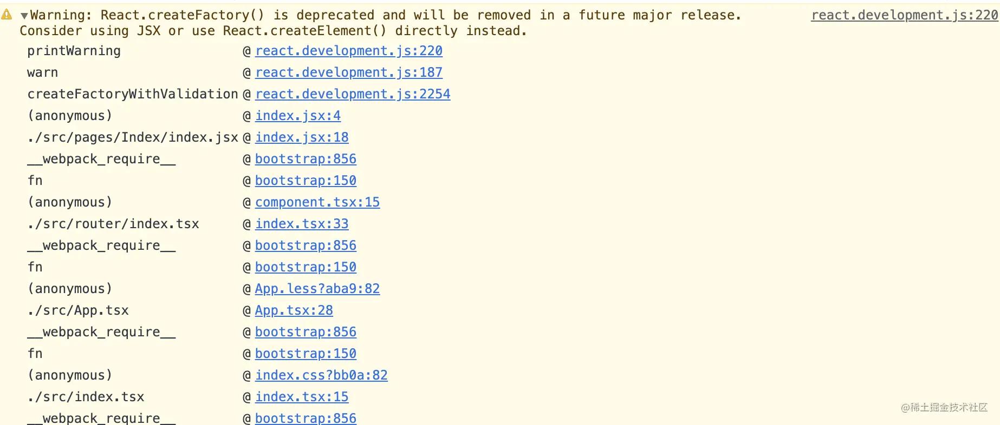

### isValidElement
isValidElement：用于验证是否是React元素，是的话就返回true，否则返回false，感觉这个Api也不是特别有用，因为我们肯定知道是否是
```js
console.log(React.isValidElement(<div>xxxxxxx</div>)) // true
console.log(React.isValidElement('大家好，我是小肚肚')) // true
```

### Version
查看React版本号
```js
console.log(React.version)
```
我们可以看下在React中的文件位置，在react中有一个单独处理版本信息的位置：

packages/shared/ReactVersion.js

## 声明周期
React的生命周期主要有两个比较大的版本，分别是v16.0和v16.4两个版本的生命周期，我们分别说下新旧的生命周期坐下对比

### v16.0前
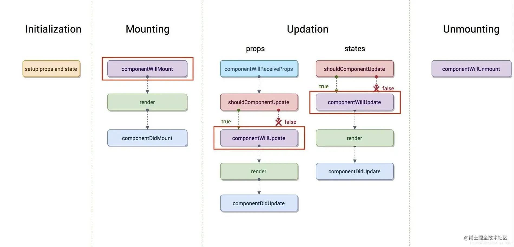

从图中，总共分为四大阶段：<span style="color: blue">Intiazation(初始化)、Mounting(挂载)、Update(更新)、Unmounting(卸载)</span>

- Intiazation(初始化)

    在初始化阶段，我们会用到constructor()这个构造函数
    ```js
    constructor(props) {
        super(props)
    }
    ```
    - super的作用，用来调用基类的构造方法(constructor()),也将父组件的props注入给子组件，供子组件读取(组件中prop只读不可变，state可变)
    - 初始化操作，定义this.state的初始内容
    - 只会执行一次

- Mounting(挂载)

    - componentWillMount:在组件挂载到DOM前调用
        - 在这里的调用的this.setState不会引起组件的重新渲染，也可以把写在这边的内容提到constructor()，所以项目很少用
        - 只会调用一次
    - render:渲染
        - 只要props和state发生改变(无论两者的重传递和重赋值，无论值是否有变化，都可以引起组件重新render，都会重新渲染render)
        - return：是必须，是一个Render元素(UI,描述组件)，不负责组件实际渲染工作，由React自身根据此元素去渲染出DOM
        - render是穿函数(Pure function：返回的结果只依赖与参数，执行过程中没有副作用)，不能执行this.setState
    - componentDidMount: 组件挂载到DOM后调用

- Update(更新)
    - componentWillReceiveProps(nextProps):调用props引起的组件更新过程中
        - nextProps:父组件传给当前组件新的props
        - 可以用nextProps和this.props来查明重传props是否发生变化(原因:不能保证组件重传的props有变化)
        - 只要props发生变化，引起调用
    - shouldComponentUpdate(nextProps, nextState):性能优化组件
        - nextProps：当前组件的props
        - nextState: 当前组件的this.state
        - 通过比较nextProps和nextState，来判断当前组件是否有比较继续执行更新的过程
            - 返回false，表示停止更新，用于减少组件的不必要渲染，性能优化
            - 返回true，继续执行更新
        - 像componentWillReceiveProps()中执行了this.state，更新了state，但在render前(如shouldComponentUpdate, componentWillUpdate),this.state依然只想更新前的state，不然nextState及当前组件的this.state的对比就一直是true了
    - componentWillUpdate(nextProps, nextState):组件更新前调用
        - 在render方法前调用
        - 由于组件更新就会调用，所以一般很少使用
    - render重新渲染
    - componentDidUpdate(prevProps, prevState):组件更新后被调用
        - prevprops:组件更新前的props
        - prevState:组件更新前的state
        - 可以操作组件更新的DOM
- Unmounting(卸载)
    - componentWillUnmount: 组件被卸载前调用
        - 可以在这里执行一些清理工作，比如清楚组件中使用的定时器，清楚componentDidMount中手动创建的DOM元素等，以避免引起内存泄漏

### React v16.4
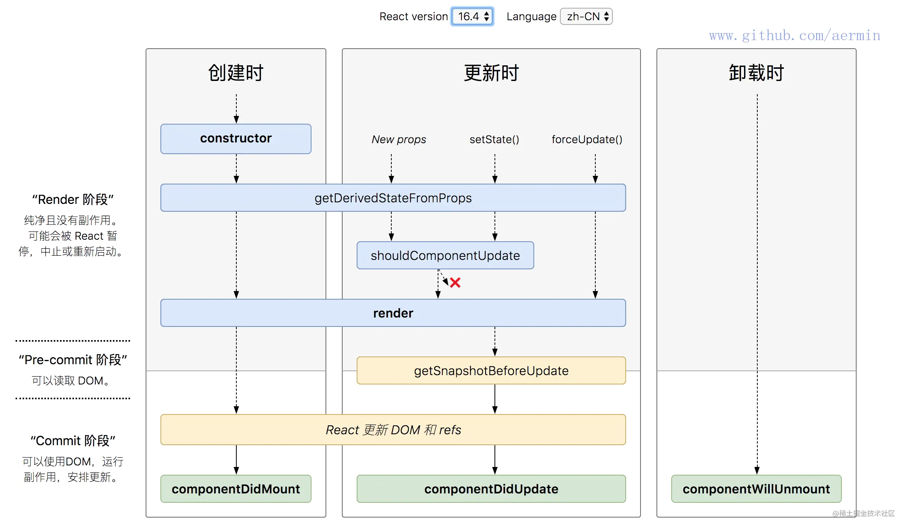

与v16.0的生命周期对比

<span style="color: red">新增了getDerivedStateFromProps 和getSnapshotBeforeUpdate</span>

<span style="color: red">取消了componentWillMount、componentWillReceiveProps、componentWillupdate</span>

- getDerivedStateFromProps

    getDerivedStateFromProps(prevProps, prevState):组件创建和更新时调用的方法
    - prevProps：组件更新前的props
    - prevState：组件更新前的state

    > 注意：在React v16.3中，在创建和更新时，只能是由父组件引发才会调用这个函数，在React v16.4改为无论是Mounting还是Updating，也无论是什么引起的Updating，全部都会调用

    有点类似于componentWillReceiveProps，不同的是getDerivedStateFromProps是一个静态函数，也就是这个函数不能通过this访问到class的属性，当然也不推荐使用

    如果props传入的内容不需要影响到你的state，那么就需要返回一个null，这个返回值是必须的，所以尽量将其写到函数的末尾。

    在组件创建时和更新时的render方法之前调用，它应该返回一个对象来更新状态，或者返回null来不更新任何内容。

    <span style="color: red">**getDerivedStateFromProps 的存在只有一个目的：让组件在 props 变化时更新 state。**</span>

    [demo](https://www.runoob.com/react/react-ref-getderivedstatefromprops.html)

- getSnapshotBeforeUpdate(prevProps, prevState): Updating时的函数，在render之后调用

    - prevProps: 组件更新前的props
    - prevState： 组件更新前的state

    可以读取，但是无法使用DOM的时候，在组件可以在可能更前之前从DOM获取一些信息(例如滚动位置)

    **返回的任何指都将作为参数传递给componentDidUpdate（)**

    [demo](https://www.runoob.com/react/react-ref-getsnapshotbeforeupdate.html)

### 注意
在17.0的版本，官方彻底废除 componentWillMount、componentWillReceiveProps、componentWillUpdate

<span style="color: red">如果还想使用的话可以使用：UNSAFE_componentWillMount()、UNSAFE_componentWillReceiveProps()、UNSAFE_componentWillUpdate()</span>

对了，如果在面试的时候可能会问道有关生命周期的问题，建议各位小伙伴，将以上的生命周期都可说一说，然后做个对比，这样的话，效果肯定不错～

## React-hooks
react-hooks是React 16.8的产物，给函数式组件赋上了生命周期，再经过三年多的时间，函数式组件已经逐渐取代了类组件，可以说是React开发者必备的技术

同时在React v18中又出现了一些hooks，今天我们将一起详细的看看，确保你能迅速掌握～

### React v16.8中的hooks

#### useState
<span style="color: blue">usestate: 定义变量，可以理解为他是类组件中的this.state</span>

使用
```js
const [state, setState] = useState(initialState);
```
- state：目的是提供给UI，作为渲染视图的数据源
- setState: 改变state的函数，可以理解为this.setState
- initialState: 初始默认值

两种写法的🌰
```js
import React, { useState } from 'react';
import { Button } from 'antd-mobile';

const Index = () => {
    const [number, setNumber] = useState(0);

    return <div style={{padding: 20}}>
        <div>数字： {number}</div>
        <Button
            color='primary'
            onClick={() => this.setState(number + 1); // 第一种
        >
        点击加1
        </Button>
        <Button
            color='primary'
            style={{marginLeft: 8}}
            onClick ={() => {
                setNumber(value => value + 2); // 第二种
            }}
        >
            点击加2
        </Button>
    </div>
}
export default Index
```


##### 注意点
**<span style="color: red">useState有点类似于PureComponent,会进行一个比较浅的比较，如果是对象的时候直接传入并不会更新，这点一定要切记</span>**，如：
```js
import React, { useState } from 'react';
import { Button } from 'antd-mobile';

const Index = () => {
    const [state, setState] = useState({number: 0})

    return <div style={{padding: 20}}>
        <div>数字：{state.number}</div>
        <Button
        color='primary'
        onClick={() => {
            state.number++
            setState(state)
        }}
        >
        点击
        </Button>
    </div>
}
export default Index
```


#### useEffect
useEffect:副作用，你可以理解为是类组件的生命周期，也是我们最常用的钩子

那么什么是副作用呢？<span style="color: blue">副作用(Side Effect):是指function做了和本身运算返回值无关的事，如请求数据、修改全局变量，打印、数据获取、设置订阅以及手动更改React 组件中的DOM都属于副作用操作都算是副作用</span>

我们直接演示下它的用法例子🌰：

- 不断执行

    当useEffect不设立第二个参数时，无论什么情况，都会执行

- 模拟初始化和卸载

    我么可以利用useEffect弄挂载和卸载阶段，通常我们用于监听addEventListener和removeEventListener的使用
    ```js
    import React, { useState, useEffect } from 'react';
    // import { Button } from 'antd-mobile'

    const Child = () => {
        useEffect(() => {
            console.log('挂载');
            return () => {
                console.log('卸载')
            }
        }, [])
        console.log('render')
        return <div>大家好，我是小肚肚</div>
    }
    const Index = () => {
        const [flag, setFlag] = useState(false)

        return <div style={{padding: 20}}>
            <button
                color="primary"
                onClick = {() => {setFlag(v => !v)}}
            >
                {flag ? '卸载' : '挂载'}
            </button>
            {flag && <Child />}
        </div>
    }
    export default Index;
    // render 、挂载；卸载
    ```
    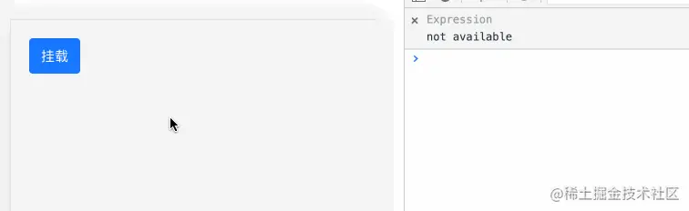

- 根据依赖值改变

    我们可以设置useEffect的第二个值来改变
    ```js
    import React, { useState, useEffect } from 'react';
    import { Button } from 'antd-mobile';

    const Index = () => {

    const [ number, setNumber ] = useState(0)
    const [ count, setCount ] = useState(0)

    useEffect(() => {
        console.log('count改变才会执行')
    }, [count])

    return <div style={{padding: 20}}>
        <div>number: {number}   count: {count}</div>
        <Button
        color='primary'
        onClick={() => setNumber(v => v + 1)}
        >
        number点击加1
        </Button>
        <Button
        color='primary'
        style={{marginLeft: 8}}
        onClick={() => setCount(v => v + 1)}
        >
        count点击加1
        </Button>
    </div>
    }
    
    export default Index
    ```
    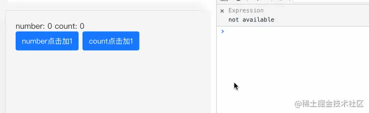
#### useContext
<span style="color: blue">useContext：上下文，类似于Context,其本意就是设置全局共享数据，使所有组件可跨层级实现共享</span>

useContent的参数一般是由createContext的创建，通过CountContext.Provider包裹的组件，才能通过useContent获取对应的值
```js
import React, { useState, createContext, useContext } from 'react';

import { Button } from 'antd-mobile';

const CountContext = createContext(-1);

const Child = () => {
    const count = useContext(CountContext);

    return <div style={{padding: 20}}>
        子组件获取到的count: {count}
        <Son/>
    </div>
}

const Son = () => {
    const count = useContext(CountContext);

    return <div style={{marginTop: 20}}>
        孙组件获取到的count:  {count}
    </div>
}
const Index = () => {
    const [count, setCount] = useState(0);

    return <div style={{padding: 20}}>
        <div>父组件:{count}</div>
        <Button
            color='primary'
            onClick= {() => setCount( v + 1)}
        >
            点击加1
        </Button>
        <CountContext.Provider value={count}>
        <Child />
        </CountContext.Provider>
    </div>
}
export default Index;
```
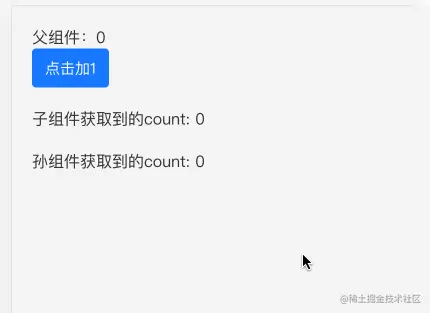
### useReducer
<span style="color: blue">useReducer：它类似于redux功能的api</span>

结构
```js
const [state, dispatch] = useReducer(reducer, initialArg, init);
```
- state: 更新后的state值
- dispatch: 可以理解为useState的setState一样的效果
- reducer：可以理解为redux的reducer
- initialArl: 初始值
- init: 惰性初始化

直接来看🌰
```js
import React, { useReducer } from 'react';
import { Button } from 'antd-mobile';

const Index = () => {
    const [count, dispatch] = useReducer((state, action) => {
        switch(action?.type) {
            case 'add':
                return state + action?.payload
            case 'sub':
                return state + action?.payload
            default:
                return state
        }
    }, 0)
}
return <div style={{padding: 20}}>
    <div>count：{count}</div>
    <Button
      color='primary'
      onClick={() => dispatch({type: 'add', payload: 1})}
    >
      加1
    </Button>
    <Button
      color='primary'
      style={{marginLeft: 8}}
      onClick={() => dispatch({type: 'sub', payload: 1})}
    >
      减1
    </Button>
  </div>
}
 
export default Index
```
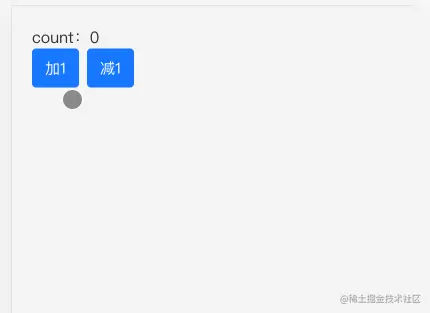

[useReducer与useContext组合实现跨组件的状态管理](https://www.cnblogs.com/liangtao999/p/15968018.html)

#### useMemo
useMemo:与memo的理念上差不多，都是判断是否满足当前的限定条件来决定是否执行callback函数，而useMemo的第二个参数是一个数组，通过这个数组来判定是否更新回掉函数

当一个父组件中调用了一个子组件的时候，父组件的state发生变化，会导致父组件更新，而子组件虽然没有发生改变，但也会进行更新

简单的理解一下，当一个页面内容非常复杂，模块非常多的时候，函数式组件会**从头到尾更新**，只要一处改变，所有的模块都会进行刷新，这种情况显然是没有必要的

我们的理想装填是各个模块只进行自己的更新，不要相互去影响，那么此时useMemo是最佳的解决方案

<span style="color: red">这里要尤其注意一点，只要父组件的状态更新，无论有没有对自组件进行操作，子组件都会进行更新，useMemo就是为了防止这点而出现的</span>

为了更好的理解useMemo，我们来看下面一个小栗子🌰：
```js
// usePow.js
const Index = (list: number[]) => {
    return list.map((list:number) => {
        console.log(1);
        return Math.pow(item, 2)
    })
}
export default Index

// Index.js
import { Button } from 'antd-mobile';
import React, { useState } from 'react';
import { usePow } from '@/components';

const Index: React.FC<any> = (props) => {
    const [flag, setFlag] = useState<boolean>(true);
    const data = usePow([1,2,3]);

    return (
    <div>
        <div>数字：{JSON.stringify(data)}</div>
        <Button color='primary' onClick={() => {setFlag(v => !v)}}>切换</Button>
        <div>切换状态：{JSON.stringify(flag)}</div>
    </div>
    )
}
export default Index
```
我们简单的写了个 usePow，我们通过 usePow 给所传入的数字平方, 用切换状态的按钮表示函数内部的状态，我们来看看此时的效果：

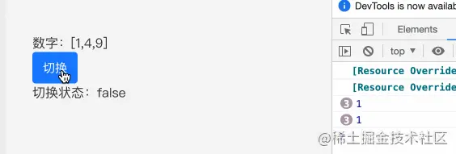

我们发现了一个问题，为什么点击切换按钮也会触发console.log(1)呢？

这样明显增加了性能开销，我们的理想状态肯定不希望做无关的渲染，所以我们做自定义 hooks的时候一定要注意，需要减少性能开销,我们为组件加入 useMemo试试：

```js
import { useMemo } from 'react';

const Index = (list: number[]) => {
    return useMemo(() => list.map((item:number) => {
        console.log(1);
        return Math.pow(item, 2)
    }), [])
}
export default Index;
```
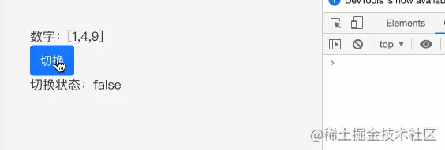
发现此时就已经解决了这个问题，不会在做相关的渲染了

#### useCallback
<span style="color: red">useCallback与useMemo及其类似，可以说一模一样，唯一不同的是usememo返回的是函数运行的结果，而useCallback返回的是函数</span>

> 注意：这个函数是父组件传递子组件的一个函数，防止做无关的刷新，其次，这个组件必须配合memo，否则不但不会提升性能，还有可能减低性能

```js
import React, { useState, useCallback } from 'react';
import { Button } from 'antd-mobile';

const MockMemo: React.FC<any> = () => {
    const [count, setCount] = useState(0);
    const [show, setShow] = useState(true);

    const add = useCallback(() => {
        setCount(count + 1);
    }, [count])

    return (
        <div>
            <div style={{display: 'flex', justifyContent: 'flex-start'}}>
                <TestButton title="普通点击" onClick={() => setCount(count + 1) }/>
                <TestButton title="useCallback点击" onClick={add}/>
            </div>
            <div style={{marginTop: 20}}>count: {count}</div>
            <Button onClick={() => {setShow(!show)}}> 切换</Button>
        </div>
    )
}

const TestButton = React.memo((props:any) => {
    console.log(props.title);
     return <Button color='primary' onClick={props.onClick} style={props.title === 'useCallback点击' ? {
        marginLeft: 20
        } : undefined}>{props.title}</Button>
})
export default MockMemo;
```
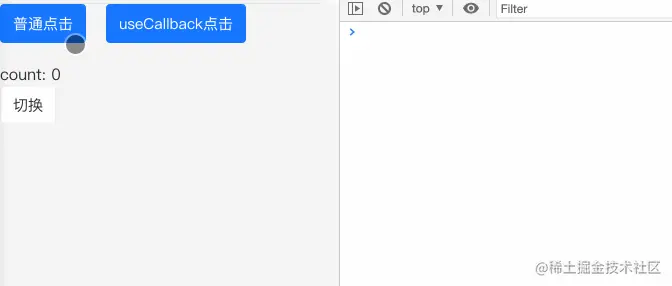

我们可以看到，当点击切换按钮的时候，没有经过 useCallback封装的函数会再次刷新，而经过 useCallback包裹的函数不会被再次刷新

有很多小伙伴有个误区，就是useCallback不能单独使用，必须要配合memo吗？

其实是这样的，你可以单独使用useCallback，但只用useCallback起不到优化的作用，反而会增加性能消耗

想之前讲的，React.memo会通过浅比较里面的props，如果没有memo，那么使用的useCallback也就毫无意义

因为useCallback本身是需要开销的，所以反而会增加性能的消耗

#### useRef
<span style="color: blue">useRef：可以获取当前元素的所有属性，并且返回一个可变的ref对象，并且这个对象只有current属性，可设置initialValue</span>

结构
```js
const refContainer = useRef(initialValue)
```
**有许多小伙伴只知道useRef可以获取对应元素的属性，但useRef还具备一个功能，就是缓存数据**，接下来一起看看：

- 通过useRef获取对应的属性值

    ```js
    import React, { useState, useRef } from 'react';

    const Index: React.Fc<any> = () => {
        const scrollRef = useRef<any>(null);
        const [clientHeight, clientWidth] = useState<number>(0);
        const [scrollTop, setScrollTop] = useState<number>(0);
        const [scrollHeight, setScrollHeight] = useState<number>(0);

        const onScroll = () => {
            if(scrollRef?.current) {
                let clientHeight = scrollRef?.current.clientHeight; //可视区域高度
                let scrollTop = scrollRef?.current.scrollTop; // 滚动条滚动高度
                let scrollHeight = scrollRef?.current.scrollHeight; // 滚动内容高度
                setClientHeight(clientHeight);
                setScrollTop(scrollTop);
                setScrollHeight(scrollHeight)
            }
        }
        return (
            <div >
                <div >
                    <p>可视区域高度：{clientHeight}</p>
                    <p>滚动条滚动高度：{scrollTop}</p>
                    <p>滚动内容高度：{scrollHeight}</p>
                </div>
                <div style={{height: 200, overflowY: 'auto'}} ref={scrollRef} onScroll={onScroll} >
                    <div style={{height: 2000}}></div>
                </div>
            </div>
        ) 
    }
    export default Index
    ```
    

    从上述可知，我们可以通过useRef来获取对应元素的相关属性，以此来做一些操作

- 缓存数据

    react-redux的源码中，在hooks推出后，react-hooks用大量的 useMemo重做了Provide等核心模块，其中就是运用 useRef 来缓存数据，并且所运用的 useRef()没有一个是绑定在dom元素上的，都是做数据缓存用的 

    简单来看一下
    ```js
        // 缓存数据
        /* react-redux 用userRef 来缓存 merge之后的 props */ 
        const lastChildProps = useRef() 
        
        // lastWrapperProps 用 useRef 来存放组件真正的 props信息 
        const lastWrapperProps = useRef(wrapperProps) 
        
        //是否储存props是否处于正在更新状态 
        const renderIsScheduled = useRef(false)

        //更新数据
        function captureWrapperProps( 
            lastWrapperProps, 
            lastChildProps, 
            renderIsScheduled, 
            wrapperProps, 
            actualChildProps, 
            childPropsFromStoreUpdate, 
            notifyNestedSubs 
        ) { 
            lastWrapperProps.current = wrapperProps 
            lastChildProps.current = actualChildProps 
            renderIsScheduled.current = false 
        }
    ```
    我们看到 react-redux 用重新赋值的方法，改变了缓存的数据源，减少了不必要的更新，如过采取useState势必会重新渲染。
    
    <span style="color: red">**有的时候我们需要使用useMemo、useCallbackApi，我们控制变量的值用useState 有可能会导致拿到的是旧值，并且如果他们更新会带来整个组件重新执行**，这种情况下，我们使用useRef将会是一个非常不错的选择</span>

#### useImperativeHandle
<span style="color:green">useImperativeHandle: 可以让你在使用ref时自定义暴漏给父组件的实例值</span>

**这个api我觉得十分有用的，建议掌握，来看看使用的场景**

在一个页面很复杂的时候，我们会将这个页面进行模块化，这样会分成很多个模块，有的时候我们需要再 最外层的组件上 控制其他组件的方法，希望最外层点击的事件，同事执行子组件的事件，这时就需要useImperativeHandle 的帮助
```js
// 结构
useImperativeHandle(ref, createHandle, [deps])
```
- ref: useRef所创建的ref
- createHandle: 处理的函数，返回值作为暴漏给父组件的ref对象
- deps: 依赖项，依赖项更改行程新的ref对象
🌰
```js
import React, { useState, useImperativeHandle, useRef } from 'react';
import {Button} from 'antd-mobile';

const Child = (cRef) => {
    const [count, setCount] = useState(0);

    useImperativeHandle(cRef, () => ({
        add
    }))
    const add = () => {
        setCount(v => v + 1)
    }
    return <div style={{marginBottom: 20}}>
        <p>点击次数:{count}</p>
        <Button color="primary" onClick={() => add()} >加1</Button>
    </div>
}

const Index = () => {
    const ref = useRef(null)

  return <div style={{padding: 20}}>
    <div>大家好，我是小杜杜</div>
    <div>注意:是在父组件上的按钮，控制子组件的加1哦～</div>
    <Button
      color='primary'
      onClick={() =>  ref.current.add()}
    >
      父节点上的加1
    </Button>
    <Child cRef={ref} />
  </div>
}
export default Index
```
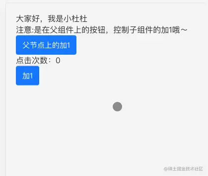

#### useLayoutEffect
<span style="color: blue">useLayoutEffect：与useEffect基本一致，不同的地方是，useLayoutEffect是同步的</span>

> 要注意的是useLayoutEffect在DOM更新之后，浏览器绘制之前，这样做的好处是可以更加方便的修改DOM,获取Dom信息，这样浏览器只会绘制一次，所以useLayoutEffect在useEffect之前执行

如果useEffect的话，useEffect执行在浏览器绘制视图之后，如果在此时改变DOM，有可能回到浏览器再次回流和重绘

除此之外useLayoutEffect的callback中代码执行会阻塞浏览器绘制

举个🌰
```js
import React, { useState, useLayoutEffect, useEffect, useRef } from 'react';
import {Button} from 'antd-mobile';

const Index = () => {

    const [count, setCount] = useState(0);
    const time = useRef(null);
    
    useEffect(() => {
        if(time.current) {
            console.log('useEffect', performance.now() - time.current);
        }
    })
    useLayoutEffect(() =>{
        if(time.current) {
            console.log('useLayoutEffect', performance.now() - time.current)
        }
    })

    return <div style={{padding: 20}}>
        <div>count: {count}</div>
        <Button
            color="primary"
            onClick = {() =>{
                setCount(v=> v + 1);
                time.current = performance.now();
            }}
        ></Button>
    </div>
}
export default Index
```
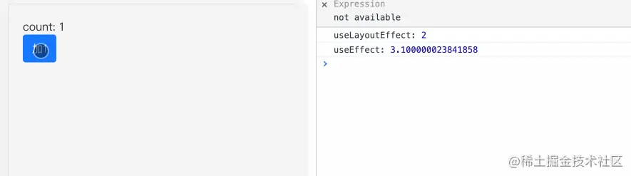

#### useDebugValue
<span style="color: blue">useDebugValue: 可用于在React开发者工具中显示自定义hook的标签</span>

官方并不推荐你想每个自动以Hook添加debug值，当它作为共享库的一部分时才有价值
```js
function useFriendStatus(friendID) {
  const [isOnline, setIsOnline] = useState(null);

  // ...

  // 在开发者工具中的这个 Hook 旁边显示标签  
  // e.g. "FriendStatus: Online"  useDebugValue(isOnline ? 'Online' : 'Offline');
  return isOnline;
}
```
[demo](https://blog.csdn.net/rock_23/article/details/121410514)

### React v18中的hooks

#### useSyncExternalStore
<span style="color: blue">useSyncExternalStore:是一个推荐用于读取和订阅外部数据源的hook，其方式与选择性的hydration和时间切片等并发渲染功能兼容</span>

```js
// 结构
const state = useSyncExternalStore(subscribe, getSnapshot[, getServerSnapshot]);
```
- subscribe: 订阅函数，用于注册一个回调函数，当存储值发生更改时被调用。此外，useSyncExternalStore会通过带有记忆性的getSnapshot来判别数据是否发生变化，如果发生变化，那么会强制更新数据
- getSnapshot:返回当前存储值的函数。必须返回缓存的值。如果getSnapshot连续多次调用，则必须返回相同的确切值，除非中间有存储值更新
- getServerSnapshot:返回服务端(hydration模式下)渲染期间使用的存储值函数
```js
import React, { useSyncExternalStore } from 'react';
import { combinReducers, createStore } from 'redux';

const reduer = (state = 1, action) => {
    switch(action.type) {
        case 'ADD':
            return state + 1;
        case 'DEL':
            return state - 1;
        default: 
            return state;
        
    }
}

// 注册reducer，并创建store
const rootReducer = combineReducers({count: reducer});
const store = createStore(rootReducer, { count: 1});

const Index = () => {
    // 订阅
    const state = useSyncExternalStore(store.subscribe, () => store.getState().count);
    return <div>
        <div>{state}</div>
        <div>
            <button onClick={() => store.dispatch({type: 'ADD'})}>加1</button>
            <button onClick={() => store.dispatch({type: 'DEL'})}>减-</Button>
        </div>
    </div>;
}
export default Index;
```


从上述代码可以看出，当点击按钮后，会触发store.subscribe(订阅函数),执行getSnapshot后得到新的count，如果count发生变化，则会触发更新

#### useTransition
<span style="color: blue">useTransition:返回一个状态值表示过渡人物的等待状态，以及一个启动该过渡任务的函数</span>

那么什么是过渡任务？

在一些场景中，如：输入框、tab切换、按钮等，这些任务需要视图上立刻做出响应，这些任务可以称之为立即更新的任务

但是有的事后，更新任务并不是那么紧急，或者说要去请求数据等，导致新的状态不能立马更新，需要用一个loading...的等待装填，这类任务就是过渡任务

```js
// 结构
const [isPending, startTrastion] = useTransition();
```
- isPending: 过渡状态的标志，为true时是等待装填
- startTrastion: 可以将里面的任务变成过渡任务

大家可能对上面的描述存在着一些疑问,我们直接举例子🌰来说明
```js
import React, { useState, useTransition } from 'react';

const Index = () => {
    const [isPending, startTrastion] = useStateTransition();
    const [input, setInput] = useState('');
    const [list, setList] = useState([]);

    return <div>
        <div>大家好,我是小肚肚</div>
        输入框：<input
        value = {input}
        onChange = {e => {
            setInput(e.target.value);
            startTrastion(() => {
                const res = [];
                for(let i = 0; i < 2000; i++) {
                    res.push(e.target.value);
                }
            });
            setList(res);
        }} />
        {isPending ? (
            <div>加载中</div>
        ) : (
            list.map((item, index) => <div key={index}>{item}</div>)
        )}
    </div>
}
export default Index;
```


实际上，我们在Input输入内容是，会进行增加，假设我们在startTrastion中请求一个接口，在接口请求的时候，isPending会为true，就会有一个loading的状态，请求完之后，isPending变为false渲染列表

#### useDeferredValue
<span style="color: blue">useDeferredValue:接受一个值，并返回该值的新副本，该副本将推迟到更紧急的更新之后</span>

如果当前渲染是一个紧急更新的结果，比如用户输入，React将返回之前的值，然后在紧急渲染完成后渲染新的值。

也就是说useDeferredValue可以让状态 滞后派生

```js
// 结构
const deferredValue = useDeferredValue(value);
```
- value: 可变的值，如useState创建的值
- deferredValue:延迟状态

这个感觉和useTransition优点相似，还是以输入框的模式，举个例子🌰
```js
import React, { useState, useDeferredValue } from 'react';

const getList = key => {
    const arr = [];
    for(let i = 0; i < 10000; i++) {
        if(String(i).includes(key)) {
            arr.push(<li key={i}></li>);
        }
    }
    return arr;
}
const Index = () => {
    const [value, setValue] = useState('');
    const defaultValue = useDeferredValue(value);
    console.log('value', value);
    console.log('deferredValue', defaultValue);
    
    return (
    <div >
        <div>
            <div>大家好，我是小杜杜</div>
            输入框：<input onChange={(e) => setValue(e.target.value)} />
        </div>
        <div>
            <ul>{deferredValue ? getList(deferredValue) : null}</ul>
        </div>
    </div>
    )
}
export default Index;
```
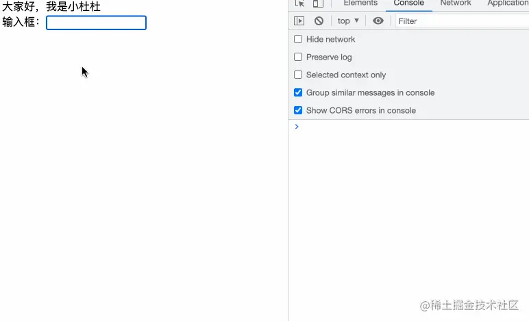

#### 和useTransition对比
根据上面两个实例我们看看useDeferredValue 和useTransition做个对比看看
- 相同点:useDeferredValue和useTransition一样，都是过渡更新任务
- 不同点： useTransition给的是一个状态，而useDeferredValue给的是一个值

#### useInsertionEffect
<span style="color: blue">useInsertionEffect：与useEffect一样，但它在所有DOM突变之前同步出发</span>

我们来看看useInsertionEffect对比useEffect和useLayoutEffect在执行顺序上有什么区别，🌰
```js
useEffect(() => {
    console.log('useEffect')
}, [])

useLayoutEffect(()=> {
    console.log('useLayoutEffect')
}, [])

useInsertionEffect(()=> {
    console.log('useInsertionEffect')
}, [])
```
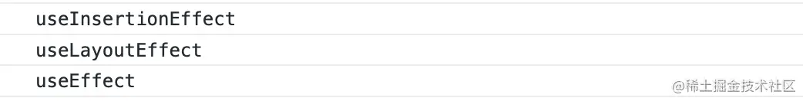

<span style="color: red">可以看到顺序上 useInsertionEffect > useLayoutEffect > useEffect</span>

> 特别注意一点, useInsertionEffect 应仅限于『css-in-js』库使用。优先考虑使用useEffect 或useLayoutEffect来替代

模拟一下 useInsertionEffect
```js
import React, { useInsertionEffect } from 'react';

const Index = () => {
    useInsertionEffect(() => {
        const style = document.createElement('style');
        style.innerHTML = `
        .css-in-js {
            color: blue;
        }
        `
    }, [])

    return (
        <div>
            <div className="css-in-js">大家好，我是小肚肚</div>
        </div>
    )
}
```


#### useId
<span style="color: blue">useId: 是一个用于生成横跨服务器和客户端的稳定的唯一ID的同事避免hydration不匹配的hook</span>

这个牵扯到SSR的问题，我打算之后单独写一章，来详细讲讲，所以这里就介绍一下使用即可
```js
const id = useId();

// 例子🌰
import React, { userId } from 'react';

const Index = () => {
    const id = useId();

    return (
        <div>
            <div id={id}>
                大家好，我是小肚肚
            </div>
        </div>
    )
}
export default Index
```
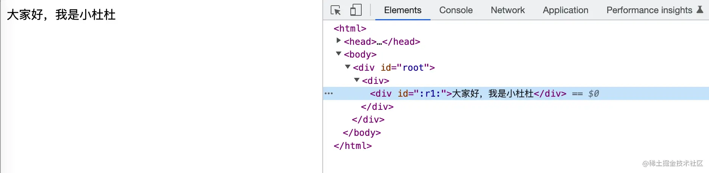

### 自定义hooks
自定义hooks是在react-hooks基础上的一个扩展，可以根据业务、需求去制定相应的hooks,将常用的逻辑进行封装，从而具备复用性

关于自定义hooks的内容可以看看我之前的文章：[搞懂这12个Hooks，保证让你玩转React](https://juejin.cn/post/7101486767336849421)

里面通过分析ahooks源码，讲解了很多不错的自定义hooks，如：useCreation、useReactive、useEventListener等的实现，相信一定能够帮助到各位，感兴趣的可以支持下～

## react-dom
<span style="color: blue">react-dom: 这个包提供了用户DOM的特定方法。这个包在React v18中还做了很大的改动，接下来我们逐个看看</span>

### createPortal
<span style="color: blue">createPortal:在Portal中提供了一种将子节点渲染到已DOM节点中的方式，该节点存在于DOM组件的层次结构之外</span>

**也就是说createPortal可以把当前组件或element元素的子节点，渲染到组件之外的其他地方**

来看看createPortal(child, container)的入参

- child：任何可渲染的子元素
- container：是一个DOM元素

看着概念可能并不是很好理解，我们来举个🌰
```js
import React,{ useState, useEffect, useRef } from 'react';
import ReactDom from 'react-dom';

const Child = ({children}) => {
    const ref = useRef();
    const [newDom, setNewDom] = useState();

    useEffect(() => {
        setNewDom(ReactDom.createPortal(children, ref.current));
    }, [])

    return <div>
        <div ref={ref}>同级的节点</div>
        <div>
            这层的节点
            {newDom}
        </div>
    </div>
}
const Index = () => {

  return <div style={{padding: 20}}>
    <Child>
      <div>大家好，我是小杜杜</div>
    </Child>
  </div>
}

export default Index;
```
要注意下Child:
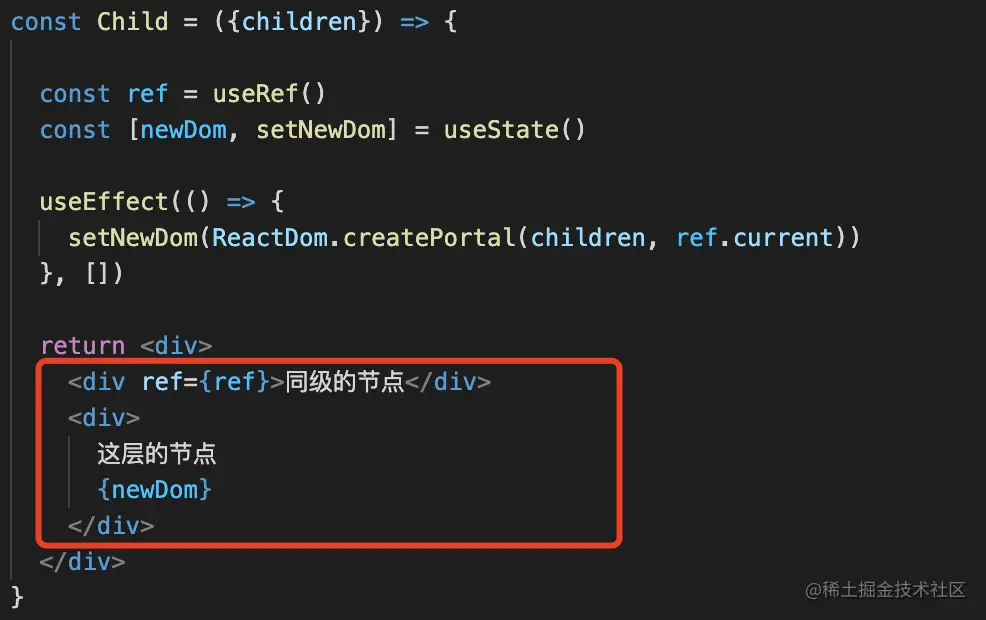

我们传入的children被createPortal包裹后，children的节点位置会如何？

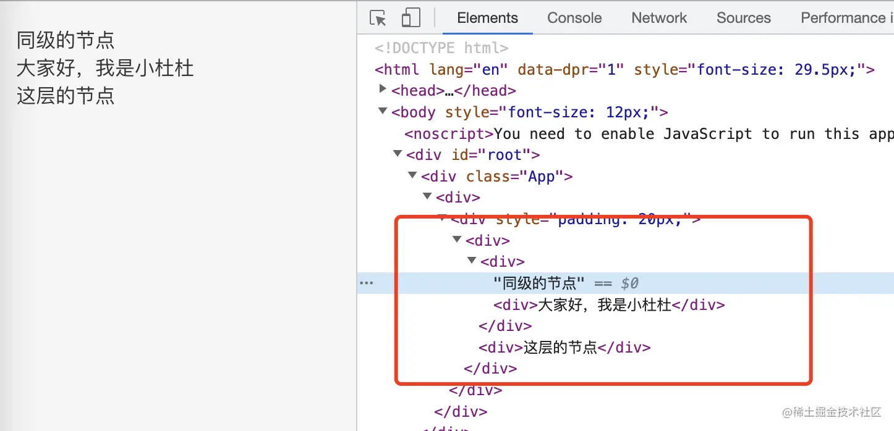

发现，我们处理的数newDom的数据到了同级的节点处，那么这个Api该如何应用呢？

我们可以处理一些顶层元素，如：Modal弹框组件，Modal组件在内部中书写，挂载到外层的容器（如body），此时这个Api就非常有用

### flushSync
<span style="color: blue">flushSync：可以将回调函数中的更新任务，放到一个较高级的优先级中，适用于强制刷新，同时确保了DOM会被立即更新</span>

```js
import {Button} from './antd-mobile';
import React, { Component } from 'react';
import { flushSync } from 'react-dom';

class Index extends Component {
    constructor(props) {
        super(props);
        this.state = {
            number: 0;
        }
    }
    render() {
         const { number } = this.state
        console.log(number)
        return <div style={{padding: 20}}>
        <div>数字: {number}</div> 
        <Button
            color='primary'
            onClick={() => {
            this.setState({ number: 1  })
            this.setState({ number: 2  })
            this.setState({ number: 3  })
            }}
        >
            点击 
        </Button>   
    }
}
```
我们看看点击按钮会打印出什么？

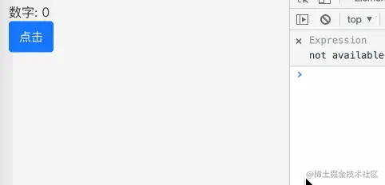

这个不难理解，因为this.setState会进行批量更新，所以打印出的是3 接下来，我们用flushSync处理下number: 2 来看看是什么效果：

```js
onClick = {() => {
    this.setState({
        this.setState({number: 1})
        React.flushSync(() => {
            this.setState({number: 2})
        })
        this.setState({number: 3})
    })
}}
```
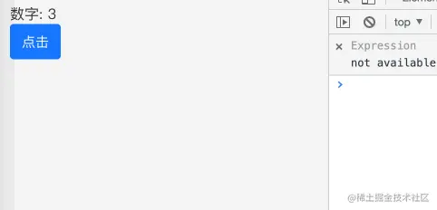

可以发现flushSync会优先执行，并且强制刷新，所以会改变number值为2， 然后1和3在批量处理，更新为3

### render
render: 这个是我们在react-dom中最常用的api，用于渲染一个react元素

我们通常在根部使用
```js
ReactDom.render(
    <App />,
    document.getElementById('app')
)
```
#### createRoot
在React v18中，render函数已经被creaetRoot所替代

creaetRoot会控制你传入的容器节点的内容。当调用render时，里面的任何现有DOM元素都会被替换。后面的调用使用React的DOM Diffing算法进行有效更新

并且createRoot不修改容器节点(只修改容器的子节点)。可以在不覆盖现有子节点的情况下将组件插入现有 DOM 节点。
```js
import React, { StrictMode } from 'react';
import { createRoot } from 'react-dom/client';

const rootElement = document.getElementById('root');
const root = createRoot(rootElement);

root.render(
  <StrictMode>
    <Main />
  </StrictMode>
);
```
### hydrate
<span style="color: blue">hydrate：服务端显然用hydrate与render()相同，但它用于在ReactDOMServer渲染的容器中对HTML的内容进行hydrate操作</span>

```js
hydrate(element, conttainer[, callback])
```

#### hydrateRoot()
hydrate 在React v18也被替代为hydrateRoot();
```js
hydrateRoot(container, element[, optiions])
```

### findDOMNode
findDOMNode：用于访问组件DOM元素节点（应急方案），官方推荐使用ref

需要注意的是：

- findDOMNode只能用到挂载的组件上
- findDOMNode只能用于类组件，不能用于函数式组件
- 如果组件渲染为null或者为false，那么findDOMNode返回的值也是null
- 如果是多个子节点Fragment的情况，findDOMNode会返回第一个非空子节点对应的 DOM 节点。
- 在严格模式下这个方法已经被弃用

举个例子🌰：
```js
import { Button } from 'antd-mobile';
import React, { Component} from 'react';
import ReactDOM from 'react-dom'
 

class Index extends Component{

  render(){

    return <div style={{padding: 20}}>
      <div>大家好，我是小杜杜</div> 
      <Button
        color='primary'
        onClick={() => {
          console.log(ReactDOM.findDOMNode(this))
        }}
      >
        获取容器
      </Button>    
    </div>
  }
}

export default Index;
```


### unstable_batchedUpdates
<span style="color: blue">unstable_batchedUpdates:用于手动批量更新state， 可以指定多个setState合并为一个更新请求</span>

那么这块手动合并，用在什么情况下呢？来看看下面的场景：
```js
import { Button } from 'antd-mobile';
import React, { Component} from 'react';
import ReactDOM from 'react-dom'
 
class Index extends Component{

  constructor(props){
    super(props)
    this.state={
      number: 0
    }
  }

  render(){
    const { number } = this.state
    return <div style={{padding: 20}}>
      <div>数字: {number}</div> 
      <Button
        color='primary'
        onClick={() => {
          this.setState({ number: this.state.number + 1 })
          console.log(this.state.number)
          this.setState({ number: this.state.number + 1  })
          console.log(this.state.number)
          this.setState({ number: this.state.number + 1 })
          console.log(this.state.number)
        }}
      >
        点击 
      </Button>    
    </div>
  }
}

export default Index
```
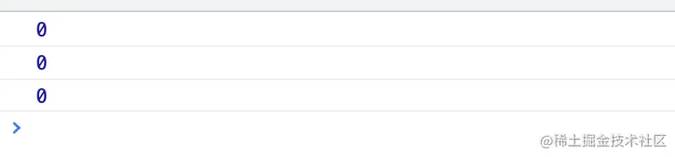

此时的场景只会执行一次，并且渲染一次，渲染时为1

那么我们打破React的机制，比如说使用setTimeout绕过，再来看看会打印出什么：
```js
      <Button
        color='primary'
        onClick={() => {
          setTimeout(() => {
            this.setState({ number: this.state.number + 1 })
            console.log(this.state.number)
            this.setState({ number: this.state.number + 1  })
            console.log(this.state.number)
            this.setState({ number: this.state.number + 1 })
            console.log(this.state.number)
          }, 100)
        }}
      >
        点击 
      </Button>  
```


那么我们现在想在setTimeout实现React的事件机制该怎么办？就需要用到unstable_batchedUpdates来解决这类问题

```js
      <Button
        color='primary'
        onClick={() => {
          setTimeout(() => {
            ReactDOM.unstable_batchedUpdates(() => {
              this.setState({ number: this.state.number + 1 })
              console.log(this.state.number)
              this.setState({ number: this.state.number + 1  })
              console.log(this.state.number)
              this.setState({ number: this.state.number + 1 })
              console.log(this.state.number)
            })
          }, 100)
        }}
      >
        点击 
      </Button> 
```
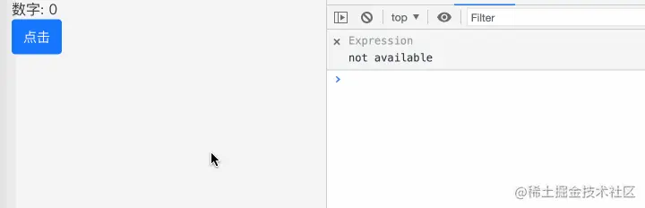


## 最后
[react 官方文档](https://reactjs.org/docs/react-api.html)

[「React 进阶」 React 全部 Hooks 使用大全 （包含 React v18 版本 ）](https://juejin.cn/post/7118937685653192735)

其他react 好文
- [搞懂这12个Hooks，保证让你玩转React](https://juejin.cn/editor/drafts/7101481981212524552)
- [作为一名React，我是这样理解HOC的！](https://juejin.cn/post/7103345085089054727)
- [「React深入」一文吃透虚拟DOM和diff算法](https://juejin.cn/post/7116326409961734152)
- [花三个小时，完全掌握分片渲染和虚拟列表～](https://juejin.cn/post/7121551701731409934/)

## 资料
[原文](https://juejin.cn/post/7124486630483689485#heading-0)

[你真的了解浅比较么？PureComponent 和 shouldeComponentUpdate 解析](https://juejin.cn/post/6844904137344155661)