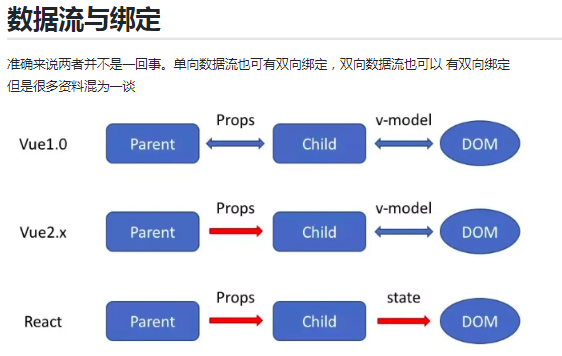
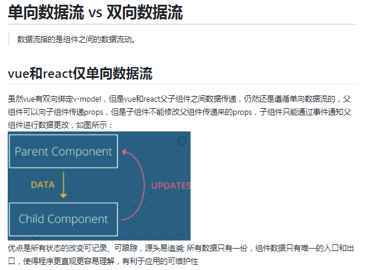
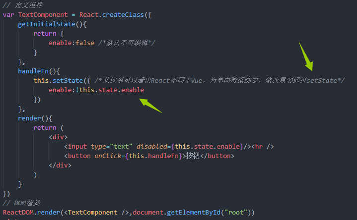

## 总结

React遵循从上到下的数据流向，即单向数据流

1. 单项数据流并非'单向绑定'，甚至单向数据流与绑定没有任何关系。对于React来说，单向数据流(从上到下)与单一数据源这两个原则，限定了React中要像在一个组建中更新另一个组件的状态(类似Vue的平行组件传参，或者子组件向父组件传参)，需要进行状态提升。即将状态提升到他们最近的祖先组件中。子组件change了状态，触发父组件状态的变更，父组件状态的变更，影响到了另一个组件的显示(因为传递给另一个组件的状态变化了，这一点与Vue子组件的$emit()方法很相似)
2. **Vue也是单向数据流，只不过能实现双向绑定**
3. 单向数据流中的单向--数据从父组件到子组件的这个流向叫单向。
4. 绑定的打双向：View层与Module层之间的映射关系

