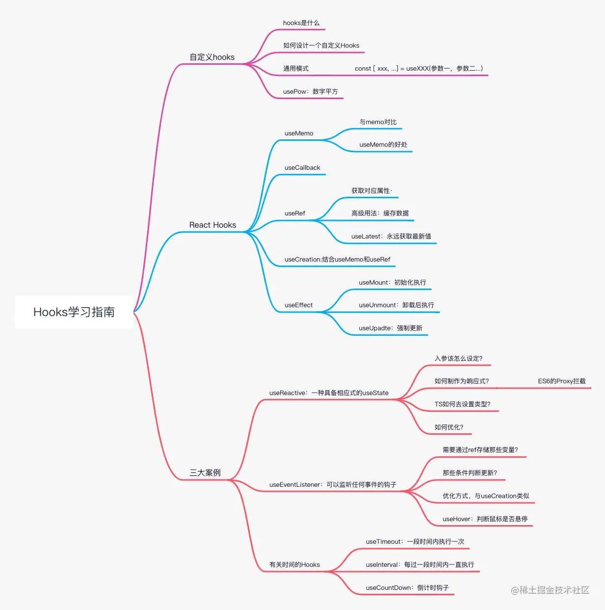
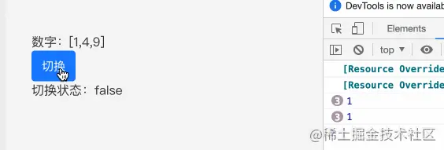
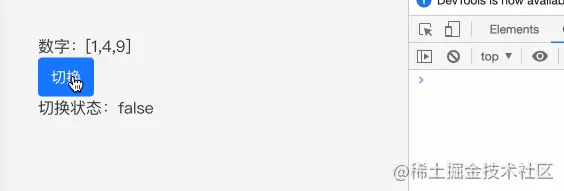
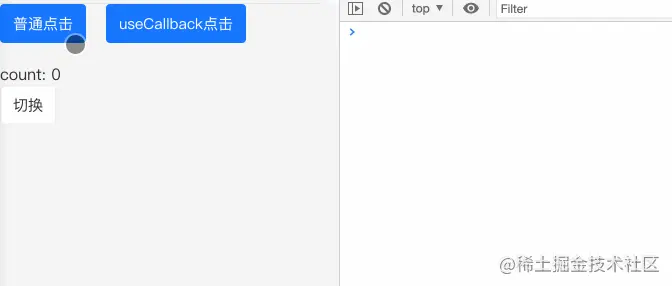

我们知道React Hooks有useState设置变量，useEffect副作用，useRef来获取元素的所有属性，还有useMemo、useCallback来做性能优化，当然还有一个自定义Hooks，来创造出你所想要的Hooks

接下来我们开看看几个问题，问问自己，是否全部知道
- Hooks的由来是什么？
- useRef的高级用法是什么
- useMemo 和useCallback 是怎么做优化的
- 一个好的自定义Hooks该如何设计
- 如果做一个不需要useState就可以直接修改属性并刷新树图的自定义hooks?
- 如果做一个可以监听任何事件自定义hooks

本文将会以介绍自定义Hooks来解答上述问题，并结合 TS，ahooks中的钩子，以案列的形式去演示，本文过长，建议：点赞 + 收藏 哦～
注：这里讲解的自定义钩子可能会和 ahooks上的略有不同，不会考虑过多的情况，如果用于项目，建议直接使用ahooks上的钩子～

如果有小伙伴不懂TS，可以看看我的这篇文章：[一篇让你完全够用TS的指南](https://juejin.cn/post/7088304364078497800)



## 自定义Hooks是什么？
<span style="color: red">?react-hooks是React16.8以后新增的钩子API，目的是增加代码的可复用性、逻辑性，**最重要的是解决了函数式组件无状态的问题**，这样即保留了函数式的简单，又解决了没有数据管理状态的缺陷</span>

那么什么是自定义Hooks呢？

自定义hooks是在react-hooks基础上的一个扩张，可以根据业务、需求去制定相应的hooks，将常用的逻辑进行封装，从而具备复用性

### 如何设计一个自定义Hooks
hooks本质上是一个函数，而这个函数主要就是**逻辑复用**，我们首先要知道一件事，hooks的驱动条件是什么？

其实就是props的修改，useState、useReducer的使用是无状态组件更新的条件，从而驱动自定义hooks。

### 通用模式
自定义hooks的名称是以use开头，我们设计为

:::tip
const [xxx, ...] = useXXX(参数一， 参数二...)
:::
### 简单的例子：usePow
我们先写一个简单的小李子来了解下 自定义hooks
```js
// usePow.ts
const Index = (list: number[]) => {
    return list.map(item: number => {
        console.log(1);
        return Math.pow(item, 2);
    })
}

export default Index;

// Index.tsx;
import { Button } from 'antd-mobile';
import React, { useState } from 'react';
import { usePow } from '@/components';

const Index: React.FC<any> = (props) => {
    const [flag, setFlag] = useState<boolean>(true);
    const data  = usePow([1,2,3]);

    return (
        <div>
            <div>数字: {JSON.stringify(data)}</div>
            <Button color="primary" onClick = {() => setFlag(v => !v)}>切换</Button>
            <div> 切换状态</div>
        </div>
    )
}
export default Index;
```
我们简单的写了个usePow,我们通过usePow给所传入的数字平方，用切换状态的按钮表示函数内部的状态，我们来看看次数的效果：



<span style="color: red">我们发现了一个问题，为什么点击切换按钮也会触发console.log(1)呢？</span>

这样明显增加了性能开销，我们的理想状态肯定不希望做无关的渲染，所以我们做自定义hooks的时候一定要注意，需要**减少性能开销**，我们为组件加入useMemo试试
```js
import { usememo } from 'react';

const Index = (list: number[]) => {
    return useMemo(() => list.map(item: number => {
        console.log(1);
        return Math.pow(item, 2);
    }), [])
}
```


发现此时就已经解决了这个问题，所以要非常注意一点，一个好用的自定义hooks，一定要配合useMemo、useCallback等API一起使用

## 玩转React Hooks
在上述中我们讲了用useMemo来处理无关的渲染，接下来我们一起来看看React Hooks的这些钩子的妙用(这里建议先熟知、并使用对应的React Hooks，才能造出好的钩子)

### useMemo
当一个父组件中调用了一个子组件的时候，父组件的state发生变化，会导致父组件更新，而子组件虽然没有发生变化，但也会进行更新。

**简单的理解下，当一个页面内容非常复杂，模块非常多的时候，函数式组件会从头更新到尾，只要一处改变，所有的模块都会进行更新，这种情况是没有必要的**

我们理想的状态是哥哥模块只进行自己的更新，不要想去去影响，那么此时用useMemo是最佳的解决方案。

这里要尤其注意一点，<span style="color: red">只要父组件的状态更新，无论有没有对子组件进行操作，子组件都会进行更新，useMemo就是为了防止这点出现的</span>

在讲useMemo之前，我们先说说memo,memo的作用是<span style="color: blue">结合了pureComponent纯函数和componentShouldUpdate功能</span>，会对传入的props进行一次对比，然后根据第二个函数返回值进一步判断哪些Props需要更新(具体使用会在下文讲到)

useMemo与memo的理念上差不多，都是判断是否满足当前的限制条件来决定是否执行callback函数，而useMemo的第二个参数是一个数组，通过这个数组来判定是否更新回调函数

这种方式可以运用在『元素、组件、上下文中』,尤其是利用在数组中，先看一个例子
```js
useMemo(() => {
    <div>
        {
            list.map((item, index) => {
                <p key={index}>
                    {item.name}
                </p>
            })
        }
    </div>
}, [list])
```
从上面我们看出useMemo只有在list发生变化的时候才会进行渲染，从而减少不必要的开销

总结一下useMemo的好处
- 可以减少不必要的循环和不必要的渲染
- 可以减少子组件的渲染次数
- 可以特定的依赖进行更新，可以避免很多不必要的开销，但要注意，有时候在配合useState拿不到最新的值，这种情况可以考虑useRef解决

### useCallback
useCallback与useMemo极其类似，可以说是一模一样，**唯一不同的是useMemo返回的是函数运行的结果，而useCallback返回的是函数**

> 注意:这个函数是父组件传递子组件的一个函数，防止做无关的刷新，其次，这个组件必须配合memo，否则**不但不会提升性能，还有可能降低性能**

```js
import React, { useState, useCallback } from 'react';
import { Button } from 'antd-mobile';

const MockMemo: React.FC<any> = () => {
    const [count, setCount] = useState(0);
    const [show, setShow] = useState(true);

    const add = useCallback(() => {
        setCount(count + 1);
    }, [count]);

    return (
        <div>
            <div style={{display: 'flex', jusifyContent: 'flex-start'}}>
                <TestButton title="普通点击" onClick={() => setCount(count + 1)}/>
                <TestButton title="useCallback点击" onClick={add} />
            </div>
            <div style={{marginTop: 20}}>count: {count}</div>
            <Button onClick={() => {setShow(!show)}}> 切换</Button>
        </div>
    )
}
const TestButton = React.memo((Props: any) => {
    console.log(props.title);
    return <Button color="primary" onClick={props.onClick} style={props.title === 'useCallback点击' ? {
        marginLeft: 20,
    } : undefined }>{props.title}</Button>
})
```


可以看到，当点击切换按钮的时候，没有经过useCallback封装的函数会再次刷新，而经过useCallback包裹的函数不会被再次刷新。

### useRef
useRef可以获取当前元素的所有属性，并且返回一个可变的ref对象，并且这个对象只有current属性，可设置initialValue

#### 通过useRef获取对应的属性值
```js
import React, { useState, useRef } from 'react';

const Index:React.FC<any> = () => {
    const scrollRef = useRef<any>(null);
    const [clientHeight, setClientHeight] = useState<number>(0);
    const [scrollTop, setScrollTop] = useState<number>(0);
    const [scrollHeight, setScrollHeight] = useState<number>(0);

    const onScroll = () => {
        if(scrollRef?.current) {
            let clientHeight = scrollRef?.current.clientHeight; // 可视区域高度
            let scrollTop = scrollRef?.current.scrollTop; // 滚动条高度
            let scrollHeight = scrollRef?.current.scrollHeight; // 滚动内容高度
            setClientHeight(clientHeight);
            setScrollTop(scrollTop);
            setScrollHeight(scrollHeight);
        }
    }

    return (
        <div>
            <div>
                <p>可视区域高度：{clientHeight}</p>
                <p>滚动条滚动高度：{scrollTop}</p>
                <p>滚动内容高度:{scrollHeight}</p>
            </div>
            <div style={{height: 200, overflowY: 'auto'}} ref={scrollRef} onScroll={onScroll}>
                <div style={{height: 20000}}></div>
            </div>
        </div>
    )
}
export default Index;
```
从上述可知，我们可以通过useRef来获取对应元素的相关属性，从此来做一些操作


### 缓存数据
除了获取对应的属性外，useRef还有一点比较重要的特性，那就是缓存数据

上述讲到我们封装一个合格的自定义hooks的时候需要结合 useMemo、useCallback等Api,但我们控制变量的值用useState有可能会导致拿到的是旧值，并且如果他们更新会带来整个组件重新执行，这种情况下，我们使用useRef是非常不错的选择。

在react-redux的源码中，在hooks推出后，react-redux用大量的useMemo重做了Provide等核心模块，其中就是运用useRef来缓存数据，并且所运用的userRef（）没有一个是绑定在dom上的，都是做数据缓存作用

简单来看一下
```js
// 缓存数据
/* react-redux 用userRef 来缓存 merge之后的 props */ 
const lastChildProps = useRef() 

// lastWrapperProps 用 useRef 来存放组件真正的 props信息 
const lastWrapperProps = useRef(wrapperProps) 

//是否储存props是否处于正在更新状态 
const renderIsScheduled = useRef(false)

//更新数据
function captureWrapperProps( 
    lastWrapperProps, 
    lastChildProps, 
    renderIsScheduled, 
    wrapperProps, 
    actualChildProps, 
    childPropsFromStoreUpdate, 
    notifyNestedSubs 
) { 
    lastWrapperProps.current = wrapperProps 
    lastChildProps.current = actualChildProps 
    renderIsScheduled.current = false 
}
```
我们看到react-redux用重新赋值的方法，改变了缓存的数据源，减少了不必要的更新，如果采用useState势必会重新渲染

### useLatest
经过上面的讲解我们知道useRef可以拿到最新值，我们可以进行简单的封装，这样做的好处是：**可以随时确保获取的是最新值，并且也可以解决闭包问题**

```js
import {useRef} from 'react';

const useLatest = <T>(value: T) => {
    const ref = useRef(value);
    ref.current = value;
    return ref;
}
export default useLatest;
```
## 结合useMemo和useRef封装useCreation
useCreation:是useMemo或useRef的替代品。换言之，useCreation这个钩子增强了useMemo 和 useRef，这个钩子替换这两个钩子([useCreation](https://ahooks.js.org/zh-CN/hooks/use-creation))

- useMemo的值不一定是最新的值，但useCreation可以保证拿到的值一定是最新的值
- 对于复杂常量的创建，useRef容易出现潜在的性能隐患，但useCreation可以避免

<span style="color: red">这里的性能隐患是指</span>

```js
// 每次重渲染，都会执行实例化Subject的过程，即便这个示例立刻就被扔掉了
const a = useRef(new Subject());

// 通过factory函数 可以避免性能隐患
const b = useCreation(() => new Subject(), [])
```
接下来我们来看看如何封装一个useCreation，首先我们要明白一下三点：

- <span style="color:blue">第一点：先确定参数，useCreation的参数与useMemo的一致，第一个参数是函数，第二个参数是可变的数组</span>
- <span style="color:blue">第二点: 我们的值要保存在useRef中，这个可以将值缓存，从而减少无关的刷新</span>
- <span style="color:blue">第三点: 更新值的判断，怎么通过第二个参数判断是否更新 useRef里的值</span>

明白以上三点我们可以自己实现一个useCreation
```ts
import { useRef } from 'react';
import type { DependencyList } from 'react';

const depsAreSame = (oldDeps: DependencyList, deps: DependencyList): boolean => {
    if(oldDeps === deps) return true;

    for(let i = 0; i < oldDeps.length; i++) {
        // 判断两个值是否是同一个值
        if(!Object.is(oldDeps[i], deps[i)) return false;
    }
    return true;
}

const useCreation = <T>(fn: () => T, deps: DependencyList) => {
    const { current } = useRef({
        deps, 
        obj: undefined as undefined | T,
        initialized: false
    })
    if(current.initialized === false || !depsAreSame(current.deps, deps)) {
        current.deps = deps;
        current.obj = fn();
        current.initialized = true;
    }
    return current.obj as T;
}
export default useCreation;
```
在useRef判断是否更新通过initialized 和 depsAreSame 来判断，其中 depsAreSame 通过存储在useRef 下的 deps(旧值)和新传入的 deps(新值)来做对比，判断两数组的数组是否一致，来确定是否更新

### 验证 useCreation


## 资料
[原文](https://juejin.cn/post/7101486767336849421)