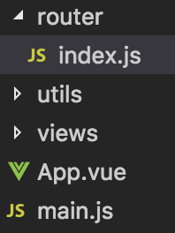
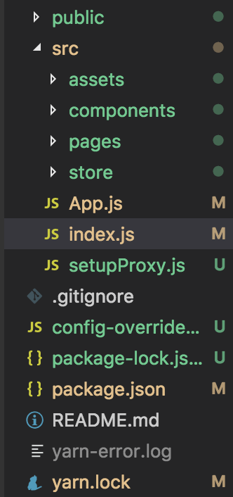

## 包容性路由与排他性路由
1. 包容性路由。多个&lt;Route&gt;可以同事匹配和渲染，例如:如果路由有/food和/food/1 那么在匹配的时候两个都能匹配到。而react-router v4以后的版本就是包容性路由为基础。例如:如果路由有/food和food/1那么匹配/food的时候两个都能匹配到
2. 排他性路由。属于自上而下的匹配方式，只能匹配成功一个，就不会继续向下匹配。vue的路由实现就属于排他性路由。

## vue-router与react-router的基本用法
vue-router与react-router在使用方式上有较大的差异，但是其实提供的功能是大同小异的，下面我们来详细的对比下看看
1. 引入方式
    - vue必须要通过Vue.use()明确的安装路由功能;也可以将Vue.use()和vue-router的引入都放在独立的模块中，(比如：router/index.js中，再在main.js中引入router/index.js)
    - react只需要在index.js中直接进行部分配置即可使用
2. router的基础组件
    - vue-router的常用组件主要是keep-alive、router-link和router-view
        - router-link定义点击后导航到哪个路径下;对应的组件内容渲染到router-view中
        - 被keep-alive包裹住的组件，会被vue进行缓存。当组件在keep-alive内被切换时组件的activated、deactivated这两个声明周期钩子函数会被执行，不会再执行挂载和销毁组件的生命周期函数。同时也可以使用keep-alive组件身上的include和excludes两个属性来区分哪些组件需要被缓存，哪些不需要
    - react-router的常见组件主要是&lt;switch/&gt;、&lt;Route/&gt;和&lt;CacheRoute/&gt;
        - switch组件用来将react的包容性路由转换为排他性路由，每次只能匹配成功就不会向下匹配
        - Route组件定义了URL路径与组件的对应关系
        - CacheRoute组件的作用与Route大致相同，使用CacheRoute的组件将会得到一个名为cacheLifecycles的属性，里面包含两个额外生命周期的注入函数didCache和didRecover，分别用在组件被缓存和被恢复时触发。类比于vue-router中keep-alive实现的效果
3. 路由的配置
- vue-router路由的属性配置
    - path:匹配组件的路由
    - component:匹配到以后要渲染的组件
    - name:路由名称
    - children:该路由下的子路由
    - meta: 可以利用meta属性在路由下挂载一些自定义的信息，比如对路由的权限配置
    - redirect和alias:alias相当于是给路由添加了一个别名，页面上的路由会展示为path，但是同时也可以使用alias设置的别名来访问;redirect则会将页面从path的路径重定向到redirect设置的路径
    - 另外，vue-router可以设置动态路由例如下面这种方式，可以在组件内通过this.$route.params.id获取url中的内容
    ```js
    { path: '/two/:id', components: Two }
    ```
    - vue-router的大概目录

    

- react-router的路由配置

    不同于vue-router的使用对象来配置路由，react-router配置路由的方式可以使用Object,也可以使用jsx进行路由配置
    - path、component的用于与vue-router的相同
    - exact: Boolean标记着是否是开启排他性路由
    - from和to：对应着vue-router的path和redirect两个属性，可以将路由从from重定向到to匹配的组件
    - Link和NavLink：两者都是用来做类似于route-link的跳转，但是不同的是NavLink可以为当前选中的路由设置类名、样式以及回调函数等
    - react-router的动态路由用法和vue-router的用法一直
    - react-router的大概目录

    

    不需要像vue那样麻烦的用到一个单独的文件夹，react只需要在index.js中部分配置即可

4. 路由模式
- vue-router主要分为hash和history两种模式
    - hash--即地址栏URL中的#符号。比如这个URL：http://www.abc.com/#/hello  hash的值为#/hello。它的特点在于:hash虽然出现在URL中，但不会被包括在HTTP请求中，对后端完全没有影响，因此改变hash不会影响加载页面
    - history-- 利用了HTML5 History Interface 中新增的pushState() 和replaceState()方法。(需要特定浏览器支持)这两个方法应用于浏览器的历史记录栈，在当前已有的back、forward、go的基础之上，它们提供了对历史记录进行修改的功能。之上当它们执行修改时，虽然改变了当前的URL,但是浏览器不会立即向后端发送请求
    - 因此可以说,hash模式和history模式都是属于浏览器自身的特性，Vue-Router之上利用了这两个特性(通过调用浏览器提供的接口)来实现前端路由
- <span style="color: red">react-router是建立在history之上的，常用的history有browserHistory、hashHistory和createMemoryHistory三种模式</span>
    - browserHistory-- Browser history是使用React Router的应用推荐的history。它使用浏览器中的History API用于处理URL，创建一个像example.com/some/path这样真实的URL。服务器需要做好处理URL的准备。处理应用启动最初的/这样的请求应该没问题，但当用户来回跳转并在/accounts/123刷新时，服务器就会收到来自/acccounts/123的请求，这时你需要处理这个URL并在响应中包含Javascript应用代码
    - hashHistory-- 使用URL中的hash(#)部分去创建形如example.com/#/accounts/123的路由
    - createMemoryHistory-- Memory history不会在地址栏被操作或读取。这就解释了我们是如何实现服务器渲染的。同时它也非常适合测试和其他渲染环境（像React Native）
    > 和另外两种history的一点不同是你必须创建它，这样方式便于测试

5. react路由有两个重要的属性：children和render，这两个有什么区别呢
    - Route可以写行间render，render={() => {return}}
    - 也可以写行间children = {() => {return}}
    - 不管匹配与否children都执行
    - render优先级比children高
6. 通过路由传递参数
    - react的路由参数传递
        - 通配符参数(刷新页面数据不丢失)
        ```js
        // 定义路由的时候
        <Route path="/path/:自己起个名字" component="{Path}">
        // 在路由点击跳转的时候
        <Link to="/path/你要传的参数">通配符</Link>
        // 另一个页面接受传来的参数
        this.props.match.params.你起的名字
        ```
        - query传参(刷新页面数据丢失)
        ```js
        // 路由定义
        <Route path="/query" component={Query}>
        // 跳转的时候
        var jquery = {
            pathname: '/query',
            query:'我是通过jquery传值'
        }
        <Link to={query}>query</Link>

        // 另一个页面使用的时候
        this.props.location.query

        // 这里的this.props.location.query === '我是通过query传值'
        ```
        - state参数(刷新页面数据丢失，同query差不多，只是属性不一样，而且state传的参数是加密的，quyer传的参数是公开的)
        ```js
        // Route定义
        <Link to={state}>state</Link>

        // 使用的时候
        var state = {
            patchname: '/state',
            state: '我是通过state传值'
        }
        <Route path="/state" component={State} />

        // 另一个页面获取值的时候
        this.props.location.state
        // 这里的this.props.location.state === '我是通过query传值'
        ```
        - 直接通过url拼接传参
        ```js
        // 跳转方式this.props.history.push(`/child02?${a=1}`) // 获取参数
        this.props.location.search // "?a=1"
        ```
    - vue的路由参数传递
        - 通配符传参
        ```js
        //在定义路由的时候

        {
        path: '/describe/:id',
        name: 'Describe',
        component: Describe
        }

        //在使用的时候

        this.$router.push({ path: `/describe/${id}` })

        //接收页面获取值

        this.$route.params.id
        ```
        - params传参，跳转的时候不会显示在url上
        ```js
        //在使用的时候

        this.$router.push({ name: 'Describe', params{id: id} })

        //接收页面获取值

        this.$route.params.id
        ```
        - query传参，传餐的时候在url显示?key=value&key=value
        ```js
        //在使用的时候

        this.$router.push({ path: '/describe', query: { id: id } })

        //接收页面获取值
        this.$route.query.id
        ```
## 路由守卫


## 资料
[vue-router与react-router全面对比](https://www.cnblogs.com/marui01/p/13215468.html)