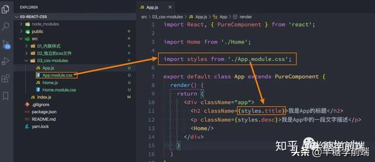
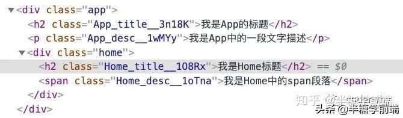
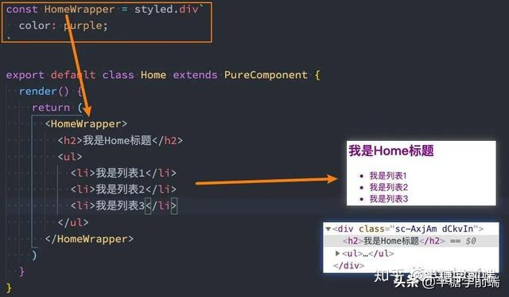

> 整个前端已经是组件化的天下，而CSS设计就不是为了组件化而生的，所以在目前组件化的框架中都需要一种合适的CSS解决方案

## React中的css方案

### 1.1react中的css
事实上，css一直是React的痛点，也被很多开发者吐槽、诟病的一个点

在组件化中选择合适的css解决方案应该符合一下条件

- 可以编写局部css: css具备自己的作用域，不会随意污染其他组件内的原生
- 可以编写动态的css: 可以获取当前组件的一些状态，根据状态的变化生成不同的css样式
- 支持所有css特性：伪类、动画、媒体查询等
- 编写起来简介方便、最好符合一贯的css风格特点
- 等等...

在这一点上，Vue做的要远好于React
- Vue通过在.vue文件中编写&lt;style&gt;&lt;/style&gt;标签来编写自己的样式;
- 通过是否添加scope属性来决定编写的样式是全局有效还是局部有效
- 通过lang属性来设置你喜欢的less、sass等预处理器
- 通过内联样式风格的方式来根据最新状态设置和改变css
- 等等...

Vue在CSS上虽然不能称之为完美，但是已经足够简洁、自然、方便了，至少统一的样式风格不会出现多个开发人员、多个项目采用不一样的样式风格。

相比而言，React官方并没有给出在React中统一的样式风格：

- 由此，从普通的css，到css modules，在到css in js，有几十种不同的解决方案，上百个不同的库；
- 大家一直在寻找最好的或者说最适合自己的CSS方案，但是到目前为止也没有统一的方案

在这篇文章中，我会介绍挑选四种解决方案来介绍

- <span style="color: blue">方案一: 内联样式的写法</span>
- <span style="color: blue">方案二: 普通的css写法 </span>
- <span style="color: blue">方案三: css module</span>
- <span style="color: blue">方案四: css in js</span>

### 1.2普通的解决方案
- 内联样式

    内联样式是官方推荐的一种css样式写法
    - style接受一个采用小驼峰命名属性的Javascript对象，而不是CSS字符串
    - 并且可以引用state中的状态来设置相关的样式
    ```js
    export default class App extends PureComponent {
        constructor(props) {
            super(props);

            this.state = {
                titleColor: 'red'
            }
        }
        render() {
            return (
                <div>
                    <h2 style={{color: this.state.titleColor, fontSize: '20px'}}>我是App标题</h2>
                    <p style={{color: 'green', textDecoration: 'underline'}}>这是一段文字描述</p>
                </div>
            )
        }
    }
    ```
    内联样式的优点
    1. 内联样式，样式之间不会有冲突
    2. 可以动态获取当前state中的状态
    内联样式的缺点：
    1. 写法上都需要使用驼峰标识
    2. 某些样式没有提示
    3. 大量的样式，代码混乱
    4. 某些样式无法编写(比如伪类、微元素)
    所以官方依然是希望内联合适和普通的css来结合编写
- 普通的css

    普通的css我们通常会编写到一个单独的文件。

    App.js中编写React逻辑代码：
    ```js
    import React, { PureComponent } from 'react';
    import Home from './Home';
    import './App.css';

    export default class App extends PureComponent {
        render() {
            return (
                <div className="app">
                    <h2 className="title">我是App的标题</h2>
                    <p className="desc">我是App中的一段文字描述</p>
                    <Home/>
                </div>
            )
        }
    }
    ```
    App.css中编写React样式代码
    ```css
    .title {
        color: red;
        font-size: 20px;
    }
    .desc {
        color: green;
        text-decoration: underline;
    }
    ```
    这样的编写方式和普通的网页开发中编写方式是一致的：

    - 如果我们按照普通的网页标准去编写，那么也不会有太大的问题；
    - 但是组件化开发中我们总是希望组件是一个独立的模块，即便是样式也只是在自己内部生效，不会相互影响；
    - 但是普通的css都属于全局的css，样式之间会相互影响；

    比如编写Home.js的逻辑代码：
    ```js
    import React, { PureComponent } from 'react';
    import './Home.css';

    export default class Home extends PureComponent {
        render() {
            return (
            <div className="home">
                <h2 className="title">我是Home标题</h2>
                <span className="desc">我是Home中的span段落</span>
            </div>
            )
        }
    }
    ```
    又编写了Home.css的样式代码
    ```css
    .title {
        color: orange
    }
    .desc {
        color: purple
    }
    ```
    最终样式之间会相互层叠，只有一个样式会生效
- css module

    css modules并不是React特有的解决方案，而是所有使用了类似于webpack配置的环境下都可以使用的。

    但是如果在其他项目中使用，那么我们需要自己来进行配置，比如配置webpack.config.js中的modules:true等

    但是React的脚手架已经内置了css modules的配置
    - .css/.less/.scss等样式文件都修改成.module.css/.module.less/.module.scss等
    - 之后就可以引用并且使用了
    使用方式如下

    

    css modules用法
    这种css使用方式最终生成的class名称会全局唯一
    

    css modules确实解决了局部作用域的问题，也是很多人喜欢在React中使用的一种方案。

    但是这种方案也有自己的缺陷：

    - <span style="color: red">引用的类名，不能使用连接符(.home-title)，在JavaScript中是不识别的；</span>
    - <span style="color: red">所有的className都必须使用{style.className} 的形式来编写；</span>
    - <span style="color: red">不方便动态来修改某些样式，依然需要使用内联样式的方式；</span>

    如果你觉得上面的缺陷还算OK，那么你在开发中完全可以选择使用css modules来编写，并且也是在React中很受欢迎的一种方式。

## css in JS
### 认识CSS in JS
实际上，官方文档也有提到过CSS in JS这种方案
- CSS in JS是指一种模式，其中CSS由JavaScript生成而不是在外部文件中定义
- 注意此功能并不是React的一部分，而是由第三方库提供。React对样式如何定义并没有明确态度

在传统的前端开发中，我们通常会将结构（HTML）、样式（CSS）、逻辑（JavaScript）进行分离。
- 但是在前面的学习中，我们就提到过，React的思想中认为逻辑本身和UI是无法分离的，所以才会有了JSX的语法。
- 样式呢？样式也是属于UI的一部分；
- 事实上CSS-in-JS的模式就是一种将样式（CSS）也写入到JavaScript中的方式，并且可以方便的使用JavaScript的状态；
- 所以React有被人称之为 All in JS；
当然，这种开发方式也收到很多批评

批评声音虽然有，但是在我们看来很多优秀的CSS-in-JS的库依然非常强大、方便
- CSS-in-JS通过JavaScript来为CSS赋予一些能力，包括类似于CSS预处理器一样的样式嵌套、函数定义、逻辑复用、动态修改状态等等；
- 依然CSS预处理器也具备某些能力，但是获取动态状态依然是一个不好处理的点；
- 所以，目前可以说CSS-in-JS是React编写CSS最为受欢迎的一种解决方案；

目前比较流程的CSS-in-JS库有哪些
- <span style="color: blue">styled-components</span>
- <span style="color: blue">emotion</span>
- <span style="color: blue">glamorous</span>
目前可以说styled-components依然是社区最流行的CSS-in-JS库，所以我们以styled-components的讲解为主；

安装styled-components：
```js
yarn add styled-components
```
### 2.2 styled-components
- 标签模板字符串

    ES6中增加了模板字符串的语法，这个对于很多人来说都会使用。

    但是模板字符串还有另外一种用法: 标签模板字符串(Tagged Template Literals).

    我们一起来看一个普通的Javascript的函数
    ```js
    function foo(...args) {
        console.log(args);
    }
    foo('Hello World')
    ```
    正常情况下，我们都是通过 函数名() 方式来进行调用，其实函数还有另外一种调用方式
    ```js
    foo`Hello world`
    ```
    如果我们在调用的时候插入其他的变量
    - 模板字符串被拆分了;
    - 第一个元素是数组，是被模板字符串拆分的字符串组合
    - 后面的元素是一个个模板字符串传入的内容
    ```js
    foo`Hello ${name}`; // ['hello', '']
    ```
    在styled component中，就是通过这种方式来解析模块字符串，最终生成我们想要的样式的

- styled基本使用

    styled-components的本质是通过函数的调用，最终创建出一个组件：
    - 这个组件会被自动添加上一个不重复的class;
    - styled-components会给该class添加相关样式
    比如我们正常开发出来的Home组件是这样的格式
    ```html
    <div>
        <h2>我是Home标题</h2>
        <ul>
            <li>我是列表1</li>
            <li>我是列表2</li>
            <li>我是列表3</li>
        </ul>
    </div>
    ```
    我们希望给外层的div添加一个特殊的class，并且添加相关的样式
    

    styled-components基本使用

    另外，它支持类似于CSS预处理器一样的样式嵌套:
    - 支持直接子代选择器或后代选择器，并且直接编写样式
    - 可以通过&符号获取当前元素
    - 直接伪类选择器、伪元素等
    ```js
    const HomeWrapper = styled.div`
        color: purple;

        h2 {
            font-size: 50px;
        }
        ul > li {
            color: orange:

            &.active {
                color: red;
            }
            &:hover {
                background: #aaa;
            }
            $::after {
                content: 'abc'
            }
        }
    `
    ```
    

- props、attrs属性

    - props可以穿透

        定义一个styled组件
        ```js
        const HYInput = styled.input`
            border-color: red;
            &:focus {
                outline-color: orange
            }
        `
        ```
        使用styled的组件
        ```js
        <HYInput TYPE="password" />
        ```
    - props可以被传递给styled组件
        ```js
        <HomeWrapper color="blue">
        </HomeWrapper>
        ```
        使用时可以获取到传入的color：
        - 获取props需要通过${}传入一个插值函数，props会作为该函数的参数；
        - 这种方式可以有效的解决动态样式的问题；
        ```js
        const HomeWrapper = styled.div`
            color: ${props => props.color};
        `
        ```
    - 添加attrs属性
        ```js
        const HYInput = styled.input.attrs({
            placeholder: "请填写密码",
            paddingLeft: props => props.left || "5px"
        })`
            border-color: red;
            padding-left: ${props => props.paddingLeft};

            &:focus {
                outline-color: orange;
            }
        `
        ```
- styled高级特性

    - 支持样式的继承

        编写styled组件
        ```js
        const HYButton = styled.button`
        padding: 8px 30px;
        border-radius: 5px;
        `

        const HYWarnButton = styled(HYButton)`
        background-color: red;
        color: #fff;
        `

        const HYPrimaryButton = styled(HYButton)`
        background-color: green;
        color: #fff;
        `
        ```
        按钮的使用
        ```js
        <HYButton>我是普通按钮</HYButton>
        <HYWarnButton>我是警告按钮</HYWarnButton>
        <HYPrimaryButton>我是主要按钮</HYPrimaryButton>
        ```
    - styled设置主体

        在全局定制自己的主题，通过Provider进行共享：
        ```js
        import { ThemeProvider } from 'styled-components';

        <ThemeProvider theme={{color: "red", fontSize: "30px"}}>
        <Home />
        <Profile />
        </ThemeProvider>
        ```
        在styled组件中可以获取到主题的内容：
        ```js
        const ProfileWrapper = styled.div`
        color: ${props => props.theme.color};
        font-size: ${props => props.theme.fontSize};
        `
        ```
- classnames

    - vue中添加class

        在vue中给一个元素添加动态的class是非常简单的事情，你可以通过传入一个对象
        ```html
        <div class="static" v-bind:class="{active: isActive, 'text-danger: hasError'}"></div>
        ```
        你也可以传入数组
        ```html
        <div v-bind:class="[activeClass, errorClass]"></div>
        ```
        甚至是对象和数组混合使用
        ```js
        <div v-bind:class="[{ active: isActive, errorClass}]"></div>
        ```
    - React添加class

        React在JSX给了我们开发者足够多的灵活性，你可以像编写JavaScript代码一样，通过一些逻辑来决定是否添加某些class：
        ```js
        import React, { PureComponent } from 'react'

        export default class App extends PureComponent {
            constructor(props) {
                super(props);

                this.state = {
                    isActive: true
                }
            }

            render() {
                const {isActive} = this.state; 

                return (
                    <div>
                        <h2 className={"title " + (isActive ? "active": "")}>我是标题</h2>
                        <h2 className={["title", (isActive ? "active": "")].join(" ")}>我是标题</h2>
                    </div>
                )
            }
        }
        ```
        这个时候我们可以借助于一个第三方的库：classnames

        - 很明显，这是一个用于动态添加classnames的一个库。

        我们来使用一下最常见的使用案例：
        ```js
        classNames('foo', 'bar'); // => 'foo bar'
        classNames('foo', { bar: true }); // => 'foo bar'
        classNames({ 'foo-bar': true }); // => 'foo-bar'
        classNames({ 'foo-bar': false }); // => ''
        classNames({ foo: true }, { bar: true }); // => 'foo bar'
        classNames({ foo: true, bar: true }); // => 'foo bar'

        // lots of arguments of various types
        classNames('foo', { bar: true, duck: false }, 'baz', { quux: true }); // => 'foo bar baz quux'

        // other falsy values are just ignored
        classNames(null, false, 'bar', undefined, 0, 1, { baz: null }, ''); // => 'bar 1'
        ```

## 资料
[React中的CSS](https://zhuanlan.zhihu.com/p/156806997)

[关于css隔离的几种方案带来的思考和展望](/front-end/Css/base-shadow.html#什么是css隔离)