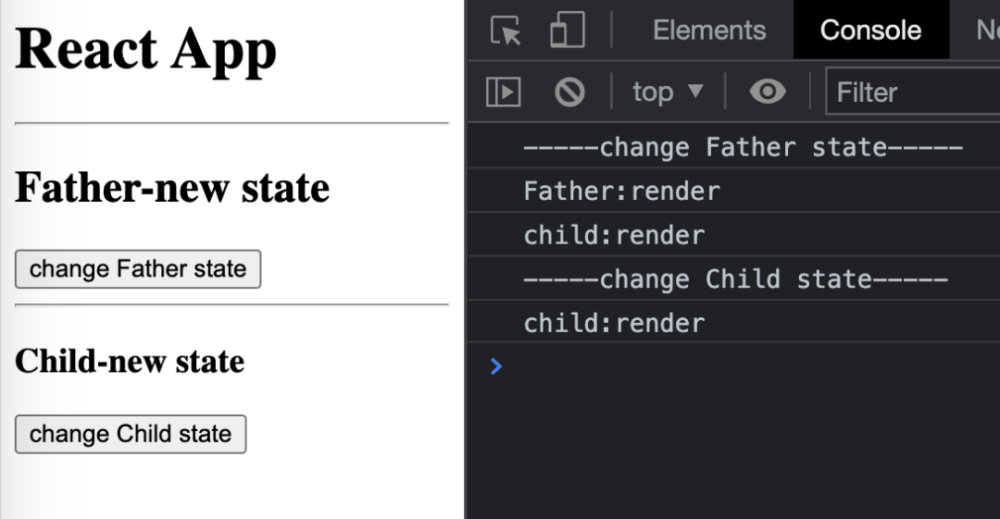
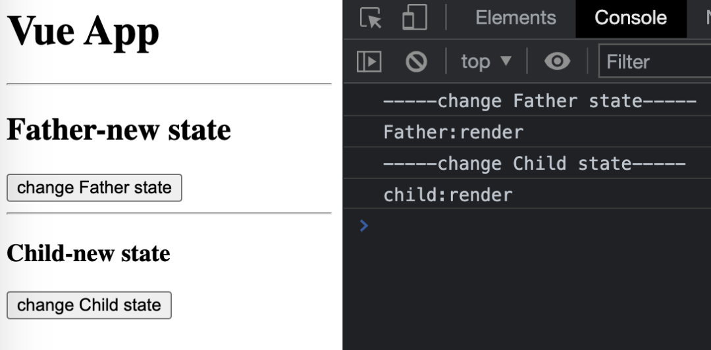
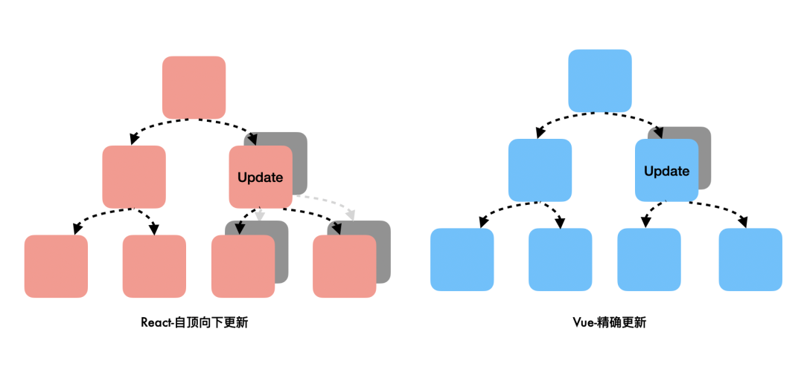
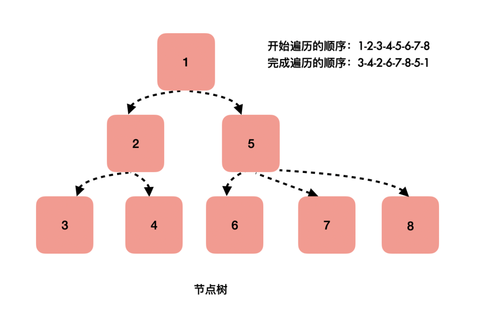
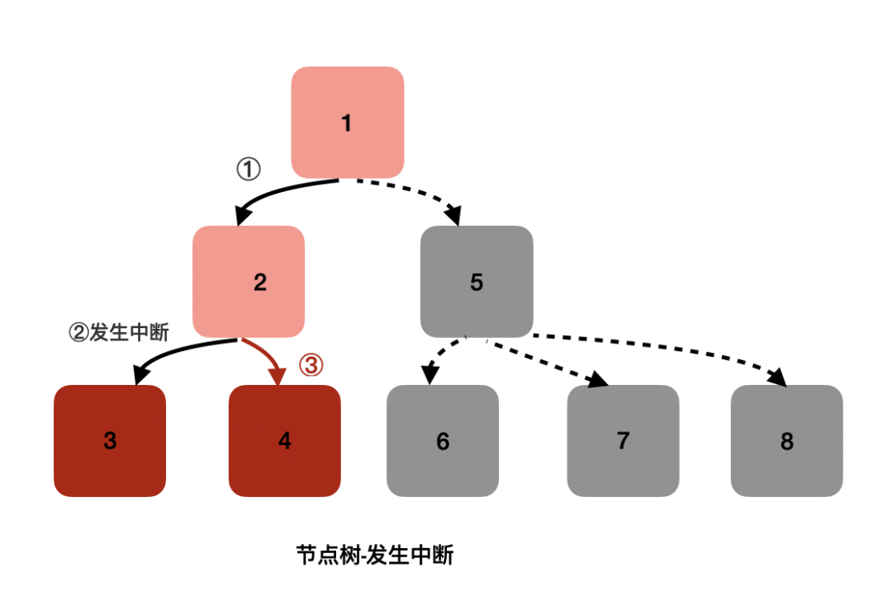
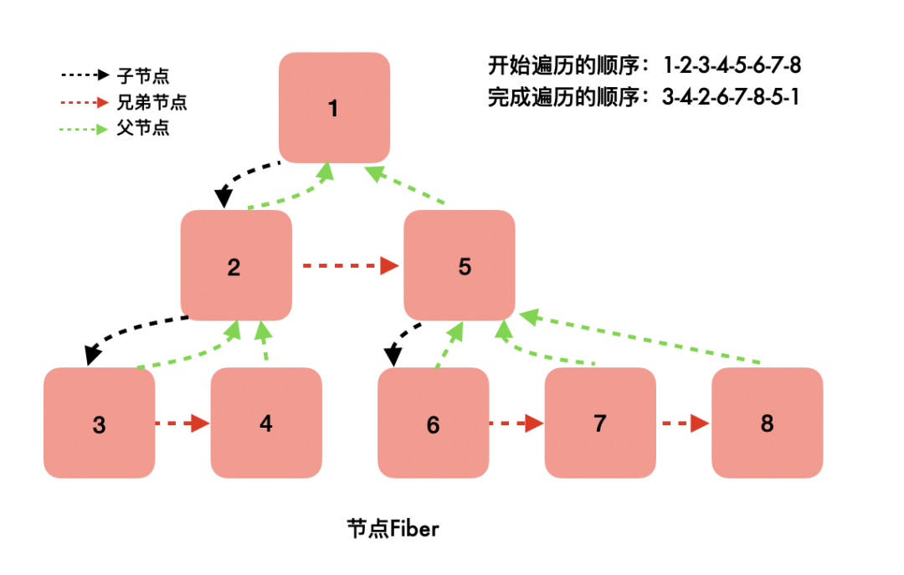
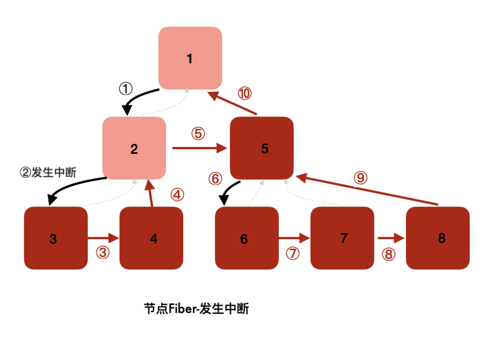

提到react fiber,大部分人都知道这是一个react新特性，看过一些网上的文章，大概能说出"纤程"一种新的数据结构"更新时调度机制"等关键词

但是如果被问：
1. <span style="color: red">有react fiber,为什么不需要vue fiber</span>
2. <span style="color: red">之前递归遍历虚拟dom树被打断就的从头开始，为什么有了react Fiber就能断点恢复呢</span>

本文将从两个框架的响应式设计为切入口讲清这两个问题，不涉及晦涩源码，不管有没有使用过react，阅读都不会有太大的阻力

## 什么是响应式
无论你常用的是react，还是vue，"响应式更新"这个词肯定都不陌生。

响应式，直观来说就是视图自动更新。如果一开始接触前端就直接上手框架，会觉得这是理所当然，但在"响应式框架"出世之前，实现这一切是很麻烦的

下面做一个时间显示器，用原生js、react、vue分别实现


### 原生js
想让屏幕上内容辩护，必须先找到dom(document.getElementById),然后在修改dom(clockDom.innerText).
```html
<div id="root">
    <div id="greet"></div>
    <div id="clock"></div>
</div>
<script>
    const clockDom = document.getElementById('clock');
    const greetDom = document.getElementById('greet');
    setInterval(() => {
        clockDom.innerText = `现在是:${Util.getTime()}`;
        greet.innerText = Util.getTime()
    }, 1000)
</script>
```
有了响应式框架，一切就很简单了

### react
对内容做修改，只需要调用setState去修改数据，之后页面便会重新渲染。
```html
<body>
    <div id="root"></div>
    <script type="text/babel">
        function Clock() {
            const [time, setTime] = React.useState();
            const [greet, setGreet] = React.useState();
            setInterval(() => {
                setTime(Util.getTime());
                setGreet(Util.getTime())
            }, 1000)
            return (
                <div>
                    <div>{greet}</div>
                    <div>现在是：{time}</div>
                </div>
            )
        }
        ReactDOM.render(<Clock />, document.getElementById('root'));
    </script>
</body>
```
### vue
我们一样不用关注dom，在修改数据时,直接this.state=xxx修改，页面就会展示最新的数据。

```html
<body>
    <div id="root">
        <div>{{greet}}</div>
        <div>现在是：{{time}}</div>
    </div>
    <script>
        const Clock = Vue.createApp({
            data(){
                return{
                    time:'',
                    greet:''
                }
            },
            mounted(){
                setInterval(() => {
                    this.time = Util.getTime();
                    this.greet = Util.getGreet();
                }, 1000);
            }
        })
        Clock.mount('#root')
    </script>
</body>
```
## react、vue的响应式原理
上文提到修改数据时，react需要调用setState方法，而vue直接修改变量就行。看起来只是两个框架的用法不同罢了，但是响应式原来正在于此。

从底层实现来看修改数据:<span style="color: red">**在React中，组件的状态是不能被修改的，setState没有修改原来那块内存中的变量，而是去新开辟一块内存；而vue则是直接修改保存状态的那块原始内存**</span>

所以经常能看到react相关的文章里经常会出现一个词"immutable"，翻译过来就是不可变的。

<span style="color: blue">数据修改了，接下来要解决视图的更新：**react中，调用setState方法后，会自顶向下重新渲染组件，自顶向下的含义是，该组件以及它的子组件全部需要渲染；而vue使用Object.defineProperty(vue@3迁移到Proxy)对数据的设置(setter)和获取(getter)做了劫持，也就是说，vue能准确知道视图模块中哪一块用到了这个数据，并且在这个数据修改时，告诉这个视图，你需要重新渲染了**</span>

<span style="color: red">**所以当一个数据改变，react的组件渲染是很消耗性能的--父组件的状态更新了，所有的子组件得跟着一起渲染，它不能像vue一样，精确到当前组件的粒度**</span>

为了佐证，我分别用react和vue写了一个demo，功能很简单：父组件嵌套子组件，点击父组件的按钮会修改父组件的状态，点击子组件的按钮会修改子组件的状态。

为了更好的对比，直观展示渲染阶段，没用使用更流行的react函数式组件，vue也用的是不常见的render方法：
```js
class Father extends React.Component {
    state = {
        fatherState: 'Father-original state'
    }
    changeState = () => {
        console.log('-----change Father state-----')
        this.setState({fatherState:'Father-new state'})
    }
    render(){
        console.log('Father:render')
        return ( 
            <div>
                <h2>{this.state.fatherState}</h2>
                <button onClick={this.changeState}>change Father state</button>
                <hr/>
                <Child/>
            </div>
        )
    }
}
class Child extends React.Component{
    state = {
            childState:'Child-original state'
    }
    changeState = () => {
        console.log('-----change Child state-----')
        this.setState({childState:'Child-new state'})
    }
    render(){
        console.log('child:render')
        return ( 
            <div>
                <h3>{this.state.childState}</h3>
                <button onClick={this.changeState}>change Child state</button>
            </div>
        )
    }
}
ReactDOM.render(<Father/>,document.getElementById('root'))
```


上面是使用react时的效果，修改父组件的状态，父子组件都会重新渲染：点击change Father state，不仅打印了Father:render，还打印了child:render。

```js
const Father = Vue.createApp({
    data() {
        return {
            fatherState:'Father-original state',
        }
    },
    methods:{
        changeState:function(){
            console.log('-----change Father state-----')
            this.fatherState = 'Father-new state'
        }
    },
    render(){
        console.log('Father:render')
        return Vue.h('div',{},[
            Vue.h('h2',this.fatherState),
            Vue.h('button',{onClick:this.changeState},'change Father state'),
            Vue.h('hr'),
            Vue.h(Vue.resolveComponent('child'))
        ])
    }
})
Father.component('child',{
    data() {
        return {
            childState:'Child-original state'
        }
    },
    methods:{
        changeState:function(){
            console.log('-----change Child state-----')
            this.childState = 'Child-new state'
        }
    },
    render(){
        console.log('child:render')
        return Vue.h('div',{},[
            Vue.h('h3',this.childState),
            Vue.h('button',{onClick:this.changeState},'change Child state'),
 
        ])
    }
})
Father.mount('#root')
```


上面使用vue时的效果，无论是修改哪个状态，组件都只重新渲染最小颗粒：点击change Father state，只打印Father:render，不会打印child:render。

### 不同响应式原理的影响
首先需要强调的是，上文提到的"渲染"、『render』、"更新"都不是指浏览器真正渲染出视图。而是框架在javascript层面,调用自身实现的render方法，生成一个普通的对象，这个对象保存了真实dom的属性，也就是常说的虚拟dom。本文会用组件渲染和页面渲染对两者区分

每次的视图更新流程是这样的
1. <span style="color: blue">组件渲染生成一颗新的虚拟dom树</span>
2. <span style="color: blue">新旧虚拟dom树对比，找出变动的部分(也就是常说的diff算法)</span>
3. <span style="color: blue">为真正改变的部分创建真实dom，把他们挂载到文档，实现页面重新渲染</span>

由于react和vue的响应式实现原理不同，数据更新时，第一步中react组件会渲染出一棵更大的虚拟dom树。



## Fiber是什么
上面说的这么多，都是为了方便将清楚为什么需要react fiber：<span style="color:red">在数据更新时，react生成一颗更大的虚拟dom树，给第二步的diff带来了很大压力---我们想要找到真正变化的部分，这需要花费更长的时间。**js占据主线程去做比较，渲染线程便无法做其他工作，用户的交互得不到响应，所以便出现了react fiber**</span>

react fiber没法让比较的时间缩短，但它使得diff的过程被分成一小段一小段的，因为它有了"保存工作进度"的能力，js会比较一部分虚拟dom，然后让渡主线程，给浏览器去做其他工作，然后继续比较，以此往复，等到最后比较完成，一次性更新到视图上

### fiber是一种新的数据结构
上文提到了，react fiber使得diff阶段有了被保存工作进度的能力，这部分会讲清楚为什么。

我们要找到前后状态变化的部分，必须把所有节点遍历。



在老的架构中，节点以树的形式被组织起来:每个节点上有多个指针指向子节点。要找到两棵树的变化部分，最容易想到的办法就是深度优先遍历，规则如下

1. <span style="color: blue">从根节点开始，依次遍历改节点的所有子节点</span>
2. <span style="color: blue">当一个节点的所有子节点遍历完成，才认为该节点遍历完成</span>

如果你系统学习过数据结构，应该很快就能反应过来，这不过是深度优先遍历的后续遍历。根据这个规则，在图中标出了节点完成遍历的顺序。

<span style="color: blue">这种遍历有一个特点，必须一次性完成。假设遍历发生了中断，虽然可以保留当前进行中节点的索引，下次继续时，我们的确可以继续遍历该节点下面的所有子节点，但是没有办法找到其父节点--因为每个节点只有其子节点的指向。断点没有办法恢复，只能从头再来一遍。</span>

以该树为例



在遍历到节点2时发生了中断，我们保存对节点2的索引，下次恢复时可以把它下面的3、4节点遍历到，但是却无法找回5、6、7、8节点。



<span style="color: blue">**在新的架构中，每个节点有三个指针: 分别指向第一个子节点、下一个兄弟节点、父节点。这种数据结构就是fiber**，他的遍历规则如下</span>

- <span style="color: blue">从根节点开始，依次遍历该节点的子节点、兄弟节点，如果两者都遍历了，则回到它的父节点；</span>
- <span style="color: blue">当一个节点的所有子节点遍历完成，才认为该节点遍历完成；</span>

<span style="color: red">根据这个规则，同样在图中标出了节点遍历完成的顺序。跟树结构对比会发现，虽然数据结构不同，但是节点的遍历开始和完成顺序一模一样。不同的是，当遍历发生中断时，只要保留下当前节点的索引，断点是可以恢复的——**因为每个节点都保持着对其父节点的索引**。</span>



同样在遍历到节点2时中断，fiber结构使得剩下的所有节点依旧能全部被走到。

这就是react fiber的渲染可以被中断的原因，树和fiber虽然看起来很像，但本质上来说，**一个是树，一个是链表**

### fiber是纤程
这种数据结构之所以被叫做fiber，因为fiber的翻译是纤程，它被认为是协程的一种实现形式。协程是比线程更小的调度单位：它的开启、暂停可以被程序员所控制。具体来说，<span style="color: red">react fiber是通过requestIdleCallback这个api去控制的组件渲染的“进度条”。</span>

<span style="color: blue">requesetIdleCallback是一个属于宏任务的回调，就像setTimeout一样。不同的是，setTimeout的执行时机由我们传入的回调时间去控制，requesetIdleCallback是受屏幕的刷新率去控制。</span>本文不对这部分做深入探讨，只需要知道它每隔16ms会被调用一次，它的回调函数可以获取本次可以执行的时间，每一个16ms除了requesetIdleCallback的回调之外，还有其他工作，所以能使用的时间是不确定的，但只要时间到了，就会停下节点的遍历。

使用方法如下
```js
const workLoop = deadLine => {
    let shouldYield = false; // 是否该让出线程
    while(!shouldYield) {
        console.log('working');
        // 遍历节点等工作
        shouldYield = deadLine.timeRemaining() < 1;>
    }
    requestIdleCallback(workLoop);
}
requestIdleCallback(workLoop);
```
requestIdleCallback的回调函数可以通过传入的参数deadLine.timeRemaining()检查当下还有多少时间供自己使用。上面的demo也是react fiber工作的伪代码。

但由于兼容性不好，加上该回调函数被调用的频率太低，react实际使用的是一个polyfill(自己实现的api)，而不是requestIdleCallback。

现在，可以总结一下了：<span style="color: red">React Fiber是React 16提出的一种更新机制，使用链表取代了树，将虚拟dom连接，使得组件更新的流程可以被中断恢复；它把组件渲染的工作分片，到时会主动让出渲染主线程。</span>

## react fiber带来的变化

## react不如vue?
我们现在已经知道了react fiber是弥补更新时"无脑"刷新，不够精确带来的缺陷。这是不是能说明react性能更差呢？

并不是。孰优孰劣是一个很争议的话题，再次不做评论。<span style="color: red">**因为vue实现精准更新也是有代价的，一方面是需要给每一个组件配置一个"监视器"，管理者视图的依赖收集和数据更新时的发布通知，这对性能同样是有消耗的；另一方面vue能实现依赖收集得益于它的模块语法，实现静态编译，这是使用更灵活的JSX语法的react做不到的**</span>

**在react fiber出现之前，react也提供了PureComponent、shouldComponentUpdate、useMemo,useCallback等方法给我们，来声明哪些是不需要连带更新子组件。**

## 总语
回到开头的几个问题，答案不难在文中找到
1. <span style="color: red">react因为先天不足--无法精准更新，所以需要react fiber把组件渲染工作切片；而vue基于数据劫持，更新粒度更小，没有这个压力</span>
2. <span style="color: red">react fiber这种数据结构使得节点可以回溯到其父节点，只要保留中断的节点索引，就可以恢复之前的工作进度</span>

## 资料
[原文](https://blog.csdn.net/frontend_frank/article/details/123700502)