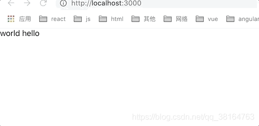

react hook面试已经有一段时间了，相信很多人都已经在代码中用上hooks。而对于useEffect和useLayoutEffect,我们使用的最多的应该就是useEffect。那么他们两个到底有什么不一样的地方？

## 使用方式
这两个函数的使用方式其实非常简单，它们都接受一个函数一个数组，只有在数组里面的值改变的情况下才会再次执行effect。所以对于使用方式我就不过多介绍了，具体查看[官网](https://zh-hans.reactjs.org/docs/hooks-reference.html)

## 差异
- <span style="color:blue">useEffect(渲染后)是异步执行的，而useLayoutEffect(渲染时)是同步执行的</span>
- <span style="color:blue">useEffect的执行时机是浏览器完成渲染之后，而useLayoutEffect的执行时机是浏览器把内容真正渲染到界面之前，和componentDidMount等价</span>

- <span style="color:blue">useInsertionEffect(渲染前)工作原理类似useLayoutEffect,区别在于回调执行时还不能访问ref中的DOM节点。</span>
    - 你可以在这个Hook内操作全局DOM节点(比如&lt;style&gt;或者SVG&lt;defs&gt;)
    - 操作CSS库(比如CSS-IN-js方案)可以用这个Hook插入全局style

## 具体表现
🌰
```js
import React , { useEffect, useLayoutEffect, useState } from 'react';
import logo from './logo.svg';
import './App.css';

function App() {
    const [state, setState] = useState('hello world');

    useEffect(() => {
        let i = 0; 
        while(i < 1000000) {
            i++;
        }
        setState('world hello');
    }, [])

    // useLayoutEffect(() => {
    //     let i = 0; 
    //     while(i < 1000000) {
    //         i++;
    //     }
    //     setState('world hello');
    // }, [])
    return (
        <>
            <div>{state}</div>
        </>
    )
}
```
这是它的效果


<span style="color: red;">"而换成useLayoutEffect之后闪烁现象就消失了</span>

看到这里相信你应该能理解他们的区别了，因为useEffect是渲染之后异步执行的，所以会导致hello world先被渲染到屏幕上，在变成world hello，就会出现闪烁现象。而useLayoutEffect是渲染之前同步执行的，所以会等它执行完在渲染上去，就避免了闪烁现象。也就是说等它执行完在渲染上去，就避免了闪烁现象。也就是说我们把操作dom的相关操作放到useLayoutEffect中去，避免导致闪烁

## ssr
也正是因为useLayoutEffect可能会导致渲染结果不一样的关系，如果你在ssr的时候使用这个函数会有一个warning
```js
Warning: useLayoutEffect does nothing on the server, because its effect cannot be encoded into the server renderer's output format. This will lead to a mismatch between the initial, non-hydrated UI and the intended UI. To avoid this, useLayoutEffect should only be used in components that render exclusively on the client. See https://fb.me/react-uselayouteffect-ssr for common fixes.
```
这是因为useLayoutEffect是不会在服务端，所以就有可能导致ssr渲染出来的内容和实际的首屏内容并不一致。而解决这个问题也很简单

- 放弃使用useLayoutEffect,使用useEffect代替
- <span style="color:blue">如果你明确知道useLayoutEffect对于首屏渲染并没有影响，但是后续会使用，你可以这么写</span>
```js
import { useEffect, useLayoutEffect } from 'react';

export const useCustomLayoutEffect = typeof window !== 'undefined' ? useLayoutEffect : useEffect;
```
当你使用useLayoutEffect的时候就用useCustomLayoutEffect代替。这样在服务端就会用useEffect,这样就不回报warning了.

## 源码剖析
### useEffect
首先找到useEffect调用入口
```js
function updateEffect(create, deps) {
  {
    // $FlowExpectedError - jest isn't a global, and isn't recognized outside of tests
    if ('undefined' !== typeof jest) {
      warnIfNotCurrentlyActingEffectsInDEV(currentlyRenderingFiber$1);
    }
  }

  return updateEffectImpl(Update | Passive, Passive$1, create, deps);
}
```
//................................................................

## 总结
- <span style="color:blue">优先使用useEffect,因为它是异步的，不会阻塞渲染</span>
- <span style="color:blue">会影响到渲染的操作尽量放到useLayoutEffect中去，避免出现闪烁问题</span>
- <span style="color:blue">useLayoutEffect和componentDidMount是等价的，会同步调用，阻塞渲染</span>
- <span style="color:blue">useLayoutEffect在服务端渲染的时候使用会有一个warning,因为它可能导致首屏实际内容和服务端渲染出来的内容不一样</span>

## 资料
[useEffect和useLayoutEffect的区别](https://blog.csdn.net/qq_38164763/article/details/113532855)

[梳理useEffect和useLayoutEffect的原理与区别](https://zhuanlan.zhihu.com/p/346977585)


