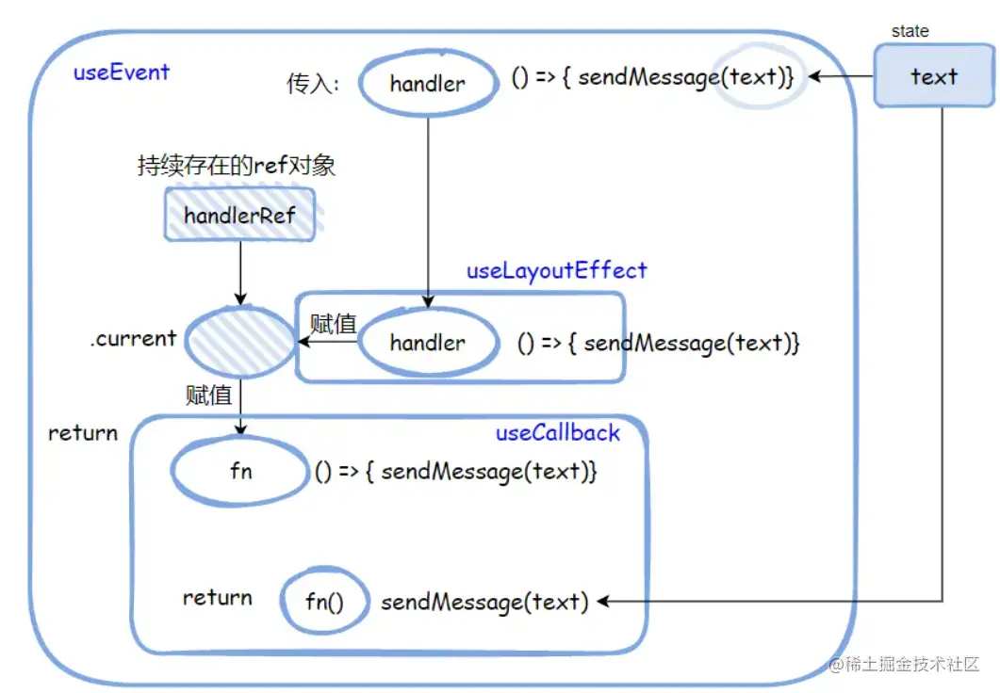

## 前言
[useEvent](https://github.com/reactjs/rfcs/blob/useevent/text/0000-useevent.md)是一个刚刚提案的原生Hook，还处于RFC。[讨论地址](https://github.com/reactjs/rfcs/blob/useevent/text/0000-useevent.md)下面有些嗲吗是来自其中

> RFC:request for Comments还在广泛讨论阶段

## 为什么要怎么做
### 没有useEvent的时候
我么先看看不用useEvent的情况
```js
function Chat() {
    const [text, setText] = useState('');
    // Always a different function
    const onClick = () => {
        sendMessage(text);
    }

    return <SendButton onClick={onClick}>
}
```
<span style="color: blue">其中点击事件的回调函数onClick中需要读取当前键入的文本text，这里onClick随着组件渲染一次次的重新创建，每次都会是不一样的引用，这显然带来了性能损耗</span>，如果你想对其进行优化，你可能会这样做

```js
function Chat() {
    const [text, setText]= useState('');

    // 🟡 A different function whenever `text` changes
    const onClick = useCallback(() => {
        sendMessage(text);
    }, [text]);

    return <SendButton onClick={onClick} />
}
```
#### 通过useCallback返回一个memoized回调函数
:::tip
useCallback:返回一个[memoized](https://en.wikipedia.org/wiki/Memoization)回调函数(记忆)。<span style="color: blue">把内联回调函数及依赖项数组作为参数传入callback,它将返回该回调函数的memoized版本，该回调函数仅在某个依赖项改变时才会更新。当你把回调函数传递给经过优化的并使用引用相等性去避免非必要渲染(例如shouldComponentUpdate)的子组件时，它将非常有用。useCallback(fn, deps)相当于useMemo(() => fn, deps)</span>
:::
<span style="color: red">**最终使得onClick的引用使用不变**</span>

**但是，onClick这个方法有需要保证每次都拿到最新的、正确的text，所以他的deps中就自然是设置了text----坏了，"又会到最初的起点"。随着每一次keystroke, onClick又变成了上面的情况**

> 🟡 Always a different function

**但你又不能将其从deps中移除，移除了他就只能拿到text的初始值，失去了他本该有的功能...**

### useEvent来整个活
<span style="color: red">useEvent就是为了解决此问题，所以它干脆不要deps了，他就是一直返回一个相同的函数引用，哪怕text发生变化。**当然，保证它也能拿到最新、正确的text**</span>

```js
function Chat() {
    const [text, setText] = useState('');

    // ✅Always the same function (even if 'text' change)
    const onClick = useEvent(() => {
        sendMessage(text);
    })
    return <SendButton onClick={onClick}>
}
```
现在好了

- <span style="color: blue">onClick的引用使用是同一个</span>
- <span style="color: blue">保证每次都能拿到最新的、正确的text</span>
---
当然还有其他一些场景，但是大致需求原理相同，**就是不想让A因为b变化而总是重新加载，但是又因为要拿到b恰当的值，所以deps中必须b,导致不得不重新加载**，掉进了"圈圈圆圆圈圈~"的陷阱。

### 好活好活🍞
总而言之，用useEvent给他裹上就是香，就可以同事达到上面两个效果
- <span style="color: red">引用不变</span>
- <span style="color: red">拿到恰当的值</span>

## 这是咋做到的
说了这么多，我们看看它是咋做到的

他大概就是这么个形状(不是源码就长这样)
```js
// (!) Approximate behavior

function useEvent(handler) {
  const handlerRef = useRef(null);

  // In a real implementation, this would run before layout effects
  useLayoutEffect(() => {
    handlerRef.current = handler;
  });

  return useCallback((...args) => {
    // In a real implementation, this would throw if called during render
    const fn = handlerRef.current;
    return fn(...args);
  }, []);
}
```
### 先回顾几个Hook相关知识点
- [useRef](https://zh-hans.reactjs.org/docs/hooks-reference.html#useref)

    > useRef返回一个可变的ref对象，其.current属性被初始化为传入的参数(initialValue).返回ref对象在组件的整个生命周期内持续存在
    这里通过useRef保存回调函数handler到handlerRef.current，然后再在useCallback中从handlerRef.current来取函数在调用，这边避免了直接调用，跳出了闭包陷阱。并且不出意外的话handler在整个生命周期内持续存在，也就是**只有一个引用**
- useLayoutEffect

    这个[useLayoutEffect](https://zh-hans.reactjs.org/docs/hooks-reference.html#uselayouteffect)可能没那么常用，我们来看看是啥

    > 其函数签名与useEffect相同，但它会在所有的DOM变更之后同步调用effect。可以使用它来读取DOM布局并同步触发重渲染。在浏览器执行绘制之前，useLayoutEffect内部的更新计划将被同步刷新
- useEffect

    回顾一下[useEffect](https://zh-hans.reactjs.org/docs/hooks-reference.html#useeffect)

    > <span style="color: blue">默认情况下，effect将在每轮渲染结束后执行</span>
- useLayoutEffect vs useEffect

    现在我们总结一下两者区别，useLayoutEffect更"快",这个快不是速度更快，而是抢跑了。<span style="color: blue">>useLayoutEffect是在render之前同步执行，useEffect在render之后异步执行，这就保证useLayoutEffect里的回调肯定比useEffect更早被调用、被执行</span>
- usecallback
    - 执行时机
        
        前面说到
        > useCallback(fn, deps)相当于usememo(() => fn, deps)

        文档里这样说[usememo](https://zh-hans.reactjs.org/docs/hooks-reference.html#usememo)的

        > 记住，<span  style="color: blue">传入useMemo的函数会在渲染期间执行。</span>请不要在这个函数内部执行与渲染无关的事情，诸如副作用这类的操作属于useEffect的适用范畴， 而不是useMemo

        也就它是在render时执行的，也就保证了赋值handler给handleRef.current是在前面发生
    - 这里的作用

        这里返回的是一个useCallback包裹后memoized函数，其中从handlerRef.current中获取函数，并且deps为[]，也就说他不会再次更新

## 捋一捋🌊
回顾完知识点我们也就缕清了这个useEvent方法，一句话总结就是：<span style="color: blue">它接收一个回调函数handler作为参数，**提供给你一个稳定的函数(始终只有一个引用)并且调用时都是用的你传入的最新的参数...args**--- 比如前面案例中text，始终都是**最新的、正确的、恰当的**</span>

在结合一开始的案例，大概流程是这样



## 资料
[useEvent：一个显著降低Hooks心智负担的原生Hook](https://mp.weixin.qq.com/s/9hV3cYF9VWlmlBdiR1g7Zw)