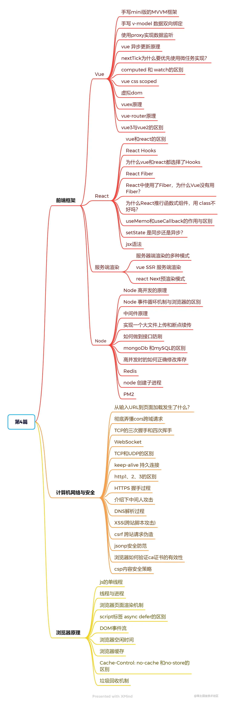
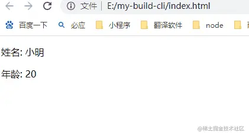
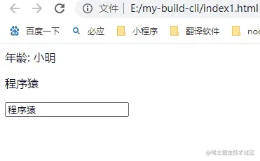
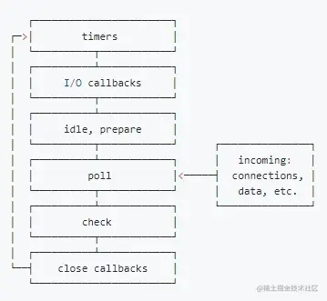
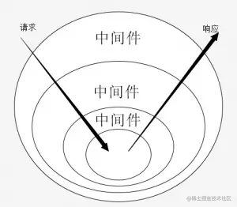

## 文章导图


## 前端框架
### Vue
#### 手写minni版的MVVM框架
实现效果：2s后修改姓名和年龄这两个值，页面响应式更新渲染


##### 实现流程
1. 实现 observer函数，利用Object.defineProperty把data中的属性变成响应式的，同时给每一个属性添加一个dep对象(用来存储对应的watcher观察者)
2. 定义compile函数，模板编译，遍历DOM，遇到mustache(双大括号{{}})形式的文本，则替换成data.key对应的值，同时将该dom节点添加到对应key值的dep对象中
3. 当data的数据变化时，调用dep对象的update方法，更新所有观察者中的dom节点
```html
<!doctype html>
<head>
    <meta charset="UTF-8">
    <title>vue的mvvm简单实现</title>
</head>
<div id="app">
  <p>姓名: <span>{{name}}</span></p>
  <p>年龄: <span>{{age}}</span></p>
</div>
<script>
window.onload = function() {
    // new一个vue实例
    let vue = new Vue({
        el: '#app',
        data: {
            name: '加载中',
            age: '18'
        }
    })
    // 2s后更新页面信息
    setTimeout(() => {
        // 修改vue中$data的name和age属性
        vue.$data.name = '小明';
        vue.$data.age = 20
    }, 1000)
}
class Vue {
    constructor(options) {
        this.options = options;
        this.$data = options.data;
        this.observe(options.data);
        this.compile(document.querySelector(options.el))
    }
    // 监听data中属性变化
    observe(data) {
        Object.keys(data).forEach(key => {
            // 给data中的每一个属性添加一个dep对象(改对象用来存储对应的watcher观察者)
            let observer = new Dep();
            // 利用闭包 获取和设置属性的时候，操作的都是value
            let value = data[key];
            Object.defineProperty(data, key, {
                get() {
                    // 观察者对象添加对应的dom节点
                    Dep.target && observer.add(Dep.target);
                    return value;
                },
                set(newValue) {
                    value = newValue;
                    // 属性变化时，更新观察者中的所有节点
                    observer.update(newValue)
                }
            })
        })
    }
    compile(dom) {
        dom.childNodes.forEach(child => {
            // nodeType为3时是文本节点，并且该节点的内容包含`mustache`(双括号)
            if(child.nodeType === 3 && /\{\{(.*)\}\}/.test(child.textContent)) {
                // RegExp.$1是正则表达式匹配的第一个字符串，这里对应的就是data的key值
                let key = RegExp.$1.trim();
                // 将该节点添加到对应的观察者对象中，在下面的this.options.data[key]中触发get方法
                Dep.target = child;
                // 将{{key}}替换成data中对应的值
                child.textContent = child.textContent.replace(`{{${key}}}`, this.options.data[key]);
                Dep.target = null;
            }
            // 递归遍历子节点
            if(child.childNodes.length) {
                this.compile(child)
            }
        })
    }
}
// dep对象存储所有的观察者
class Dep {
    constructor() {
        this.watcherList = [];
    }
    // 添加watcher
    add(node) {
        this.watcherList.push(node);
    }
    // 更新watcher
    update(value) {
        this.watcherList.forEach(node => {
            node.textContent = value;
        })
    }
}
</script>
</html>
```
[50行代码的MVVM，感受闭包的艺术](https://juejin.cn/post/6844903619808985095)

#### 手写v-model数据双向绑定


#### 和前文mini版MVVM框架的区别
1. 实现v-model指令，input值改变后,页面对应的数据也会变化，实现数据的双向绑定
2. 给input元素绑定input事件，当输入值变化会触发对应属性的dep.update方法，通过对应的观察者发生变化
3. 增加了数据代理，通过this.info.person.name就可以直接修改$data对应的值，实现了this对this.$data的代理
4. 数据劫持，对data增加了递归和设置新值的劫持，让data中每一层数据都是响应式的，如info.person.name

```html
<!doctype html>
<html lang="en">
<head>
  <meta charset="UTF-8">
  <meta name="viewport"
        content="width=device-width, user-scalable=no, initial-scale=1.0, maximum-scale=1.0, minimum-scale=1.0">
  <meta http-equiv="X-UA-Compatible" content="ie=edge">
  <title>vue双向绑定的简单实现</title>
</head>
<body>
<div id="app">
  <div>年龄: <span>{{info.person.name}}</span></div>
  <p>{{job}}</p>
  <input v-model="job" placeholder="请输入工作" type="text">
</div>

<script>
window.onload = function() {
    // new一个vue对象
    let vm = new Vue({
        // el为需要挂在的dom节点
        el: '#app',
        data: {
            info: {
                person: {
                    name: '加载中'
                }
            },
            job: '程序猿'
        }
    })
    setTimeout(() => {
        vm.info.person.name = '小明'
    }, 2000)
}
class Vue {
    constructor(options) {
        this.$data = options.data;
        this.$el = document.querySelector(options.el);
        observe(options.data);
        this.proxy(this.$data, this);
        this.compile(this.$el, this)
    }
    // 模板编译
    compile(dom, vm) {
        Array.from(dom.childNodes).forEach(child => {
            // 元素节点，匹配v-model 如input,textArea元素等
            if(child.nodeType === 1) {
                Array.from(child.attributes).forEach(attr => {
                    // 判断元素是否设置v-model属性
                    if(attr.name.includes('v-model')) {
                        Dep.target = child;
                        child.value = vm.$data[attr.value];
                        Dep.target = null;
                        // 重点：给input绑定原生input事件
                        child.addEventListener('input', e => {
                            // 当input输入内容发生变化时，动态设置vm.$data[attr.value]的值
                            vm.$data[attr.value] = e.target.value;
                        })
                    }
                })
            }
            if (child.nodeType === 3 && /\{\{(.*)\}\}/.test(child.textContent)) {
                let key = RegExp.$1.trim()
                let keyList = key.split('.')
                let value = vm.$data
                Dep.target = child

                // 循环遍历，找到info.person.name对应的name值
                keyList.forEach(item => {
                    value = value[item]
                })
                Dep.target = null
                child.textContent = child.textContent.replace(`{{${key}}}`, value)
            }
            if (child.childNodes.length > 0) {
                // 递归模板编译
                this.compile(child, vm)
            }
        })
    }
    // this 代理this.$data;
    // vm.info.person.name 相当于 vm.$data.info.person.name
    proxy($data, vm) {
        Object.keys($data).forEach(key => {
            Object.defineProperty(vm, key, {
                set(newValue) {
                    $data[key] = newValue;
                },
                get() {
                    return $data[key]
                }
            })
        })
    }
}
function observe(data) {
    if(data && typeof data === 'object') {
        return new Observe(data);
    }
}
// 递归进行数据劫持，使data中的每一层都是响应式
function Observe(data) {
    Object.keys(data).forEach(key => {
        let value = data[key];
        let dep = new Dep();
        // 递归
        observe(value);
        Object.defineProperty(data, key, {
            get() {
                Dep.target && dep.add(Dep.target);
                return value;
            },
            set(newValue) {
                value = newValue;
                // 如果新设置的值是一个对象，该对象也要变成响应式的
                observe(newValue);
                dep.update(newValue)
            }
        })
    })
}
class Dep {
    constructor() {
        this.subs = [];
    }
    add(target) {
        this.subs.push(target);
    }
    update(newValue) {
        this.subs.forEach(node => {
            if(node.tagName === 'INPUT' || node.tagName === 'TEXTAREA') {
                node.value = newValue;
            } else {
                node.textContent = newValue;
            }
        })
    } 
}
</script>
</body>
</html>
```
[源码](https://github.com/xy-sea/blog/blob/dev/mini-vue/%E6%89%8B%E5%86%99v-model%E5%8F%8C%E5%90%91%E7%BB%91%E5%AE%9A.html)

#### 使用proxy实现数据监听
vue3底层通过Proxy实现了数据监听，替代了vue2中的Object.defineProperty
```js
function observe(target) {
    return new Proxy(target, {
        get(target, key, receiver) {
            let result = Reflect.get(target, key);
            // 递归获取对象多层嵌套的情况，如pro.info.type(递归监听，保证每一层返回都是proxy对象)
            return isObject(result);
        },
        set(target, key, value, receiver) {
            if(key !== 'length') {
                // 解决对数组修改，重复更新视图的问题
                console.log('更新视图')
            }
            return Reflect.set(target, key, value, receiver)
        }
    })
}
function isObject(target) {
    if(typeof target === 'object' && target !== null) {
        return observe(target);
    } else {
        return target;
    }
}
let target = {name: '测试', info: { type: '1' }}
let pro = observe(target);
pro.infot.type = 2;
```
#### vue异步更新原理
<span style="color: red">vue的数据频繁变化，但为什么dom只会更新一次</span>
1. Vue数据发生变化之后，不会立即更新dom，而是异步更新的
2. 侦听到数据变化，Vue将开启一个队列，并缓存在同一事件循环中发生的所有数据变更
3. 如果同一个watcher被多次触发，只会被推入队列中一次，可以避免重复修改相同的dom，这种去掉重复数据，对于避免不必要的计算和DOM操作是非常重要的
4. 同步任务执行完毕，开始执行异步watcher队列任务，一次性更新DOM

**异步更新的源码实现**
```js
// 定义watcher类
class Watcher {
    update() {
        // 放到watcher队列中，异步更新
        queueWatcher(this);
    }
    // 触发更新
    run() {
        this.get();
    }
}
// 队列中添加watcher
function queueWatcher(watcher) {
    const id = watcher.id;
    // 先判断watcher是否存在，去掉重复的watcher
    if(!has[id]) {
        queue.push(watcher);
        has[id] = true;
        if(!pending) {
            pending = true;
            // 使用异步更新watcher
            nextTick(flushSchedulerQueue)
        }
    }
}
let queue = []; // 定义watcher队列
let has = {}; // 使用对象来保存id，进行去重操作
let pending = false; // 如果异步队列正在执行，将不会再次执行
// 执行watcher队列任务
function flushSchedulerQueue() {
    queue.forEach(watcher => {
        watcher.run();
        if(watcher.options.render) {
            // 在更新之后执行对应的回调：这里是updated钩子函数
            watcher.cb();
        }
    })
    // 执行完成后清空队列 充值pending状态
    queue = [];
    has = {};
    pending = false;
}
```
#### nextTick为什么要优先使用微任务实现
1. vue nextTick的源码实现，异步优先级判断，总结就是Promise > MutationObserver > setImmediate > setTimeout

2. 优先使用Promise，因为根据event loop与浏览器更新渲染时机，宏任务->微任务->渲染更新，使用微任务，本次event loop轮训就可以获取到更新的dom

3. 如果使用宏任务，要到下一次event loop中，才能获取到更新dom

**nextTick的源码实现**
```js
// 定义nextTick的回调队列
let callbacks = [];

// 批量执行nextTick的回调队列
function flushCallbacks() {
    callbacks.forEach(cb => cb());
    callbacks = [];
    pending = false;
}
// 定义异步方法，优先使用微任务实现
let timerFunc;

// 优先使用promise 微任务
if(promise) {
    timerFunc = function() {
        return Promise.resolve().then(flushCallbacks);
    }
}
// 如果不支持promise,在使用MutationObserver 微任务
else if(MutationObserver) {
    const textNode = document.createTextNode('1');
    const observer = new MutationObserver(() => {
        flushCallbacks();
        observer.disconnect();
    })
    const observer = observer.observe(textNode, { characterData: true })
    textNode.textContent = '2'
}
// 微任务不支持，在使用宏任务实现
else if(setImmediate) {
    timerFunc = function() {
        setImmediate(flushCallbacks)
    }
} else {
    timerFunc = function() {
        setTimeout(flushCallbacks)
    }
}

// 定义nextTick方法
export function nextTick(cb) {
    callbacks.push(cb);
    if(!pending) {
        pending = true;
        timerFunc();
    }
}
```
[MutationObserver](/front-end/Log/performance-word.html#指标)

[你真的理解$nextTick么](https://juejin.cn/post/6844903843197616136)

[Vue 源码详解之 nextTick：microtask 才是核心！](https://segmentfault.com/a/1190000008589736)

#### computed 和 watch的区别
1. 计算属性本质上是computed watcher,而watch本质是user watcher(用户自己定义的watcher)；
2. computed有缓存的功能，通过dirty控制
3. watcher设置deep:true,实现深度监听的功能
4. computed可以监听多个值的变化

##### computed原理
1. 初始化计算属性时，遍历computed对象,给其中每一个计算属性分别生成唯一computed watcher，并将该watcher中的dirty设置为true
    初始化时，计算出现并不会立即计算(vue做的优化之一)，只有当获取的计算属性值才会进行对应计算
2. 初始化计算属性时候，将Dep.target设置成当前的computed watcher，将computed watcher添加到所依赖data值的dep中(依赖收集过程)，然后计算computed对应的值，后将dirty改成false
3. 当依赖data中的值发生变化时，调用set方法触发dep的notiry方法，将computed watcher中的dirty设置为true
4. 下次获取计算属性值时，若dirty为true，重新计算属性值
5. dirty是控制缓存的关键，当所依赖的data发生变化，dirty设置为true，再次呗获取时，就会重新计算
**computed源码实现**
```js
// 空函数
const noop = () => {};
// computed初始化的watcher传入lazy:true，就会触发watcher中的dirty值为true
const computedWatcherOptions = { lazy: true }
// Object.defineProperty 默认value参数
const sharedPropertyDefinition = {
    enumberable: true,
    configurable: true,
    get: noop,
    set: noop
}
// 初始化computed
class initComputed {
    constructor(vm, computed) {
        // 新建存储watcher对象，挂载在vm对象执行
        const watchers = (vm._computedWatchers = Object.create(null));
        // 遍历computed
        for(const key in computed) {
            const userDef = computed[key];
            // getter值为computed重key的监听函数或对象的get值
            let getter = typeof userDef === 'function' ? userDef : userDef.get;
            // 新建computed watcher
            watchers[key] = new Watcher(vm, getter,noop, computedWatcherOptions);
            if(!(key in vm)) {
                // 定义计算属性
                this.defineComputed(vm, key, userDef)
            }
        }
    }
 // 重新定义计算属性  对get和set劫持
  // 利用Object.defineProperty来对计算属性的get和set进行劫持
  defineComputed(target, key, userDef) {
    // 如果是一个函数，需要手动赋值到get上
    if (typeof userDef === "function") {
      sharedPropertyDefinition.get = this.createComputedGetter(key);
      sharedPropertyDefinition.set = noop;
    } else {
      sharedPropertyDefinition.get = userDef.get
        ? userDef.cache !== false
          ? this.createComputedGetter(key)
          : userDef.get
        : noop;
      // 如果有设置set方法则直接使用，否则赋值空函数
      sharedPropertyDefinition.set = userDef.set ? userDef.set : noop;
    }
    Object.defineProperty(target, key, sharedPropertyDefinition);
  }

  // 计算属性的getter 获取计算属性的值时会调用
  createComputedGetter(key) {
    return function computedGetter() {
      // 获取对应的计算属性watcher
      const watcher = this._computedWatchers && this._computedWatchers[key];
      if (watcher) {
        // dirty为true,计算属性需要重新计算
        if (watcher.dirty) {
          watcher.evaluate();
        }
        // 获取依赖
        if (Dep.target) {
          watcher.depend();
        }
        //返回计算属性的值
        return watcher.value;
      }
    };
  }
}
```
##### watch原理
1. 遍历watch对象，给其中每一个watch属性，生成use watcher
2. 调用watcher中的get方法，将Dep.target设置成当前的user watcher，并将user watcher添加到监听data值对应的dep中(依赖收集的过程)
3. 当所监听data中的值发生变化时，会调用set方法触发dep的notify方法，执行watcher中定义的方法
4. 设置成deep：true的情况，递归遍历所监听的对象，将user watcher添加到对象中每一层key值的dep对象中，这样武林当对象的中那一层发生变化，watcher都可以监听到。通过对象的递归遍历，实现了深度监听功能

[Vue.js的computed和watch是如何工作的？](https://juejin.cn/post/6844903667884097543)

[手写Vue2.0源码（十）-计算属性原理](https://juejin.cn/post/6956407362085191717)

[珠峰：史上最全最专业的Vue.js面试题训练营](https://www.bilibili.com/video/BV1YE411u7m4/?from=search&seid=14891340203736945411)

#### vue css scoped
##### css属性选择器示例
```html
<!-- 页面上"属性选择器"这几个字显示红色 -->
<div data-v-hash class="test-attr">属性选择器</div>
<style>
/* 该标签有个data-v-hash的属性，只不过该属性为空，依然可以使用属性选择器 */
.test-attr[data-v-hash] {
    color: red
}
</style>
<script>
    // 通过js判断是否存在data-v-hash属性
    console.log(document.querySelector('.test-attr').getAttribute('data-v-hash') === '') // true
</script>
```
##### vue css scoped原理
1. 编译时，会给每个vue文件生成一个唯一的id,会将次id添加到当前文件中所有html标签上

    如&lt;div class="demo"&gt;&lt;/div&gt;会被编译成&lt;div class="demo" data-v-27e4e96e&gt;&lt;/div&gt;
2. 编译style标签时，会将css选择器改造成属性选择器，如.demo{color: red}会被编译成.demo[data-v-27e4e96e]{color: red}

#### 虚拟DOM
<span stle="color: red">什么是虚拟dom?</span>

<span style="color: blue">Virtual DOM是模拟真实DOM节点，这个对象就是更加轻量级的对DOM的描述</span>

<span style="color: red">为什么现在主流的框架都是用虚拟dom?</span>

1. 前端性能优化的一个秘诀就是尽可能少操作DOM，频繁变动DOM会造成浏览器的回流或者重绘
2. 是用虚拟dom，当数据变化，页面需要更新时，通过diff算法，对比新旧虚拟dom节点进行对比，比较两棵树的差异，生成差异对象，一次性将dom进行批量更新操作，进而有效提高性能
3. 虚拟DOM本质上是JS对象，而DOM与平台强相关，相比之下虚拟DOM可以进行更方便的跨平台操作，例如服务器渲染、weex开发等等

##### 虚拟dom与真实dom的相互转化
```js
// 将真实dom转化为虚拟dom
function dom2Json(dom) {
    if(!dom.tagName) return;
    let obj = {};
    obj.tag = dom.tagName;
    obj.children = [];
    dom.childNodes.forEach(item => {
        // 去掉空节点
        dom2Json(item) && obj.children.push(dom2Json(item));
    })
    return obj
}

// 虚拟dom包含三个参数 type,props, children
class Element {
    this.type = type;
    this.props = props;
    this.children = children;
}
// 将虚拟dom渲染成真实的dom
function render(domObj) {
    let el = document.createElement(domObj.type);
    Object.keys(domObj.props).forEach(key => {
        let value = domObj.props[key];
        switch(key) {
            case 'value':
                if(el.tagName == 'INPUT' || el.tagName == 'TEXTAREA') {
                    el.value = value;
                } else {
                    el.setAttribute('value', value);
                }
                break;
            case 'style': 
                el.style.cssText = value;
                break;
            default: 
                el.setAttribute(key, value)
        }
    })
    domObj.children.forEach(child => {
        child = child instaceof Element ? render(child) : document.createTextNode(child);
    })
    return el;
}
```
[让虚拟DOM和DOM-diff不再成为你的绊脚石](https://juejin.cn/post/6844903806132568072)

[虚拟 DOM 到底是什么？](https://mp.weixin.qq.com/s/oAlVmZ4Hbt2VhOwFEkNEhw)

[详解vue的diff算法](https://juejin.cn/post/6844903607913938951)

#### vuex原理
1. vuex中store本质就是一个没有template模板的隐藏式的vue组件
2. vuex是利用vue的mixin混入机制，在beforeCreate钩子前混入vuexInit方法
3. vuexInit方法实现将vuex store注册到当前组件的$store属性上
4. vuex的state作为一个隐藏的vue组件的data，定义在state上面的变量，相当于这个vue示例的data属性，凡是定义在data上的数据都是响应式的
5. 当页面中使用了vuex state中的数据，就是依赖收集的过程，当vuex中state的数据发生变化，就通过调用对应的dp对象notify方法 去修改视图变化

[vuex实现原理](/source-vue/source-vue-vuex.html)

[vuex工作原理详解](https://www.jianshu.com/p/d95a7b8afa06)

[Vuex数据流动过程](https://blog.csdn.net/weixin_34285318/article/details/90182481)

#### vue-router原理
1. 创建的页面路由会与该页面形式一个路由表(key value形式，key为该路由，value为对应页面)
2. vue-router原理是监听URL的变化，然后匹配路由规则，会用新路由的页面替换到老页面，无需刷新
3. 目前单页面使用的路由有两种实现方式：hash模式、history模式
4. hash模式(路由中带#号)，通过hashChange时间来监听路由变化 window.addEventListener('hashChange', ()=> {})
5. history模式，利用了pushState()和replaceState()方法，实现往history中添加新的浏览记录、或替换对应的浏览器记录，通过popstate事件来监听路由变化，window.addEventListener('popstate', () => {})

[前端路由简介以及vue-router实现原理](https://juejin.cn/post/6844903615283363848)

[Vue Router原理](https://juejin.cn/post/6844904099050160141)

#### vue3和vue2的区别
1. vue3性能比vue2.x快1.2~2倍
2. 使用proxy取代Object.defineProperty,解决了vue中新增属性监听不到的问题，同时proxy也支持数组，不需要像vue2那样对数组的方法做拦截处理
3. diff方法优化--vue3新增了静态标记(patchflag),虚拟节点对比时，就只会对比这些带有静态标记的节点
4. 静态提升

    vue3对于不参与更新的元素，会做静态提升，只会被创建一次，在渲染时直接复用即可。vue2无论元素是否参与更新，每次都会重新创建然后再渲染

5. 事件侦听器缓存
    默认情况下onClick会被视为动态绑定，所以每次都会追踪它的变化，但是因为是同一个函数，所以不用追踪变化，直接缓存起来复用即可
6. 按需引入，通过treeSharking 体积比vue2.x更小
7. 组合API（类似react hooks），可以将data与对应的逻辑写到一起，更容易理解
8. 提供了很灵活的api 比如toRef、shallowRef等等，可以灵活控制数据变化是否需要更新ui渲染
9. 更好的Ts支持

### React
#### vue和react区别
1. 设计理念不同

    react整体上是函数式编程思想，组件使用jsx语法，all in js，将html于css全都融入javascript中，jsx语法相对来说更加灵活

    vue整体思想，是拥抱经典的html(结构)+css(表现)+js(行为)的形式，使用template模板，并提供指令供开发者使用,如v-if、v-show、v-for等，开发时有结构、表现、行为分离的感觉

2. 数据是否可变

    vue的思想是响应式的，通过Object.defineProperty或proxy代理实现数据监听,每一个属性添加一个dep对象(用来存储对应的watcher)，当属性变化的时候，通知对应的watcher发生改变

    react推崇的是数据不可变，react使用的是浅比较，如果对象和数据的引用地址没有变，react认为该对象没有变化，所以react变化时一般都是新创建一个对象

3. 更新渲染方式不同

    当组件的状态发生变化时,vue是响应式,通过对应的watcher自动找到对应的组件重新渲染

    react需要更新组件时，会重新走渲染流程，通过从根节点开始遍历，dom diff找到需要变更的节点，更新任务还是很大，需要使用到Fiber，将大人物分割为多个小任务，可以中断和回复，不阻塞主进程执行高优先级任务

4. 各自优势不同

    vue的优势包括:框架内部封装的多，更容易上手，简单的语法及项目创建，更快的渲染速度和更小的体积

    react的优势包括:react更灵活，更接近原生的js、可操作性强，对于能力强的人，更容易早出更个性化的项目

[React与Vue对比](https://www.cnblogs.com/yubin-/p/11537122.html)

[关于Vue和React区别的一些笔记](https://github.com/lihongxun945/myblog/issues/21)

#### react Hooks
可以在函数式组件中，获取state、refs、生命周期钩子等特性

**使用规则**
1. 只在最顶层使用Hook，Hokks底层使用链表存储数据，按照定义的useState顺序存储对应的数据，不要在循环、条件或嵌套函数中调用hook，否则hooks的顺序会错乱
2. 自定义Hook必须以『use』开头，如useFriendStatus
3. 在两个组件中使用相同的Hook不会共享state，每次使用自定义Hook时，其中的所有state和副作用都是完全隔离的

[React hooks原理](https://github.com/brickspert/blog/issues/26)

#### 为什么vue和react都选择了Hooks
1. 更好的状态复用

    对于vue2来说，使用的是mixin进行混入，会造成方法与属性的难以追溯。 随着项目的复杂，文件的增多，经常会出现不知道某个变量在哪里引入的，几个文件间来回翻找， 同时还会出现同名变量，相互覆盖的情况……😥

2. 更好的代码组织

    vue2的属性是放到data中，方法定义在methods中，修改某一块的业务逻辑时， 经常会出现代码间来回跳转的情况，增加开发人员的心智负担

    使用Hooks后，可以将相同的业务逻辑放到一起，高效而清晰地组织代码

3. 告别this

    this有多种绑定方式，存在显示绑定、隐式绑定、默认绑定等多种玩法，里边的坑不是一般的多

    <span style="color: red">vue3的setup函数中不能使用this，不能用挺好，直接避免使用this可能会造成错误的</span>

#### React Fiber
<span style="color: red">**解决react旧版本，页面卡段时候出现丢帧卡顿问题**</span>

#### React旧版本问题
当我们调用setState更新页面的时候，React会遍历应用的所有节点，计算出差异，然后在更新UI

整个过程一气呵成，不能被打断。如果页面元素很多，这个过程执行的时间可能超过50毫秒，就容易出现掉帧的现象

#### 新版本解决方案
React Fiber是把一个大任务拆分为很多个小块的任务，一个小块任务的执行必须是一次完成的，不能出现暂停，但是一个小块任务执行完后可以移交控制权给浏览器响应用户操作

核心是通过requestIdleCallback，会在利用浏览器空闲时间找出所有需要变更的节点

<span style="color: red">阶段一，生成Fiber树，得出需要更新的节点信息，这一步是一个渐进的过程，可以被打断</span>

<span style="color: red">阶段二,将需要更新的节点一次性批量更新，这个过程不能被打断</span>

[走进Fiber的世界](https://juejin.cn/post/6943896410987659277)

#### React中使用了Fiber，为什么vue没有使用Fiber？
<span style="color: red">原因是二者的更新机制不一样</span>

Vue是基于template和watcher的组件级更新，把每个更新任务分割的足够小，不需要使用Fiber架构，将任务进行更细粒度的拆分

React是不管在哪里调用setState，都是从根节点开始更新，更新任务还是很大，需要用到Fiber将大任务分割为多个小任务，可以中断和恢复，不阻塞主进程执行高优先级的任务，如果不用Fiber，会出现老版本卡顿问题

[走进Fiber的世界](https://juejin.cn/post/6943896410987659277)

#### 为什么React推行函数式组件
1. 函数组件不需要声明类，可以避免大量的譬如extends或者constructor这样的代码
2. 函数组件不需要处理this指向问题
3. 函数组件更贴近于函数式编程，更加贴近react的原则。使用函数式编程，灵活度更高，更好的代码复用
4. 随着Hooks功能强大，更推动了函数式组件+Hooks这对组合的发展
[为什么 React 现在要推行函数式组件，用 class 不好吗？](https://www.zhihu.com/question/343314784)

[函数式组件 && React Hook](https://juejin.cn/post/6844904100891459591)
#### useMemo和useCallback的作用与区别
##### useCallback
useCallback返回一个函数，只有在依赖项发生变化的时候才会更新(返回一个新的函数),多用于生成一个防抖函数

注意:组件每次更新时，所有方法都会重新创建，这样之前写的防抖函数就会失效，需要使用useCallback包裹
```js
import {debounce} from 'debounce';
// 第二个参数为要监听的变量，当为空数组时[],submit只会被创建一次
// 当监听有值时，会随着值的变化重新创建生成新的submit
const submit = useCallback(debounce(fn, 2000), [])
<button onClick={() => submit()}>提交</button>
```
##### useMemo
useMemo只有依赖项发生改变的时候，才会重新调用此函数，返回一个新的值，类似于vue中的Computed计算属性

```js
const info = useMemo(() => {
    // 定义info变量，该变量会随着inputPerson,inputAge的变化而变化，info可以在页面中显示
    return {
        name: inputPerson,
        age: inputAge
    }
}, [inputPerson, inputAge])
```
[详解React useCallback & useMemo](https://juejin.cn/post/6844904101445124110)

#### setState是同步还是异步？
首先，同步和异步主要取决于它被调用的环境

**这里的同步还是异步，指的是调用setState方法后，是否能立刻拿到更新后的值**

1. 如果setState在React能够控制的范围被调用，它就是异步的。比如合成事件处理函数、生命周期函数

    在合成事件和钩子函数中，多次调用setState修改同一个值，只会取最后一次的执行，前面的会被覆盖

2. 如果setState在原生Javascript控制的范围被调用，它就是同步的。比如原生事件处理函数、setTimeout、promise的回调函数

    在原生事件和异步中，可以多次调用setState 修改同一个值，每次修改都会生效

##### react中的合成事件和原生事件
react为了解决跨平台，兼容性问题，自己封装了一套事件机制，代理了原生的事件，像在jsx中常见的onClick、onChange这些都是合成事件

原生事件是指非react合成事件，原生自带的事件监听addEventListener，或者也可以用原生js、jq直接绑定事件的形式都属于原生事件

#### JSX语法
1. jsx是React.createElement(component, props, ...children)函数的语法糖
2. 底层是使用babel-plugin-transform-react-jsx插件将jsx的语法转成js对象，判断是否是jsx对象或者是否是一个组件，转换为对应的js对象(虚拟dom)

```js
// 示例一
<MyButton color="blue" shadowSize={2}>Chick Me</MyBotton>
// 会编译为
React.createElement(MyBotton, {color: 'blue', shadowSize:2 }, 'Chick Me')

// 示例二:
// 以下两种示例代码完全等效
const element = (<h1 className='greet'>Hello</h1>) 
// 等价于
const element = React.createElement('h1', {className:"greet"},  'Hello')
```
### 服务端渲染
#### 服务器渲染的多重模式
- 传统的spa应用，都属于CSR(Client Side Rendering)客户端渲染

    主要问题
    - <span style="color: red">**白屏时间过程**:在JS bundle返回之前，加入bundle体积过大或者网络条件不好的情况下，页面一直是空白的，用户体验不好</span>
    - SEO不友好:搜索引擎访问页面时，只会看HTML中的内容，默认是不会执行JS，所以赚取不到页面的具体内容

- 服务端渲染的多种模式  
    - SSR(Server Side Rendering),即服务端渲染

        服务端直接实时同构渲染当前用户访问的页面，返回的HMTL包含页面具体内容，提高用户的体验

        适用于:页面动态内容，SEO的诉求、要求首屏时间快的场景

        缺点: SSR需要较高的服务器运维成本、切换页面时较慢，每次切换页面都需要服务端新生成页面
    - SSG(Static Site Generation),是指在应用编译构建时预先渲染页面，并生成静态HTML

        把生成的HTML静态资源部署到服务器后，浏览器不仅首次能请求到带页面内容的HTML，而且不需要服务端实时渲染，大大节约了服务器运维成本和资源

        适用于:页面内容由后端获取，但变化不频繁，满足SEO 的诉求、要求首屏时间快的场景，SSG打包好的是静态页面，和普通页面部署一样
    - ISR(Incremental Static Regeneration),创建需要增量静态再生的页面

        创建具有动态路由的页面(增量静态再生)，允许在应用运行时再重新生成每个页面HTML，而不需要重新构建整个应用，这样即使有海量页面(比如博客、商品介绍也等场景)，也能使用SSG的特性

        在Next.js，使用ISR需要getStaticPaths 和getStaticProps同时配合使用

[你知道吗？SSR、SSG、ISR、DPR 有什么区别？](https://www.cnblogs.com/lhb25/p/16223782.html)

[什么是SSR/SSG/ISR？如何在AWS上托管它们？](https://blog.csdn.net/weixin_41556756/article/details/125486069)

#### vue SSR服务端渲染
##### ssr原理
<span styl="color: red">通过asyncData获取数据，获取数据成功后，通过vue-server-renderer将数据渲染到页面中，生成完整的html内容，实现服务端渲染</span>

##### SSR基本交互流程
1. 在浏览器访问首页时，Web服务器根据路由拿到对应数据渲染并输出html，输出的html包含两部分
    - 路由页对应的页面及已渲染好的数据(后端渲染)
    - 完整的SPA程序代码
2. 在客户端首屏渲染完成之后，其实已经是一个和之前SPA相差无几的应用程序了，接下来我们进行的任何操作只是客户端的应用进行交互

##### vue SSR整体流程
1. 配置两个入口文件，一个是客户端使用，一个是服务端使用，一套代码两套执行环境
2. 服务端渲染需要Vue实例，每一次客户端请求页面，服务端渲染都是用一个新的vue实例，服务端利用工厂函数每次都返回一个新的vue实例
3. 获取请求页面的路由，生成对应的vue实例
4. 如果页面中需要调接口获取数据，通过asyncData获取数据，数据获取成功后，通过异步的方式在继续进行初始化，通过vue-server-renderer将数据渲染到页面中，生成html内容

##### 如何避免客户端重复请求数据
在服务端已经请求的数据，在客户端应该避免重复请求，怎样同步数据到客户端？

通过（window对象作为中间媒介进行传递数据）

1. 服务端获取数据，保存到服务端的store状态，以便渲染时候使用，最终会将store保存到window中
2. 在renderer中会在html代码中添加
    ```html
    <script>window.__INITIAL_STATE__ = context.state</script>，
    <!-- 在解析页面的时候会进行设置全局变量 -->
    ```
3. 在浏览器进行初始化Store的时候，通过window对象进行获取数据在服务端的状态，并且将其注入到store.state状态中，这样能够实现状态统一

##### 为什么服务端渲染不能调用mounted钩子
<span style="color: red">服务端渲染不能调用beforeMount和mounted，Node环境没有document对象，初始化的时候，vue底层会判断当前环境中是否有el这个dom对象，如果没有，就不会执行到beforeMount和mounted这两个钩子函数</span>

[Vue 服务端渲染（SSR）](https://juejin.cn/post/6844903569632526344)

[理解Vue SSR原理，搭建项目框架](https://juejin.cn/post/6950802238524620837)

#### React Next预渲染模式
Next.js支持SSR、SSG、ISR三种模式，默认是SSG

1. SSR模式

    需要将Next.js应用程序部署到服务器，开启服务端渲染

    整个流程：用户访问页面->如果该页面配置了getServerSideProps函数->调用getServerSideProps函数->用接口的数据渲染出完整的页面返回给用户
    ```js
    // 定义页面
    function Page({data}) {
        // Render data...
    }
    // 如果该页面配置了getServerSideProps函数，调用该函数
    export async function getServerSideProps() {
        // 请求接口拿到对应的数据
        const res = await fetch('https://.../data');
        const data = await res.join();

        // 将数据渲染到页面中
        return { props: { data }}
    }
    // 导出整个页面
    export default Page
    ```
2. SSG模式

    SSG模式:项目在打包时，从接口中请求数据，然后用数据构建出完整的html页面，最后把打包好的静态页面，直接放到服务器上即可。

    Next.js允许你从同意文件export(导出)一个名为getStaticProps的async(异步)函数。该函数在构建时候被调用，并允许你在预渲染时将获取的数据作为props参数传递给页面
    ```js
    // 定义Blog页面
    function Blog({posts}) {
        // Render posts...
    }
    // getStaticProps函数，在构建时候被调用
    export async function getStaticProps() {
        // 调用外部API获取博文列表
        const res = await fetch('https://...//posts');
        const posts = await res.json();
        // 通过返回{ props: {posts}} 对象 Blog组件
        // 在构建时将接收到的posts参数
        return {
            props: {
                props: {
                    posts,
                }
            }
        }
    }
    export default Blog
    ```
- ISR模式

    创建具有动态路由的页面，用于海量生成

    Next.js允许在应用运行时在重新生成每个页面HTML，而不需要重新构建整个应用。这样即使有海量页面，也能使用上SSG的特性。一般来说，使用ISR需要getStaticPaths和getStaticProps同时配合使用
    ```js
    // 定义博文页面
    function Blog({ post }) {
        // Render post...
    }

    // 此函数在构建时被调用
    export async function getStaticPaths() {
        // 调用外部 API 获取博文列表
        const res = await fetch('https://.../posts')
        const posts = await res.json()

        // 据博文列表生成所有需要预渲染的路径
        const paths = posts.map((post) => ({
            params: { id: post.id },
        }))

        return { paths, fallback: false }
    }

    // 在构建时也会被调用
    export async function getStaticProps({ params }) {
        // params 包含此片博文的 `id` 信息。
        // 如果路由是 /posts/1，那么 params.id 就是 1
        const res = await fetch(`https://.../posts/${params.id}`)
        const post = await res.json()

        // 通过 props 参数向页面传递博文的数据
        return { props: { post } }
    }

    export default Blog
    ```
[next预渲染](https://www.nextjs.cn/docs/basic-features/pages#%E9%A2%84%E6%B8%B2%E6%9F%93)

[使用Next.js进行增量静态再生（ISR）的完整指南](https://juejin.cn/post/6977783923099041800)
## Node
Node经常用于前端构建、微服务、中台等场景

### Node 高并发的原理
<span style="color: red">Node的特点:事件驱动、非阻塞I/O、高并发</span>

#### node高并发的原理
<span style="color: red">Nodejs之所以单线程可以处理高并发的原因，得益于内部的事件循环机制和底层线程池实现</span>

遇到异步任务,node将所有的阻塞操作都交给了内部的线程池去实现。本质上的异步操作还是由线程池完成的，主线程本身只负责不断的往返调度，从而实现异步非阻塞I/O，这边是Node单线程和事件驱动的精髓之处

#### 整体流程
1. 每个Node进程只有一个主线程在执行程序代码
2. 当用户的网络请求、数据库操作、读取文件等其他的异步操作时候，node会把它放到Event Queue('事件队列')之中，此时并不会立即执行它，代码也不会被阻塞，继续往下走，直到主线程代码执行完毕
3. 主线程代码执行完毕完成后，然后通过事件循环机制，依次取出对应的事件，从线程池中分配一个对应的线程去执行，当有事件执行完毕后，会通知主线程，主线程执行回调拿到对应的结果

### Node事件循环机制与浏览器的区别
<span style="color: red">主要区别:**浏览器中的微任务是在每个相应的宏任务中执行的，而nodejs的微任务是在不同阶段之间执行的**</span>

node事件循环机制分为6个阶段，他们会按照顺序反复执行

每当进入某一阶段的时候，都会从对应的回调队列中取出函数去执行。当队列为空或执行的回调函数数量达到系统设置的阀值，会进入下一阶段



主要介绍timers、poll、check这3个阶段，因为日常开发中的绝大部分异步任务都是在这3个阶段处理的

1. timer

    timers阶段会执行setTimeout和setInterval回调，并且是由poll阶段控制的

2. poll

    poll是一个至关重要的阶段，这一阶段中，系统会做两件事情:回到timer阶段执行回调，执行I/O回调

3. check阶段

    setImmediate()回调会被加入check队列中，从event loop的阶段图可以知道，check阶段的执行顺序在poll阶段之后

[面试题：说说事件循环机制(满分答案来了)](https://blog.csdn.net/LuckyWinty/article/details/104765786)

[浏览器与Node的事件循环(Event Loop)有何区别?](https://zhuanlan.zhihu.com/p/54882306)

### 中间件原理
比较流行的Node.js框架有Express、Koa和Egg.js，都是基于中间件来实现的。中间件主要用于请求拦截和修改请求或响应结果

node中间件本质就是在进入具体的业务处理之前，先让特定过滤器进行处理。

**一次HTTP请求通常包含很多工作，如果请求体解析、Cookie处理、权限验证、参数验证、记录日志、ip过滤、异常处理，这些环节通过中间件处理，让开发人员把核心放在对应的业务开发上**

这种模式也被称为"洋葱圈模型"



**模拟一个中间件流程**
```js
const m1 = async next => {
    console.log('m1 run');
    await next();
    console.log('result1')
}
const m2 = async next => {
    console.log('m2 run');
    await next();
    console.log('result2')
}
const m3 = async next => {
    console.log('m3 run');
    await next();
    console.log('result3')
}
const middlewares = [m1, m2, m3]

function useApp() {
    const next = ()=> {
        const middleware = middleware.shift();
        if(middleware) {
            return Promise.resolve(middleware(next));
        } else {
            return Promise.resolve('end')
        }
    }
    next();
}
// 启动中间件
useApp();
// 依次打印 
// m1 run
// m2 run
// m3 run
// result3
// result2
// result1
```
[koa中间件](/back-end/Node/frame-compose.html)

[koa中间件实现](/back-end/Node/study-02koa.html#中间件)

**express中间件的执行过程**
```js
const express = require('express');
const app = express();

app.listen('3000', () => {
    console.log('启动服务')
})
app.use((req, res, next) => {
    console.log('first');
    next();
    console.log('end1')
})
app.use((req, res, next) => {
    console.log('second');
    next();
    console.log('end2')
})
app.use((req, res, next) => {
    console.log('third');
    next();
    console.log('end3')
})
app.get('/', (req, res) => {
    res.send('express')
})
// 请求http://localhost:3000/#/
// 依次打印：
// first
// second
// third
// end3
// end2
// end1
```
- express常用的中间件

    中间件名称|作用
    ---|---
    express.static() | 用来返回静态文件
    body-parser | 用来解析post数据
    multer | 处理文件上传
    cookie-parser | 用来操作cookie
    cookie-session | 处理session

[深入浅出node中间件原理](https://blog.csdn.net/KlausLily/article/details/109506490)

[nodejs 中间件理解](https://www.cnblogs.com/xiaosongJiang/p/10854467.html)

### 实现一个大文件上传和断点续传
该案例会使用node对文件进行操作，这也是node最常用的场景之一

其中一个关键的知识点：pipe管道流

- 管道:一个程序的输出直接成为下一个程序的输入，就像水流过管道一样方便

    readStream.pipe(writeStream)就是在可读流与可写流中间加入一个管道，实现一遍读取，一边写入，读一点写一点

- 管道流的好处:节约内存

    读出的数据，不做保存，直接流出。写入写出会极大的占用内存，stream可以边读边写，不占用太多内存，并且完成所需任务

[字节跳动面试官：请你实现一个大文件上传和断点续传](https://juejin.cn/post/6844904046436843527)

### 如何做到接口防刷
- 第一步:负载均衡层的限流,防止用户重复抽象

    在负载均衡设备中做一些配置，判断如果同一个用户在1分钟之内多次发送请求来进行抽奖，就认为是恶意重复抽奖，或者是他们自己写的脚本在刷

    这种流量一律认为是无效流量，在负载均衡那个层就给直接屏蔽掉。所以这里就可以把无效流量给拦截掉

- 第二步:暴力拦截浏览

    其实秒杀、抢红包、抽奖，这类系统有一个共同的特点，那就是假设有50万请求涌入进来，可能前5万请求就直接把事儿干完了，甚至是前500请求就把事儿干完了

    后续的几十万流量是无效的，不需要让他们进入后台系统执行业务逻辑了

    这样的话，其实在负载均衡这一层（可以考虑用Nginx之类的来实现）就可以拦截掉99%的无效流量
- 第三步: ip或用户抽象次数校验

    建立一个抽奖表，该表记录所有参与抽奖的ip和用户信息，比如判断5s内，该用户连续抽奖了2次以上，就拒绝该请求，认为是在刷接口，就把该用户和ip加入黑名单

[如何设计一个百万级用户的抽奖系统？](https://juejin.cn/post/6844903847031226382)

### mongoDb和mySQL的区别
- mongoDb是非关系型数据库，mySQL是关系型数据库

- 对事务性的支持不同


## 计算机网络与安全
## 浏览器原理
## 总结

## 原文
[10万字前端知识体系总结（前端框架+浏览器原理篇）](https://juejin.cn/post/7146996646394462239)