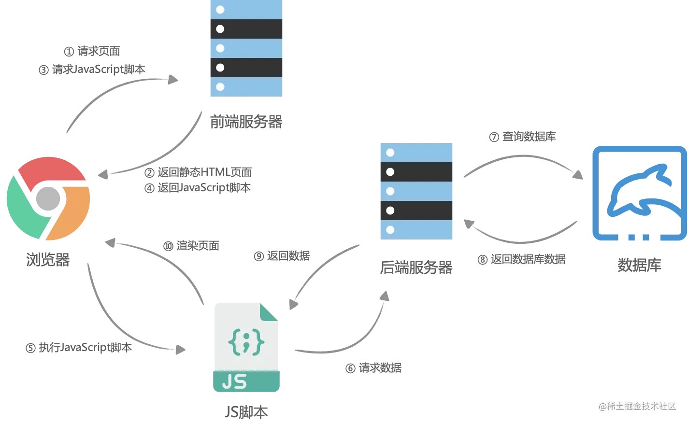
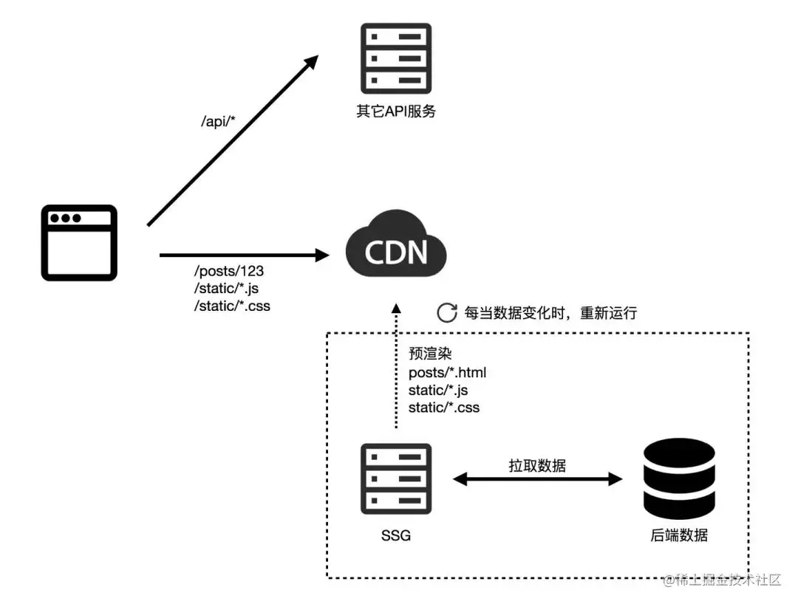
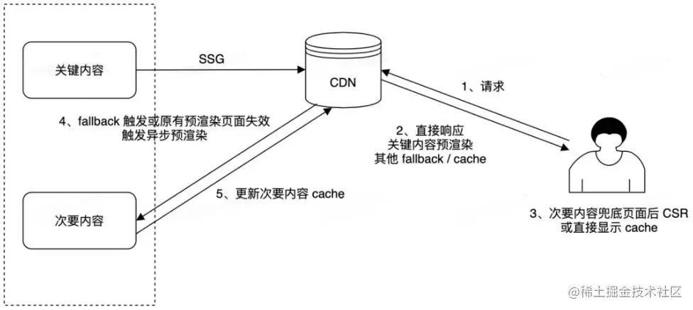

## SPA 与 MPA
- MPA

    MPA(multiple page application) 称为多页应用，指的的是多个页面的应用，从技术手段上来讲，你可以这么的粗略的理解
    - **首屏速度快**:各个页面相互独立，需要单独维护多个html页面，每个请求都直接返回html
    - **切换页面比较慢**: 基于原生浏览器的文档跳转(navigating across documents).因为每一次的页面更新都是一次重载，这将带来巨大的重启性能消耗。
    - **对SEO友好**: 页面在初始时,就具有全部页面内容而非「无状态」,从而大搞更好的收录效果

- SPA

    SPA(sigle page application)称为单页应用。通过js去感知到url的变化，动态的将当前页面的内容清除掉，然后将在下一个页面的内容挂载到当前页面上。此时的路由不是后端来做了，而是前端来做，动态显示需要的组件。

    - **页面切换速度快**:路由跳转是基于特定的实现(如vue-router,react-router等前端路由)，而非原生浏览器的文档跳转，避免了不必要的整个页面重载。
    - **前后端分离**:基于前端路由，SPA与应用后端解耦，使得前端不在依赖于后端的路由分配
    - **首屏时间慢**: 首屏除了html还要额外请求病执行js文件，通过js在页面上渲染首屏。
    - **SEO不友好**: 内容都是靠js渲染生成出来的，但搜索引擎并不是别这部分内容，导致SEO效果差
##  CSR(Client Side Rendering)

    CSR(客户端渲染)是一种在浏览器上执行Javascript以生成DOM并显示内容的渲染方法。CSR更贴近现代前端开发，我们通常使用的Vue和React默认使用CSR。其大致流程如下：

    对于典型的CSR应用程序，浏览器仅接收一个用作应用程序的HTML页面，因此也成为单页应用，所以CSR得特点与之前提到的SPA类似

    

## SSR

### 概念

### 同构直出

### 两个重要的概念
- 脱水
- 注水
### SSR与CSR的对比
- 优点
- 缺点
## SSG
### 概念
SSG(静态站点生成)与SSR的原理非常类似，但不同之处在于HTML文件是预先生成的，而不是在服务器实时生成的。
### 工作流程
1. 构建阶段：在构建过程中，SSG将源文件和模板(如HTML、CSS)结合，生成静态页面。这些页面通常由预定义的布局、组件和样式组成
2. 预渲染：SSG在构建过程中会自动执行预渲染。这意味着SSG会根据预定义的路由和数据源，在构建时候生成静态页面的多个实例。例如，对于一个博客，每篇文章都可以在构建过程中生成一个独立的静态页面
3. 静态输出: 一旦构建完成，SSG将生成的静态一噩梦输出到目标文件夹中。这些页面包含所有必要的HTML、CSS和Javascript文件，以及任何相关的静态资源(如图像、视频等)
4. 部署：生成的静态页面可以直接部署到任何支持静态文件的Web服务器上。因为这些页面不需要动态生成，所以它们可以被高效的缓存和交付给访问者，提供更好的性能和可扩展性。
5. 用户访问:首屏直接解析html生成dom。接着和SSR一样通过hydrate将整个应用转为React或vue应用，使用户在交互时与单页应用无异。

### 特点
SSG的优缺点都非常明显，通常适用于静态页面，例如文档、博客、帮助站点和电子商务产品

- 优点
    - 性能高: 相比SSR减轻了服务器压力，还可以将生成的静态资源放到CDN上，充分利用缓存
    - SEO友好：搜索引擎爬虫可以直接抓取到最终页面的内容
    - 易于部署：生成的静态页面可以直接部署到任何支持静态文件的 Web 服务器上，无需依赖 Node 环境等。
    - 高度安全性：由于服务器不需要运行程序，因此服务器漏洞仅限于操作系统本身，维护也更加方便。
- 缺点：
    - 静态：只适用于静态数据，对于经常改动的数据，需要每次重新生成页面

## ISR(Incremental Static Regeneration)
### 概念
ISR(增量式网站渲染)结合了SSG 和 SSR的优势。ISR的核心思想是将部分静态也在构建时生成，并在用户访问时进行增量更新

在ISR中，静态页面的构建仍然是在构建时完成的，类似于 SSG，然而，与完全静态的SSG不同，ISR允许某些页面在构建后仍保持动态，并在用户首次访问时进行渲染。一旦渲染完成，生成的静态页面被缓存，并在后续的请求中被直接提供，以提供性能和响应速度

### 工作流程
1. 构建阶段:在构建过程中，使用SSG(静态站点生成器)生成静态页面，并将这些页面上传到CDN。
2. 用户发起页面请求
    - 请求静态页面：CDN直接返回
    - 请求ISR页面，且该页面未被CDN缓存：直接响应fallback页面，浏览器接收到该页面后以CSR的形式；同时CDN会将请求转发到服务端，触发服务端渲染，服务器动态的生成页面内容，并返回给CDN进行缓存
    - 请求ISR页面，该页面 CDN 已有缓存且未过期：直接返回缓存的html页面
    - 请求ISR页面，该页面CDN已有缓存但已经过期：直接返回这份过期的缓存给浏览器，此时用户看到的是缓存已经过期的页面；通过CDN会将请求转发到服务端，触发服务端渲染，服务器动态的生成页面内容，并返回给CDN将该页面的缓存更新

### 特点
- 优点

    ISR的优势在于它在静态和动态之间找到了一个平衡点。对于不经常变动的内容，可以通过SSG生成完全静态页面，从而实现加载和地服务器负载。而对于可能需要频繁更新的部分，如评论区或实时数据，ISR可以使用SSR来动态生成这些内容，并在后续的请求中进行增量更新，从而保持页面的实时性
- 缺点

    - 访问到没有被预渲染过的次要内容触发 fallback ,需要进行CSR，加载较慢
    - 访问之前被预渲染过，但已经过期且未更新的页面，会得到过期的缓存响应，用户刷新一次，才能看到新的数据

### 应用场景
本质上来说，ISR让然是SSG的范畴，复杂场景让然无法应对。其典型应用场景包括博客评论、最新文章列表等。通过将这些动态内容与静态页面结合使用，可以在保持高性能和安全性的同时，提供更丰富和实时的用户体验

https://juejin.cn/post/7233699680490799162/