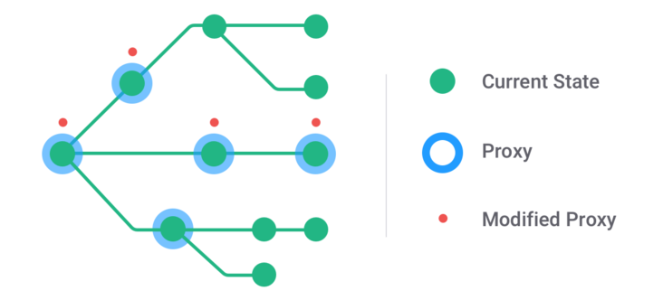

## ES6 Proxy作用
  - 代理
  - 不可变数据--> immer.js

## 什么是可变数据
首先需要先理解什么是可变数据:举个例子
```js
var objA = {name: '小明'}；
var objB = objA;
objB.name = '小红';
console.log(objA.name) // objA的那么也变成了小红
```
像这样我们明明只修改代码objB的name，发现ObjA也发生了改变，这个就是可变数据。

那不可变数据是什么呢？

**<span style="color: blue">不可变数据概念来源于函数式编程。函数式编程中，对已初始化的"变量"是不可以更改的，每次更改都要创建一个新的"变量"。新的数据进行有副作用的操作都不会影响之前的数据。这就是Immutabel的本质。</span>**

Javascript在语言层面没有实现不可变数据，需要借助第三方库来实现。Immer.js就是其中一种实现(类似的还有Imutable.js)

## Immer例子
Immer结合Copy-on-write机制与ES6 Proxy特性，提供了一种异常简介的不可变数据的操作方式
```js
const myStructure = {
  a: [1, 2, 3], 
  b: 0
}
const copy = produce(myStructure, () => {
  // nothings to do
})
const modified = produce(myStructure, myStructure => {
  myStructure.a.push(4);
  myStructure.b++
})

copy === myStructure // true
modified !== myStructure // true
JSON.stringify(modified) === JSON.stringify({a: [1,2,3,4], b: 1}) // true
JSON.stringify(myStructure) === JSON.stringify({A: [1,2,3], b: 0}) // true
```
这是怎么做到的呢？

## 目标
immer只有一个核心API
```js
produce(currentState, producer: (draftState) => void): nextState
```
所以，只要手动实现一个等价的produce函数，就能弄清楚Immer的秘密了

## 思路
仔细观察produce的用法，不难发现5个特点(见注释)
```js
const myStructure = {
  a: [1,2, 3], 
  b: 0
}
const copy = produce(myStructure, () => {});
const modified = produce(myStructure, myStructure => {
  // 1. 在producer函数中访问draftState，就像访问原值currentState一样
  myStructure.a.push(4);
  myStructur.b++;
})

// 2. producer中不修改draftState的话，引用不变，都指向原值
copy = myStructure // true
// 3. 改过draftState的话，引用发生变化，produce()返回新值
modified !== myStructure // true
// 4. produce函数中对draftState的操作都会应用到新值上
JSON.stringify(modified) === JSON.stringify({a: [1,2,3,4], b: 1}) // true
// 5. producer函数中对draftState的操作不影响原值
JSON.stringify(myStructure) === JSON.stringify({a: [1,2,3], b: 0}); // true
```
即：
- 仅在写时拷贝(注释2， 3）
- 读操作被代理到原址上(注释1)
- 写操作就被代理到拷贝值上(注释4， 5)

那么，**简单的骨架已经浮出水面了**
```js
function produce(currentState, producer) {
  const copy = null;
  const draftState = new Proxy(currentState, {
    get(target, key, receiver) {
      // todo把读操作代理到原值上
    }
    set() {
      if (!mutated) {
        mutated = true;
        // todo创建拷贝值
      }
      // todo把写操作代理到拷贝值上
    }
  })
  producer(draftState);
  return copy || currentState;
}
```
此外，由于Proxy只能监听到当前层的属性访问，所以代理关系也要按需创建


根节点预先创建一个Proxy,对象树上被访问到的所有中间节点(或新增子树的根节点)都要创建对应的Proxy。

而每个Proxy都只在监听到写操作(直接赋值、原生数据操作API等)时才创建拷贝值(所谓Copy-on-write),并将之后写操作全部代理到拷贝值上

最后，将这些拷贝值与原值整合起来，得到数据最后操作结果

因此Immer = Copy-on-write + Proxy

## 具体实现
按照上面的分析，实现主要分为3步
- 代理：按需创建、代理读写操作
- 拷贝：按需拷贝(Copy-on-write)
- 整合：建立拷贝值与原值的关联、深度merge原值与拷贝值

### 代理
拿到原值自后，先给根节点创建Proxy，得到供producer操作的draftState;
```js
function produce(original, producer) {
  const daft = proxy(original);
  // ...
}
```
最关键的当然是对原值get、set操作代理
```js
function proxy(original, onWrite) {
  // 存放代理关系及copy值
  let draftState = {
    originalValue: original,
    draftValue: Array.isArray(original) ? [] : Object.create(Object.getPrototypeOf(original)),o
    mutated: false,
    onWrite
  }
  // 创建根节点代理
  const draft = new Proxy(original, {
    // 读操作(代理属性访问)
    get(target, key, receiver) {
      if (typeof original[key] === 'object' && original[key] !== null) {
        // 不为基本类型的现有属性，创建下一层代理
        return proxyProp(original[key], key, draftState, onWrite);
      } else {
        // 改过直接从draft取最新状态
        if (draftState.mutated) {
          return draftValue[key];
        }

        // 不存在的，或者值为基本值的现有属性，代理到原值
        return Reflect.get(target, key, receiver);
      }
    }
        // 写操作（代理数据修改）
    set(target, key, value) {
      // 如果新值不为基本值类型，创建下一层代理
      if (typeof value === 'object') {
        proxyProp(value, key, draftState, onWrite);
      }
      // 第一次写时复制
      copyOnWrite(draftState);
      // 复制过了，直接写
      draftValue[key] = value;
      return true;
    }
  })
  return draft
}
```
P.S.此外，其余许多读写方法也需要代理，例如has、ownKeys、deleteProperty等等，处理方式类似，这里不再赘述

### 拷贝
即上面出现过的copyOnWrite函数
```js
function copyOnWrite(draftState) {
  const { originalValue, draftValue, mutated, onWrite } = draftState;
  if(!mutated) {
    draftState.mutated = true;
    // 下一层有修改时才往父级draftValue上挂
    if(onWrite) {
      onWrite(draftValue);
    }
    // 第一次写时复制
    copyProps(draftValue, originalValue);
  }
}
```
仅在第一次写时(!mutated)才将原值上的其余属性拷贝到draftValue上

特殊的，浅拷贝时需要注意属性描述符、Symbol属性等细节
```js
// 跳过target身上已有的属性
function copyProps(target, source) {
  if (Array.isArray(target)) {
    for (let i = 0; i < source.length; i++) {
      // 跳过在更深层已经被改过的属性
      if(!(i in target)) {
        target[i] = source[i];
      }
    }
  } else {
    Reflect.ownKeys(source).forEach(key => {
      const desc = Object.getOwnPropertyDescriptor(source, key);
      // 跳过已有属性
      if(!(key in target)) {
        Object.defineProperty(target, key, desc);
      }
    })
  }
}
```
P.S.Reflect.ownKeys能够返回对象的所有属性名（包括 Symbol 属性名和字符串属性名）

### 整合
要想把拷贝值与原值整合起来，先要建立两种关系：
- 代理与原值、拷贝值的关联：根节点的代理需要将结果带出来
- 下层拷贝值与祖先拷贝值的关联：拷贝值要能轻松对应结果树上

对于第一个问题，只需要将代理对象对应的draftState暴露出来即可
```js
const INTERNAL_STATE_KEY = Symbol('state');
function proxy(original, onWrite) {
  let draftState = {
    originalValue: original,
    draftValue,
    mutated: false,
    onWrite
  };
  const draft = new Proxy(original, {
    get(target, key, receiver) {
      // 建立proxy到draft值的关联
      if (key === INTERNAL_STATE_KEY) {
        return draftState;
      }
      //...
    }
  }
}
```
至于第二个问题，可以通过onWrite钩子来简历下层拷贝值与组件拷贝值的关联
```js
// 创建下一层代理
function proxyProp(propValue, propKey, hostDraftState) {
  const {originalValue, draftValue, onWrite} = hostDraftState;
  // 下一层属性发生写操作时
  const onPropWrite = (value) => {
    // 按需创建父级拷贝值
    if (!draftValue.mutated) {
      hostDraftState.mutated = true;
      // 拷贝host所有属性
      copyProps(draftValue, originalValue);
    }
    // 将子级拷贝值挂上去（建立拷贝值的父子关系）
    draftValue[propKey] = value;
    // 通知祖先，向上建立完整的拷贝值树
    if (onWrite) {
      onWrite(draftValue);
    }
  };
  return proxy(propValue, onPropWrite);
}
```
也就是说， **深层属性第一次发生写操作时，向上按需拷贝，构造拷贝值树**

至此大功告成
```js
function produce(original, producer) {
  const draft = proxy(original);
  // 修改draft
  producer(draft);
  // 取出draft内部状态
  const { originalValue, draftValue, mutated } = draft[INTERNAL_STATE_KEY];
  // 将改过的新值patch上去
  const next = mutated ? draftValue : originalValue;
  return next;
}
```

## 在线demo
鉴于手搓的版本要比原版更精简一些，索性少个 m，就叫 imer：

- Git repo：[ayqy/imer](https://github.com/ayqy/imer)
- npm package：[imer](https://www.npmjs.com/package/imer)


## 资料
[不可变数据实现](https://juejin.cn/post/7047450607984541710)

[ES6 Proxy 在 Immer 中的妙用](https://segmentfault.com/a/1190000022951743)