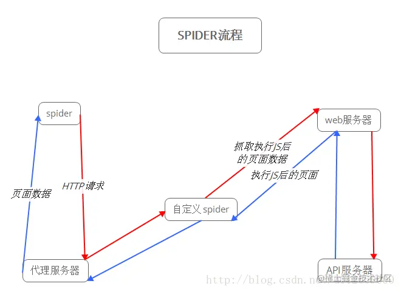
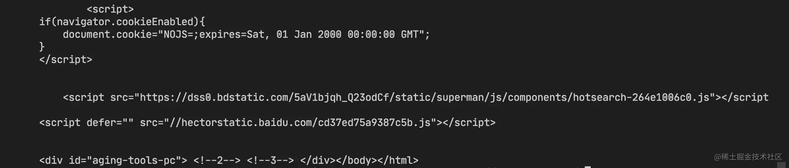

> 通过在nginx里拦截判断ua的http_user_agent是否属于爬虫，如果不是，则正常返回页面，如果是则先通过PlantomJS渲染完整的HTML后在返回

> 只要两条路线返回的内容基本一致，就不会被搜索引擎出发，认为是作弊手段



## 安装PhantomJS
MAC本地
> brew update && brew cask install phantomjs

phantomjs -v查看
> 2.1.1

## 编写搅拌文件 spider.js
```js
// spider.js
'use strict';

console.log('=====start=====');

// 单个资源等待时间，避免资源加载后还需要加载其他资源
var resourceWait = 500;
var resourceWaitTimer;

// 最大等待时间
var maxWait = 5000;
var maxWaitTimer;

// 资源计数
var resourceCount = 0;

// PhantomJS WebPage模块
var page = require('webpage').create();

// NodeJS 系统模块
var symstem = require('system');

// 从CLI中获取第二个参数为目标URL
var url = system.args[1];

// 设置PhantomJS视窗大小
page.viewportSize = {
    width: 1280,
    height: 1014
}

// 获取镜像
var capture = function(errCode) {
    // 外部通过stdout获取页面内容
    console.log(page.content);

    // 清除计数器
    clearTimeout(maxWaitTimer);

    // 任务完成，正常退出
    phantom.exit(errCode)
}

// 资源请求并计数
page.onResourceRequested = function(req) {
    resourceCount++;
    clearTimeout(resourceWaitTimer);
}

// 资源加载完毕
page.onResourceReceived = function(res) {
    // chunk模式的HTTP回报，会多次出发resourceReceived事件，需要判断资源是否已经end
    if(res.stage !== 'end') {
        return;
    }
    resourceCount--;

    if(resourceCount === 0) {
        // 当页面中全部资源都加载完毕后，截取当前渲染出来的html
        // 由于onResourceReceived在资源加载完毕后就立即被调用了，我们需要给一些事件让JS跑解析任务
        // 这里默认预留500毫秒
        resourceWaitTimer = setTimeout(capture, resourceWait)
    }
}
// 资源加载超时
page.onResourceTimeout = function (req) {
	resouceCount--;
};

// 资源加载失败
page.onResourceError = function (err) {
	resourceCount--;
};

// 打开页面
page.open(url, function (status) {
	if (status !== 'success') {
		phantom.exit(1);
	} else {
		// 当改页面的初始html返回成功后，开启定时器
		// 当到达最大时间（默认5秒）的时候，截取那一时刻渲染出来的html
		maxWaitTimer = setTimeout(function () {
			capture(2);
		}, maxWait);
	}
});
```
## 本地测试百度
```js
phantomjs spider.js 'www.baidu.com/'
```
返回HTML结构则说明成功，但确实访问速度明显降低



## 命令服务化
要做到响应搜索引擎爬虫的请求，我们需要将此命令服务化，通过node起个简单的web服务
```js
// server.js
// ExpressJS调用方式
var express = require('express');
var app = express();

// 引入NodeJS的子进程模块
var child_proces = require('child_process');

app.get('*', (req, res) => {
    // 完整URL
    var url = req.protocol + '://' + req.hostname + req.originalURL;

    // 预渲染后的页面字符串容器
    var content = '';

    // 开启一个phantomjs子进程
    var phantom = child_process.spawn('phantomjs', ['spider.js', url]);

    // 设置stdout字符编码
    phantom.stdout.setEncoding('utf8');

    // 监听phantomjs的stdout,并拼接起来
    phantom.stdout.on('data', function(data) {
        content += data.toString();
    })

    // 监听子进程退出事件
    phantom.on('exit', function(code){
        switch (code){
            case 1:
                console.log('加载失败');
                res.send('加载失败');
                break;
            case 2:
                console.log('加载超时: '+ url);
                res.send(content);
                break;
            default:
                res.send(content);
                break;
        }
    });
})
app.listen(3000, function () {
  console.log('Spider app listening on port 3000!');
});
```
运行node server.js，此时我们已经有了一个预渲染的web服务啦，接下来的工作便是将搜索引擎爬虫的请求转发到这个web服务，最终将渲染结果返回给爬虫。

为了防止node进程挂掉，可以使用nohup来启动，nohup node server.js &。

通过Nginx配置，我们可以轻松的解决这个问题。
```js
upstream spider_server {
  server localhost:3000;
}

server {
    listen       80;
    server_name  example.com;
    
    location / {
      proxy_set_header  Host            $host:$proxy_port;
      proxy_set_header  X-Real-IP       $remote_addr;
      proxy_set_header  X-Forwarded-For $proxy_add_x_forwarded_for;

      if ($http_user_agent ~* "Baiduspider|twitterbot|facebookexternalhit|rogerbot|linkedinbot|embedly|quora link preview|showyoubot|outbrain|pinterest|slackbot|vkShare|W3C_Validator|bingbot|Sosospider|Sogou Pic Spider|Googlebot|360Spider") {
        proxy_pass  http://spider_server;
      }
}
```
## PhantomJS方案优缺点
- 优点
    - 对VUE代码改动冲击小，甚至可以基本无改动，开发成功相对其他SEO方案最低
    - SEO方案可以抽离出来，供别的项目使用
- 缺点
    - 访问速度慢
    - 部分ES6编译可能会出现问题，例如Set、Promise等
    - 高并发访问服务器压力大


## 资料
[使用PhantomJS解决VUE的SEO方案](https://juejin.cn/post/7033661909756968973#heading-1)