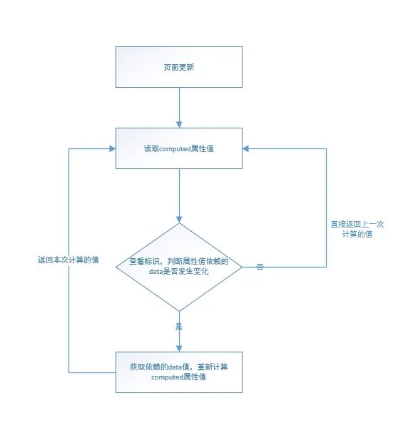
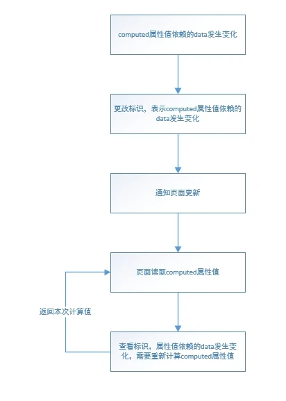

1. 每个computed属性都会生成对应的观察者(Watcher实例),观察者存在values属性和get方法。computed属性的getter函数会在get方法中调用，并将返回值赋值给value。初始设置dirtry和lazy的值为true,lazy为true不会立即get方法(懒执行)，而是在读取computed值时候执行

    ```js
    function initComputed(vm, computed) {
        var watchers = vm._computedWatchers = Object.create(null); // 存放computed的观察者
        var isSSR = isServerRendering();
        for(var key in computed) {
            var userDef = computed[key];
            var getter = typeof userDef === 'function' ? userDef : userDef.get;
            ...
            wachers[key] = new Watcher( // 生成观察者(Watcher实例)
                vm,
                getter || noop, // getter将在观察者get方法中执行
                noop,
                computedWatchersOptions, // { lazy: true } 懒执行，暂不执行get方法，当读取computed属性值执行
            )
            ...
            defineComputed(vm, key, userDef);
        }
    } 
    ```
2. 将computed属性添加到组件实例上，并通过get、set获取或设置属性值，并且重新定义getter函数

    ```js
    function defineComputed(target, key, userDef) {
        var shouldCache = !isServerRendering();
        ...
        sharedPropertyDefinition.get = shouldCache // 重定义getter函数
            ? createComputedGetter(key)
            : createGetterInvoker(userDef);
    ...
        Object.defineProperty(target, key, sharedPropertyDefinition); // 将computed属性添加到组件实例上
    }

    // 重定义的getter函数
    function createComputedGetter(key) {
        return function computedGetter() {
            var watcher = this._computedWatchers && this._computedWatchers[key];
            if (watcher) {
                if (watcher.dirty) {
                    // true，懒执行
                    watcher.evaluate(); // 执行watcher方法后设置dirty为false
                }
                if (Dep.target) {
                    watcher.depend();
                }
                return watcher.value; //返回观察者的value值
            }
        };
    }
    ```
3. 页面初始渲染时，读取computed属性值，触发重定义后的getter函数。由于观察者的dirty值为true，将会调用get方法，执行原始getter函数。getter函数中会读取data（响应式）数据，读取数据时会触发data的getter方法，会将computed属性对应的观察者添加到data的依赖收集中(用于data变更时通知更新)。观察者的get执行完成之后，更新观察者的value值，并将dirty设置为false，表示value值已更新，之后在执行观察着的depend方法，将上层观察者(该观察者包含页面更新的方法，方法中读取了computed属性值)也添加到getter函数中的收集依赖中(getter中的data的依赖器收集器包含computed对应的观察者，以及包含页面更新方法(调用了computed属性)的观察者)，最后返回computed观察者的value值。

    

4. 当更改了computed属性getter函数依赖的data值时，将会根据之前依赖收集的观察者，依次调用观察者的update方法，先调用computed观察者的update方法，由于lazy为true，将会设置观察者的dirty为true,表示computed属性getter函数依赖的data值发生变化，但不调用观察者的get方法更新value值。在调用包含页面更新方法的观察者的update方法，在更新页面时会读取computed属性值，触发重定义的getter函数，此时由于computed属性观察者ditry为true，调用该观察者的get方法更新value值，并返回，完成页面渲染

    

5. <span style="color: blue">dirty值初始值为true, 即首次读取computed属性值时，根据setter计算属性值，并保存在观察者的value上，然后设置dirty值为false。之后读取computed属性值时，dirty值为false,不用调用setter重新计算值，而是直接返回观察者的value，也就是上一次计算值。只有当computed属性setter函数依赖的data发生变化时，才会设置dirty为true,即下一次读取computed属性值时调用setter重新计算值。也就是说，computed属性依赖的data不发生变化时，不会调用setter函数重新计算值，而是读取上一次计算值</span>


## 资料
[原文](https://segmentfault.com/a/1190000022169550)