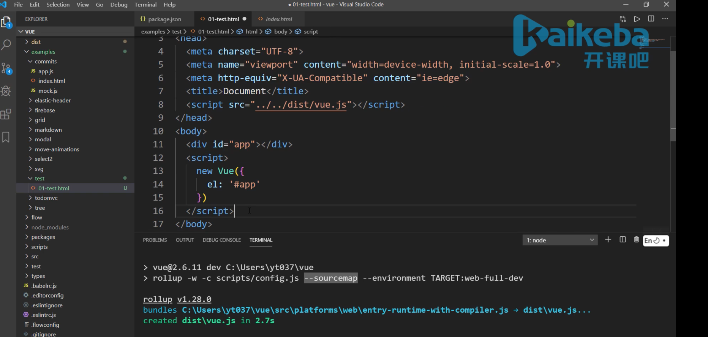

1. 搭建调试环境
    - 获取地址：https://github.com/vuejs/vue
    - 安装依赖: npm i
    - 安装rollup： npm i -g rollup
    - 修改打包脚本
    - 执行脚本 npm run dev
    ```
    git clone https: //github.com/vuejs/vue
    cd ./vue/
    npm install

    // package.json
    "dev": "rollup -w -c scripts/config.js --sourcemap --environmment TARGET:web-full-dev"
    ```

2. 调试技巧
    - 打开指定文件： ctrl + p
    - 断点
    - 单步执行
    - 查看调用栈-- Call Stack
    - 定位源文件所在位置-- 右键->Reveal in sidebar




开发者工具 -> sources -> common+p  