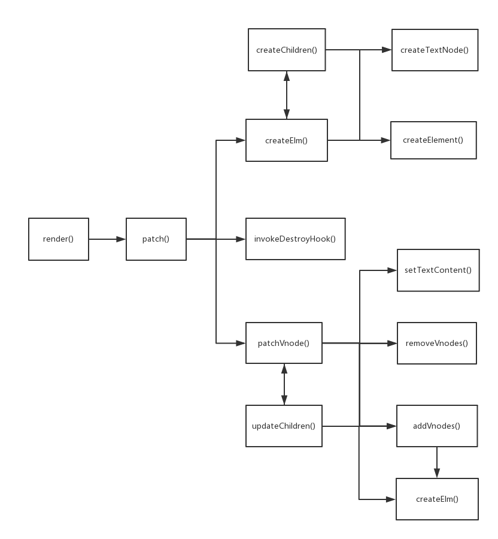

## 概述
本文主要介绍在视图的渲染过程中，Vue是如何把vnode解析并挂载到页面中。我们通过一个最简单的例子来分析主要流程
```html
<div id="app">
    {{someVar}}
</div>
<script type="text/javascript">
    new Vue({
        el: '#app',
        data: {
            someVar: 'init'
        },
        mounted() {
            setTimeout(() => this.someVar = 'changed', 3000);
        }
    })
</script>
```
页面初始会显示"init"字符串，3秒之后，会更新为"changed"字符串。

为了便于理解，将流程分为两个阶段
1. 首次渲染，生成vnode,并将其挂载到页面中
2. 再次渲染，根据更新后的数据，再次生成vnode，并将其更新到页面中

## 第一阶段
### 流程
```js
vm.$mount(vm.$el) => render => compileToFunctions(template).render => updateComponent() => vnode => render() => vm._update(vnode) => patch(vm.$el, vnode)
```
### 说明
由render()方法生成vnode，然后由patch()方法挂载到页面中

- render()方法
    
    render()方法根据当前vm的数据生成vnode。该方法可以是新建Vue实例时传入的render()方法，也可以由Vue的 Compiler 模块传入的teplate自动生成

    本例中该方法是由el属性对应的template生成的，代码如下
    ```js
    (function() {
        with(this) {
            return _c('div', {
                attrs: {
                    'id'： 'app'
                }
            }, [_v("\n" + _s(someVar) + "\n")])
        }
    })
    ```
    实例化Vue时传入这样的参数可以达到相似的效果(区别在于变量两边的空格):
    ```js
    new Vue({
        data: {
            someVal: 'init',
        },
        render: function(createElement) {
            return createElement(
                'div',
                {
                    attrs: {
                        'id': 'app'
                    }
                },
                [
                    this.someVar
                ]
            )
        },
        mounted() {
            setTimeout(() => this.someVal = 'changed', 3000);
        }
    }).$mount('#app')
    ```
- Vnode()类

    Vnode是虚拟DOM节点类，其实Vnode是一个包含着渲染DOM节点所需要的一切信息的普通对象

    上述的render()方法调用后会生成vnode，这是第一次生成，将其成为 initVnode 结构如下(选区部分属性)
    ```js
    {
        children: [
            {
                children: undefined,
                data: undefined,
                elm: undefined,
                tag: undefined,
                text: undefined
            }
        ],
        data: {
            attrs: {
                id: 'app'
            }
        },
        elm: undefined,
        tag: 'div',
        text: undefined
    }
    ```
    简要介绍其属性

    1. children是当前vnode的子节点(VNodes)数组，当前只有一个文本子节点
    2. data是当前vnode代表的节点的各种属性，是createElement()方法的第二个参数
    3. elm是根据vnode生成HTML元素挂载到页面中后对应的DOM节点，此时还没有挂载，所以为空
    4. tag是当前 vnode 对应的html标签
    5. text是当前 vnode 对应的文本或注释

    children和text是互斥的，不会同时存在

    生成vnode之后，就要根据其属性生成DOM元素并挂载到页面中了，这是patch()方法要做的事情，下面看其内部的流程
    ```js
    patch(vm.$el, vnode) => createElm(vnode,[], parentElm, nodeOps.nextSibling(oldElm)) => removeVnodes(parentElm, [oldVnode], 0, 0)
    ```
    <span style="color: red">**patch(oldVnode, vnode) 方法**</span>

    根据参数的不同，该方法的处理方式也不同，oldVnode 有这几种可能的取值：undefined、ELEMENT_NODE、VNode，vnode 有这几种可能的取值：undefined、VNode，所以组合起来一共是 3 * 2 = 6 种处理方式：

    oldVnode | vnode | 操作
    ---|---|---
    undefined | undefined | -
    ELEMENT_NODE | undefined | invokeDestroyHook(oldVnode)
    Vnode | undefined |invokeDestroyHook(oldVnode)
    undefined | Vnode | createElm(vnode, [], parentElm, refElm)
    ELEMENT_NODE | Vnode | createElm(vnode, [], parentElm, refElm)
    Vnode | Vnode | patchVnode(oldVnode, vnode)

    可以看到，处理方式可以分为3种情况：
    1. 如果 vnode 为 undefined，就要删除节点
    2. 如果 oldVnode 是 undefined 或者是 DOM 节点，vnode 是 VNode 实例的话，表示是第一次渲染 vnode，调用 createElm() 方法创建新节点
    3. 如果 oldVnode 和 vnode 都是 VNode 类型的话，就要调用 patchVnode() 方法来对 oldVnode 和 vnode 做进一步处理了，第二阶段流程会介绍这种情况


----
...


## 第二阶段
### 流程
```js
updateComponent() => vnode = render() => vm._update(vnode) => patch(oldVnode, vnode)
```
第二阶段渲染时，会根据更新后的 vm 数据，再次生成 vnode 节点，称之为 updateVnode，结构如下：
```js
{
    children: [
        {
            children: undefined,
            data: undefined,
            elm: undefined,
            tag: undefined,
            text: 'changed'
        }
    ],
    data: {
        attrs: {
            id: 'app'
        }
    },
    elm: undefined,
    tag: 'div',
    text: undefined
}
```
可以看到， updateVnode 与 最初生成的 initVnode 的区别就是子节点的 text 属性由 init 变为了 changed，正是符合我们预期的变化。

生成新的 vnode 之后，还是要调用 patch 方法对 vnode 做处理，不过这次参数发生了变化，第一个参数不再是要挂载的DOM节点，而是 initVnode，本次 patch() 方法调用的流程如下：

patch(oldVnode, vnode) => patchVnode(oldVnode, vnode) => updateChildren(elm, oldCh, ch) => patchVnode(oldCh, ch) => nodeOps.setTextContent(elm, vnode.text)

其中 oldVnode 就是第一阶段保存的 vm._vnode，elm 就是第一阶段更新的 elm 属性。

根据上面对 patch() 方法的分析，此时 oldVnode 和 vnode 都是 VNode 类型，所以调用 patchVnode() 方法做进一步处理。

---
...



## 资料
[vue 声明周期](/source-vue/vue-statement.html#vue的父子组件生命周期)

[vue源码学习-vnode的挂载和更新流程](https://www.cnblogs.com/zhaoran/p/7600849.html)