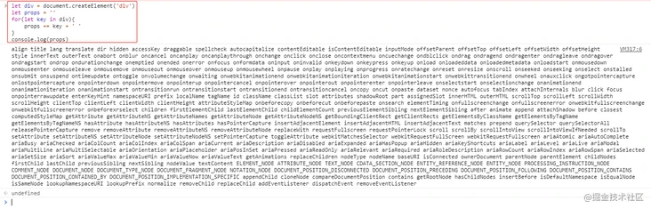
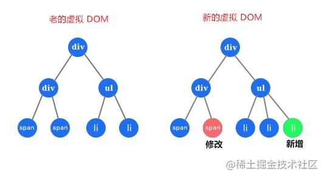
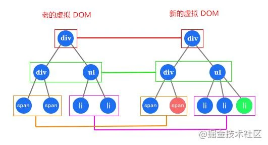
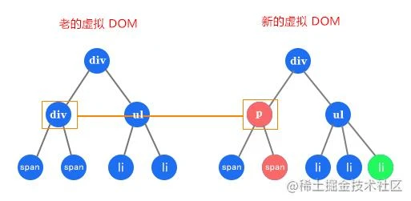
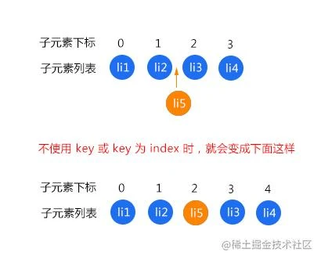
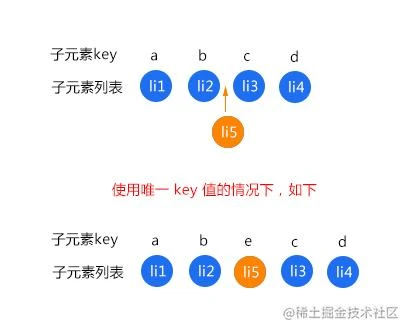
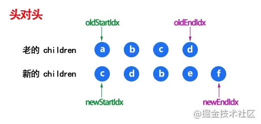

因为Diff算法，计算的就是虚拟DOM的差异,所以先铺垫一点点虚拟DOM，了解一下其结构，再来一层层揭开Diff算法的面纱，深入浅出，助你彻底弄懂Diff算法原理

## 认识虚拟DOM
虚拟DOM简单说就是<span style="color:blue">**用JS对象来模拟DOM结构**</span>

那它是怎么用JS对象模拟DOM结构的呢？例子
```html
<template>
    <div id="app" class="container">
        <h1>慕华</h1>
    </div>
</template>
```
上面的模板转成虚拟DOM就是下面这样的
```js
{
    tag: 'div',
    props: { id: 'app', class: 'container' },
    children: [
        { tag: 'h1', children: '慕华' }
    ]
}
```
这样的DOM结构就称为**虚拟DOM(Virtual Node),简称vnode**。

它的表达方式就是把每一个标签都转为一个对象，这个对象可以有三个属性：tag、props、children

- <span style="color: blue">tag: 必选。就是标签。也可以是组件，或者函数</span>
- <span style="color: blue">props: 非必选。就是这个标签上的属性和方法</span>
- <span style="color: blue">children: 非必选。就是这个标签的内容或者子节点，如果是文本节点就是字符串，如果有子节点就是数组。换句话说 如果判断children是字符串的话，就表示一定是文本节点，这个节点肯定没有子元素</span>

<span style="color: red">为什么要使用虚拟DOM呢?</span>看个图


<span style="color: blue">如图可以看出原生DOM有非常多的属性和时间，就算是创建一个空div也要付出不小的代价。而使用虚拟DOM来提升性能的点在于DOM发生变化的时候，通过Diff算法和数据改变前的DOM对比，计算出需要更改的DOM，然后只对变化的DOM进行操作，而不是更新整个视图。</span>

在 Vue 中是怎么把 DOM 转成上面这样的虚拟 DOM 的呢，有兴趣的可以关注我另一篇文章详细了解一下 Vue 中的模板编译过程和原理

<span style="color: blue">在Vue 里虚拟DOM的数据更新机制采用的是异步更新队列，就是把变更后的数据装入一个数据更新的异步队列，就是patch,用它来做新老vnode对比</span>

## 认识Diff算法
<span style="color: blue">Diff算法，在Vue 里面就是叫做patch，它的核心就是参考[Snabbdom](https://github.com/snabbdom/snabbdom)，通过新旧虚拟DOM对比(即patch过程)，中出最小变化的地方转为进行DOM操作</span>

:::danger
扩展
在Vue1 里是没有patch的,每个依赖都有单独的Watcher负责更新，当项目规模变大的时候性能就更不上，所以在Vue2里为了提升性能，改为每个组件只有一个Watcher,那我们需要更新的时候，怎么才能精确找到组件里发生变化的位置呢？所以patch它来了
:::
<span style="color:red">那么它是什么时候执行的呢？</span>

<span style="color: blue">在页面首次渲染的时候会调用一次patch并创建vnode,不会进行更深层次的比较</span>

<span style="color: blue">然后是在**组件中数据发生变化时**，会触发setter然后通过Notify通知Watcher，对应的Watcher会通知更新并执行更新函数，它会执行render函数获取新的虚拟DOM，然后执行patch对比上次渲染结果老的虚拟DOM，并计算出最小的变化，然后在去根据这个最小的变化去更新真实的DOM，也就是视图</span>

那么它是怎么计算的？先看个图



比如有上图这样的DOM结构，是怎么计算出变化？简单来说就是

- <span style="color:blue">遍历老的虚拟DOM</span>
- <span style="color:blue">遍历新的虚拟DOM</span>
- <span style="color:blue">然后根据变化，比如上面的改变和新增，在重新排序</span>

可是这样会有很大问题，加入有1000个节点，就需要计算1000<sup>3</sup>，也就是10亿次，这样是无法让然接受的，所以Vue或React里使用Diff算法的时候都遵循深度优先，同层比较的策略做了一些优化，来计算出最小变化

## Diff算法的优化
### 1.只比较同一层级，不跨级比较
如图，Diff过程只会把同颜色框起来的同一层级的DOM进行比较，这样简化比较次数，这是第一个方面



### 2.比较标签名
如果同一层级的比较标签名不同，就直接移除老的虚拟DOM对应的节点，不继续按这个树状结构做深度比较，这是简化比较次数的第二个方面



### 3.比较key
如果标签名相同，key也相同，就会认为是相同节点，也不继续按这个树状结构做深度比较，比如我们写v-for的时候会比较key，不写key就会报错，这也就是因为Diff算法需要比较key。

面试中有一道特别常见的题，就是让你说一下 key 的作用，实际上考查的就是大家对虚拟 DOM 和 patch 细节的掌握程度，能够反应出我们面试者的理解层次，所以这里扩展一下 key

### Key的作用
比如有一个列表，我们需要在中间插入一个元素，会发生什么变化呢？先看个图



如图的li1和li2不会重新渲染,这个没有争议的。而li3、li4、li5都会重新渲染。

<span style="color: blue">因为在不是用key或列表的index作为key的时候，每个元素对应的位置关系都是index，上图中的结果直接导致我们插入的元素到后面的全部元素，对应的位置关系都发生了变化，所以全部都会执行更新操作，这可不是我们想要的，我们希望的是渲染添加的那一个元素，其他四个元素不做任何变更，也就不要重新渲染。</span>

而在使用唯一key的情况下，每个元素对应的位置关系就是key，来看一个使用唯一key值的情况下



这样如图中的li3和li4就不会重新渲染，因为元素内容没发生改变，对应的位置关系也没有发生变化

这也算为什么v-for必须要写key，而且不建议开发中使用数组的index作为key的原因

总结一下
- <span style="color: blue">**key的作用是为了更高效的更新虚拟DOM，因为它可以非常精确的找到相同节点，因此patch过程会非常高效**</span>
- <span style="color: blue">**Vue 在patch过程中会判断两个节点是不是相同节点时,key是一个必要条件**。比如渲染列表时，如果不写key, Vue在比较的时候，就可能会导致频繁更新元素，使整个patch过程比较低效，影响性能</span>
- <span style="color: blue">应该避免使用数组下标作为key,因为key值不是唯一的话可能上图中表示的bug，使Vue无法区分它它，还有比如在使用相同标签元素过度切换的时候，就会导致只替换其内部属性而不会触发过度效果</span>
- <span style="color: blue">从源码里可以知道，Vue判断两个节点是否相同时主要判断两者的元素类型和key等，如果不设置key,就可能永远任务这两个是相同节点，只能去做更新操作，就造成大量不必要的DOM更新操作，明显不可取</span>

有兴趣的可以去看一下源码：src\core\vdom\patch.js -35行 sameVnode()，下面也有详细介绍

## Diff算法核心原理--源码
上面说了Diff 算法，在 Vue 里面就是 patch，铺垫了这么多，下面进入源码里看一下这个神乎其神的 patch 干了啥？

### patch
源码地址：src/core/vdom/patch.js -700行

其实patch就是一个函数，我们先介绍一下源码里的核心流程，再来看一下patch的源码，源码里每一行也有注释

它可以接受四个参数，主要还是前两个
- <span style="color:blue">**oldVnode**: 老的虚拟DOM节点</span>
- <span style="color:blue">**vnode**: 新的虚拟DOM节点</span>
- <span style="color:blue">**hydrating**: 是不是要和真实DOM混合，服务端渲染的话会用到，这里不过多说明</span>
- <span style="color:blue">**removeOnly**: transition-group会用到，这里不过多说明</span>

主要流程是这样的
- vnode不存在，oldVnode存在，就删掉oldVnode
- vnode存在，oldVnode不存在，就创建vnode
- 两个都存在的话，通过sameVnode函数(后面详解)对比是不是同一个节点
    - 如果是同一个节点的话，通过patchVnode进行后续对比节点文本变化或子节点变化
    - 如果不是同一个节点，就把vnode挂载到oldVnode的父元素下
        - 如果组件的根节点被替换，就遍历更新父节点，然后删掉旧的几点
        - 如果是服务端渲染就用hydrating把oldVnode和真实DOM混合

下面看完整的patch函数源码
```js
// 两个判断函数
function isUndef (v: any): boolean %checks {
  return v === undefined || v === null
}
function isDef (v: any): boolean %checks {
  return v !== undefined && v !== null
}
return function patch (oldVnode, vnode, hydrating, removeOnly) {
    // 如果新的 vnode 不存在，但是 oldVnode 存在
    if (isUndef(vnode)) {
      // 如果 oldVnode 存在，调用 oldVnode 的组件卸载钩子 destroy
      if (isDef(oldVnode)) invokeDestroyHook(oldVnode)
      return
    }

    let isInitialPatch = false
    const insertedVnodeQueue = []
    
    // 如果 oldVnode 不存在的话，新的 vnode 是肯定存在的，比如首次渲染的时候
    if (isUndef(oldVnode)) {
      isInitialPatch = true
      // 就创建新的 vnode
      createElm(vnode, insertedVnodeQueue)
    } else {
      // 剩下的都是新的 vnode 和 oldVnode 都存在的话
      
      // 是不是元素节点
      const isRealElement = isDef(oldVnode.nodeType)
      // 是元素节点 && 通过 sameVnode 对比是不是同一个节点 (函数后面有详解)
      if (!isRealElement && sameVnode(oldVnode, vnode)) {
        // 如果是 就用 patchVnode 进行后续对比 (函数后面有详解)
        patchVnode(oldVnode, vnode, insertedVnodeQueue, null, null, removeOnly)
      } else {
        // 如果不是同一元素节点的话
        if (isRealElement) {
          // const SSR_ATTR = 'data-server-rendered'
          // 如果是元素节点 并且有 'data-server-rendered' 这个属性
          if (oldVnode.nodeType === 1 && oldVnode.hasAttribute(SSR_ATTR)) {
            // 就是服务端渲染的，删掉这个属性
            oldVnode.removeAttribute(SSR_ATTR)
            hydrating = true
          }
          // 这个判断里是服务端渲染的处理逻辑，就是混合
          if (isTrue(hydrating)) {
            if (hydrate(oldVnode, vnode, insertedVnodeQueue)) {
              invokeInsertHook(vnode, insertedVnodeQueue, true)
              return oldVnode
            } else if (process.env.NODE_ENV !== 'production') {
              warn('这是一段很长的警告信息')
            }
          }
          // function emptyNodeAt (elm) {
          //    return new VNode(nodeOps.tagName(elm).toLowerCase(), {}, [], undefined, elm)
          //  }
          // 如果不是服务端渲染的，或者混合失败，就创建一个空的注释节点替换 oldVnode
          oldVnode = emptyNodeAt(oldVnode)
        }
        
        // 拿到 oldVnode 的父节点
        const oldElm = oldVnode.elm
        const parentElm = nodeOps.parentNode(oldElm)
        
        // 根据新的 vnode 创建一个 DOM 节点，挂载到父节点上
        createElm(
          vnode,
          insertedVnodeQueue,
          oldElm._leaveCb ? null : parentElm,
          nodeOps.nextSibling(oldElm)
        )
        
        // 如果新的 vnode 的根节点存在，就是说根节点被修改了，就需要遍历更新父节点
        if (isDef(vnode.parent)) {
          let ancestor = vnode.parent
          const patchable = isPatchable(vnode)
          // 递归更新父节点下的元素
          while (ancestor) {
            // 卸载老根节点下的全部组件
            for (let i = 0; i < cbs.destroy.length; ++i) {
              cbs.destroy[i](ancestor)
            }
            // 替换现有元素
            ancestor.elm = vnode.elm
            if (patchable) {
              for (let i = 0; i < cbs.create.length; ++i) {
                cbs.create[i](emptyNode, ancestor)
              }
              const insert = ancestor.data.hook.insert
              if (insert.merged) {
                for (let i = 1; i < insert.fns.length; i++) {
                  insert.fns[i]()
                }
              }
            } else {
              registerRef(ancestor)
            }
            // 更新父节点
            ancestor = ancestor.parent
          }
        }
        // 如果旧节点还存在，就删掉旧节点
        if (isDef(parentElm)) {
          removeVnodes([oldVnode], 0, 0)
        } else if (isDef(oldVnode.tag)) {
          // 否则直接卸载 oldVnode
          invokeDestroyHook(oldVnode)
        }
      }
    }
    // 返回更新后的节点
    invokeInsertHook(vnode, insertedVnodeQueue, isInitialPatch)
    return vnode.elm
  }
```

### sameVnode
源码地址：src/core/vdom/patch.js -35行

<span style="color: blue">**用来判断是不是同一个节点的函数**</span>

```js
function sameVnode (a, b) {
  return (
    a.key === b.key &&  // key 是不是一样
    a.asyncFactory === b.asyncFactory && ( // 是不是异步组件
      (
        a.tag === b.tag && // 标签是不是一样
        a.isComment === b.isComment && // 是不是注释节点
        isDef(a.data) === isDef(b.data) && // 内容数据是不是一样
        sameInputType(a, b) // 判断 input 的 type 是不是一样
      ) || (
        isTrue(a.isAsyncPlaceholder) && // 判断区分异步组件的占位符否存在
        isUndef(b.asyncFactory.error)
      )
    )
  )
}
```
### patchVnode
源码地址：src/core/vdom/patch.js -501行

<span style="color: blue">**这个是在新的vnode和oldVnode是同一个节点的情况下，才会执行的函数，主要是对比节点文本变化或子节点变化**</span>

还是先介绍一下主要流程，再看源码吧，流程是这样的：

- <span style="color: blue">如果oldVnode和vnode的引用地址是一样的，就表示节点没有变化，直接返回</span>
- <span style="color: blue">如果 oldVnode 的 isAsyncPlaceholder 存在，就跳过异步组件的检查，直接返回</span>
- <span style="color: blue">如果 oldVnode 和 vnode 都是静态节点，并且有一样的 key，并且 vnode 是克隆节点或者 v-once 指令控制的节点时，把 oldVnode.elm 和 oldVnode.child 都复制到 vnode 上，然后返回</span>
- <span style="color: blue">如果 vnode 不是文本节点也不是注释的情况下</span>
    - 如果 vnode 和 oldVnode 都有子节点，而且子节点不一样的话，就调用 updateChildren 更新子节点
    - 如果只有 vnode 有子节点，就调用 addVnodes 创建子节点
    - 如果只有 oldVnode 有子节点，就调用 removeVnodes 删除该子节点
    - 如果 vnode 文本为 undefined，就删掉 vnode.elm 文本
- <span style="color: blue">如果 vnode 不是文本节点也不是注释的情况下</span>

```js
function patchVnode (
    oldVnode, // 老的虚拟 DOM 节点
    vnode, // 新的虚拟 DOM 节点
    insertedVnodeQueue, // 插入节点的队列
    ownerArray, // 节点数组
    index, // 当前节点的下标
    removeOnly // 只有在
  ) {
    // 新老节点引用地址是一样的，直接返回
    // 比如 props 没有改变的时候，子组件就不做渲染，直接复用
    if (oldVnode === vnode) return
    
    // 新的 vnode 真实的 DOM 元素
    if (isDef(vnode.elm) && isDef(ownerArray)) {
      // clone reused vnode
      vnode = ownerArray[index] = cloneVNode(vnode)
    }

    const elm = vnode.elm = oldVnode.elm
    // 如果当前节点是注释或 v-if 的，或者是异步函数，就跳过检查异步组件
    if (isTrue(oldVnode.isAsyncPlaceholder)) {
      if (isDef(vnode.asyncFactory.resolved)) {
        hydrate(oldVnode.elm, vnode, insertedVnodeQueue)
      } else {
        vnode.isAsyncPlaceholder = true
      }
      return
    }
    // 当前节点是静态节点的时候，key 也一样，或者有 v-once 的时候，就直接赋值返回
    if (isTrue(vnode.isStatic) &&
      isTrue(oldVnode.isStatic) &&
      vnode.key === oldVnode.key &&
      (isTrue(vnode.isCloned) || isTrue(vnode.isOnce))
    ) {
      vnode.componentInstance = oldVnode.componentInstance
      return
    }
    // hook 相关的不用管
    let i
    const data = vnode.data
    if (isDef(data) && isDef(i = data.hook) && isDef(i = i.prepatch)) {
      i(oldVnode, vnode)
    }
    // 获取子元素列表
    const oldCh = oldVnode.children
    const ch = vnode.children
    
    if (isDef(data) && isPatchable(vnode)) {
      // 遍历调用 update 更新 oldVnode 所有属性，比如 class,style,attrs,domProps,events...
      // 这里的 update 钩子函数是 vnode 本身的钩子函数
      for (i = 0; i < cbs.update.length; ++i) cbs.update[i](oldVnode, vnode)
      // 这里的 update 钩子函数是我们传过来的函数
      if (isDef(i = data.hook) && isDef(i = i.update)) i(oldVnode, vnode)
    }
    // 如果新节点不是文本节点，也就是说有子节点
    if (isUndef(vnode.text)) {
      // 如果新老节点都有子节点
      if (isDef(oldCh) && isDef(ch)) {
        // 如果新老节点的子节点不一样，就执行 updateChildren 函数，对比子节点
        if (oldCh !== ch) updateChildren(elm, oldCh, ch, insertedVnodeQueue, removeOnly)
      } else if (isDef(ch)) {
        // 如果新节点有子节点的话，就是说老节点没有子节点
        
        // 如果老节点文本节点，就是说没有子节点，就清空
        if (isDef(oldVnode.text)) nodeOps.setTextContent(elm, '')
        // 添加子节点
        addVnodes(elm, null, ch, 0, ch.length - 1, insertedVnodeQueue)
      } else if (isDef(oldCh)) {
        // 如果新节点没有子节点，老节点有子节点，就删除
        removeVnodes(oldCh, 0, oldCh.length - 1)
      } else if (isDef(oldVnode.text)) {
        // 如果老节点是文本节点，就清空
        nodeOps.setTextContent(elm, '')
      }
    } else if (oldVnode.text !== vnode.text) {
      // 新老节点都是文本节点，且文本不一样，就更新文本
      nodeOps.setTextContent(elm, vnode.text)
    }
    if (isDef(data)) {
      // 执行 postpatch 钩子
      if (isDef(i = data.hook) && isDef(i = i.postpatch)) i(oldVnode, vnode)
    }
  }
```
### updateChildren
源码地址：src/core/vdom/patch.js -404行

<span style="color: blue">**这个是新的vnode和oldVnode都有子节点，且子节点不一样的时候进行对比子节点函数**</span>

这里很关键，很关键！

比如现在有两个子节点列表对比，对比主要流程如下

循环遍历两个列表，循环停止条件是：其中一个列表的开始指针 startIdx 和 结束指针 endIdx 重合

循环内容是：{
- 新的头和老的头对比
- 新的尾和老的尾对比
- 新的头和老的尾对比
- 新的尾和老的头对比。 这四种对比如图



以上四种只要有一种判断相等，就调用 patchVnode 对比节点文本变化或子节点变化，然后移动对比的下标，继续下一轮循环对比

如果以上四种情况都没有命中，就不断拿新的开始节点的 key 去老的 children 里找

- 如果没找到，就创建一个新的节点
- 如果找到了，再对比标签是不是同一个节点

    - 如果是同一个节点，就调用 patchVnode 进行后续对比，然后把这个节点插入到老的开始前面，并且移动新的开始下标，继续下一轮循环对比
    - 如果不是相同节点，就创建一个新的节点
- 如果老的 vnode 先遍历完，就添加新的 vnode 没有遍历的节点
- 如果新的 vnode 先遍历完，就删除老的 vnode 没有遍历的节点

为什么会有头对尾，尾对头的操作？

因为可以快速检测出 reverse 操作，加快 Diff 效率
```js
function updateChildren (parentElm, oldCh, newCh, insertedVnodeQueue, removeOnly) {
    let oldStartIdx = 0 // 老 vnode 遍历的下标
    let newStartIdx = 0 // 新 vnode 遍历的下标
    let oldEndIdx = oldCh.length - 1 // 老 vnode 列表长度
    let oldStartVnode = oldCh[0] // 老 vnode 列表第一个子元素
    let oldEndVnode = oldCh[oldEndIdx] // 老 vnode 列表最后一个子元素
    let newEndIdx = newCh.length - 1 // 新 vnode 列表长度
    let newStartVnode = newCh[0] // 新 vnode 列表第一个子元素
    let newEndVnode = newCh[newEndIdx] // 新 vnode 列表最后一个子元素
    let oldKeyToIdx, idxInOld, vnodeToMove, refElm

    const canMove = !removeOnly
    
    // 循环，规则是开始指针向右移动，结束指针向左移动移动
    // 当开始和结束的指针重合的时候就结束循环
    while (oldStartIdx <= oldEndIdx && newStartIdx <= newEndIdx) {
      if (isUndef(oldStartVnode)) {
        oldStartVnode = oldCh[++oldStartIdx] // Vnode has been moved left
      } else if (isUndef(oldEndVnode)) {
        oldEndVnode = oldCh[--oldEndIdx]
        
        // 老开始和新开始对比
      } else if (sameVnode(oldStartVnode, newStartVnode)) {
        // 是同一节点 递归调用 继续对比这两个节点的内容和子节点
        patchVnode(oldStartVnode, newStartVnode, insertedVnodeQueue, newCh, newStartIdx)
        // 然后把指针后移一位，从前往后依次对比
        // 比如第一次对比两个列表的[0]，然后比[1]...，后面同理
        oldStartVnode = oldCh[++oldStartIdx]
        newStartVnode = newCh[++newStartIdx]
        
        // 老结束和新结束对比
      } else if (sameVnode(oldEndVnode, newEndVnode)) {
        patchVnode(oldEndVnode, newEndVnode, insertedVnodeQueue, newCh, newEndIdx)
        // 然后把指针前移一位，从后往前比
        oldEndVnode = oldCh[--oldEndIdx]
        newEndVnode = newCh[--newEndIdx]
        
        // 老开始和新结束对比
      } else if (sameVnode(oldStartVnode, newEndVnode)) { // Vnode moved right
        patchVnode(oldStartVnode, newEndVnode, insertedVnodeQueue, newCh, newEndIdx)
        canMove && nodeOps.insertBefore(parentElm, oldStartVnode.elm, nodeOps.nextSibling(oldEndVnode.elm))
        // 老的列表从前往后取值，新的列表从后往前取值，然后对比
        oldStartVnode = oldCh[++oldStartIdx]
        newEndVnode = newCh[--newEndIdx]
        
        // 老结束和新开始对比
      } else if (sameVnode(oldEndVnode, newStartVnode)) { // Vnode moved left
        patchVnode(oldEndVnode, newStartVnode, insertedVnodeQueue, newCh, newStartIdx)
        canMove && nodeOps.insertBefore(parentElm, oldEndVnode.elm, oldStartVnode.elm)
        // 老的列表从后往前取值，新的列表从前往后取值，然后对比
        oldEndVnode = oldCh[--oldEndIdx]
        newStartVnode = newCh[++newStartIdx]
        
        // 以上四种情况都没有命中的情况
      } else {
        if (isUndef(oldKeyToIdx)) oldKeyToIdx = createKeyToOldIdx(oldCh, oldStartIdx, oldEndIdx)
        // 拿到新开始的 key，在老的 children 里去找有没有某个节点有这个 key
        idxInOld = isDef(newStartVnode.key)
          ? oldKeyToIdx[newStartVnode.key]
          : findIdxInOld(newStartVnode, oldCh, oldStartIdx, oldEndIdx)
          
        // 新的 children 里有，可是没有在老的 children 里找到对应的元素
        if (isUndef(idxInOld)) {
          /// 就创建新的元素
          createElm(newStartVnode, insertedVnodeQueue, parentElm, oldStartVnode.elm, false, newCh, newStartIdx)
        } else {
          // 在老的 children 里找到了对应的元素
          vnodeToMove = oldCh[idxInOld]
          // 判断标签如果是一样的
          if (sameVnode(vnodeToMove, newStartVnode)) {
            // 就把两个相同的节点做一个更新
            patchVnode(vnodeToMove, newStartVnode, insertedVnodeQueue, newCh, newStartIdx)
            oldCh[idxInOld] = undefined
            canMove && nodeOps.insertBefore(parentElm, vnodeToMove.elm, oldStartVnode.elm)
          } else {
            // 如果标签是不一样的，就创建新的元素
            createElm(newStartVnode, insertedVnodeQueue, parentElm, oldStartVnode.elm, false, newCh, newStartIdx)
          }
        }
        newStartVnode = newCh[++newStartIdx]
      }
    }
    // oldStartIdx > oldEndIdx 说明老的 vnode 先遍历完
    if (oldStartIdx > oldEndIdx) {
      // 就添加从 newStartIdx 到 newEndIdx 之间的节点
      refElm = isUndef(newCh[newEndIdx + 1]) ? null : newCh[newEndIdx + 1].elm
      addVnodes(parentElm, refElm, newCh, newStartIdx, newEndIdx, insertedVnodeQueue)
    
    // 否则就说明新的 vnode 先遍历完
    } else if (newStartIdx > newEndIdx) {
      // 就删除掉老的 vnode 里没有遍历的节点
      removeVnodes(oldCh, oldStartIdx, oldEndIdx)
    }
  }
```
至此，整个Diff流程的核心逻辑源码到这就结束了，再来看一下Vue3里做了那些改变吧

## Vue3的优化
本文源码版本是Vue2的，在Vue3里整个重写了Diff算法这一块的东西，所以源码的话可以说基本是完全不一样的 但是要做的事还是一样的

关于Vue3的Diff完整源码还在撰写中，过几天就发布了，这里先介绍下相比Vue2优化的部分，尤大公布的数据就是 update 性能提升了 1.3~2 倍，ssr 性能提升了 2~3 倍，来看看都有哪些优化
- <span style="color: blue">事件缓存:将事件缓存，可以理解为变成静态的了</span>
- <span style="color: blue">添加静态标记:Vue2是全量Diff，Vue3是静态标记+ 非全量Diff</span>
- <span style="color: blue">静态提升:创建静态节点时保存，后续直接复用</span>
- <span style="color: blue">使用最长递增子序列优化了对比流程:Vue2里在updateChildren()函数里对比变更，在Vue3里这一块的逻辑主要在patchKeyedChildren()函数里</span>

### 事件缓存
比如一个点击事件按钮
```html
<button @click="handleClick">按钮</button>
```
Vue3被编译后的结果
```js
export function render(_ctx, _cache, $props, $setup, $data, $options) {
  return (_openBlock(), _createElementBlock("button", {
    onClick: _cache[0] || (_cache[0] = (...args) => (_ctx.handleClick && _ctx.handleClick(...args)))
  }, "按钮"))
}
```
注意看，onClick会先读取缓存，如果缓存没有的话，就把传入的事件存到缓存里，都可以理解为变成静态节点了，优秀吧，而在Vue2中没有缓存是动态的

### 静态标记
看一下静态标记是啥？

源码地址：packages/shared/src/patchFlags.ts
```js
export const enum PatchFlags {
  TEXT = 1 ,  // 动态文本节点
  CLASS = 1 << 1,  // 2   动态class
  STYLE = 1 << 2,  // 4   动态style
  PROPS = 1 << 3,  // 8   除去class/style以外的动态属性
  FULL_PROPS = 1 << 4,       // 16  有动态key属性的节点，当key改变时，需进行完整的diff比较
  HYDRATE_EVENTS = 1 << 5,   // 32  有监听事件的节点
  STABLE_FRAGMENT = 1 << 6,  // 64  一个不会改变子节点顺序的fragment (一个组件内多个根元素就会用fragment包裹)
  KEYED_FRAGMENT = 1 << 7,   // 128 带有key属性的fragment或部分子节点有key
  UNKEYEN_FRAGMENT = 1 << 8, // 256  子节点没有key的fragment
  NEED_PATCH = 1 << 9,       // 512  一个节点只会进行非props比较
  DYNAMIC_SLOTS = 1 << 10,   // 1024   动态slot
  HOISTED = -1,  // 静态节点 
  BAIL = -2      // 表示 Diff 过程中不需要优化
}
```
先了解一下静态标记有什么用

在什么地方用到的呢？比如下面这个代码
```js
<div id="app">
    <div>沐华</div>
    <p>{{ age }}</p>
</div>
```
在 Vue2 中编译的结果是，有兴趣的可以自行安装 vue-template-compiler 自行测试
```js
with(this){
    return _c(
      'div',
      {attrs:{"id":"app"}},
      [ 
        _c('div',[_v("沐华")]),
        _c('p',[_v(_s(age))])
      ]
    )
}
```
在Vue3中编译结果是这样的，有兴趣的可以[点击这里](https://vue-next-template-explorer.netlify.app/#eyJzcmMiOiI8ZGl2PkhlbGxvIFdvcmxkPC9kaXY+XG48ZGl2PkhlbGxvIFdvcmxkMTExPC9kaXY+XG4iLCJzc3IiOmZhbHNlLCJvcHRpb25zIjp7ImhvaXN0U3RhdGljIjp0cnVlfX0=)自行测试
```js
const _hoisted_1 = { id: "app" }
const _hoisted_2 = /*#__PURE__*/_createElementVNode("div", null, "沐华", -1 /* HOISTED */)

export function render(_ctx, _cache, $props, $setup, $data, $options) {
  return (_openBlock(), _createElementBlock("div", _hoisted_1, [
    _hoisted_2,
    _createElementVNode("p", null, _toDisplayString(_ctx.age), 1 /* TEXT */)
  ]))
}
```
看到上面编译结果中的 -1 和 1 了吗，这就是静态标记，这是在 Vue2 中没有的，patch 过程中就会判断这个标记来 Diff 优化流程，跳过一些静态节点对比

### 静态提升
其实还是拿上面Vue2和Vue3静态标记的例子,在Vue2里每当触发更新的时候，不管元素是否参与了更新，每次都会重新创建一遍，就是下面这一堆
```js
while(this) {
    return _c(
        'div',
        {attrs: {"id": "app"}},
        [
            _c('div',[_v("沐华")]),
            _c('p',[_v(_s(age))])
        ]
    )
}
```
而在Vue3中会把这个不参与更新的元素保存起来，只创建一次，之后在每次渲染的时候不停的复用，比如上面的例子这个，静态的创建一次保存起来
```js
const _hoisted_1 = { id: "app" }
const _hoisted_2 = /*#__PURE__*/_createElementVNode("div", null, "沐华", -1 /* HOISTED */)
```
### patchKeyedChildren
在Vue2里updateChildren会进行
- 头和头比
- 尾和尾比
- 头和尾比
- 尾和头比
- 都没有命中的比

在Vue3里patchKeyedChildren为
- 头和头比
- 尾和尾比
- 基于最长递增子序列进行移动、添加、删除

看个例子比如：
- 老的children: [ a, b, c, d, e, f, g ]
- 新的children: [ a, b, f, c, d, e, h, g ]

1. 新进行头和头比，发现不同就结束循环，得到[a, b]
2. 在进行尾和尾比，发现不同就结束循环，得到[g]
3. 在保存没有比较过的节点[f,c,d, e,h],并通过newIndexToOldindexMap拿到在数组里对应的下标，生成数组[5, 2, 3, 4, -1], -1是老数组里没有的就说明是新增
4. 然后在拿取出数组里的最长递增子序列，也就是[2,3,4]对应的节点[c,d, e]
5. 然后只需要把其他剩余的节点，基于[c, d,e]的位置进行移动、新增、删除就可以了

<span style="color: red">使用最长递增子序列可以最大程序的减少DOM的移动，达到最少的DOM操作，有兴趣的话去 leet-code 第300题(最长递增子序列) 体验下</span>

## 资料
[原文](https://juejin.cn/post/7010594233253888013)

[vue3.0 diff算法详解(超详细)](https://zhuanlan.zhihu.com/p/150103393)

[Vue3diff算法原理和优化](https://jishuin.proginn.com/p/763bfbd3ba89)