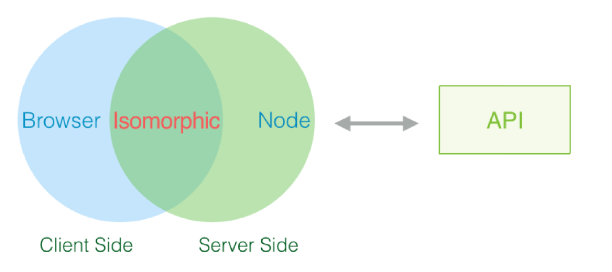
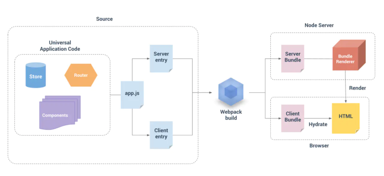

## 相关概念
- <span style="color: blue">CSR:客户端渲染(Client Side Render).渲染过程全部交给浏览器进行处理，服务器不参与任何渲染。页面初始加载HTML文档中无内容，需要下载执行JS文件，由浏览器动态生成页面，并通过JS进行页面交互事件与状态管理。</span>
- <span style="color: blue">SSR:服务端渲染(Server Side Render).DOM树在服务端生成，而后返回给前端。即当前页面的内容是服务器生成好一次性给到浏览器的进行渲染的</span>
- <span style="color: blue">同构:客户端渲染和服务器端渲染的结合，在服务器端执行一次，用于实现服务器端渲染(首屏直出)，在客户端在执行一次，用于接管页面交互(绑定事件)，**核心解决SEO和首屏渲染慢的问题**。采用同构思想的框架：Nuxt.js(基于Vue)、Next.js（基于React）</span>



## ssr(服务端渲染)实现方案
- <span style="color: blue">使用next.js/nuxt.js的服务端渲染方案</span>
- <span style="color: blue">使用node + vue-server-renderer实现vue项目的服务端渲染</span>
- <span style="color: blue">使用node + React renderToStaticMarkup/renderToString实现react项目的服务端渲染</span>
- <span style="color: blue">使用模板引擎来实现ssr(比如ejs，jade， pug)等</span>

我所在的部门采用基于vue的Nuxt框架来实现ssr同构渲染，但是Nuxt并未提供相应的降级策略。当node服务端请求出现偶发性错误(非接口服务挂掉)，本来应该在首屏渲染的模块会因无数据而显示空白，双十一等高流量情况下，出现人肉『运维』的无奈，想象一下其他小伙伴陪着对象，吃着火锅，唱着歌，你在电脑前抱着忐忑不安的心情盯着监控系统...我们需要一个降级方案以备不时需。<span style="color: red">**考虑到容灾和项目稳定性，虽然说已经部署了负载均衡，保险起见还是把 CSR 降级策略也搞了（避免背锅**</span>

## vue-ssr实现流程
在我们开始降级方案之前，我们必须对ssr的原理有一定的认知。接下来我们以vue(同理)为例：



<span style="color: blue">如上图所示有两个入口文件Server entry和Client entry。分别经webpack打包成服务端用的Server Bundle和客户端用的Client Bundle。</span>

<span style="color: blue">服务端：当Node Server收到来自客户端的请求后，BundleRenderer会读取Server Bundle，并且执行它，而Server Bundle实现了数据预取并将填充数据的Vue实例挂载在HTML模板上，接下来BundleRenderer将HTML渲染为字符串，最后将完整的HTML返回给客户端。</span>

<span style="color: blue">客户端收到HTML后，客户端加载了ClientBundle，通过app.$mount('#app')的方式将Vue实例挂载在服务端返回的静态HTML上，如</span>
```js
<div id="app" data-server-rendered="true">
```
data-server-rendered 特殊属性,让客户端Vue知道这部分HTML是由Vue在服务端渲染的，并且应该以激活模式(Hydration：https://ssr.vuejs.org/zh/hydration.html)进行挂载。

## 性能优化
降级的目的是为了预防node服务器压力过大时造成的风险，那么在这之前，也可以通过代码实现来做一定的优化，下面简单介绍集中常规优化方法

### 减少服务器渲染DOM树
1. 当页面特别长的时候，譬如我们常见的首页、商品详情页，底部会有特别推荐商品流、评价、商品介绍等并不会出现在首屏的模块，也不需要在服务端的时候执行渲染，这个时候就可以结合vue的插槽系统、内置component组件的is,利用vue ssr服务端只会执行beforeCreate和created声明周期的特性，封装自定义组件，被改组件在mounted的时候将包裹的组件挂载到component组件的is属性上
2. 通过vue高级异步组件封装延迟加载方法，只有当模块达到指定可视区域时在加载
```js
function asyncComponent({componentFactory, loading = 'div', loadingData = 'loading', errorComponent, rootMargin = '0px',retry= 2}) {
  let resolveComponent;
  return () => ({
    component: new Promise(resolve => resolveComponent = resolve),
    loading: {
      mounted() {
        const observer = new IntersectionObserver(([entries]) => {
          if (!entries.isIntersecting) return;
          observer.unobserve(this.$el);

          let p = Promise.reject();
          for (let i = 0; i < retry; i++) {
            p = p.catch(componentFactory);
          }
          p.then(resolveComponent).catch(e => console.error(e));
        }, {
          root: null,
          rootMargin,
          threshold: [0]
        });
        observer.observe(this.$el);
      },
      render(h) {
        return h(loading, loadingData);
      },
    },
    error: errorComponent,
    delay: 200
  });
}

export default {
  install: (Vue, option) => {
    Vue.prototype.$loadComponent = componentFactory => {
      return asyncComponent(Object.assign(option, {
        componentFactory
      }))
    }
  }
}
```
### 开启多进程
Node.js是单进程，单进程模型，其基于事件驱动、异步非阻塞模式，可以应用于高并发场景，避免了线程创建、线程之间上下文切换所产生的资源开销。但是遇到大量计算，CPU耗时的操作，则无法通过开启线程利用CPU多核资源，但是可以通过开启多进程的方式，来了利用浏览器的多核资源

1. 单个Node.js实例运行在单个线程中。为了充分利用多核系统，有时候需要开启一组Node.js进程去处理负载任务，cluster管理多进程的方式为主-从模式，master进程复杂开启、调度worker进程，worker进程负责处理请求和其他逻辑

    ```js
    const cluster = require('cluster');
    const http = require('http');
    const numCPUS = require('os').cpus().length;

    if (cluster.isMaster) {
        console.log(`主进程${process.pid}正在运行`)；

        for(let i = 0; i < numsCPUS; i++) {
            cluster.fort();
        }
        cluster.on('exit', (worker, code, signal) => {
            console.log(`工作进程 ${worker.process.pid} 已退出`)
        })
    } else {
        http.createServer((req, res) => {
            res.writeHead(200);
            res.end('hello, Bug Star');
        }).listen(8000)

        console.log(`工作进程 ${process.pid} 已启动`)
    }
    ```
2. 生产环境一般采用pm2来维护node项目

如果控制各进程之间的通信，让每个进程分别处理自己的逻辑，采用编写node脚本的方式启动cluster，从健壮性的角度上讲pm2的方式要好一些

### 开启缓存
1. 页面级缓存:在创建render实例时利用LRU-cache来缓存当前请求资源
2. 组件级缓存:需缓存的组件必须定义一个唯一的name选项。通过使用唯一的名称，每个缓存键(cache key)对应一个组件。如果renderer在组件渲染过程中进行缓存命中，那么它将直接重新使用整个子树的缓存结果
3. 分布式缓存:SSR应用程序部署在多服务、多进程下，进程下的缓存并不是共享的，造成缓存命中效率低下，可以采用如Redis，用以实现多进程间对缓存的共享

## 项目降级改造
业务逻辑的迁移以及各种MV*框架的服务端渲染模型的出现，让基于Node的前端SSR策略更依赖服务器的性能。

首屏直出性能以及Node服务的稳定性，直接关系影响着用户体验。Node作为服务端语言，相比于Java和PHP这种老服务器语言来说，对于整体性能的调控还不够完善。虽然有sentry这种报警平台来及时通知发生的错误，既然是个node服务，那么对于服务也要有相应的容灾方案，不然怎么放心将大流量交给它。那么要实现SSR的降级为CSR，<span style="color: blue">可以理解为需要打包出2份html，一份用来给服务端渲染插件createBundleRenderer当作模版传入输出渲染好的html片段，另外一份是作为客户端渲染的静态模版使用，当服务端渲染失败或者触发降级操作时，客户端代码要重新执行组件的async方法来预取数据</span>

- webpack.base.js在公共打包配置中，需要配置打包出的文件位置

    ```js
    // build/webpack.base.js
    const path = require('path')
    const VueLoaderPlugin = require('vue-loader/lib/plugin')
    const resolve = dir => path.resolve(__dirname, dir)
    module.exports = {
    output: {
        filename: '[name].bundle.js', 
        path: resolve('../dist')
    },
    // 扩展名
    resolve: {
        extensions: ['.js', '.vue', '.css', '.jsx']
    },
    module: {
        rules: [
        {
            test: /\.css$/,
            use: ['vue-style-loader', 'css-loader'] 
        },
        // .....
        {
            test: /\.js$/,
            use: {
            loader: 'babel-loader',
            options: {
                presets: ['@babel/preset-env']
            }
            },
            exclude: /node_modules/
        },
        {
            test: /\.vue$/,
            use: 'vue-loader'
        },
        ]
    },
    plugins: [
        new VueLoaderPlugin(),
    ]
    }
    ```
- webpack.client.js

    ```js
    // build/webpack.client.js
    const webpack = require('webpack')
    const {merge} = require('webpack-merge');
    const HtmlWebpackPlugin = require('html-webpack-plugin')
    const VueSSRClientPlugin = require('vue-server-renderer/client-plugin')

    const path = require('path')
    const resolve = dir => path.resolve(__dirname, dir)
    const base = require('./webpack.base')
    const isProd = process.env.NODE_ENV === 'production'
    module.exports = merge(base, {
        entry: {
            client: resolve('../src/entry-client.js')
        },
        plugins: [
            new VueSSRClientPlugin(),
            new HtmlWebpackPlugin({
                filename: 'index.csr.html',
                template: resolve('../public/index.csr.html')
            })
        ]
    })
    ```
- webpack.server.js

    ```js
    // build/webpack.server.js
    const {merge} = require('webpack-merge');
    const HtmlWebpackPlugin = require('html-webpack-plugin')
    const VueSSRServerPlugin = require('vue-server-renderer/server-plugin')

    const path = require('path')
    const resolve = dir => path.resolve(__dirname, dir)
    const base = require('./webpack.base')
    module.exports = merge(base, {
        entry: {
            server: resolve('../src/entry-server.js')
        },
        target:'node',
        output:{
            libraryTarget:'commonjs2'
        },
        plugins: [
            new VueSSRServerPlugin(),
            new HtmlWebpackPlugin({
                filename: 'index.ssr.html',
                template: resolve('../public/index.ssr.html'),
                minify: false,
                excludeChunks: ['server']
            })
        ]
    })
    ```
- server.js部分代码

    在该文件中，可以根据请求url参数、err异常错误、获取全局配置文件等方式，判断是否执行SSR的renderToString方法构建Html字符串，还是降级为CSR直接返回SPA Html
    ```js
    const app = express()
    const bundle = require('./dist/vue-ssr-server-bundle.json')
    // 引入由 vue-server-renderer/client-plugin 生成的客户端构建 manifest 对象。此对象包含了 webpack 整个构建过程的信息，从而可以让 bundle renderer 自动推导需要在 HTML 模板中注入的内容。
    const clientManifest = require('./dist/vue-ssr-client-manifest.json')

    // 分别读取构建好的ssr和csr的模版文件
    const ssrTemplate = fs.readFileSync(resolve('./dist/index.ssr.html'), 'utf-8')
    const csrTemplate = fs.readFileSync(resolve('./dist/index.csr.html'), 'utf-8')
    // 调用vue-server-renderer的createBundleRenderer方法创建渲染器，并设置HTML模板，之后将服务端预取的数据填充至模板中
    function createRenderer (bundle, options) {
        return createBundleRenderer(bundle, Object.assign(options, {
            template: ssrTemplate,
            basedir: resolve('./dist'),
            runInNewContext: false
        }))
    }

    // vue-server-renderer创建bundle渲染器并绑定server bundle
    let renderer = createRenderer(bundle, {
        clientManifest
    })


    // 相关中间件 压缩响应文件 处理静态资源等
    app.use(...)
            
    // 设置缓存时间
    const microCache = LRU({
        maxAge: 1000 * 60 * 1
    })

    function render (req, res) {
    const s = Date.now()
    res.setHeader('Content-Type', 'text/html')
    // 缓存命中相关代码，略...
    
    // 设置请求的url
    const context = {
        title: '', 
        url: req.url,
    }
    if(/**与需要降级为ssr的相关 url参数、err异常错误、获取全局配置文件...条件*/){
        res.end(csrTemplate)
        return
    }
    // 将Vue实例渲染为字符串，传入上下文对象。
    renderer.renderToString(context, (err, html) => {
        if (err) {
            // 偶发性错误避免抛500错误  可以降级为csr的html文件
            //打日志操作.....
            res.end(csrTemplate)
            return
        }
        res.end(html)
        
    })
    }
    // 启动一个服务并监听8080端口
    app.get('*', render)
    const port = process.env.PORT || 8080
    const server = http.createServer(app)
    server.listen(port, () => {
        console.log(`server started at localhost:${port}`)
    })
    ```
- entry.server.js

    ```js
    import { createApp } from './app'
    export default context => {
        return new Promise((resolve, reject) => {
            const { app, router, store } = createApp()
            const { url, req } = context
            const fullPath = router.resolve(url).route.fullPath
            if (fullPath !== url) {
            return reject({ url: fullPath })
            }
        // 切换路由到请求的url
            router.push(url)
            router.onReady(() => {
            const matchedComponents = router.getMatchedComponents()
            if (!matchedComponents.length) {
                reject({ code: 404 })
            }
        // 执行匹配组件中的asyncData
            Promise.all(matchedComponents.map(({ asyncData }) => asyncData && asyncData({
                store,
                route: router.currentRoute,
                req
            }))).then(() => {
                context.state = store.state
                if (router.currentRoute.meta) {
                context.title = router.currentRoute.meta.title
                }
                resolve(app)
            }).catch(reject)
            }, reject)
        })
    }
    ```
- entry-client.js

    ```js
    import 'es6-promise/auto'
    import { createApp } from './app'
    const { app, router, store } = createApp()
    // 由于服务端渲染时，context.state 作为 window.__INITIAL_STATE__ 状态，自动嵌入到最终的 HTML 中。在客户端，在挂载到应用程序之前，state为window.__INITIAL_STATE__。
    if (window.__INITIAL_STATE__) {
        store.replaceState(window.__INITIAL_STATE__)
    }
    router.onReady(() => { 
        router.beforeResolve((to, from, next) => {
            const matched = router.getMatchedComponents(to)
            const prevMatched = router.getMatchedComponents(from) 
            let diffed = false
            const activated = matched.filter((c, i) => {
            return diffed || (diffed = prevMatched[i] !== c)
            })
            const asyncDataHooks = activated.map(c => c.asyncData).filter(_ => _)
            if (!asyncDataHooks.length) {
            return next()
            }
            Promise.all(asyncDataHooks.map(hook => hook({ store, route: to })))
            .then(() => {
                next()
            })
            .catch(next)
        })
        // 挂载在DOM上
        app.$mount('#app')
    })

    ```

## 降级策略

## 降级总结
- <span style="color: red">偶发性降级--偶发的服务端渲染失败降为客户端渲染</span>
- <span style="color: red">配置平台降级--通过配置平台修改全局配置文件主动降级，比如双十一等大流量情况下，可提前通过配置平台将整个应用集群都降级为客户端渲染</span>
- <span style="color: red">监控系统降级--监控系统跑定时任务监控应用渲染集群状态，集群资源占用达到设定CPU/内存阀值将整个集群降级or扩容</span>
- <span style="color: red">渲染服务器宕机--ssr渲染可以理解为另一形式BFF层，接口服务器与ssr渲染服务器是独立的，html的获取逻辑回溯到Nginx获取，此时触发客户端渲染</span>


[Node.js环境性能监控 -- https://juejin.im/post/6844903781889474567](https://juejin.im/post/6844903781889474567)

[VueSSR高阶指南 -- https://juejin.im/post/6844903669922529287](https://juejin.im/post/6844903669922529287)

[vue服务端渲染（SSR）实战 -- https://juejin.im/post/6844903630147944455](https://juejin.im/post/6844903630147944455)

## 资料
[SSR再好，也要有优雅降级策略哟~](https://cloud.tencent.com/developer/article/1738923)

[React笔记五：使用Next.js实现React SSR的优雅降级](https://www.jianshu.com/p/108a590416d2)

[SSR 服务稳定性优化：通用降级方案](https://zhuanlan.zhihu.com/p/423943957)

[Nuxt.js 利用 Nginx 实现同构降级策略](https://linhong.me/2021/03/04/nuxt-ssr-to-csr/)