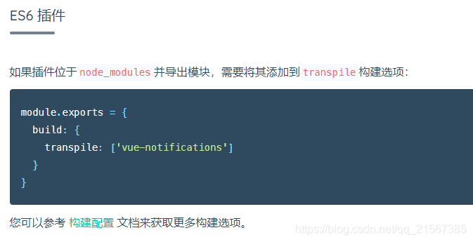

## Nuxt.js为页面提供的特殊配置项
属性名|描述
---|---
asyncData | 最重要的一个键，支持异步数据处理，另外该方法的第一个参数为当前页面组件的上下文对象
fetch | 与asyncData方法类似，用于渲染页面之前获取数据填充应用的状态数(store)。不同的是fetch方法不会设置组件的数据，详情请参考[关于fetch方法的文档](https://www.nuxtjs.cn/api/pages-fetch)。
head | 配置当前页面的Meta标签，详情参考[页面头部配置API](https://www.nuxtjs.cn/api/pages-head)
layout | 指定当前页面使用的布局(layouts根目录下的布局文件),详情参考[关于布局的文档](https://www.nuxtjs.cn/api/pages-layout)
loading | 如果设置为false,则阻止页面自动调用this.$nuxt.$loading.finish()和this.$nuxt.$loading.start()，你可以手动控制它，请看[例子](https://nuxtjs.org/examples/custom-page-loading)适用于在nuxt.config.js中设置loading的情况下。请参考[API配置 loading 文档](https://www.nuxtjs.cn/api/configuration-loading)。
transition | 指定页面切换的过度动效，详情请参考[页面过度动效](https://www.nuxtjs.cn/api/pages-transition)
scrollToTop | 布尔值，默认: false。 用于判定渲染页面前是否需要将当前页面滚动至顶部。这个配置用于 [嵌套路由](https://www.nuxtjs.cn/guide/routing#%E5%B5%8C%E5%A5%97%E8%B7%AF%E7%94%B1)的应用场景。
validate | 校验方法用于校验[动态路由](https://www.nuxtjs.cn/guide/routing#%E5%8A%A8%E6%80%81%E8%B7%AF%E7%94%B1)的参数
middleware | 指定页面的中间件，中间件会在页面渲染之前被调用，请参考[路由中间件](https://www.nuxtjs.cn/guide/routing#%E4%B8%AD%E9%97%B4%E4%BB%B6)


## Nuxt.js配置构建选项build中transpile的作用
- 类型：Array<string | RegExp>
- 默认：[]
如果要使用Babel与特定的依赖关系进行转换，你可以在build.transpile中添加它们，transpile中的选项可以是字符串或正则表达式，用于匹配依赖项文件名

不过在[nuxt插件配置](https://nuxtjs.org/docs/directory-structure/plugins/)里能找到



我们终于知道这个选项是当使用ES6的库时，需要将其导出，告诉babel做转化的意思。

特别是element UI这种，需要添加到其中做转化，如果用脚手架生成时选择了elementUI,他汇自动将element UI的库添加到这里
```
build: {
  transpile: [/^element-ui/],

  /*
  ** You can extend webpack config here
  */
  extend(config, ctx) {
  }
}
```

## Nuxt.js项目工程的middleware
可以运行在
1. nuxt.config.js
2. 布局Layout
3. page页面

拦截顺序：nuxt.config -> 布局layout -> page页面

page页面示例
```
<template>
  <div>
    <h2>admin page</h2>
    
  </div>
</template>

<script>
export default {
  // middleware: ['auth']
  middleware({ route, redirect, store }) {
  if (!store.state.user.token) {
    redirect("/login?redirect="+route.path);
  }
};
</script>
```


## 资料
[中文官网](https://nuxt.com.cn/)

[Nuxt.js学习指南](https://www.w3cschool.cn/nuxtjs/nuxtjs-8dmz36fy.html)

[Nuxt.js使用教程](https://www.bookstack.cn/read/nuxtjs-2.11.x-zh/4049cd9fa6ada116.md)
