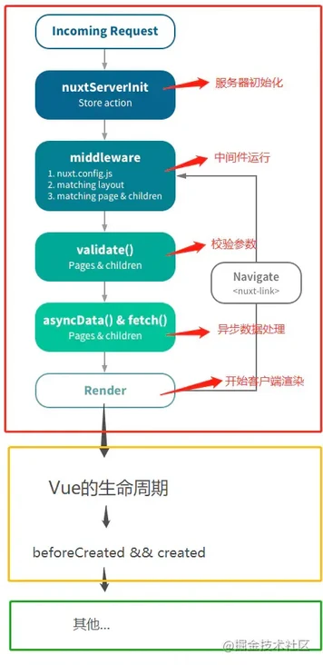

这篇文章整理一下nuxt中pages、layout、components、plugins的相关使用,之前已经上手使用过了，这些详细看一下官方文档，加深理解

### 目录结构
```
|-- src
    |-- component   ---编写重复使用组件
    |-- layout      ---编写全局布局
    |-- pages       --- 编写具体路由页面
    |-- plugins     --- 编写需要的插件
```

## components
该components目录包含您的Vue.js组件。组件构成了页面的不同部分，可以重复使用并导入页面、布局甚至其他组件中。

通过在Nuxt.config.js文件中进行如下配置，可以直接使用组件，无需导入
```
export default {
  components: true
}
```

```
|-- components
    |-- TheHeader.vue
    |-- TheFooter.vue
```

```
<template>
  <div>
    <TheHeader>
    <Nuxt />
    <TheFooter>
  </div>
</template>
```
引用时，需要与文件名相同。

**当components层级较多时的引用方法**
```
--components
  |--base
      |--foo
         |--CustomButton.vue
```
组件名称将基于其自己的路径目录和文件名。因此，改组件将是
```
<BaseFooCustomButton>
```

### 获取数据
components获取数据的方式为：Nuxt中的fetch()。无法使用asyncData，因为asyncData方法会在组件(仅限页面组件)每次加载之前就被调用
```
<script>
  export default {
    async fetch({ store, params}) {
      let { data } = await axios.get('http://my-api/stars');
      store.commit('setStarts', data)
    }
  }
</script>
```
**注意：无法在内部使用this获取组件实例，fetch是在组件初始化之前就被调用**

## Layout
编写全局布局，例如，侧边栏，导航栏
```
|-- layouts
    |-- default.vue
```
default.vue文件，会默认应用到所有为指定布局的页面

引用导航栏，页脚组件
```
<template>
  <div>
    <TheHeader />
    <Nuxt />
    <TheFooter />
  </div>
</template>
```

也可以自定义导入需要的布局
```
// X.vue
<script>
export default {
  layout: 'blog',
  // OR
  layout (context) {
    return 'blog'
  }
}
</script>
```

layouts有个特殊的页面--error。虽然这个文件放在layouts文件夹中，但它应该被视为一个页面。
```
<template>
  <div class="container">
    <h1 v-if="error.statusCode === 404">!!!!!!!!!!!!!!啊呀，页面找不到了</h1>
    <h1 v-else>An error occurred</h1>
    <h2>这是 error.message  {{error.message}}</h2>

    <h2>这是 error.statusCode  {{error.statusCode}}</h2>
    <NuxtLink to="/">Home page</NuxtLink>
  </div>
</template>

<script>
export default {
  layout: 'errorLayout',
  props: ['error'] // you can set a custom layout for the error page
}
</script>
```
接收error参数。在全局的api接口调用，处理错误信息
```
export default function({ app, $axios, error}, inject) {
  const API = {};
  API.getGameList = function() {
    return $axios.$get('/api/apps.json').catch(e => {
      error({ statusCode: e.response.status, message: e.response.stateText})
    })
  }
  app.api = API;
  inject('api', API)
}
```
这样，就能捕获接口异常信息，跳转到 error 页面

## pages
page包含所有的目录和路由。nuxt会根据文件名自动生成路由，也可以根据接收的参数生成动态页面，接收的参数以下划线开头。如：_slug
```
|-- pages
    |--_slug
        |--index.vue
    |-- game
        |-- index.vue
```
```
<nuxt-link :to="{ name: 'slug', params: { slug:item.slug} }"></nuxt-link>

<nuxt-link :to="/game"></nuxt>
```
_slug/index.vue文件接收参数
```
<template>
  <h1>{{ this.slug }}</h1>
</template>

<script>
export default {
  async asyncData({ params }) {
    const slug = params.slug;
    return { slug }
  }
}
</script>
```
### page获取数据的方法
- asyncData

  这个钩子只能放在页面组件上。不同的是fetch，此钩子在客户端渲染期间不会显示加载占位符，相反，此钩子会阻止路由导航，直到解决为止，如果失败则显示页面错误

- fetch(Nuxt 2.12+)

  这个钩子可以放在任何组件上，并提供渲染加载状态(在客户端渲染期间)和错误的快捷方式

  在fetch里可以使用this。this的数据，需要现在data中定义

```
export default {
  asyncData(context) {
    const tempParams = context.params;
    return { tempParams }
  }
  data() {
    return {
      iframeShow: false
    }
  }
  async fetch({ params }) {
    this.iframeShow = await params.iframeShow
  }
}
```

### page其他配置
- 文档head信息
- layout布局
- 加载loading
- 路由过渡动画transition
- 中间件middleware:定义此页面的中间件。中间件将在呈现页面之前被调用
- 滚动到顶部scrollToTop
- 监听字符串变化watchQuery：可以设置查询字符串的监听程序

  如：watchQuery:['sq'],&lt;nuxt-link to="/test/abc?sq=1"&gt;test&lt;nuxt-link&gt;将会监听到sq的变化，将调用所有组件方法(asyncData,fetch(context),validate, layout等)。监听默认情况下处于禁用状态，以提高性能。**如果要为所有查询字符串设置监听程序，请设置watchQuery:true**

- key:key属性赋值到&lt;router-view :key="$route.path" /&gt;这对于在动态页面和不同路径中进行转换很有用。不同的key回事页面组件重新渲染。
- 配置Configuration: 可以重命名当前page名字
- 忽略页面Ignoring pages

  在文件名前面加'-',如: pages/-about.vue，如果你想忽略页面以便它们不包含在生成的router.js文件中，那么你可以通过前面加上-来忽略他们，about.vue将被忽略

```
export default {
  middleware: 'auth',
  layout: 'gamePlay',
  head() {
    return {
      title: 'New head'
    }
  },
  loading: false,
  transition: 'fade',
  scrollToTop: true, 
  watchQuery: ['sq'],
  key(route) {
    return route.fullPath
  },
  dir: {
    pages: 'routes'
  }
}
```

## plugins
该目录文件,包含想要在vue.js实例化之前的所有js插件。

例如，elementUI引用，之前介绍的[axios封装](https://segmentfault.com/a/1190000040681617)、[国际化文件](https://segmentfault.com/a/1190000040681617)

最重要的是，需要在nuxt.config.js里配置你需要的插件
```
module.exports = {
  modules: ['@nuxtjs/axios'],
  plugins: [
    '~/plugins/element-ui',
    '~/plugins/api',
    { src: '~plugins/vueLazyLoad', ssr: false },
    '~/plugins/gtag',
    '~/plugins/global',
    '~/plugins/i18n'
  ]
}
```
最后，你可以直接在具体的页面中使用了

<br/>
<br/>
最后附带一个nuxt声明周期图

