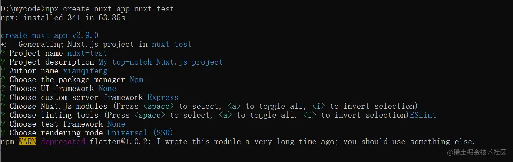

## 为什么要用Nuxt.js
原因其实不用多说，就是利用Nuxt.js的服务端渲染能力来解决Vue项目的SEO问题

## Nuxt.js和纯Vue项目的简单对比
1. build后目标产物不同
  
    vue:dist

    nuxt:.nuxt

2. 网页渲染流程

    vue: 客户端渲染，先下载js后，通过ajax来渲染页面

    nuxt:服务端渲染，可以做到服务端拼接好html后直接返回，首屏可以做到无需发起ajax请求

3. 部署流程

    vue：只需部署dist目录到服务器，没有服务端，需要用nginx等做web服务器；

    nuxt: 需要部署几乎所有文件到服务器(除node_modules, .git),自带服务端，需要pm2管理(部署时需要reload pm2)，若要求用域名，则需要nginx做代理

4. 项目入口

  vue: /src/main.js，在main.js可以做一些全局注册的初始化工作

  nuxt:没有main.js入口文件，项目初始化的操作需要通过nuxt.config.js进行配置执行

## 从零搭建一个nuxt.js项目并配置
### 新建项目
直接使用脚手架进行安装
```
npx create-nuxt-app <项目名>
```



大概选上面这些选项

值得一说的是，关于**Choose custom server framework(选择服务端框架)**，可以根据你的业务情况选择一个服务端框架，常见的就是Express、Koa，默认是Node，即Nuxt默认服务器，我这里选了Express。

- 选择默认的Nuxt服务器，不会生成server文件夹，所有服务端渲染的操作都是Nuxt帮你完成，无需关心服务端的细节，开发体验更接近Vue项目，缺点是无法做一些服务端定制化的操作。
- 选择其他的服务端框架，比如Express，会生成server文件夹，帮你搭建一个基本的Node服务端环境，可以在里面做一些node端的操作。比如我公司业务需要（解析protobuf）使用了Express，对真正的服务端api做一层转发，在node端解析protobuf后，返回json数据给客户端。

还有Choose Nuxt.js modules（选择nuxt.js的模块），可以选axios和PWA,如果选了axios，则会帮你在nuxt实例下注册$axios，让你可以在.vue文件中直接this.$axios发起请求。

### 开启eslint检查
在nuxt.config.js的build属性下添加
```
build: {
  extend(config, ctx) {
    // Run ESLint on save
    if(ctx.isDev && ctx.isClient) {
      config.module.reules.push({
        enforce: 'pre',
        test: /\.(js|vue)$/,
        loader: 'eslint-loader',
        exclude: /(node_module)/
      })
    }
  }
}
```
这样开发时保存文件就可以检查语法了。nuxt默认使用的规则是[@nuxtjs](https://github.com/nuxt/eslint-config)--底层是[eslint-config-standard](https://github.com/standard/eslint-config-standard),默认配置在/。eslintrc.js

```
module.exports = {
  root: true,
  env: {
    browser: true,
    node: true
  },
  parserOptions: {
    parser: 'babel-eslint'
  },
  extends: [
    '@nuxtjs', // 改规则对应这个依赖：@nuxtjs/eslint-config
    'plugin:nuxt/recommended'
  ],
  // add you custom rules here
  rules: {
    'nuxt/no-cjs-in-config': 'off'
  }
}
```
如果不习惯用standard规则的团队可以将@nuxtjs改成其他的

### 使用dotenv和@nuxtjs/dotenv统一管理环境变量
在node端，我们喜欢使用dotenv来管理项目中的环境变量，把所有环境变量都放在根目录下的.env中

- 安装

  ```
  npm i dotenv
  ```

- 使用
  - 在根目录新建一个.env文件，并写上需要管理的环境变量，比如服务端渎职APIHOST

      ```
      APIHOST = http://your_server.com/api
      ```
  - 在/server/index.js中使用(该文件是选Express服务端框架自动生成的)

    ```
    require('dotenv').config()

    // 通过process.env即可使用
    console.log(process.env.APIHOST) // http://your_server.com/api
    ```
此时我们只是让服务端可以使用.env的文件而已，Nuxt客户端并不能使用，按[Nuxt.js文档](https://nuxtjs.org/docs/configuration-glossary/configuration-env/)所说,可以将客户端的环境变量放置在nuxt.config.js中：
```
module.exports = {
  env: {
    baseUrl: process.env.BASE_URL || 'http://localhost:3000'
  }
}
```
:::tip
但如果node端和客户端需要使用同一个环境变量时(后面讲到API鉴权时会使用同一个SECRET变量),就需要同时在nuxt.config.js和.env维护这个字段，比较麻烦，我们更希望环境变量只需要在一个地方维护，所以为了解决这个问题，我找到了@nuxtjs/dotenv这个依赖，它使得nuxt客户端也可以直接使用.env，达到我们的预期
:::
客户端也是通过process.env.XXX来使用，不在举例了。

另外，[@nuxtjs/dotenv](https://www.npmjs.com/package/@nuxtjs/dotenv)允许打包时指定其他的env文件。比如，开始时我们使用的是.env，但是我们打包的线上版本想用其他环境变量，此时我们可以指定build时用另一份文件如/.env.prod，只需要在nuxt.config.js指定
```
module.exports = {
  modules: [
    ['@nuxtjs/dotenv', { filename: '.env.prod' }] // 指定打包时候使用的dotenv
  ]
}
```
### @nuxt/toast模块
toast可以说是很常用的功能，一般的UI框架都会有这个功能。但如果你的站点没有使用UI框架，而alert又太丑，不放引入该模块
```
npm install @nuxtjs/toast
```
然后在nuxt.config.js引入
```
module.exports = {
  modules: [
    '@nuxtjs/toast',
    ['@nuxtjs/dotenv', { filename: '.env.prod' }] // 指定打包时使用的dotenv
  ],
  // toast模块的配置
  toast: {
    position: 'top-center',
    duration: 2000
  }
}
```
这样，nuxt就会在全局注册$toast方法供你使用，非常方便：
```
this.$toast.error('服务器开小差啦~~')
this.$toast.error('请求成功~~')
```
[github @nuxt/js](https://github.com/nuxt-community/community-modules/blob/master/packages/toast/index.js)

### API鉴权
对于某些敏感的服务，我们可能需要对API进行鉴权，防止被人轻易盗用我们node端的API，因此我们需要做一个API的鉴权机制.常见的方案有jwt，可以参考一下阮老师的介绍：《JSON Web Token 入门教程》(http://www.ruanyifeng.com/blog/2018/07/json_web_token-tutorial.html),如果场景比较简单，可以自行设计一下，这里提供一个思路

1. 客户端和node端在环境变量中声明一个秘钥:SECRET=xxx,注意这个是保密的
2. 客户端发起请求时，将当前时间戳(timestamp)和SECRET通过某种算法，生成一个signature,请求时带上timestamp和signature;
3. node接收到请求，获得timestamp和signature，将timestamp和秘钥用同样的算法在生成一次签名_signature
4. 对于客户端请求的signature和node用同样的算法生成的_signature，如果一直就表示通过，否则鉴权失败。

具体步骤：

客户端对axios进行一层封装
```
import axios from 'axios';
import sha256 from 'crypto-js/sha256';
import Base64 from 'crypto-js/enc-base64';
// 加密算法，需安装crypto-js
function crypto(str) {
  const _sign = sha256(str);
  return encodeURIComponent(Base64.stringify(_sign));
}

const SECRET = process.env.SECRET;

const options = {
  headers: { 'X-Requested-With': 'XMLHttpRequest' },
  timeout: 30000,
  baseURL: '/api'
}

// The server-side needs a full url to works
if(process.server) {
  options.baseURL = `http://${process.env.HOST || 'localhost'}:${process.env.PORT || 3000}/api`;
  options.widthCredentials = true
}

const instance = axios.create(options);
// 对axios的每一个请求都做一个处理，携带上签名和timestamp
instance.interceptors.request.use(config => {
  const timestamp = new Date().getTime();
  const param = `timestamp=${timestamp}&secret=${SECRET}`;
  const sign = crypto(param);
  config.params = Object.assign({}, config.params, { timestamp, sign })
})

export default instance
```
接着，在server端写一个鉴权的中间件，/server/middleware/verify.js
```
const sha256 = require('crypto-js/sha256');
const Base64 = require('crypto-js/enc-base64');

function crypto(str) {
  const _sign = sha256(str);
  return encodeURIComponent(Base64.startsWith(_sign))
}

// 使用和客户端相同的秘钥
const SECRET = process.env.SECRET;

function verifyMiddleware(req, res, next) {
  const { sign, timestamp } = req.query;
  // 加密算法与请求时一致
  const _sign = crypto(`timestamp=${timestamp}&secret=${SECRET}`);

  if(_sign === sign) {
    next();
  } else {
    res.status(401).send({
      message: 'invalid token'
    })
  }
}
module.exports = { verifyMiddleware }
```
最后，在需要鉴权的路由中引用这个中间件，/server/index.js
```
const { Router } = require('express')
const { verifyMiddleware } = require('../middleware/verify.js')
const router = Router()

// 在需要鉴权的路由加上
router.get('/test', verifyMiddleware, function (req, res, next) {
    res.json({name: 'test'})
})
```

### 静态文件处理
根目录下有个/static文件夹，我们希望这里面的文件可以直接通过url访问，需要在/server/index.js中加入一句
```
const express = require('express');
const app = express();

app.use('/status', express.static('static'))
```
## Nuxt开发相关
### 声明周期
Nuxt扩展了Vue的生命周期，大概如下
```
export default {
  middleware() {}, // 服务端
  validate() {}, // 服务端
  asyncData() {}, // 服务端
  fetch() {}, // store数据加载
  beforeCreate() {}, // 服务端和客户端都会执行
  created() {}, // 服务端和客户端都会执行
  beforeMount() {},
  mounted() {} // 客户端 
}
```
### asyncData
该方法是Nuxt最大的一个卖点，服务端渲染的能力就在这里，首次渲染必须使用该方法。asyncData会传进一个context参数，通过该参数可以获取一些信息如：
```
export default {
  asyncData(ctx) {
    ctx.app // 根实例
    ctx.route // 路由实例
    ctx.params // 路由参数
    ctx.query // 路由问号后面的参数
    ctx.error // 错误处理方法
  }
}
```
### 渲染出错和ajax请求出错的处理
- asyncData渲染出错

  使用asyncData钩子时可能会由于服务器错误或api错误导致无法渲染，此时页面还为渲染出来，需要针对这种情况做一些处理，当遇到asyncData错误时，跳转到错误页面，nuxt提供了context.error方法用于错误处理，在asyncData中调用该方法即可跳转到错误页面
  ```
  export default {
    asyncData(ctx) {
      // 尽量使用try catch的写法，将所有异常都捕捉到
      try {
        throw new Error()
      } catch {
        ctx.error({statusCode: 500, message: '服务器开了小差了~'})
      }
    }
  }
  ```
  这样，当出现异常时会跳转到[默认的错误页](https://nuxtjs.org/docs/concepts/views/#%E9%94%99%E8%AF%AF%E9%A1%B5%E9%9D%A2),错误页面可以通过/layout/error.vue自定义。

  这里会遇到一个问题,context.error的参数必须是类似{ statusCode: 500, message: '服务器开小差了~' }, statusCode必须是http状态码，而我们服务端返回的错误往往有一些其他自定义的代码，如{ statusCode: 10005, resultInfo: '服务器内部错误' }，此时需要对返回的api错误进行转换一下

  为了方便，我引入了/plugin/ctx-inject.js为context注册一个全局的错误处理方法：

  context.$errorHandler(err)。注入方法可以参考:[注入$root和context](https://nuxtjs.org/docs/directory-structure/plugins/#%E6%B3%A8%E5%85%A5-vue-%E5%AE%9E%E4%BE%8B)

  ctx-inject.js
  ```
  //为context注册全局的错误处理事件
  export default (ctx, inject) => {
    ctx.$errorHandler = err => {
      try {
        const res = res.data;
        if (res) {
          // 由于nuxt的错误页面只能识别http状态码，因此statusCode统一传500，表示服务器异常
          ctx.error({ statusCode: 500, message: res.resultInfo })
        } else {
          ctx.error({ statusCode: 500, message: '服务器开小差了' })
        }
      } catch {
        ctx.error({ statusCode: 500, message: '服务器开小差了~' })
      }
    }
  }
  ```
  然后在nuxt.config.js使用该插件
  ```
  export default {
    plugins: [
      '~/plugins/ctx-inject.js'
    ]
  }
  ```
  注入完毕，我们可以在asyncData使用了
  ```
  export default {
    async asyncData (ctx) {
        // 尽量使用try catch的写法，将所有异常都捕捉到
        try {
            throw new Error()
        } catch(err) {
            ctx.$errorHandler(err)
        }
    }
  }
  ```

- ajax请求出错

  对于ajax的异常，此时页面已经渲染，出现错误时不必跳转到错误页，可以通过this.$toast.error(res.message) toast出来就可

### loading方法
nuxt内置了页面顶部[loading进度条的样式](https://nuxtjs.org/docs/configuration-glossary/configuration-loading/#loading-%E5%B1%9E%E6%80%A7%E9%85%8D%E7%BD%AE) 推荐使用，提供页面跳转体验。 打开： this.$nuxt.$loading.start() 完成： this.$nuxt.$loading.finish()

### 打包部署
一般来说，部署前可以先在本地打包，本地跑一下确认无误后再上传到服务器部署。命令
```
// 打包
npm run build
// 本地跑
npm start
```
除node_modules，.git,.env，将其他的文件都上传到服务器，然后通过pm2进行管理,可以在项目根目录建一个pm2.json方便维护：
```
{
  "name": "nuxt-test",
  "script": "./server/index.js",
  "instances": 2,
  "cwd": "."
}
```
然后配置生产环境的环境变量，一般是直接用.env.prod的配置：cp ./.env.prod ./.env。 首次部署或有新的依赖包，需要在服务器上npm install一次，然后就可以用pm2启动进程啦：
```
// 项目根目录下运行
pm2 start ./pm2.json

```
需要的话，可以设置开机自动启动pm2: pm2 save && pm2 startup。 需要注意的是，每次部署都得重启一下进程:pm2 reload nuxt-test。

## 最后
Nuxt.js引入了Node,同时nuxt.config.js替代了main.js的一些作用，目录结构和vue项目有稍有不同，增加了很多约定

demo源码： [fengxianqi/front_end-demos/src/nuxt-test](https://github.com/fengxianqi/front_end-demos/tree/master/src/nuxt-test)。


## 资料
[Nuxt.js实战和配置](https://juejin.cn/post/6844903906200256525#heading-18)
