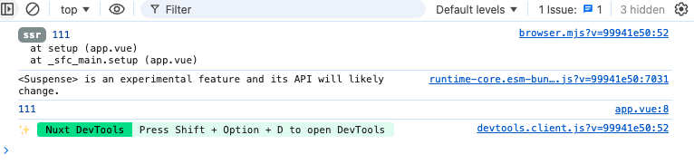
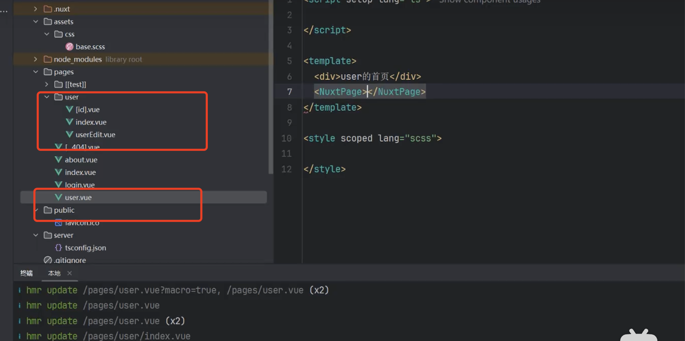

## console.log输出两次
```html
<template>
	<div>{{ name }}</div>
</template>
<script setup>
import { ref } from 'vue';

const name = ref('welcome nuxt');
console.log(111);
</script>
```


- 带ssr前缀的是 服务端输出(正常打包之后客户端看不到)
- 不带ssr前缀的是客户端输出

**nuxt nitro 负责服务端渲染，内置引擎**

- 按钮点击

    ```html
    <template>
        <div>{{ name }}</div>
        <button @click="handleClickButton">测试button</button>
    </template>
    <script setup>
    import { ref } from 'vue';

    const name = ref('welcome nuxt');
    console.log(111);

    // nuxt nitro 服务端渲染；由于hmr热更新局部更新只会渲染一次，输出两次，如果服务重启会输出四次
    for(let i = 0; i < 2; i++) {
        alert(i) // 服务端 nitro不支持alert 改为console
    }
    const handleClickButton = () => {
        console.log('button');
    };
    </script>
    ```
    点击测试按钮，只会执行一次-- 因为页面已经打开了，页面内容已经请求出来了

## 基础配置
```js
export default defineNuxtConfig({
    // 运行时的一些变量配置
    runtimeconfig: {
        // 只能在服务端获取到--可以用来判断是在服务端还是客户端
        count: 1, // 服务端输出1， 客户端输出 undefined
        // 服务端环境变量
        public: {
            baseURL: 'http://localhost:3000'
        }
    },
    // 初始化样式
    css: ['~/assets/css/base.less'], // 服务端~表示根目录
    vite: {
        css: {
            preprocessorOptions: {
                less: {
                    additionalData: `@import "~/assets/css/base.less";`
                }
            }
        }
    }
    modules: ['@element-plus/nuxt'],
	elementPlus: {
		/** Options */
	}
})
```

使用 useRuntimeConfig 访问运行时配置变量

## 区分server 和 client
```js
export default defineNuxtConfig({
	compatibilityDate: '2024-11-01',
	devtools: { enabled: true },
	runtimeConfig: {
		isServer: true,
		public: {
			baseUrl: 'localhost: 8080'
		}
	},
	css: ['~/assets/css/base.less'],
	vite: {
		css: {
			preprocessorOptions: {
				less: {
					additionalData: `@import "~/assets/css/variable.less";`
				}
			}
		}
	},
	modules: ['@element-plus/nuxt'],
	elementPlus: {
		/** Options */
	}
});

// use
const { isServer } = useRuntimeConfig();
if(isServer) {
    console.log('server')
} else { 
    console.log('client')
}
```
- 第二种方式直接使用nuxt提供的

    ```js
    if (import.meta.server) {
        console.log('server');
    } else {
        console.log('client');
    }
    ```

## 路由
[nuxt路由](https://nuxt.com/docs/getting-started/routing)

- NuxtPage 基本等于 router-view 但是功能更加强大
- [NuxtLoadingIndicator](https://nuxt.com/docs/api/components/nuxt-loading-indicator)--页面导航之间的进度条

- NuxtLink 
## 路由
### 命令路由、可选路由、全局路由、嵌套路由、编程时路由navigateTo
- 命名路由
    在pages里面创建一个user的文件夹下 [aa].vue,访问：http://localhost:3000/user/:aa()，也可以http://localhost:3000/user/xxxx
    ```js
    const route = userRoute();

    console.log(route.params.aa)
    ```
- 可选路由
    pages下创建[[test]]文件夹，文件夹下testEdit.vue，访问localhost:3000/test/testEdit 或 localhost:3000/testEdit 

- 全局路由

    pages下创建[...404].vue   在所有路由都没有匹配到的时候匹配到这个页面

- 路由自定义
    在pages下面创建一个about1.vue  访问localhost:3000/about1
    ```html
    <script setup lang="ts">
        definePageMeta({
            path: '/about1'
        })
    </script>
    ```
- 嵌套路由

    

- 编程时路由 navigateTo

    - navigateTo 在服务端、客户端渲染时候都可以使用
    - router.push 在客户端渲染的时候使用
    ```html
    <script setup>
        const router = useRouter();
        router.push('/login'); // 服务端没用 客户端用了


        if(import.meta.server) {
            navigateTo('/login')
        }
        console.log(111); // 只会在服务端执行
    </script>
    ```
    
### 中间件
- 路由独享中间件
    middleware文件夹里my.js
    ```js
    export default defineNuxtRouteMiddleware((to, from) => {
    console.log(to.path)
    if(to.path === '/about') {
        return navigateTo('/login')
        // return true； true后面中间件会执行 false后面中间件不会执行
    }
    })

    // 应用
    definePageMeta({
        middleware: [
            'my'
        ]
    })
    ```
- 全局中间件

    middleware文件夹里*.global.ts 名字必须global.ts,执行顺序从小到大排序
    ```js
    export default defineNuxtRouteMiddleware((to, from) => {
        console.log(to.path)
        if(to.path === '/about') {
            return navigateTo('/login')
            // return true； true后面中间件会执行 false后面中间件不会执行
        }
    })
    ```
### 路由守卫
```js
// test.global.js
let passURL = ['/', '/login', '/about', '/index'];
if(!passURL.includes(to.path)) {
    let token = '';
    if(import.meta.client) {
        token = localStorage.getItem('token');
    }
    if(!token) {
        // 由于执行顺序问题，这里这个判断不会执行
        if(import.meta.client) {
            ElMessage.error('请先登录')
        }
        return navigateTo({
            path: '/login',
            query: {
                code: 401,
                message: '请先登录'
            }
        })
    }
}
```
```html
<script setup lang="ts">
    onMounted(() => {
        const route = useRoute();
        ElMessage.error(route.query.code + '' + route.queyr.message);
    })
</script>
<template>
    <div>login页面</div>
</template>
```
## composables 可组合项
[目录结构](https://nuxt.com/docs/guide/directory-structure/composables)

使用的时候不需要导入---只会扫描composables的第一层目录

** utils目录和composables 使用一致**

```js
// composables/mycom.js
export const add = (x, y) => {
    return x + y
}
export default function(x, y) {
    return x + y;
}

//使用的时候再vue的script中直接使用
console.log(add(1, 2))

console.log(mycom(1 + 1)); // export default的时候的使用
```
## $fetch 和useAsynData
```js
// 服务端和客户端同时会执行 如果是post类的请求会出现问题 所以用useAsyncData
if(import.meta.server) {
    const res = await $fetch('http://localhost:8080/test');
    console.log(res);
}

// 后端只执行了一次 在服务端执行 如果test的key不是固定的 Math.random() * 5 就会执行多次
let res = await useAsyncData('test', () => {
    console.log(111); // 只执行了一次 服务端
    return $fetch('http://localhost:8080/test');
})
cosole.log(res.data.value)
```
key一般是url

## useFetch、lazy、refresh
[useFetch](https://nuxt.com/docs/api/composables/use-fetch)

useFetch此可组合项为 useAsyncData和$fetch提供了一个方便的包装器
```js
const res = useFetch('http://localhost:8080/test');
console.log(res.data.value)

// refresh 刷新token
const { refresh, status} = await useFetch('http://localhost:8080/test');
refresh(); // 服务端多刷新一次
```

```html
<script setup lang="ts">
    const {refresh, status} = useFetch('http://localhost:8080/test', {
        lazy: true // 如果不加lazy的话每次进入服务端请求已完成
    });
    console.log(status.value)
</script>
<template>
    <div>
        index页面<br/>
        <div v-if="status ==='pending'">
            正在请求...
        </div>
        <div v-else>
            请求完成
        </div>
    </div>
</template>
```
## axios
axios没有处理两次请求的问题---直接使用usefetch就可以

## useFetch封装
composables/api.js
```js
export const apiCore = (url, options) => {
    const config = useRuntimeCconfig();

    return useFetch(url, {
        baseURL: config.public.baseUrl,
        onRequest({ options}) {
            // localStorage 只会存在客户端
            let token = ''
            if(import.meta.client) {
                token = localStorage.getItem('token');
            }
            options.headers = {
                Authorization: 'Bearer ' + token,
                ...options.headers
            }
        },
        ...options
    })
}

export const GetApi = (url, options) => {
    return apiCore(url,  {
        method: 'GET'
    })
}

//使用used
const res = await GetApi('/user/1')
console.log(res)
```
## state

```html
<script setup lang="ts">
    const count = ref(0);
    count.value++;
    console.log(count.value); // 1 服务端和客户端都是输出1
</script>
```
```html
<script setup lang="ts">
    const config = useRuntimeConfig();
    config.public.count++;
    console.log(config.public.count); // 1、2

    // useState
    let res = useState('count', () => {
        return 0;
    })
    res.value++;
    console.log(res.value); // 1、2
    console.log(useState('count')); // 1、2
</script>
```
useState 服务端定义，客户端可以访问到

useState 客户端定义，客户端可以访问到

useState 刷新页面，服务端客户端就获取不到

## pinia引入
```js
// nuxt.config.ts
modules: [
    '@element-plus/nuxt',
    '@pinia/nuxt'
]

// composables/useStore.js
import { defineStore } from 'pinia';

export const userStore = defineStore('userStore', {
    const token = ref('');
    const setToken = (value) => {
        token.value = value;
    }
    const getToken = () => {
        return token.value;
    }

    return {token, setToken, getToken}
})

// 使用
userStore.setToken();
```
### 持久化插件
```js
// 客户端设置 刷新页面 获取不到就，服务端设置客户端可以获取到
if(import.meta.server) {
    userStore.setToken('12312312')
}
// 客户端去获取store，那么服务端的数据就会被同步过来，但是不会持久化
if(import.meta.client) {
    console.log(userStore.getToken()); // 12312312
}
```
引入
```shell
npm i @pinia-plugin-persistedstate/nuxt -D;

export default defineNuxtConfig({
    module: [
        '@pinia/nuxt',
        '@pinia-plugin-persistedstate/nuxt'
    ],
    build: {
        transpile: ['pinia-plugin-persistedstate']
    }
})
```
```js
// composables/useStore.js
import { defineStore } from 'pinia';

export const userStore = defineStore('userStore', {
    const token = ref('');
    const setToken = (value) => {
        token.value = value;
    }
    const getToken = () => {
        return token.value;
    }

    return {token, setToken, getToken}
}, {
    persist: {
        storage: persistedState.localStorage // 仅支持客户端持久化，服务端设置客户端获取
    }
})
```

```js
// 客户端设置 刷新页面 获取不到就，服务端设置客户端可以获取到
if(import.meta.server) {
    userStore.setToken('12312312')
}
if(import.meta.server) {
    console.log(userStore.getToken()); // 12312312
}
if(import.meta.client) {
    console.log(userStore.getToken()); // 12312312
}
```
## 修改拦截器和导航守卫


## 打包发布
```js
// 生产环境下的配置
$production {

}
// 开发环境下的配置
$developments: {

}

// 动态的程序需要运行在node服务器上
npm run build
node .output/server/index.mjs

// 直接生成静态文件，部署静态文件服务器上
// 但是会有一些限制，不然编译不过
npx nuxi generate
```

## nuxt3项目开发和生产环境如何配置proxy代理转发请求
vite配置(无法在ssr的情况下工作)
```js
vite: {
    server: {
        proxy: {
            '/backend': {
                target: process.env.NUXT_PUBLIC_BASE_URL,
                changeOrigin: true,
                rewrite: (path) => path.replace(/^\/backend/, '')
            }
        }
    }
}
```
nitro(ssr可以工作但是客户端无法工作，只适合开发环境)
```js
nitro: {
    devProxy: {
        '/backend': {
            target: process.env.NUXT_PUBLIC_BASE_URL,
            changeOrigin: true,
            rewrite: (path) => path.replace(/^\/backend/, '')
        }
    }
}
```
## Nuxt插件的引入
1. 直接安装并在组件中引入(适用于前端库)

    如果是普通的前端库，可以直接安装并在组件中import使用
    ```shell
    npm install axios # 或者yarn add axios
    ```
    在组件中使用
    ```html
    <script setup>
        import axios from 'axios';

        axios.get('https://api.example.com/data').then(response => {
            console.log(response.data);
        })
    </script>
    ```
    **使用场景**
    - 适用于仅在前端使用的库(如axios、lodash、dayjs)

2. 在Nuxt插件中引入(适用于全局使用的库)

    对于希望在整个Nuxt应用中全局使用的库，可以将其封装为一个Nuxt插件
    - 安装库
        ```shell
        npm install dayjs
        ```
    - 创建Nuxt插件
        ```js
        // 在plugins/目录下创建dayjs.ts
        import dayjs from 'dayjs';
        import { defineNuxtPlugin } from '#app';

        export  default defineNuxtPlugin((nuxtApp) => {
        	nuxtApp.provide('dayjs', dayjs)
        })
        ```
    - 在组件中使用
        ```html
        <script setup>
            const dayjs = useNuxtApp().$dayjs;
            console.log(dayjs().format('YYYY-MM-DD'));
        </script>
        ```
    **使用场景**
    - 适用于 需要全局使用的库(如dayjs、lodash、vue-i18n)
    - 适用于 需要服务端和客户端共享的库
3. 通过nuxt.config.ts自动导入(适用于Vue插件)

    如果第三方库提供Vue插件，可以在 nuxt.config.ts 中配置 modules 或 build.plugins;
    ```shell
    npm install @vueuse/core
    ```
    在nuxt.config.ts中
    ```js
    export default defineNuxtConfig({
        modules: ['@vueuse/nuxt']
    })
    ```
    这样你就可以在全局使用 @vueuse/core 的API，而无需import

    使用场景
    - **Nuxt 官方支持的模块（如 @vueuse/core、@nuxt/image）**。
    - **Vue 插件（如 vee-validate、vue-toastification）**。
4. 在 nuxt.config.ts 配置全局变量(适用于CDN外部引入)

    如果你想通过CDN引入库(比如Jquery或Google Maps Api)，可以在 nuxt.config.ts中使用script标签
    - 示例：通过CDN引入Jquery
        ```js
        export default defineNuxtConfig({
        	app: {
                head: {
                    script:[
                        { src: 'https://code.jquery.com/jquery-3.6.0.min.js',defer: true}
                    ]
                }
            }
        })  
        ```
        然后在组件中使用
        ```js
        if(process.client) {
            window.$('#element').hide();
        }
        ```
    使用场景
    - 适用于 使用CDN提供的第三方库(如Jquery、Google Maps Api等)
    - 适用于 不想增加 mode_modules 依赖的库

5. 使用 defineNuxtPlugin 兼容不支持SSR的库

    有些第三方库（如 chart.js、mapbox-gl）依赖浏览器环境，不能在 SSR 下直接使用。可以使用 defineNuxtPlugin 让它仅在客户端运行：
    - 示例 ：在nuxt3使用char.js
    ```shell
    npm install chart.js
    ```
    创建 plugins/chart.client.ts
    ```js
    import { defineNuxtPlugin } from '#app';
    import Chart from 'chart.js/auto';

    export default defineNuxtPlugin((nuxtApp) => {
    	if(process.client) {
            nuxtApp.provide('chart', Chart)
        }
    })
    ```
    在组件中使用
    ```html
    <script setup>
        const chart = useNuxtApp().$chart;
        const ctx = document.getElementById('myChart').getContext('2d');
        const myChart = new chart(ctx, {
            type: 'bar',
            data: {
                labels: ['Red', 'Blue', 'Yellow', 'Green', 'Purple', 'Orange'],
                datasets: [{
                    label: '# of Votes',
                    data: [12, 19, 3, 5, 2, 3],
                    backgroundColor: [
                        'rgba(255, 99, 132, 0.2)',
                    ]
                }]
            }
        })
    ```
    使用场景
    - 适用于 仅在浏览器端运行的库(如chart.js、three.js)
    - 避免在SSR时运行报错 window is not defined

方式 | 使用场景| 示例
---|---|---
直接引入 | 普通库(如axios/lodash)| import axios from 'axios'
Nuxt插件 | 需要全局可用的库(如dayjs/vue-i18n)| useNuxtApp().$dayjs()
Nuxt官方| Nuxt生态模块(如@vueuse/nuxt) | modules:['@vueuse/nuxt']
CDN引入| 需要外部加载的库(jquery)| head:{script:[...]}
客户端插件(.client.ts) | 仅支持浏览器端的库|plugins/chart.client.ts


[视频](https://www.bilibili.com/video/BV11W421R7nC/?spm_id_from=333.788.videopod.episodes&vd_source=de30ac81210d4a5cbe5f60dc49fcb9a3&p=16)