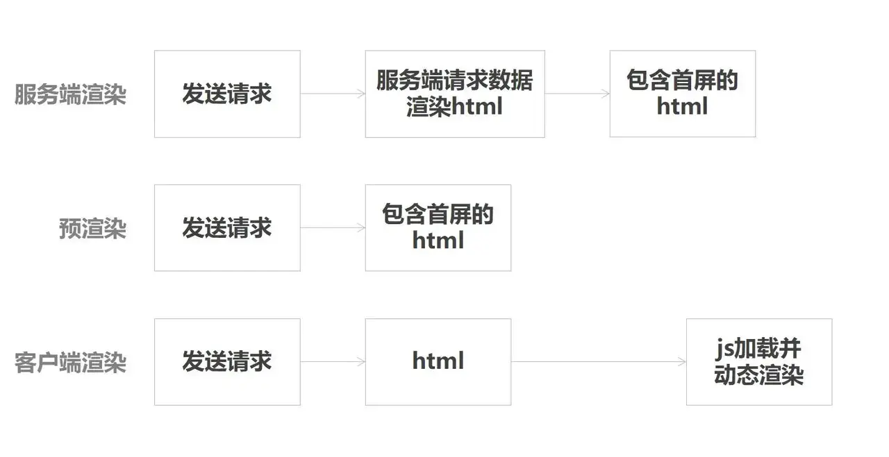
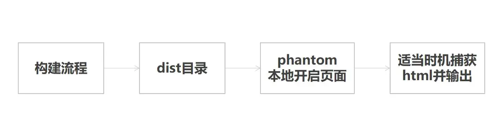

## 前言
Ajax技术的出现，让我们的web应用能够在不刷新的状态下显示不同页面的内容,这就是单页应用。在一个单页应用中，往往只有一个html文件，然后根据访问的url来匹配对应的路由脚本,动态的渲染页面内容。单页应用在优化了用户体验的同时，也给我们带来了许多问题，例如SEO不友好、首屏可见时间过长等。服务端渲染(SSR)和预渲染(Prerender)技术正事为了解决这些问题而生的。

## 服务端渲染与预渲染区别
- 客户端渲染: 用户访问url,请求html文件,前端根据路由动态渲染页面内容。关键链路较长，有一定的白屏时间。
- 服务端渲染: 用户访问url，服务端根据访问路径请求所需数据，拼接成html字符串，返回给前端。前端接收到html时候=已有部分内容
- 预渲染：构建阶段生成匹配预渲染路径的html文件(注意：每个需要预渲染的路由都有一个对应的html)。构建出来的html文件已有部分内容




## 服务端渲染与预渲染共同点
针对单页应用，服务端渲染和预渲染共同解决的问题
1. SEO: 单页应用的网站内容是根据当前路径动态渲染的，html文件中往往没有内容，网络爬虫不会等到页面脚本执行完在抓取；
2. 弱网环境：当用户在一个弱环境中访问你的站点时，你会想要尽可能快的将内容呈现给他们。甚至是在 js 脚本被加载和解析前；
3. 低版本浏览器：用户的浏览器可能不支持你使用的 js 特性，预渲染或服务端渲染能够让用户至少能够看到首屏的内容，而不是一个空白的网页。
    
预渲染能与服务端渲染一样提高 SEO 优化，但前者比后者需要更少的配置，实现成本低。弱网环境下，预渲染能更快地呈现页面内容，减少页面可见时间

## 什么场景下不适用预渲染
- 个性化内容: 对于路由是/my-profile 的页面来说，预渲染失效了。因为页面内容根据看它的人而显的不同
- 经常变化的内容，如果你预渲染一个游戏排行榜，这个排行榜这个排行榜会随着新的玩家记录而更新，预渲染会让你的页面显示不正确直到脚本加载完成并替换成新的数据。这是一个不好的用户体验；
- 成千上万的路由：不建议预渲染非常多的路由，因为这会严重拖慢你的构建进程

## Prerender SPA Plugin
prerender-spa-plugin 是一个webpack插件用于单页应用中预渲染静态html内容。因此，该插件限定了你的单页应用必须使用webpack创建,且它是框架无关的，无论你是使用React或Vue甚至不使用框架，都能用来进行预渲染

## prerender-spa-plugin 原理
那么prerender-spa-plugin 是如何做到将运行时的html打包到文件中呢？原理很简单，就是在webpack构建阶段的最后，在本地启动一个phantomjs，访问配置了预渲染的路由，再将phantomjs中渲染的页面输出到html文件中，并简历路由对应的目录



查看 prerender-spa-plugin 源码 [prerender-spa-plugin/lib/phantom-page-render.js](https://github.com/chrisvfritz/prerender-spa-plugin/blob/master/lib/phantom-page-render.js#L89-L100)。

```js
// 打开页面
page.open(url, function(status) {
    // ...
    //  没有设置捕获钩子时，在脚本执行完捕获
    if (
    !options.captureAfterDocumentEvent &&
    !options.captureAfterElementExists &&
    !options.captureAfterTime
  ) {
    // 拼接 html
    var html = page.evaluate(function () {
      var doctype = new window.XMLSerializer().serializeToString(document.doctype)
      var outerHTML = document.documentElement.outerHTML
      return doctype + outerHTML
    })
    returnResult(html) // 捕获输出
  }
  //...
})
```
## 项目实例
该实例基于Vue2.0 + vue-router,使用vue-cli3.0生成

### 安装
```js
npm install prerender-spa-plugin --save
```
### vue.config.js中增加
```js
const PrerenderSPAPlugin = require('prerender-spa-plugin');
const Renderer = PrerenderSPAPlugin.PuppeteerRenderer;
const path = require('path');
module.exports = {
    configureWebpack: config => {
        if (process.env.NODE_ENV !== 'production') return;
        return {
            plugins: [
                new PrerenderSPAPlugin({
                    // 生成文件的路径，也可以与webpakc打包的一致。
                    // 下面这句话非常重要！！！
                    // 这个目录只能有一级，如果目录层次大于一级，在生成的时候不会有任何错误提示，在预渲染的时候只会卡着不动。
                    staticDir: path.join(__dirname,'dist'),
                    // 对应自己的路由文件，比如a有参数，就需要写成 /a/param1。
                    routes: ['/', '/product','/about'],
                    // 这个很重要，如果没有配置这段，也不会进行预编译
                    renderer: new Renderer({
                        inject: {
                            foo: 'bar'
                        },
                        headless: false,
                        // 在 main.js 中 document.dispatchEvent(new Event('render-event'))，两者的事件名称要对应上。
                        renderAfterDocumentEvent: 'render-event'
                    })
                }),
            ],
        };
    }
}
```
### 在main.js中增加
```js
new Vue({
    router,
    store,
    render: h => h(App),
    mounted() {
        document.dispatchEvent(new Event('render-event'));
    }
}).$mount('#app')
```
### router.js中设置mode: "history"
预渲染的单页应用路由需要使用History 而不是Hahs模式。原因很简单，Hahs不会呆到服务器，路由信息会丢失。

### 验证是否配置成功
运行npm run build，看一下生成的 dist 的目录里是不是有每个路由名称对应的文件夹。然后找个 目录里 的 index.html 用IDE打开，看文件内容里是否有该文件应该有的内容。有的话，就设置成功了

如果你想修改每个页面的meta 信息，这里推荐使用 vue-meta(https://github.com/nuxt/vue-meta)

首先生成一个项目并安装依赖，组件开发过程我们不关注，具体可以查看示例源代码。

原文链接：https://blog.csdn.net/huangjianfeng21/article/details/92421738


## 资料
[Vue 预渲染实现方案](https://www.jianshu.com/p/57fe59d4a0f6)

[spa 如何达到ssr 的秒开技术方案——预渲染](https://mp.weixin.qq.com/s/eNNREssPqs8aJy3KCQrO7w)