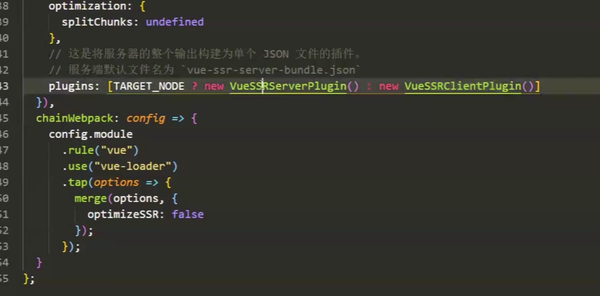
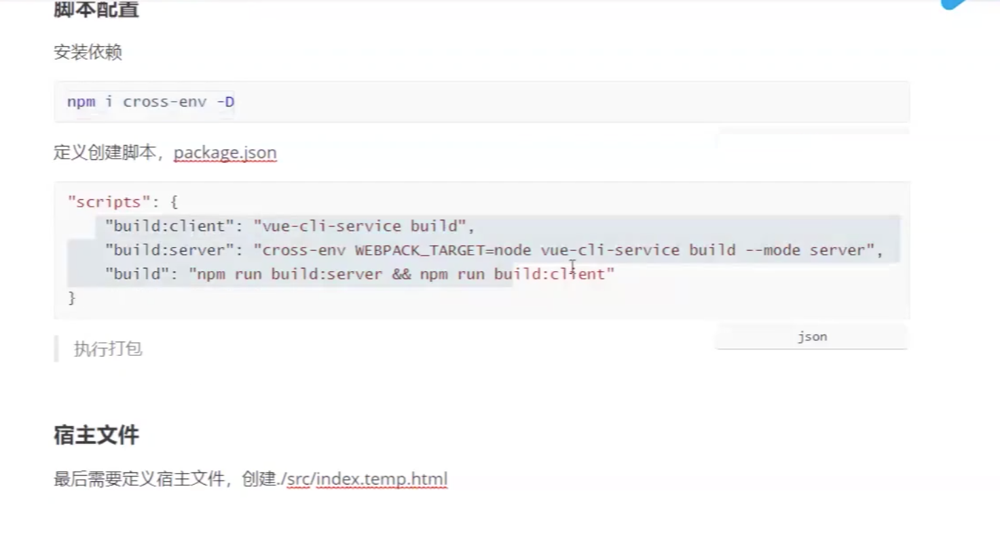
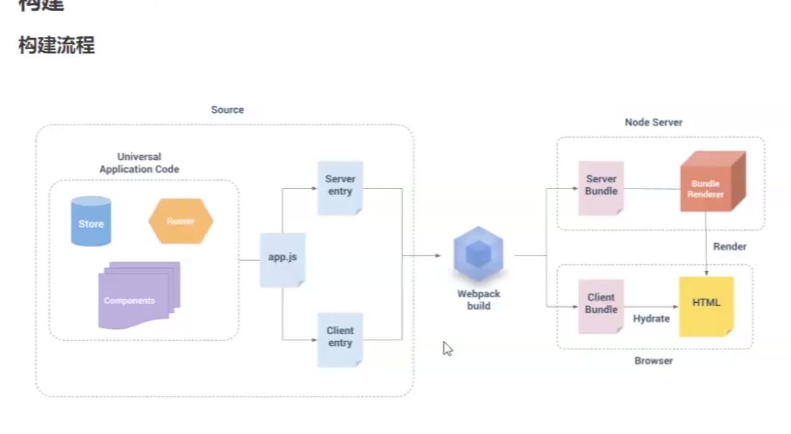
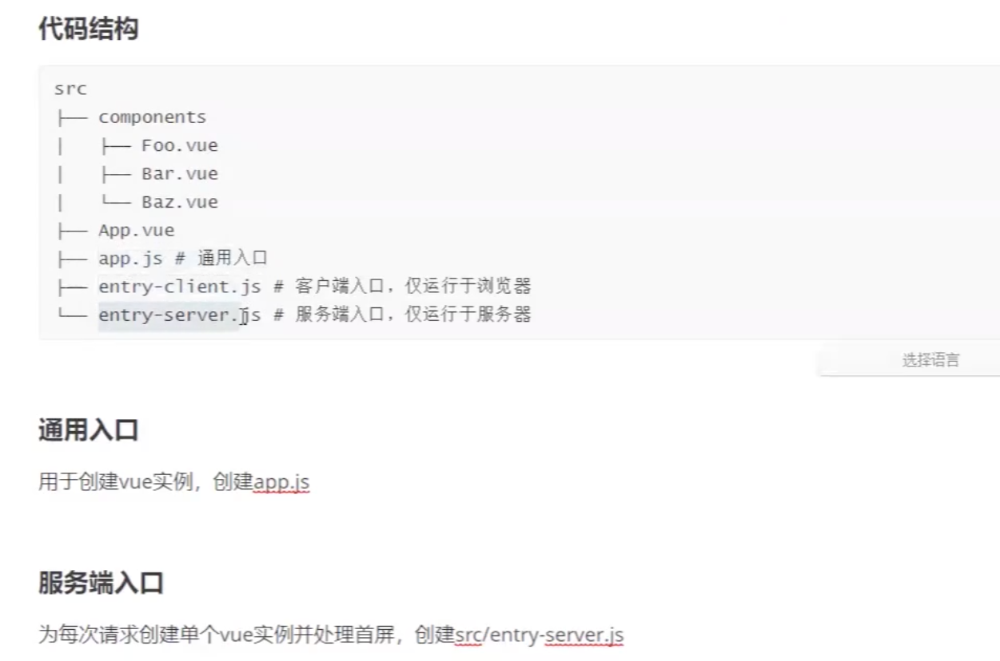

## ssr的概念
将一个Vue组件在服务器端渲染为HTML字符串并发送到浏览器，最后再将这些静态标记激活为可交互应用程序的过程成为服务端的渲染

## 基本使用
### 新建工程
```
vue create ssr
```

### 安装依赖
```
npm install vue-server-renderer express -D
```

### 编写服务的启动脚本

server=>index.js
```
// nodejs服务器
const express = require('express');
const Vue = require('vue');

// 创建express实例和vue实例
const app = express();

// 创建渲染器
const renderer = require('vue-server-renderer').createRenderer();

// 将来用渲染器渲染page可以得到html内容
const page = new Vue({
    data: {title: '测试'}，
    template: '<div><h1>{{title}}</h1><div>hello, vue ssr!</div></div>'
})

app.get('/', async (req, res) => {
    try {
        const html = await renderer.renderToString(page);
        console.log(html);
        res.send(html)l
    } catch (error) {
        res.status(500).send('服务器内部错误');
    }
})

app.listen(3000, () => {
    console.log('渲染服务器启动成功');
});
```

**server=>index2.js**

```
// nodejs服务器
const express = require('express');
const Vue = require('vue');
const fs = require('fs');
// 创建express实例和vue实例
const app = express();

// 创建渲染器
const {createBundleRenderer} = require('vue-server-renderer');

const serverBundle = require('../dist/server/vue-ssr-server-bundle.json');
const clientManifest = require('../dist/server/vue-ssr-client-manifest.json');
const renderer = createBundleRenderer(serverBundle, {
    runInNewContext: false,
    template: fs.readFileSync('../public/index.temp.html', 'utf-8'), // 宿主模板文件
    clientManifest,
})

// 中间件处理静态文件请求-- 关闭index
app.use(express.static('../dist/client', {index: false})); 

// 将来用渲染器渲染page可以得到html内容
const page = new Vue({
    data: {title: '测试'}，
    template: '<div><h1>{{title}}</h1><div>hello, vue ssr!</div></div>'
})

// 路由处理交给vue
app.get('*', async (req, res) => {
    try {
        const context = {
            url: req.url,
            title: 'ssr'
        }

        const html = await renderer.renderToString(context);
        console.log(html);
        res.send(html)l
    } catch (error) {
        res.status(500).send('服务器内部错误');
    }
})

app.listen(3000, () => {
    console.log('渲染服务器启动成功');
});
```

**index.temp.html**
```
<!DOCTYPE html>
<html lang="en">
<head>
    <meta charset="UTF-8">
    <meta http-equiv="X-UA-Compatible" content="IE=edge">
    <meta name="viewport" content="width=device-width, initial-scale=1.0">
    <title>Document</title>
</head>
<body>
    <!-- vue-ssr-outlet -->
</body>
</html>
```
### 路由

安装 vue-router

### 入口
app.js

### 服务的入口
entry-server.js

### 客户端入口
entry-client.js

### webpack

// router=>index.js

```
import Vue from 'vue';
import Router from 'vue-router';
import Index from '@/components/Index';
import Detail from '@/components/Detail';

Vue.use(Router);

// exort default new Router({})

// 这里为什么不导出一个router实例
/**
每次用户请求都需要创建router实例
优化：？？缓存？
*/
export default function createRouter() {
    return new Router({
        node: 'history',
        routes: [
            {path: '/', component: Index},
            {path: '/detail', compoents: Detail},
        ]
    })
}
```

app.js

```
// 创建vue实例
import Vue from 'vue';
import App from './App.vue';
import createRouter from './router';

export default function createApp() {
    const router = createRouter();
    const app = new Vue({
        router,
        render: h => h(App)
    })
    // .$mount()  无需挂载 只需要里面内容

    return {app, router}
}
```

entry-server.js
```
// 渲染首屏
import createApp from './app';

// context哪儿来？？
export default context => {
    return new Promise((resolve, reject) => {
        const {app, router} = createApp();
        // 进入首屏
        router.push(context.url);
        router.onReady(() => {
            resolve();
        }, reject)
    })
};
```

entry-client.js

```
// 挂载、激活app

import createApp from './app';

const {app, router} = createApp();
router.onReady(() => {
    app.$mount('#app');
})
```

webpack









## 其他
### csr特点
+ 首屏渲染速度慢
+ SEO不友好

ssr 
+ 开发条件受限
+ 构建部署要求多
+ 服务端负载变大


##  异步数据同步问题
数据预取

服务器端渲染的应用程序的"快照",如果应用依赖与一些异步数据，那么在开始渲染之前，需要先预取和解析好这些数据

store/index.js
```
import Vue from 'vue';
import Vuex from 'vuex';

Vue.use(Vuex);

export function createStore() {
    return new Vuex.Stror({
        state: {
            count: 0
        },
        mutations: {
            init(state, count) {
                state.count = count;
            },
            add(state) {
                state.count += 1;
            }
        },
        actions: {
            // 加一个异步请求count的action
            getCount({commit}) {
                return new Promise(resolve => {
                    setTimeout(() => {
                        commit('init', Math.random * 100);
                        resolve()
                    }, 1000);
                })
            }
        }
    })
}
```

app.js

```
// 创建vue实例
import Vue from 'vue';
import App from './App.vue';
import createRouter from './router';
import {createStore} from './store';

Vue.config.productionTip = false;

// 加入一个群居混入，处理客户端asyncData调用
Vue.mixin({
    beforeMount() {
        const {asyncData} = this.$options;
        if (asyncData) {
            asyncData({
                store.this.$store,
                route: this.$route
            })
        }
    }
})

// 需要返回一个应用程序工厂:返回vue实例和router实例、store实例
export default function createApp() {
    // 处理首屏，就要先处理路由跳转
    const router = createRouter();
    const app = new Vue({
        router,
        store,
        context,
        render: h => h(App)
    })
    // .$mount()  无需挂载 只需要里面内容

    return {app, router, store}
}
```

Home.vue
```
<h2 @click="$store.commit('add')">{{$store.state.count}}</h2>

asyncData({store, route}) {
    return store.dispath('getCount')
}
```

entry-server.js
```
// 渲染首屏
import createApp from './app';

// context哪儿来？？
export default context => {
    return new Promise((resolve, reject) => {
        const {app, router} = createApp();
        // 进入首屏
        router.push(context.url);
        router.onReady(() => {
            // 获取当前匹配的所有组件
            const metched = router.getMatchedComponents();

            // 404
            if (!matched.length) {
                return reject({code: 404});
            }

            // 遍历matched 数组，判断他们内部有没有asyncData
            // 如果有就执行，等待返回结果
            Promise.all(
                matched.map(Component => {
                    if (Component.asyncData) {
                        return Component.asyncData({
                            store, 
                            route: router.currentRoute
                        })
                    }
                })
            ).then(() => {
                // 约定 将app数据状态放入context.state
                // 渲染器会将state序列化变成字符串 window.__INITIAL_STATE__
                // 未来在前端激活之前可以在恢复
                context.state = store.state;
                resolve(app);
            }).catch(reject);
        }, reject)
    })
};
```

entry-client.js

```
// 挂载、激活app

import createApp from './app';
// 客户端激活
const {app, router} = createApp();

// 还原state
if (window.__INITIAL_STATE__) {
    store.replaceState(window.__INITIAL_STATE__);
}

router.onReady(() => {
    app.$mount('#app');
})
```