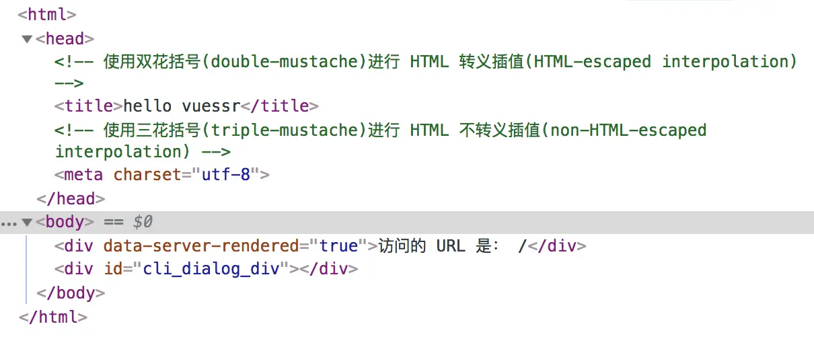
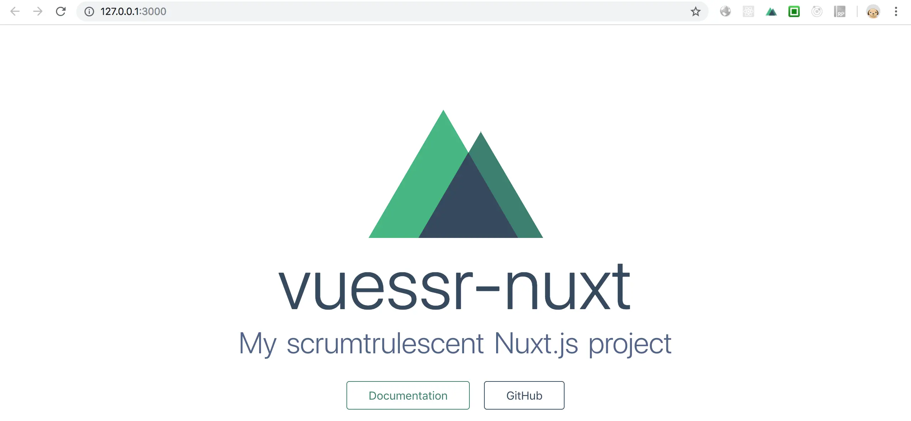
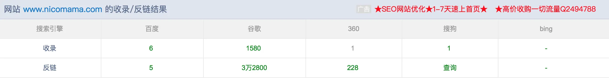

## Vue SSR
简而言之就是将本来要放在浏览器执行的组件，放到服务端先创建好，然后生成对应的html将他们直接发送到浏览器，最后将这些静态标记"激活"为客户端上完全可交互的应用程序

## Vue SSR 相比 SPA(单页应用)好处及坏处
1. 好处
    1. 更好的SEO,由于搜索引擎爬虫爬取工具可以直接查看完全渲染的页面
    2. 更快的内容达到时间(time-to-content),特别对于缓慢的网络情况或者运行缓慢的设备
2. 坏处
    1. 开发条件所限。浏览器特定的代码，只能在某些生命周期钩子函数(lifecycle hook)中使用；一些外部扩展库(external library)可能需要特殊处理，才能在服务器渲染应用程序中运行
    2. 涉及构建设置和部署的更多要求。与可以部署在任何静态文件服务器上的温泉静态单页面应用程序(SPA)不同，服务器渲染应用程序，需要处于Node.js server运行环境。
    3. 更多的服务器端负载。在Node.js中渲染完整的应用程序，显然会比仅仅提供静态文件的server更加大占用CPU资源(CPU-INTENSIVE -CPU密集)，因此如果你余量在高流量环境下使用，请准备相应的服务器负载，并明智的采用缓存策略

## 了解概念之后，让我们手动实现一个Vue SSR实例吧
相比 Vue SPA(单页应用)，Vue增加了一些扩展工具，首先我们来看一下比较重要的一个工具 vue-server-renderer，从名字可以看出它是在服务端渲染的时候用的

让我们看一下他的功能和用法
1. 创建一个项目 mkdir vuessr && cd vuessr
2. 运行npm init 进行初始化
3. 安装我们需要的以来 cnpm install vue vue-server-renderer --save
4. 创建 index.js 

    ```js
    // 第一步:创建一个Vue实例
    const Vue = require('vue');
    const app = new Vue({
        template: `<div>Hello World!</div>`
    })

    // 第二步 创建一个renderer
    const renderer = require('vue-server-renderer').createRenderer();

    // 第三步 将vue渲染为HTML
    renderer.renderToString(app, (err, html) => {
        if(err) throw err;
        console.log(html)
    })
    ```
5. 运行 node index.js 可以看到在控制台输出了

    ```js
    <div data-server-rendered="true">Hello World</div>
    ```
    我们在将生成好的html放到指定的html模板里在返回到浏览器不就实现服务端渲染功能了？

6. 安装依赖 cnpm install express --save
7. 创建 app.js 代码如下

    ```js
    const Vue = require('vue');
    const server = require('express')();
    const renderer = require('vue-server-renderer').createRenderer();

    server.get('*', (req, res) => {
        const app = new Vue({
            data: {
                url: req.url
            },
            template: `<div>访问的URL是：{{URL}}</div>`
        })
        renderer.renderToString(app, (err, html) => {
            if(err) {
                res.status(500).end('Interval Server Error');
                return;
            }
            res.end(`
                <!DOCTYPE html>
                <html lang="en">
                    <head><title>Hello</title></head>
                    <body>${html}</body>
                </html>
            `)
        })
    })
    server.listen(8080)
    ```
8. 运行node app.js
9. 打开浏览器输入http://localhost:8080/发现我们的内容已经显示出来了，如果有同学发现有中文乱码的问题，可以设置一下编码：

    ```js
    renderer.renderToString(app, (err, html) => {
        if(err) {
            res.status(500).end('Interval Server Error');
            return;
        }
        // 设置编码
        res.writeHead(200, {'Content-Type': 'text/html;charset=utf-8'});
        res.end(`
            <!DOCTYPE html>
            <html lang="zh">
                <head><title>Hello</title></head>
                <body>${html}</body>
            </html>
        `)
    })
    ```
    然后重新运行一下试试。
10. 当然直接采用字符串来拼接html内容是非常不优雅的，而且容易出错，我们可以改成模板形式，创建文件 index.template.html 代码如下

    ```html
    <!DOCTYPE html>
    <html lang="en">
        <head><title>Hello</title></head>
        <body>
            <!--vue-ssr-outlet-->
        </body>
    </html>
    ```
    > 注意：vue-ssr-outlet---这里将是应用程序HTML标记注入的地方
11. 修改 app.js 

    ```js
    const renderer = require('vue-server-renderer').createRenderer({
        template: require('fs').readFileSync('./index.template.html', 'utf-8');
    })

    // ***
    renderer.renderToString(app, (err, html) => {
        if(err) {
            res.status(500).end('Interval Server Error');
            return;
        }
        res.writeHead(200, {'Content-Type': 'text/html;charset=utf-8'});
        res.end(html);
    })
    ```
12. 重新运行一下试试，看看能正常运行
13. 它还支持模板插值操作，修改文件 index.template.html，代码入下

    ```html
    <html>
    <head>
        <!-- 使用双花括号(double-mustache)进行 HTML 转义插值(HTML-escaped interpolation) -->
        <title>{{ title }}</title>

        <!-- 使用三花括号(triple-mustache)进行 HTML 不转义插值(non-HTML-escaped interpolation) -->
        {{{ meta }}}
    </head>
    <body>
        <!--vue-ssr-outlet-->
    </body>
    </html>
    ```
    修改文件 index.js，需要调整的代码如下
    ```js
    const Vue = require('vue');
    const server = require('express')();
    const renderer = require('vue-server-renderer').createRenderer({
        template: require('fs').readFileSync('./index.template.html', 'utf-8');
    })

    const context = {
        title: 'hello vuessr',
        meta: `<meta charset="utf-8">`
    }

    server.get('*', (req, res) => {
        const app = new Vue({
            data: {
                url: req.url
            },
            template: `<div>访问的 URL 是： {{ url }}</div>`
        })

        renderer.renderToString(app, context, (err, html) => {
            if(err) {
                res.status(500).end('Interval Server Error');
                return;
            }
            res.writeHead(200, {'Content-Type': 'text/html;charset=utf-8'});
            res.end(html)
        })
    })
    server.listen(8080)
    ```
14. 再次重新运行一下试试，看看能否正常运行。以下是查看浏览器源码的截图，可以看到模板定义的内容已经替换成对应的数据了



代码地址:

[https://github.com/taoxhsmile/vuessr-demo1](https://github.com/taoxhsmile/vuessr-demo1)


## 讲完原理之后，让我们来看看Nuxt.js有是咋回事
在进入下一个环节之前，还是建议大家先去看官方文档 [zh.nuxtjs.org/guide/](zh.nuxtjs.org/guide/)

### Nuxt.js是什么？
简而言之Nuxt.js就是Vue SSR的一个开箱即用的框架。安装好就可以直接写业务代码，而不需要做过多的配置。

既然是一个框架，那我们就要按照它的规则来配置和写代码，前面提供的官方文档非常详细介绍。这里就不做过多的介绍，我们直接进行实战吧。首先我们先创建一个项目

在改造官网旗舰刚好Nuxt.js 2.0发布了，看了一下改动还是比较多的，为了确保项目正常上线，决定还是先采用稳定的1.0+版本进行编码(毕竟新版本发布多少会有一点问题)。以下也是针对1.0+版本开发过程中遇到的一些问题，大家可以借鉴以下。

以下内容主要针对实战过程中遇到的一些问题来进行分享：

第一步让我们先创建一个新项目吧，安装文档地址：[zh.nuxtjs.org/guide/insta…](https://v2.nuxt.com/docs/get-started/installation/) 我们采用 create-nuxt-app 命令来安装，运行

```shell
npx create-nuxt-app vuessr-nuxt
```
或
```shell
cnpm install -g create-nuxt-app
create-nuxt-app vuessr-nuxt
```
选择配置如下
```md
? Project name vuessr-nuxt
? Project description My unreal Nuxt.js project
? Use a custom server framework express
? Use a custom UI framework none
? Choose rendering mode Universal
? Use axios module yes
? Use eslint no
? Use prettier no
? Author name taoxinhua
? Choose a package manager npm
```
然后进入进入项目运行，cnpm run dev 看看项目是否能正常运行，如果不能运行，第一步先检查以下node版本，我的node版本是v8.12.0。第二步如果node升级之后还是不行，运行cnpm install 看下是否有依赖包少安装了。如果这两步还不能解决问题，大家可以在评论区提问。

打开浏览器进入 http://127.0.0.1:3000，可以看到我们的项目已经可以运行了。没错就是这么简单



1. 使用axios遇到的坑

    :::tips
    在使用1.0+版本开发过程中发现每次修改文件，服务端代码都会重新加载并执行一遍，如果直接把axios的钩子函数放到plugin中去执行，会发现每次修改完毕之后钩子函数都会重复添加一次，导致参数重复被处理，比如我发送请求之前要把传递的data转成字符串形式。会发现下面代码的config.data会出现累加的情况
    :::

    ```js
    axios.interceptors.request.use(config => {
        let data = config.data || {};
        let auth = buildHttpHeaders();

        config.url = getApiUrl(config.url);

        config.data = qs.stringify({
            data: JSON.stringify(data),
            auth: JSON.stringify(auth);
        })
        // 在请求发出之前进行一些操作
        return config;
    }, err => {
        // Do something with request error
        return Promise.reject(err);
    })
    ```
    <span style="color: red">解决办法</span>

    ```js
    // 创建文件 assets/js/config/config-axios.js
    import Axios from 'axios'
    import qs from 'qs'
    import { getUUID } from '~/assets/js/tools/index'
    import { getApiUrl } from '~/assets/js/config/config-urls.js'

    function buildHttpHeaders() {
        return {
            "x-user-id": '',
            "x-access-token": '',
            "x-platform": 'pc',
            "x-client-token": getUUID(),
            "x-system-version": '10.1.1',
            "x-client-version": '2.0.1',
            "x-method-version": '1.0',
            "x-network-type": '3g',
        }
    }

    let axios = Axios.create();

    // 添加一个请求拦截器
    axios.interceptors.request.use(function (config) {
        let data = config.data || {};
        let auth = buildHttpHeaders();

        config.url = getApiUrl(config.url);
        
        config.data = qs.stringify({
            data: JSON.stringify(data),
            auth: JSON.stringify(auth)
        })
        //在请求发出之前进行一些操作
        return config;
    }, function (err) {
        //Do something with request error
        return Promise.reject(err);
    });

    //添加一个响应拦截器
    axios.interceptors.response.use(function (res) {
        //在这里对返回的数据进行处理
        return res.data;
    }, function (err) {
        //Do something with response error
        return Promise.reject(err);
    });

    export default axios
    ```
    每次通过Axios.create返回一个全新的axios实例
    > 以上是项目里面拷贝出来的代码，无法单独运行，大家可以针对各自的需求进行相应调整。
    ```js
    // pluins/axios.js
    import Vue from 'vue';
    import axios from '~/assets/js/config/config-axios';

    Vue.prototype.$axios = axios;

    export default ({app}, inject) => {
        app.$axios = axios;
    }
    ```
    这样每次代码进行热更新就不会出现上面的问题了。

    这里还把axios挂到了Vue的原型下面和app对象下面，页面不需要引用axios就进行调用了。

2. asyncData

    在nuxt中组件文件申明的asyncData方法会被忽略，所以所有数据的加载都要放到对应page的asyncData中。

3. 如何增加额外的全局js文件

    我们可以通过定制模板来处理，在根目录下创建 app.html模板文件，nuxt默认的模板为

    ```html
    <!DOCTYPE html>
    <html {{ HTML_ATTRS }}>
    <head>
        {{ HEAD }}
    </head>
    <body {{ BODY_ATTRS }}>
        {{ APP }}
    </body>
    </html>
    ```
    比如我们要增加搜索引擎的收录代码我们可以
    ```html
    <!DOCTYPE html>
    <html {{ HTML_ATTRS }}>
    <head>
        {{ HEAD }}
        <!-- 百度自动收录脚本 -->
        <script>
            (function(){
                var bp = document.createElement('script');
                var curProtocol = window.location.protocol.split(':')[0];
                if (curProtocol === 'https') {
                    bp.src = 'https://zz.bdstatic.com/linksubmit/push.js';
                }
                else {
                    bp.src = 'http://push.zhanzhang.baidu.com/push.js';
                }
                var s = document.getElementsByTagName("script")[0];
                s.parentNode.insertBefore(bp, s);
            })();
        </script>
        <!-- 360自动搜录脚本 -->
        <script>(function(){
            var src = (document.location.protocol == "http:") ? "http://js.passport.qihucdn.com/11.0.1.js******":"https://jspassport.ssl.qhimg.com/11.0.1.js?******";
            document.write('<script src="' + src + '" id="sozz"><\/script>');
            })();
        </script>
        <!-- 百度统计 -->
        <script>
            var _hmt = _hmt || [];
            (function() {
            var hm = document.createElement("script");
            hm.src = "https://hm.baidu.com/hm.js?******";
            var s = document.getElementsByTagName("script")[0]; 
            s.parentNode.insertBefore(hm, s);
            })();
        </script>
    </head>
    <body {{ BODY_ATTRS }}>
        {{ APP }}
    </body>
    </html>
    ```
4. 让项目支持ip访问，在package.json文件中增加如下配置即可

    ```js
    "config": {
        "nuxt": {
            "host": "0.0.0.0",
            "port": "3000"
        }
    }
    ```
5. 正式环境、测试环境区分配置

    ```js
    // package.json
    "scripts": {
        "dev": "cross-env API_ENV=local nuxt",
        "build_beta": "cross-env API_ENV=beta nuxt build",
        "build_pro": "cross-env API_ENV=pro nuxt build",
        "start": "nuxt start",
        "generate": "nuxt generate",
        "lint": "eslint --ext .js,.vue --ignore-path .gitignore .",
        "precommit": "npm run lint"
    },
    ```
    添加 build_beta、build_pro，然后通过cross—env来设置环境
    ```js
    // nuxt.config.js
    env: {
        API_ENV: provess.env.API_ENV
    }
    ```
    这样就可以在代码中，通过process.env.API_ENV  来获取到环境变量的值了

6. 通过pm2启动项目

    ```js
    // pm2-config.json
    {
        "apps": [
            {
                "name": "nicomama-site",
                "script": "npm",
                "args" : "start",
                "watch": [".nuxt"]
            }
        ]
    }
    ```
7. 部署项目

    先运行 cnpm run build_beta 或者 cnpm run build_pro 进行打包，然后通过运行 pm2 start pm2-config.json 来运行项目

## 再来看一下上线之后搜索引擎的收录情况吧
[http://seo.chinaz.com/?q=www.nicomama.com](http://seo.chinaz.com/?q=www.nicomama.com)



可以看到网站的文章已经基本上都被谷歌收录到了，至于百度收录的数据比较少可能是因为网站整体改版的原因造成的，搜索引擎需要一定时间去更新，这个还有待观察。


[原文](https://juejin.cn/post/6844903710330454029#heading-1)