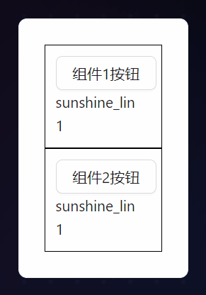
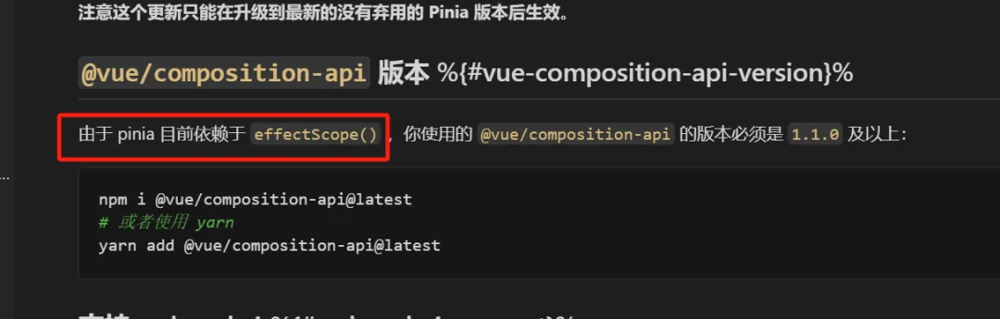

## 真的需要pinia吗？
最近在想一个问题：在vue3项目中,进行状态管理的时候，我们真的需要Pinia吗？

其实我们可以反过来想一个问题：没有pinia，我们能做状态管理吗？

答案是可以！！！

## ref reactive
vue3的一些API对比React的好处就是，这些API并不一定需要在组件中去声明

就比如你想要做局部状态管理的时候，可以直接用 reactive、Ref 这类API完成

```js
// state.ts
import {ref, reactive} from 'vue';

// 使用 reactive 或 ref 定义状态
const reactiveStateExample = reactive({
    name: 'sunshine_lin',
    age: 18,
})

const refStateExample = ref(1);

const updateName = (v: string) => {
    reactiveStateExample.name = v;
}

const updateName = (v: number) => {
    refStateExample.value = v;
}

export const useStore = () => {
    return {
        reactiveStateExample,
        refStateExample,
        updateName,
        updateNum,
    }
}
```
```html
<!-- Comp1 -->
<template>
    <div style="border: 1px solid black; padding: 10px;">
        <Button @click="onClick">组件1按钮</Button>
        <div>{{ store.reactiveStateExample.name}}</div>
        <div>{{ store.refStateExample}}</div>
    </div>
</template>

<script setup lang="ts">
    import {Button} from 'ant-design-vue';
    import {useStore} from './state';

    const store = useStore();

    const onClick = () => {
        store.updateName('xxxx')
    }
</script>
```
```html
<!-- Comp2 -->
<template>
    <div style="border: 1px solid black; padding: 10px;">
        <Button @click="onClick">组件2按钮</Button>
        <div>{{ store.reactiveStateExample.name}}</div>
        <div>{{ store.refStateExample}}</div>
    </div>
</template>

<script setup lang="ts">
    import {Button} from 'ant-design-vue';
    import {useStore} from './state';

    const store = useStore();

    const onClick = () => {
        store.updateNum(2);
    }
</script>
```
这样能达到局部状态管理，多组件公用一个状态的效果，请看下图



## effectScope
Vue3有一个超级冷门的API的effectScope，这个API非常强大，但是很多人都不知道它。

当然，既然很少人知道它，那自然就很少人知道，Pinia的底层原理就是以来了 effectScope



既然Pinia是通过 effectScope 来实现的，那么，我们自然也可以直接使用这个API来做状态管理 

其实已经有人做过这件事了，就比如vueuse中的

```js
import { effectScope } from 'vue';

export function createGlobalState<Fn extends (...args: any[]) => any>(stateFactory: Fn):Fn{
    let initialized = false;
    let state: any;
    const scope = effectScope(true);

    return ((...args: any[]) => {
        if(!initialized) {
            state = scope.run(() => stateFactory(...args))!;
            initialized = true;
        }
        return state;
    }) as Fn;
}
```
我们可以直接用这个Hooks来进行状态管理，如果是使用 effectScope 来进行管理的话，状态就不需要写在Hooks外部了，**因为effectScope内部逻辑只会执行一次，无论你调用了多少次**
```js
// state.ts
import {reactive} from 'vue';
import {createGlobalState} from './createGlobalState';

export const useStore = createGlobalState(() => {
    const state = reactive({
        name: 'sunshine_lin',
        age: 18
    })

    const updateName = (v: string) => {
        state.name = v;
    }
    const updateAge = (v: number) => {
        state.age = v;
    }

    return  {
        state, 
        updateName,
        updateAge
    }
})
```
```html
<!-- Comp1 -->
<template>
    <div style="border: 1px solid black; padding: 10px;">
        <Button @click="onClick">组件1按钮</Button>
        <div>{{ store.reactiveStateExample.name}}</div>
        <div>{{ store.refStateExample}}</div>
    </div>
</template>

<script setup lang="ts">
    import {Button} from 'ant-design-vue';
    import {useStore} from './state';

    const {state, updateName } = useStore();

    const onClick = () => {
        updateName('xxxx')
    }
</script>
```
```html
<!-- Comp2 -->
<template>
    <div style="border: 1px solid black; padding: 10px;">
        <Button @click="onClick">组件2按钮</Button>
        <div>{{ store.reactiveStateExample.name}}</div>
        <div>{{ store.refStateExample}}</div>
    </div>
</template>

<script setup lang="ts">
    import {Button} from 'ant-design-vue';
    import {useStore} from './state';

    const {state, updateAge} = useStore();

    const onClick = () => {
        updateNum(2);
    }
</script>
```
利用 effectScope 也能达到组件之间共享状态~


[原文](https://mp.weixin.qq.com/s/zfaOou0C5RuA3b79JcE57Q)