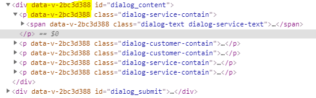

需求描述：由于样式中使用了scoped,所以编译后标签对中生成data-v-xxx属性。在 .dialog_content 的div中 动态添加元素节点p和span时，也需要给元素节点添加data-v-xxx属性。由于data-v-xxx属性是会变化的，那如何获取它，添加在动态添加的元素节点中呢？

## 解决方案
获取属性名
```js
document.getElementById('dialog_submit').attributes[0].name
```
设置属性
```js
nodeP.setAttribute(dataV, '')
```

```js
var nodeP = document.createElement("p"),
nodeSpan = document.createElement("span");
// 获取data-v-xxxx的值
var dataV = document.getElementById("dialog_submit").attributes[0].name;
// 设置属性
nodeP.setAttribute(dataV, "");
nodeSpan.setAttribute(dataV, "");
```
## 补充知识
当&lt;style&gt;标签有scoped属性时,它的CSS值作用域当前组件中的元素。编译时生成data-v-xxx属性，如下的“data-v-2bc3d899”就是因为加了scoped.
```html
<style scoped>
.title {
  color:blue;
}
</style>
 
<template>
  <div class="title">hello</div>
</template>
```
上述代码被编译为
```html
<style>
.title[data-v-f3f3eg9] {
  color: blue;
}
</style>
 
<template>
  <div class="title" data-v-f3f3eg9>hello</div>
</template>
```
使用scoped后，父组件的样式将不会参透到子组件中。不过一个子组件的根节点会同时受其父组件的scoped CSS和子组件的scoped CSS的影响。这样设计是为了让父组件可以从布局的角度出发，调整其子组件根元素的样式

## 深度作用选择器
白屏->在加载的时候资源没有下载下来
如果希望scoped样式中的一个选择器能够作用的"更深",例如影响子组件，可以使用 >>>操作符
```html
<style scoped>
.a >>> .b { /* ... */ }
</style>

<!-- 上述代码被编译为 -->
.a[data-v-f3f3eg9] .b { /* ... */ }
```


## 资料
[Vue---获取元素额外生成的data-v-xxx](https://blog.csdn.net/maidu_xbd/article/details/89315210)