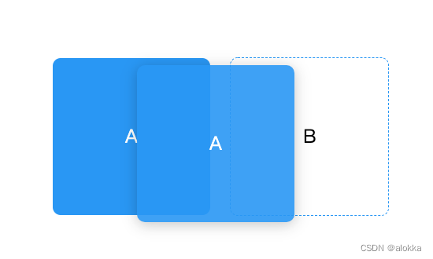
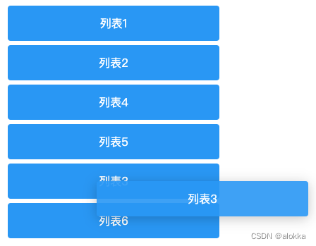
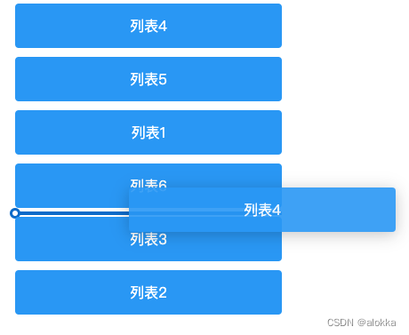

## 写在前面
在我们平时做的需求中，旺旺会遇到拖拽模块的需求。刚开始的没有接触过拖拽的时候，会对拖拽有陌生感，会比较担心实现起来比较复杂，自己很难搞定。然后会网上百度一些vue拖拽相关的插件。比如vue-draggabel它是基于sortable.js的二次封装，兼容了移动端，不过我们写toB项目的时，可能只有pc端需要拖拽功能，所以这期就结合vue教大家手写实现拖拽

## HTML拖拽API
1. 设置元素可拖放

    首先，为了使元素可拖动，吧draggable属性设置为true
    ```html
    
    ```
2. 拖放事件

    拖放涉及到两种元素，一种被拖拽元素(源对象)，一种是放置区元素(目标对象).如下图所示，按住A元素往B元素拖拽，A元素即为源对象，B元素即为目标对象

    

    触发对象|事件名称|说明
    ---|---|---
    在拖动目标上触发事件|ondragstart | 用户开始拖动元素时触发
    - | ondrag | 元素正在拖动时触发
    - | ondragend | 用户完成元素拖动后触发
    释放目标时触发的事件| ondragenter | 当被鼠标拖动的对象进入其容器范围内触发此事件
    - | ondragover | 当某被拖动的对象在另一个对象容易内拖动时触发此事件
    - | ondragleave | 当被鼠标拖动的对象离开其容器范围内触发此事件
    - | ondrag | 在一个拖动过程中，释放鼠标键时触发此事件

    > 需要注意的是: dragenter和dragover事件的默认下行为是拒绝接受任何被拖放的元素。因此，我们必须阻止浏览器这种默认行为。e.preventDefault()

## 拖拽实现
下面我会用两种方式实现vue拖拽
1. 拖拽中触发排序

    > 因为要在拖动中触发排序，所以使用ondragstart、ondragenter api来实现
    效果如下
    

    [线上体验地址](https://codesandbox.io/s/w53ds7?file=/src/App.vue)
    ```html
    <template>
        <transition-group name="drag" class="list" tag="ul">
            <li
                @dragstart="dragstart(index)"
                @dragenter="dragenter($event, index)"
                @dragover.prevent
                :draggable="true"
                v-for="(item, index) in list"
                :key="item.label"
                class="list-item"
            >
                {{item.label}}
            </li>
        </transition-group>
    </template>
    <script>
        export default {
            data() {
                return {
                    list: [
                    { label: "列表1" },
                    { label: "列表2" },
                    { label: "列表3" },
                    { label: "列表4" },
                    { label: "列表5" },
                    { label: "列表6" },
                ],
                dragIndex: "",
                }
            },
            methods: {
               dragstart(index) {
                this.dragIndex = index;
               }，
               dragenter(e, index) {
                // 避免源对象触发自身的dragenter事件
                if(this.dragIndex !== index) {
                    const moving = this.list[this.dragIndex];
                    this.list.splice(this.dragIndex, 1);
                    this.list.splice(index, 0, moving);
                    // 排序变化后目标对象的索引变成源对象的索引
                    this.dragIndex = index;
                }
               }
            }
        }
    </script>
    <style lang="scss" scoped>
        .list {
        list-style: none;
        .drag-move {
            transition: transform 0.3s;
        }
        .list-item {
            cursor: move;
            width: 300px;
            background: #EA6E59;
            border-radius: 4px;
            color: #FFF;
            margin-bottom: 6px;
            height: 50px;
            line-height: 50px;
            text-align: center;
        }
        }
    </style>
    ```
2. 辅助线拖拽后排序

    > 辅助线拖拽后我们用到了ondragstart、ondragover、ondragend api

    效果如下
    

    [线上体验地址](https://codesandbox.io/s/condescending-butterfly-enjqpr?file=/src/App.vue)
    ```html
    <template>
        <div>
            <transition-group name="drag" class="list" tag="ul">
            <li
                @dragstart="dragStart(item, index)"
                @dragover.prevent="dragOver(index)"
                @dragend="dragEnd()"
                draggable
                v-for="(item, index) in todolist"
                :key="item.label"
                :class="['list-item', { 'is-dragover': index === newIndex }]"
            >
                {{ item.label }}
            </li>
            </transition-group>
        </div>
        </template>
        <script>
        export default {
        data() {
            return {
            todolist: [
                { label: "列表1" },
                { label: "列表2" },
                { label: "列表3" },
                { label: "列表4" },
                { label: "列表5" },
                { label: "列表6" },
            ],
            oldIndex: "",
            oldData: "",
            newIndex: "",
            };
        },
        methods: {
            dragStart(val, i) {
            this.oldIndex = i;
            this.oldData = val;
            },
            dragOver(i) {
            this.newIndex = i;
            },
            dragEnd() {
            let newItems = [...this.todolist];
            // 删除老的节点
            newItems.splice(this.oldIndex, 1);
            // 在列表中目标位置增加新的节点
            newItems.splice(this.newIndex, 0, this.oldData);
            this.todolist = [...newItems];
            this.newIndex = "";
            },
        },
        };
        </script>
        <style lang="scss" scoped>
        .list {
        list-style: none;
        .drag-move {
            transition: transform 0.3s;
        }
        .list-item {
            position: relative;
            cursor: move;
            width: 300px;
            background: #EA6E59;
            border-radius: 4px;
            color: #FFF;
            margin: 10px 0;
            height: 50px;
            line-height: 50px;
            text-align: center;
        }
        }

        .list-item.is-dragover::before {
        content: "";
        position: absolute;
        bottom: -8px;
        left: 0;
        width: 100%;
        height: 4px;
        background-color: #0c6bc9;
        }
        .list-item.is-dragover::after {
        content: "";
        position: absolute;
        bottom: -12px;
        left: -6px;
        border: 3px solid #0c6bc9;
        border-radius: 50%;
        width: 6px;
        height: 6px;
        background-color: #fff;
        }
        </style>
    ```


