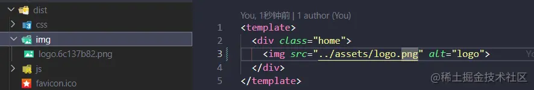
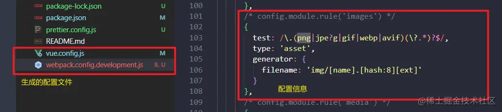

## 引言
相信用过vue的小伙伴，肯定会被面试官问过这样一个问题:在vue中动态引入图片为什么要使用require？

有些小伙伴，可能会轻蔑一笑：呵，就这，<span style="color:red">因为动态添加src被当做静态资源处理了，没有进行编译，所以要加上require；</span>我倒着都能背出来。

emmm....咋一看像说的很有道理啊，但是仔细一看，这句话到底说个啥？针对上面的问题，我不禁有如下几个疑问？
1. 什么 是静态资源
2. 为什么动态添加的src会被当做的静态的资源
3. 没有进行编译，是指是什么没有被编译
4. 加上require为什么能正确的引入资源，是因为加上require就能编译了？

## 什么是静态资源
与静态资源相对应的还有一个动态资源，先让我们看看网上的大佬们怎么解释的
:::tip
静态资源:一般客户端发送请求到web服务器，web服务器从内存中取到相应的文件，返回给客户端，客户端解析并渲染显示出来

动态资源:一般客户端请求的动态资源，先将请求交于web容器，web容器连接数据库，数据库处理数据之后，将内容交给web服务器，web服务器返回给客户端解析渲染处理
:::
其实上面的总结已经很清晰了。站在vue项目的角度，可以简单理解为:

<span style="color: red">静态资源就是直接存放在项目中的资源，这些资源不需要我们发送**专门的请求进行获取**。</span>比如assets目录下的图片、视频、音频、字体文件、css样式表等

<span style="color:red">动态资源就是需要发送请求获取到的资源。</span>比如我们刷淘宝的时候，不同的商品信息是发送的专门的请求获取到的，就可以称之为动态资源

## 为什么动态添加的src会被当做静态的资源？
我们知道浏览器打开一个网页，实际上运行的是html、css、js三种类型的文件。当我们本地启动一个vue项目的时候，实际上是先将vue项目进行打包，打包的过程就是将项目中的一个个vue文件编译成html,css,js文件的过程，而后再在浏览器上运行的。

那动态添加的src如果我们没有使用require引入，最终会打包成什么样子呢？实验一波
```html
<!-- vue文件中动态引入一张图片 -->
<template>
    <div class="home">
        <!-- 通过v-bind引入资源的方式统称为动态引入 -->
        
    </div>
</template>

<!-- 最终编译的结果(浏览器上运行的结果) -->
<!-- 这张图片是无法被正确打开的 -->

```
我们可以看出，<span style="color: red">动态添加的src最终会编译成一个静态的字符串地址。程序运行的时候，会按照这个地址去目录中引入资源。而去项目目录中引入资源的方式，就是将该资源当成了静态资源。</span>。所以这也就回答了我们的问题2。

看到这里估计就有小伙伴疑惑了，这个最终被编译的地址有什么问题吗？我项目中的图片就是这个地址，为什么无法引入？别急，我们继续往下看。

## 3.没有进行编译，是指什么没有被编译?
没有进行编译。这半句话，就听得很让人懵逼了。按照问题2我们知道这个动态引入的图片最终是被编译了，只是被编译之后无法正确的引入图片资源而已。所以这句话本来就是错的。针对于我们的标准答案，我在这里进行改写：

<span style="color: blue">**因为动态添加src被当做静态资源处理了，而被编译过后的静态路径无法正确的引入资源，所以要加上require**</span>

那这里就诞生了一个新的疑问:<span style="color: red">被编译过后的静态路径为什么无法正确的引入资源</span>

想要这个问题的答案，我们的先从正确的引入一张图片开始。在项目中我们静态的引入一张图片肯定是可以引入成功的，而引用图片所在的vue文件肯定也是被编译的，那静态引入图片最终会被编译成什么样呢？
```js
// vue文件中静态的引入一张图片
<template>
  <div class="home">
      <!-- 直接引入图片静态地址， 不再使用v-bind -->
    
  </div>
</template>

//最终编译的结果
//这张图片是可以被正确打开的

```
根据上面的测试，我们发现，使用静态的地址去引入一张图片，图片的路径和图片的名称已经发生了改变，并且编译后的静态地址是可以成功引入资源的。**这是因为,在默认情况下，src目录下面的所有文件都会被打包，src下面的图片也会被打包在新的文件夹下并生成新的文件名。编译过后的静态地址引入的是打包后的图片地址，从而可以争取的引入资源**

事实是这样吗？我们可以执行打包的命令（npm run build）进行验证


可以发现，编译后的静态地址确实是和dist下编译后的地址是一直的，从而验证我们的想法。

到这里我们其实就可以解释上面的问题了:动态添加的src，被编译后的静态路径为什么无法正确的引入资源

<span style="color: red">因为动态添加的src编译后的地址，与图片资源编译过后的资源地址不一致，导致无法正确的引入资源</span>

```js
编译过后的src地址： ../assets/logo.png
编译过后的图片资源地址：/img/logo.6c137b82.png
```
那要怎么解决上述的问题呢，答案就是：require

## 4.加上require为什么能正确的引入资源，是因为加上require就能编译了？
针对这个问题，首先就要否定后半句，无论加不加require，vue文件中引入一张图片都会被编译。

接着我们再来好好了解一下，require。
### 4.1 require是什么：是一个node方法，用于引入模块，JSON或本地文件
### 4.2 调用require方法引入一张图片之后发生了什么？
在回答这个问题之前，容我先对问题3中的内容进行一定的补充。其实如果真的有小伙伴跟着问题三中的操作进行验证，估计就要开喷了：为什么我静态引入的图片最终编译的地址和你的不一样，是个base64，而且打包之后dist下面也没有生成新的图片。大概就是下面这样的情况。
```js
// vue文件中静态的引入一张图片
<template>
<div class="home">
    <!-- 直接引入图片静态地址， 不再使用v-bind -->
  
</div>
</template>

//最终编译的结果
//这张图片是可以被正确打开的

```
先别急着喷，实际上造成这种差异的原因，是因为我改了一下webpack中的配置。接下来涉及少量webpack代码，不了解webpack的小伙伴也没关系，了解原理即可。

在上文中的我们提到，vue项目最终会被打包成一个dist目录，那么是什么帮我们完成这个打包的呢，没错，就是webpack。在vue项目中的引入一张图片的时候，细心的同学会发现，有的时候，浏览器上显示图片地址是一个base64，有的时候，是一个被编译过后的文件地址。也就是上述描述的差异。

之所以会造成这种差异，是webpack打包的时候，对图片资源进行了相关的配置。我们可以通过如下命令生成vue项目中的webpack配置文件，进行验证：



上图就是vue中webpack默认的图片打包规则。设置 type: 'asset'，默认的，对于小于8k的图片，会将图片转成base64 直接插入图片，不会再在dist目录生成新图片。对于大于8k的图片，会打包进dist目录，之后将新图片地址返回给src。

而我在上述测试中使用的图片，是vue-cli自带的一张logo图片，大小是6.69k。按照默认的打包规则，是会转成base64，嵌入图片中的。所以为了讲述方便，我在vue.config.js中修改了其默认的配置，配置如下：
```js
module.exports = {
    // 使用configureWebpack对象，下面可以直接按照webpack中的写法进行编写
    // 编写的内容，最终会被webpack-merge插件合并到webpack.config.js主配置文件中
  configureWebpack: { 
    module: {
      rules: [
        {
          test: /\.(png|jpe?g|gif|webp|avif)(\?.*)?$/,
          type: 'asset',
          parser: {
            dataUrlCondition: {
             // 这里我将默认的大小限制改成6k。
              // 当图片小于6k时候，使用base64引入图片；大于6k时，打包到dist目录下再进行引入
              maxSize: 1024 * 6
            }
          }
        }
      ]
    }
  }
}
```
那上面说了这么多，和require有啥关系，自然是有滴。

我们现在知道vue最终是通过webpack打包，并且会在webpack配置文件中编写一系列打包规则。而webpack中的打包规则，针对的其实是一个一个模块，换而言之webpack只会对模块进行打包。那webpack怎么将图片当成一个模块呢，这就要用到我们的正主require。

当我们使用require方法引入一张图片的时候，webpack会将这张图片当成一个模块，并根据配置文件中的规则进行打包。<span style="color: red">我们可以将require当成一个桥梁，使用require方法引入的资源，该资源就会当成模块并根据配置文件进行打包，并返回最终的打包结果</span>

回到4.2:调用reauire方法引入一张图片之后发生了什么？

1. <span style="color: red">如果这张图片小于项目中设置的资源下限制大小，则会返回图片的base64插入到require方法调用出</span>
2. <span style="color: red">如果这张图片大于项目中设置的资源限制大小，则会将这个图片编译成一个新的图片资源。require方法返回新的图片资源路径及方法</span>

回到问题4，为什么加上require能正确的引入资源

<span style="color: red;font-weight:bold">因为通过require方法拿到的文件地址，是资源文件编译后的文件地址(dist下生成的文件或base64文件)，因此可以找到对应的文件，从而成功引入资源</span>

答案就是这样，来验证一波
```html
<!-- vue文件中使用require动态的引入一张图片 -->
<template>
    <div class="home">
        <!-- 使用require动态引入图片 -->
        
    </div>
</template>

<!-- 最终编译的结果 -->
<!-- 这站图片是可以被正确打开的 -->

```
有问题吗，没有问题。到这里，不妨再对我们的标准答案进行一次优化：

<span style="color: red">因为动态添加的src，编译过后的文件地址和被编译过后的资源文件地址不一致，从而无法正确引入资源。而使用require，返回的就是资源文件被编译后的文件地址，从而可以正确的引入资源</span>

看到这，估计还是有一些小伙伴有一些疑问，我再扩展一波：

## 6.在问题3中，静态的引入一张图片，没有使用require，为什么返回的依然是编译后的文件地址？
在webpack编译vue文件的时候，遇见src等属性默认的使用require引入资源路径。引用vue-cli官方的一段话
:::tip
当你在Javascript、css或*.vue文件中使用相对路径(必须以.开头)引用一个静态资源，该资源将会被包含进入webpack的依赖图中。在其编译过程中，所有诸如&lt;img src="..."&gt;、background:url(...)和CSS @import的资源URL都会被解析成一个模块依赖

例如，url(./image.png) 会被翻译为 require('./image.png')，而：

&lt;img src="./image.png"&gt;

将会被编译到：
h('img', { attrs: { src: require('./image.png') }})
:::

## 7.按照问题6中所说，那么动态添加src的时候也会使用require引入，为什么src编译过后的地址，与图片资源编译过后的资源地址不一致
因为动态引入一张图片的时候，src后面的属性值，实际上是一个变量。webpack会根据v-bind指令去解析src后面的属性值。并不会通过reuqire引入资源路径。这也是为什么需要手动的添加require。

## 8.据说public下面的文件不会被编译，那我们使用静态路径去引入资源的时候，也会默认的使用require引入吗？
官方的原文是这样子的：
> 任何放置在 public 文件夹的静态资源都会被简单的复制，而不经过 webpack。你需要通过绝对路径来引用它们。

不会，使用require引入资源的前提的该资源是webpack解析的模块，而public下的文件压根就不会走编译，也就不会使用到require。

## 为什么使用public下的资源一定要绝对路径
因为虽然public文件不会被编译，但是src下的文件都会被编译。由于引入的是public下的资源，不会走require，会直接返回代码中定义的文件地址，该地址无法在编译后的文件目录(dist目录)下找到对应的文件，会导致引入资源失败

## 10.上文件中提到的webpack，为什么引入资源的时候要有base64和打包到dist目录下两种的方式，全部打包到的dist目录下，他不香吗？

为了减少http请求。页面中通过路径引入的图片，实际上都会向服务器发送一个请求拿到这张图片。对于资源较小的文件，设置成base64，既可以减少请求，也不会影响到页面的加载性能。

## demo
```js
 // 编译撑正确地址


 // 不用require是没有编译的

let demosrc = require('@/assets/admin/empty.png')
```


## 资料
[原文](https://juejin.cn/post/7159921545144434718)