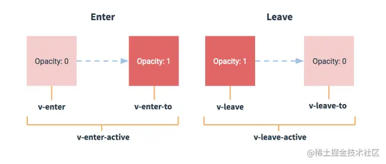

## Vue 过渡动画的实现方法
### CSS过渡
Vue 提供了 transition 组件来支持过渡动画。我们可以在需要应用过渡动画的元素外层包裹一个 transition 组件，并通过设置CSS样式或绑定动态class来实现过渡动画的效果

Vue的过渡动画通过添加CSS类名来实现。我们可以通过为过渡的元素添加v-if或v-show指令来控制元素的显示和隐藏，然后使用 transition 组件进行动画效果的设置。

example:
```html
<template>
    <button @click="show!=show">Toggle</button>
    <transition name="fade">
        <div  v-if="show">hello,World!</div>
    </transition>
</template>
<script>
    export default {
        data() {
            return {
                show: false
            }
        }
    }
</script>
<style>
.fade-enter-active,
.fade-leave-active {
  transition: opacity .5s;
}
.fade-enter,
.fade-leave-to {
  opacity: 0;
}
</style>
```
在上面的代码思路中，我们在transition包裹的div元素上使用了v-if指令来控制元素的显示和隐藏。同时给transition组件添加了一个name属性,并使用CSS样式来定义过渡动画的效果。其中， .fade-enter-active 和 .fade-leave-active 分别表示进入和离开时的过渡动画，而 .fade-enter 和 .fade-leave-to 则分别表示进入和离开时元素的样式。

### JS过渡
除了使用CSS过度外，在Vue中也可以使用Javascript过渡来实现动画效果。**JS过渡相比于CSS过渡的优势在于它可以更加灵活的控制过渡动画**

它与CSS过渡不同，Javascript过渡可以更加灵活的控制过渡动画，可以实现更加丰富的效果。Vue提供了事件钩子函数，使得我们可以自定义过渡动画的效果



Vue中提供了以下事件钩子函数

- before-enter
- enter
- after-enter
- enter-cancelled
- before-leave
- leave
- after-leave
- leave-cancelled

我们可以使用 transition 组件的 mode 属性来设置过渡的模式，如果使用了 mode 属性，Vue 将会自动调用对应的钩子函数，我们可以通过这些钩子函数来自定义过渡效果。

下面是我写的一个基于 JS 过渡的演示Demo，我们将为按钮添加自定义的过渡动画：
HTML复制代码
```html
<template>
  <button @click="show=!show">Toggle</button>
  <transition :css="false" @before-enter="beforeEnter" @enter="enter" @leave="leave">
    <div v-if="show">Hello, World!</div>
  </transition>
</template>
<script>
export default {
  data() {
    return {
      show: false
    };
  },
  methods: {
    beforeEnter(el) {
      el.style.opacity = 0;
      el.style.transformOrigin = 'left';
    },
    enter(el, done) {
      anime({
        targets: el,
        opacity: 1,
        translateX: [20, 0],
        easing: 'easeInOutQuad',
        duration: 500,
        complete: done
      });
    },
    leave(el, done) {
      anime({
        targets: el,
        opacity: 0,
        translateX: [-20, 0],
        easing: 'easeInOutQuad',
        duration: 500,
        complete: done
      });
    }
  }
};
</script>
```
在上面的前端页面中，<span style="color: red">我们通过设置 transition 组件的css属性为 false 来禁用CSS过渡，然后我们使用了 before-enter、enter和leave等钩子函数来自定义过渡动画。</span>。在这个示例代码中，我们使用了第三方动画库 Anime.js 来实现元素进入和离开时的动画效果，同时在 anime 动画完成后，我们还需要手动调用 done 函数来告知 Vue 过渡动画已经完成。