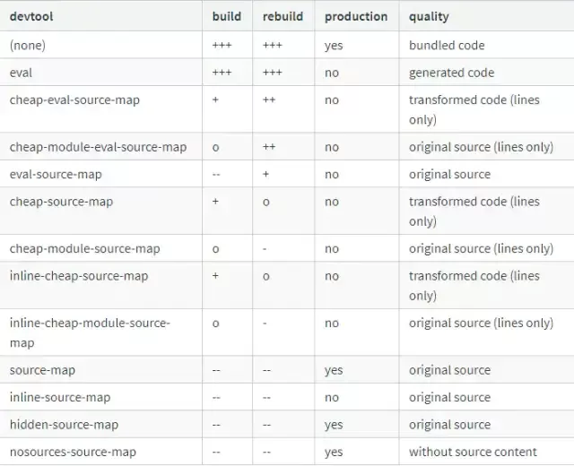

## vue渐进式框架
渐进式代表的含义是：主张最少。

## vue数据依赖问题
```js
data() {
	return{
    	arr:[],
    	obj: {
        	a:1,
        }
    }
}
//点击methods方法
handTabClick() {
    // 参考
    this.obj = {a:1, b: 2} // 改变this.obj.a this.obj.c的值视图会更新 data上的obj绑定了响应式
	this.obj.c = 3 // 改变this.obj.c的值  视图不会更新
	Object.assign(this.obj, {d: 4}) // 改变this.obj.c的值 视图不会更新
	this.$set(this.obj, 'e', 5) // 改百年this.obj.e时 视图会更新

	 //直接赋值不会触发更新
     this.arr[2] = {name: 'name',age:4}
     console.log(this.arr)
     //对象 这样添加到对象上的新属性不会触发更新
     this.obj = Object.assign(this.obj, {a:1, b:2})
     console.log(this.obj)
     //应该用原对象与要混合进去的对象属性一起创建一个新的对象
     this.obj1 = Object.assign(this.obj, {a:1, b:2})
     console.log(this.obj1)
     //或者使用$set
     this.$set(this.obj, obj);
}
```
## vue计算属性computed

### vue计算属性computed方法内传参
```js
<van-circle
	v-model="Ratedata[index].currentRate"
    color="#2462e8"
    fill="#fff"
    :rate="Ratedata[index].rate"
    :text="text(index)"
    :speed="60"
    :clockwish="true"
    :stroke-width="40"
/>
//computed中text方法传递index,利用了闭包传值
computed:{
	text(){
    	return function(index) {
        	return this.Retadata[index].currentRatet.toFixed(0) + '%'
        }
    }
}
```
### computed的定义

当其依赖的属性的值发生变化时，计算属性会重新计算，反之，则使用缓存中的值。

### 为什么要使用computed

在模板内的表达式非常普遍，但是，有时候，我们会在模板内放入太多逻辑的东西，会让模板变重且难于维护
```html
<div id="example">
	{{ message.split('').reverse().join('')}}
</div>
```
当初模板中使用表达式的初衷是为了简单运算的。所以从这点出发，我们是不是就不建议在末班中使用过于复杂的表达式了。此时，计算属性就出现了，计算属性就是当依赖的属性的值发生变化的时候后，才会触发他的更改，如果依赖的值，不发生变化的时候，使用的是缓存中的属性的值。
```js
<div id="example">
	<p>Original message: {{message}}</p>
	<p>Computed reversed message: {{reverseMessage}}</p>
</div>

var vm = new Vue({
	el: '#example',
    data: {
    	message: 'Hello'
    }, 
    computed: {
    	//计算属性的getter
        reversedMessage: function() {
        	//this指向vm实例
            return this.message.split('').reverse.join('')
        }
    }
})
```
### computed的getter函数

在vue中，computed的属性可以被视为是data一样，可以读取和设值。因此computed中可以分为getter和setter，一般情况下，是没有setter的，computed只是预设了getter,也就是只能读取，不可以改变设值。所以computed默认格式(是不表明getter函数)
```js
<div>
	message: {{message}}
</div>
//计算属性
<div>
	计算属性: {{updateMessage}}
</div>

computed: {
	updateMessage(){
    	console.log(`计算属性${this.message}`);
        return this.message
    }
}
//等价
computed: {
	updateMessage: {
    	get: function(){
        	connsole.log(`计算属性${this.message}`);
            return this.message
        }
    }
}
```
当模板中不使用updateMessage,即使message发生改变之后，也不会走computed.

在这里，就需要我们注意一下，不是说我们更改了getter中使用的变量(即依赖的属性)，就会出发computed的更新，他有一个前提是computed里的值必须要在模板中使用才可以，但是会出发声明周期的updated();

### computed中的setter函数

当赋值给计算属性的时候，将调用setter函数。多用于在模板组件中需要修改计算属性自身的值的时候

```js
computed:{
	updateMessage:function() {
    	get:function(){
        	console.log(`计算属性${this.message}`);
            return this.message
        },
        set: function(newVal) {
        	this.message = newVal;
            console.loog(`newVal:${newVal}`)
        }
    }
}
mounted() {
	this.updateMessage = '222';
    console.log(`测试：${this}`)
}
```
只有当计算属性中的属性被直接赋值的时候，才会走setter函数，而且，setter函数和getter函数是相互独立的，不是说，走setter函数就必须走getter函数，上面打印结果
```js
newVal: 222,
计算属性：222
```

## provide/inject

```js
provide: Object | () => Object

inject: Array<string> | {[key: string | Symbol | Object]}

```
provide和inject主要为高级插件/组件库提供用例。并不推荐直接用于应用程序代码中。是2.2.0版本新增的。

这个选项需要一起使用，以允许一个祖先组件向其子孙后代注入一个依赖，不论组件层次有多深，并在起上下游关系成立的时间里始终有效。

provide选项应该是一个对象或返回一个对象的函数。该对象包含可注入其子孙的属性。在该对象中你可以使用ES2015 Symbols作为key，但是只在原生支持Symbol和Reflect.ownKeys的环境下可工作。

inject选项应该是：
一个字符串数组，或一个对象，对象的key是本地的绑定名，value是在可用的注入内容中搜索用的key(字符串或Symbol),该对象的from属性是在可用的注入内容中搜索用的key(字符串或Symbol) default属性是降级情况下使用的value


**使用场景:由于vue有$parent属性可以让子组件访问父组件。但孙组件想要访问祖先组件就比较困难。通过provide/inject可以轻松实现跨级访问组件的数据**

一种最常见的用法是刷新vue组件

app.vue

```js
<template>
<div id="app">
	<router-view v-if="isRouterAlive"/>
</div>
</template>
<script>
export default {
	name: 'App',
    components:  {
    	MergeTipDialog,
        BreakNetTip
    },
    data() {
    	return {
        	isShow: false,
            isRouterAlive: true
        }	
    },
    // 父组件中返回要传给下级的数据
    provide() {
    	return {
        	reload: this.reload
        }
    },
    methods: {
    	reload() {
        	this.isRouterAlive = false;
            this.$nextTick(() => {
            	this.isRouterAlive = true;
            })
        }
    }
}
</script>
```
``` js
<template>
  <popup-assign
    :id="id"
    @success="successHandle"
  >
    <div class="confirm-d-tit"><span class="gray-small-btn">{{ name }}</span></div>
    <strong>将被分配给</strong>
    <a
      slot="reference"
      class="unite-btn"
    >
      指派
    </a>
  </popup-assign>
</template>
<script>
import PopupAssign from '../PopupAssign'
export default {
//引用vue reload方法
  inject: ['reload'],
  components: {
    PopupAssign
  },
methods: {
    // ...mapActions(['freshList']),
    async successHandle () {
      this.reload()
    }
  }
}
</script>
```
这样就实现了子组件调取reload方法就实现了刷新vue组件的功能，个人认为它实现了组件跨越组件传递数据的方法。

下面的一个栗子祖组件的数据，祖孙元素调取
```js
<template>
    <div id="app">
    </div>
</template>
    <script>
        export default {
            data () {
                    return {
                        datas: [
                            {
                                id: 1,
                                label: '产品一'
                            },
                            {
                                id: 1,
                                label: '产品二'
                            },
                            {
                                id: 1,
                                label: '产品三'
                            }
                        ]
                    }
            },
            provide {
                return {
                    datas: this.datas
                }
            }
        }
    </script>
    
    
 // 后代组件
 <template>
    <div>
        <ul>
        <li v-for="(item, index) in datas" :key="index">
            {{ item.label }}
        </li>
        </ul>
    </div>
</template>
    <script>
        export default {
            inject: ['datas']
        }
    </script>
```
后代元素引入被注入数据datas，并在组件内循环输出

实际上，你可以把依赖注入看做一部分"大范围有效的prop"，除了祖先组件不需要知道哪些后代组件使用它提供的属性，后代组件不需要知道被注入的属性来自哪里

**提示：provide和inject绑定并不是可响应的。这是刻意为之的。然而，如果你传入了一个可以监听的对象，那么其对象的属性还是可响应的**


## vuex遍历modules文件夹里文件
```js
import Vue from 'vue';
import Vuex from 'vuex';
import getter from './getters';

Vue.use(Vuex);

const modulesFiles = require.context('./modules', true, /\.js$/);

const modules = modulesFiles.keys().reduce((modules, modulePath) => {
	const moduleName = modulePath.replace(/^\.\/(.*)\.\w+$/, '$1')
    const value = modulesFiles(modulePath)
    modules[moduleName] = value.default
    return modules
},{})

const store = new Vuex.Store({
    modules,
    getters,
})
  
export default store

```

## Vue.nextTick的原理和用途
 一. 概览
   - 用法<br/>
      在下次DOM更新循环结束之后执行延迟回调。在修改数据之后立即使用这个方法，获取更新后的DOM

   - 疑问<br/>
      1. DOM更新循环是指的什么
      2.下次更新循环是什么啥时候？
      3.修改数据之后使用，是加快了数据更新进度？
      4.在什么情况下要用到？
    
二. 原理
 > Vue实现响应时是并不是是数据变化之后DOM立即更新，而是按照一定的策略进行DOM更新
 
 Vue是异步执行DOM更新的,具体异步执行的运行机制如下：
 1. 所有同步任务与都在主线程上执行，形成一个执行栈；
 2. 主线程之外，还存在一个任务队列。只要异步任务有了运行结果，就在任务队列中放置一个事件
 3. 一旦执行栈中的所有与同步任务执行完毕，系统就会读取任务队列，看看里面有哪些事件。那些对应的异步任务，于是结束等待状态，仅有执行栈，开始执行
 4. 主线程不断重复上面的三步
 
三：实例
```js
// 示例一
vm.message = 'changed';
console.log(vm.$el.textContent);
Vue.nextTick(function(){
	console.log(vm.$el.textContent);
})

// 示例二
data() {
    return {
        count: 0
    //   tableData: this.$store.state.test.tableData
    }
},
mounted() {
    this.count++;
    this.count++;
    this.count++;
    this.count++;
},
watch: {
    count() {
        console.log(this.count)
    }
}
// 输出4
```


四.其他场景
```js
showsou(){
  this.showit = true
  this.$nextTick(function () {
    // DOM 更新了
    document.getElementById("keywords").focus()
  })
}
```
```js
<div id="app">
    <p ref="myWidth" v-if="showMe">{{ message }}</p>
    <button @click="getMyWidth">获取p元素宽度</button>
</div>

getMyWidth() {
    this.showMe = true;
    //this.message = this.$refs.myWidth.offsetWidth;
    //报错 TypeError: this.$refs.myWidth is undefined
    this.$nextTick(()=>{
        //dom元素更新后执行，此时能拿到p元素的属性
        this.message = this.$refs.myWidth.offsetWidth;
  })
}
```

## 动态组件&异步组件

### 动态组件

**让多个组件使用同一个挂载点，并动态切换，这就是动态组件**

简单的说，动态组件就是将几个组件放在一个挂在点下，这个挂载点就是标签，其需要绑定js属性，属性值为父组件中的变量，变量对应的值为要挂在的组件的组件名，然后根据父组件里某个变量来动态显示哪个，也可以都不显示

```js
<template>
<div class="home">
	<component :is="currentComponent"></component>
</div>
</template>
<script>
import Tab0 from '@/components/Tab0.vue';
import Tab1 from '@/components/Tab1.vue';
export default {
	data() {
    	return {
        	currentIndex: 0 //通过改变currentIndex改变要挂在的组件
        }
    }，
    components: {
    	'tab-0':Tab0,
        'tab-1': Tab1
    },
    currentComponent{ //动态计算要挂载的组件的组件名
    	return `tab-${this.currentIndex}`;
    }
}
</script>
```
#### 缓存keep-alive

1. 包裹动态组件时，会缓存不活动的组件实例，而不是销毁他们。是一个抽象组件：它自身不会渲染一个DOM元素，也不会出现在父组件链中
2. 可以将动态组件放到组件内对动态组件进行缓存，这样动态组件进行切换的时候，就不会每次重新创建组件了。

```js
<template>
<div class="home">
	<keep-alive>
    	<component is="currentComponent"><component>
    </keep-alive>
</div>
</template>
```
### vue异步组件
#### 路由懒加载

当打包构建应用时，Javascript包会变得非常大，影响页面加载速度。如果我们能把不同的路由对应的组件分割成不同的代码块，然后当路由被访问的时候才加载对应组件，这样就更加高效了

结合Vue的异步组件和webpack的代码分割功能，轻松实现路由的懒加载
```
const Foo = () => import('./Foo.vue');
```

#### 异步组件

<span style="color: blue">在大型应用中，我们可能需要将应用分割成小一些的代码块，并且只能在需要的时候才能从服务器加载一个模块</span>。为了简化，Vue允许你以一个工厂函数的方式定义你的组件，这个工厂函数会异步解析你的组件定义。Vue只有在这个组件需要被渲染对的时候才会触发该工厂函数，且会把结果缓存起来供未来重渲染。

```js
Vue.component('async-example', function(resolve, reject) {
	setTimeout(() => {
    	//向resolve回调传递组件定义
        resolve({
        	template:'<div>I am async!</div>'
        })
    })
})
```
这个工厂函数会收到一个resolve回调，这个回调函数会在你从服务器得到组件定义的时候被调用。你也可以调用reject(reason)来表示加载失败。这里setTimeout是为了演示用的，如何获取组件取决于你自己。一个推荐的做法将一部组件和webpack的code-splitting功能一起配合使用：

```js
Vue.component('async-webpack-example', function(resolve) {
	//这个特殊的require语法将会告诉webpack
    //自动将你的构建代码切割成多个包，这些包会通过Ajax请求加载
    require(['./my-async-component'], resolve);
})
```
你也可以在工厂函数中返回一个promise，所以webpack2和ES2015语法加在一起，写成这样
```js
Vue.component(
	'async-webpack-example',
    //这个import函数会返回一个Promise对象
    () => import('./my-async-component')
)
```
当使用局部注册的时候，你也可以直接提供一个返回Promise函数
```js
new Vue({
	compontents:()=>import('./my-async-component');
})
```
## VUEX

vuex的优点
1. 解决了非父子组件的消息传递(将数据存放在state中)
2. 减少了AJAX请求次数，有些情景可以直接从内从中的state获取

vuex的缺点
1. 刷新浏览器，vuex的state会重新变为初始状态
解决方案vuex-along, vuex-persistedstate

## vue-router

### vue-router实现原理

SPA(single page application)单一页面应用程序，只有一个完整的页面；它在加载页面时，不会加载整个页面，而是只更新某个指定的容器中的内容。单页面应用(SPA)的核心之一是:更新视图而不重新请求页面；vue-router在实现单页面前端路由时，提供了两种方式：Hash模式和History模式。

1. hash模式
```js
http://www.xxx.com/#/login
```
这种#。后面hash值的变化，并不会导致浏览器向服务器发请求，浏览器不发请求，也就不会刷新页面。另外每次hash值的变化，还会触发hashchange这个事件。通过这个事件我们就可以知道hash值发生了哪些变化。然后我们便可以监听hashchange来实现更新页面部分内容的操作
```js
function matchAndUpdate(){
	//todo匹配hash做dom更新操作
}
window.addEventListener('hashchange', matchAndUpdate);
```
2. history模式

14年后，因为HTML5标准发布。多了两个API，pushState和replaceState,通过这两个API可以改变url地址且不会发送请求。同时还有popstate事件。通过这些就能用另一种方式实现前端路由了，但原理都是跟hash实现相同(改变url，保证页面不刷新)；用了HTML5的实现，单页路由的url就不会多出一个#，变的更加美观。但因为没有#号，所以当用户刷新页面之类的操作时，浏览器还是会给服务器发送请求。为了避免出现这种情况，所以这个实现需要服务器的支持，需要把所有路由都重定向到根页面。
```js
function matchAndUpdate(){
	//todo匹配路径做DOM操作
}
window.addEventListener('popstate', matchAndUpdate);
```
###  vue-router的使用

1. 动态路由的匹配

  我们经常需要把某种模式匹配到的所有路由，全部映射到同个组件。例如，我们有一个user组件，对应所有ID各不相同的用户，都要使用这个组件来渲染。那么可以在vue-router的路由路径中使用"动态路径参数"来达到这个效果
  ```js
  const User = {
      template:'<div>User</div>'
  }
  const router = new VueRouter({
      routes: [
          //动态路径参数 以冒号开头
          { path: '/user/:id', component: User}
      ]
  })
  ```
  现在，像/user/foo和/user/bar都将映射到相同的路由。

  一个"路径参数"使用冒号:标记。当匹配到一个路由时，参数值会被设置到this.$route.params,可以在每个组件内使用。于是，我们可以更新User的模板，输出当前用户的ID:
  ```js
  const User = {
      template: '<div>User {{$route.params.id}}</div>'
  }
  ```
  你可以在一个路由中设置多段"路径参数"，对应的值都会设置到$route.params中，例如：

  模式 | 匹配路径 | $route.params
  ---|--- | ---
  /user/:username | /user/evan | {username: 'evan'}
  /user/:username/post/:post_id | /user/evan/post/123 | {username: 'evan', post_id: '123'}

  <span style="color: red">**当使用路由参数时，例如从/user/foo导航到/user/bar,原来的组件实例会被复用。因为两个路由都渲染同一个组件，比起销毁在创建，复用则显得更加高效。不过，这也意味着组件的生命周期钩子不会再被调用。复用组件时，相对路由参数的变化做出相应的话，你可以简单的watch(监听变化)$route对象**</span>[参考](/source-vue/base-router-view.html)
  ```js
  const User = {
      template: '...',
      watch: {
       '$route'(to, from) {
          //对路由变化做出相应...
       }
      }
  }
  ```
  <span style="color: red">**或者使用2.2中引入的beforeRouteUpdate守卫**</span>
  ```js
  const User = {
      template: '...',
      beforeRouteUpdate(to, from, next) {
          //react to route changes....
      }
  }
  ```
2. 路由嵌套

  <!--  -->

  借助vue-router,使用嵌套路由配置，就可以很简单的表达这种关系

  ```js
  <div id="app">
      <router-view></router-view>
  </div>
  const User = {
      template: '<div>{{$route.params.id}</div>'
  }
  const router = new VueRouter({
      routes: [
          { path: '/user/:id', component: User }
      ]
  })
  ```
  这里router-view是最顶层的出口，渲染最高级路由匹配到的组件。同样的，一个被渲染组件同样可以包含自己的嵌套router-view.例如，在User组件的模板添加一个router-view
```js
  const User = {
      template: `
          <div class="user">
              <h2>User {{$route.params.id}</h2>
              <router-view></router-view>
          </div>
      `
  }
  ```
  要在嵌套的出口中渲染组件，需要在VueRouter的参数中使用children配置
  ```js
  const router = new VueRouter({
      routes: [
          {
              path:'/user/:id', 
              component: User,
              children: [
                  {
                      // 当/user/:id/profile 匹配成功，
                    // UserProfile会被渲染在 User的<router-view>中
                    path:'profile',
                    component:UserProfile
                  },{
                      // 当/user/:iid/posts匹配成功
                      //UserPosts 会被渲染在User的User的<router-view>中
                      path:'posts',
                      component:UserPosts
                  }
              ]
          }
      ]
  })
  ```
  3. 编程式导航

  在Vue实例内部，你可以通过$router访问路由实例。因此你可以调用
  ```
  this.$router.push
  ```
  声明式 | 编程式
  --- | ---
  <router-link :to="..." | router.push(...)

  ```js
  // 参数可以是一个字符串路径，或者一个描述地址的对象

  //字符串
  router.push('home');

  //对象
  router.push({path: 'home'});

  //命名的路由
  router.push({ name: 'user', params: {userId: 123}});

  //带查询参数，变成/register?plan=private
  router.push({path: 'register', query: {plan: 'private'}});

  const userId = '123';
  router.push({ name: 'user', params: { userId }})// -> /user/123
  router.push({path: `/user/${userId}`})// -> /user/123

  //这里的params 不生效
  router.push({path: '/user', params: {userId}}) // ->user

  //router.go(n)这个方法的参数是一个整数，意思是在history记录中向前或后退多少步，类似window.history.go(n);
  // 在浏览器记录中前进一步，等同于history.forward()
  router.go(1);
  //后退一步记录，等同于history.back();
  router.go(-1);
  //前进3步记录
  router.go(3);
  //如果history记录不够用，那么就默默的失败呗
  router.go(-100);
  router.go(100);
  ```

4. 命名视图

  <span style="color: blue">有时候想同时(同级)展示多个视图，而不是嵌套展示，例如创建一个布局，有sidebar(侧导航)和main(主内容)两个视图,这个时候命名视图就派上用场了。你可以在界面中拥有多个单独命名的视图，而不是只有一个单独的出口。如果router-view没有设置名字，那么默认为default</span>
  ```js
  //name对应的是组件名字
  <router-view class="view one"></router-view>
  <router-view class="view two" class="a"></router-view>
  <router-view class="view three" name="b"></router-view>
  ```
  一个视图使用一个组件渲染，因此对于同个路由，多个视图就需要多个组件。确保正确使用components配置:
  ```
  const router = new VueRouter({
      routes:[
          {
              path: '/',
              components:{
                  default: Foo,//Foo是组件名字
                  a:Bar,//Bar是组件名字
                  b:Baz,//Baz是组件名字
              }
          }
      ]
  })
  ```
  **嵌套命名视图**

  UserSetting组件的template部分应该是类似下面的这段代码

  ```js
  <!-- UserSettings.vue -->
  <div>
      <h1>User Settings</h1>
      <NavBar/>
      <router-view/>
      <router-view name="helper"/>
  </div>

  //然后你可以用这个路由配置完成该布局
  {
      path:'/setting', 
      //你也可以在顶级路由配置命名视图
      compontent: UserSetting,
      children: [{
          path:'emails',
          compontent:UserEmailSubscriptions
      }, {
          path: 'profile',
          compontents:{
              default:UserProfile,
              helper: UserProfilePreview
          }
      }]
  }

  ```
5. 重定向与别名

  重定向也是通过routes配置来完成，下面例子是从/a重定向到/b：
  ```js
  const router = new VueRouter({
      routes: [
          {path:'/a', redirect:'/b'}
      ]
  })
  ```
  重定向的目标也可以是一个命名的路由
  ```js
  const router = new VueRouter({
      routes:[
          {path:'/a', redirect: { name: 'foo'}}
      ]
  })
  ```
  甚至是一个方法，动态返回重定向目标
  ```js
  const router = new VueRouter({
      routes: [
          {
              path: '/a', 
              redirect: to => {
                  //方法接收目标路由作为参数
                  //return 重定向的字符串路径/路径对象
              }
          }
      ]
  })
  ```
  **别名**:/a的别名是/b,意味着，当用户访问/b时，URL会保持为/b，但是路由匹配则为/a,就像用户访问/a一样
  ```js
  const router = new VueRouter({
      routes: [
          {path: '/a', component:A, alias:'/b'}
      ]
  })
  ```
  **总结**

  - 重定向的意思是：当用户访问/a时，URL将会被替换成/b,然后匹配路由为/b
  - 别名的意思是：/a的别名是/b，意味着，当用户访问/b,URL会自动保持为/b，但是路由匹配则为/a,就像用户访问/a一样

  6. 导航守卫

**<span style="color: orange">全局路由钩子-单独路由独享钩子-组件内的路由钩子</span>**

当做Vue-cli项目的时候感觉在路由跳转前做一些验证,比如登录验证，是网站中的普遍需求；对此，vue-router提供的beforeEach可以方便的实现全局导航守卫

**如何设置一个全局守卫**

可以使用router.beforeEach注册一个全局前置守卫：就是在你router配置的下方注册
```
const router = new VueRouter({...})
router.beforeEach((to, form, next) => {
	//...
})
```
当一个导航触发时，全局前置守卫按照顺序调用。守卫是异步解析执行，此时导航在所有守卫resolve完之前一直处于等待中。
:::tip
每个守卫方法接收三个参数：

- to:Route:即将要进入的目标 路由对象
- from:Route:当前导航正要离开的路由
- next:Function: 一定要调用该方法来resolve这个钩子.执行效果依赖next方法的调用参数
 - next():进行管道中的下一个钩子。如果全部钩子执行完了，则导航的状态就是confirmed(确认的)
 - next(false):中断当前的导航。如果浏览器的URL改变了(可能是用户手动或者浏览器后退按钮)，那么URL地址会重置到from路由对应的地址。
 - next('/')或者next({path: '/'}):跳转到一个不同的地址。当前的导航被中断，然后进行一个新的导航。你可以向next传递任意位置对象，且允许设置诸如replace:true、name:'home'之类的选项以及任何用在router-link的to prop或router.push中的选项。
 - next(error):(2.4.0+)如果传入next的参数是一个Error实例，则导航会被终止切该错误会被传递给router.onError注册过的回调
:::
**确保要调用next方法，否则钩子就不会被resolved；

举个栗子
```js
const router = new VueRouter({ ... }) //这是路由配置，我就不多说了

const whiteList = ['/error', '/register/regindex', '/register/userauthent',  '/register/submit'] // 路由白名单
vueRouter.beforeEach(function(to,from,next){
    console.log("进入守卫");
    if (userInfo.user_id>0){
        console.log("登录成功");
        next();   //记得当所有程序执行完毕后要进行next()，不然是无法继续进行的;
    }else{
        console.log("登录失败");
        getUserInfo.then(res => {
            if(res){
                if (res.user_id){
                    if (res.status == 4) {
                        //账号冻结
                        next({ path: '/error', replace: true, query: { noGoBack: true } })
                    }
                    if (res.status == 3) {
                        //认证审核中
                        next({ path: '/register/submit', replace: true, query: { noGoBack: true } })
                    }
                    if (res.status != 1 && res.status != 3) {
                        if (!res.mobile ) {
                            next({ path: '/register/regindex', replace: true, query: { noGoBack: true }})
                        } else {
                            //绑定完手机号了
                            next({ path: '/register/userauthent', replace: true, query: { noGoBack: true } })
                        }
                    }
                    next();  //记得当所有程序执行完毕后要进行next()，不然是无法继续进行的;
                }else{
                    if (whiteList.indexOf(to.path) !== -1) { // 在免登录白名单，直接进入
                        next();  //记得当所有程序执行完毕后要进行next()，不然是无法继续进行的;
                    }else{
                        next({ path: '/register/regindex', replace: true, query: { noGoBack: true }})
                    } 
                }
                
            }else{
                
                }
            }
            
        }).catch(()=>{
            //跳转失败页面
            next({ path: '/error', replace: true, query: { noGoBack: true }})
        })
    }
    
    
});

export default router
```
**如果白名单太多或项目更大时，我们需要把白名单换为vue-router路由元信息**

直接在路由配置的时候，给每个路由添加一个自定义的meta对象，在meta对象中可以设置一些状态，来进行一些操作。用它来做登录校验在合适不过了
```js
{
	path:'/actile',
    name: 'Actile',
    component: Actile,
    meta: {
    	login_require: false,
    },
}, {
	path: '/goodslist',
    name: 'goodslist',
    component:Goodslist,
    meta:{
    	login_require: true
    },
    children:[
    	{
        	path: 'online',
            component:GoodslistOnline
        }
    ]
}
```
这里我们只需要判断item下面的meta对象中的login_require是不是true,就可以做一些限制
```js
router.beforeEach((to, from, next) => {
	if(to.matched.some((item) => {
    	return item.meta.login_require
    })){
    	next('/login')
    } else {
    	next();
    }
})
```
**全局解析守卫(router.beforeResolve)**

你可以用router.beforeResolve注册一个全局守卫。这和router.beforeEach类似，区别是在导航被确认之前，同时在所有组件内守卫和异步路由组件被解析之后，解析守卫就被调用
```
[beforeEach]：在路由跳转前触发，参数包括to,from,next（参数会单独介绍）三个，这个钩子作用主要是用于登录验证，也就是路由还没跳转提前告知，以免跳转了再通知就为时已晚。

[beforeResolve]（2.5+）：这个钩子和beforeEach类似，也是路由跳转前触发，参数也是to,from,next三个，和beforeEach区别官方解释为：

区别是在导航被确认之前，同时在所有组件内守卫和异步路由组件被解析之后，解析守卫就被调用。
即在 beforeEach 和 组件内beforeRouteEnter 之后，afterEach之前调用。

[afterEach]：和beforeEach相反，他是在路由跳转完成后触发，参数包括to,from没有了next（参数会单独介绍）,他发生在beforeEach和beforeResolve之后，beforeRouteEnter（组件内守卫，后讲）之前。
```
**路由独享的守卫**

```js
const router = new VueRouter({
	routes: [
    	{
        	path: '/foo', 
            component:Foo,
            beforeEnter: (to, from, next)=> {
            	//....
            }
        }
    ]
})
```

**组件内的守卫**

你可以在路由组件内直接定义一下路由导航守卫：
- beforeRouteEnter
- beforeRouteUpdate
- beforeRouteLeave
```js
const Foo = {
	template: `...`,
    beforeRouteEnter(to, from, next) {
    	//在渲染该组件的对应路由被confirm前调用
        //不能，获取组件实例this
        //因为当守卫执行前，组件实例还没没创建
    }，
    beforeRouteUpdate(to, from, next) {
    	//在当前路由改变，但是该组件被复用时调用
        //举例来说，对于一个带有动态参数的路径/foo/:id，在/foo/1和/fooo/2之间跳转的时候，由于会渲染同样的Foo组件，因此组件实例会被复用。而这个钩子就会在这种情况下调用。
        //可以访问组件实例this
    },
    beforeRouteLeave(to, from, next) {
    	//导航离开该组件的对应路由时调用
        //可以访问组件实例this
    }
}
```
beforeRouteEnter守卫不能访问this,因为守卫在导航确认前被调用，因此即将登场的新组件还没被创建。

不过你可以通过传一个回调给next来访问组件实例。在导航被确认的时候执行回调，并且把组件实例作为回调方法的参数。
```js
beforeRouteEnter(to, from, next) {
	next(vm => {
    	//通过vm访问组件实例
    })
}
```
这个离开守卫通常用来禁止用户在还未保存修改前突然离开。该导航可以通过next(false)来取消
```js
beforeRouteLeave(to, from, next) {
	const answer = window.confirm('Do you really want to leave? you have uunsaved change!');
    if(answer){
    	next();
    } else {
    	next(false)
    }
}
```

**完整的导航解析流程**
- <span style="color: blue">导航被触发</span>
- <span style="color: blue">在失活的组件里调用离开守卫(**beforeRouteLeave**)</span>
- <span style="color: blue">调用全局的beforeEach守卫(**beforeEach**)</span>
- <span style="color: blue">在重用的组件里调用beforeRouteUpdate守卫(**beforeRouteUpdate**)</span>
- <span style="color: blue">在路由配置里调用beforeEnter.(**beforeEnter**)</span>
- <span style="color: blue">解析异步路由组件</span>
- <span style="color: blue">在被激活的组件里调用beforeRouteEnter.(**beforeRouteEnter**)</span>
- <span style="color: blue">调用全局的beforeResolve守卫(**beforeResolve**)</span>
- <span style="color: blue">导航被确认</span>
- <span style="color: blue">调用全局的afterEach钩子(**afterEach**)</span>
- <span style="color: blue">触发DOM更新</span>
- <span style="color: blue">用创建好的实例调动beforeRouterEnter守卫中传给next的回调函数(**beforeRouterEnter**)</span>


## vue优化
1. Vue代码层面的优化
2. webpack配置层面的优化
3. 基础的Web技术层面的优化

### 代码层面的优化
1. v-if和v-show区分使用场景

  v-if是真正的条件渲染，因为它会确保在切换过程中条件内的事件监听器和子组件适当的被销毁和重建，也是惰性的；

  如果在初始渲染时条件为假，则什么也不做--一直到条件第一次变为真时，才会开始渲染条件块。

  v-show就简单的多，不管初始条件是什么，元素总是被渲染，并且只是简单的基于css的display属性进行切换。

  所以,v-if适用在运行时很少改变条件，不需要频繁切换条件的场景;v-show则适用于频繁切换条件的场景

2. computed和watch区分使用场景

  **computed**：是计算属性，依赖其他属性值，并且computed的值有缓存；

  只有它依赖的属性值发生变化，下一次获取computed的值才会重新计算computed的值；

  **watch**:更多的是观察作用，类似于某些数据的监听回调；

  每当监听的数据变化时都会执行回调进行后续操作；

  **运用场景**

  当我们需要进行数值计算，并且依赖于其他数据时，应该使用computed，因为可以利用computed的缓存特性，避免每次获取值，都需要重新计算；

  当我们需要在数据变化时执行异步或开销较大的操作时，应该使用watch

  使用watch选项允许我们执行异步操作(访问一个API)，限制我们执行该操作的频率，并在我们得到最终结果前，设置中间状态。这些都是计算属性无法做到的

3. v-for遍历避免同时使用v-if

  v-for比v-if优先级高，如果每一次都需要遍历整个数组，将会影响速度，尤其当需要渲染很小的一部分的时候，必要情况下应该替换成computed属性

  推荐：
  ```
  <ul>
      <li v-for="user in activeUsers" :key="item.id">{{item.name}}</li>
  </ul>
  computed:{
      ativeUsers:function() {
          return this.users.filter((user) => {
              return user.isActive
          })
      }
  }
  ```
  不推荐：
  ```
  <ul>
      <li v-for="user in users" v-if="user.isActive" :key="user.id">{{user.name}}</lii>
  </ul>
  ```
 
4. 长列表性能优化

  Vue会通过Object.defineProperty对数据进行劫持，来实现视图响应数据的变化;

  然而有些时候我们的组件就是纯碎的数据展示，不会有任何改变，我们就不需要Vue来劫持我们的数据，在大量数据展示的情况下，这能够很明显的减少组件初始化的时间。

  如何禁止Vue劫持数据？可以通过Object.freeze方法冻结一个对象，一旦被冻结的对象就再也不能被修改了
  ```
  export default {
      data:() => ({
          users: {},
      }),
      async created() {
          const users = await axios.get('/api/users');
          this.users = Object.freeze(users);
      }
  }
  ```
  
5. 事件的销毁
 
  Vue组件销毁时，会自动清理它与其他实例的连接，解绑它的全部指令及事件监听器，但是仅限于组件本身的事件;

  如果JS内使用addEventListener等方式是不会自动销毁的，我们需要在组件销毁时主动移除这些事件的监听，以免造成内存的泄露

  ```
  created() {
      addEventListener('click', this.click, false);
  }
  beforeDestroy() {
      removeEventListener('click', this.click, false);
  }
  ```

6. 图片资源懒加载

  对于图片过多的页面，为了加速页面的加载速度，所以很多时候我们需要将页面内未出现在可视区域内的图片先不做加载，等到滚动到可视区域后在去加载。

  这样对于页面加载性能会有很大的提升，也提高了用户体验；

  我们在项目中使用vue的vue-lazyload插件

  **安装插件**
  ```
  npm install vue-lazyload --save-dev
  ```
  **在入口文件main.js中引入并使用**
  ```
  import VueLazyload from 'vue-lazyload';
  ```
  然后再vue中直接使用
  ```
  Vue.use(VueLazyload);
  ```
  或者添加自定义选项
  ```
  Vue.use(VueLazyload, {
      preload:1.3,
      error:'dist/error.png',
      loading: 'dist/loading.gif',
      attempt:1
  })
  ```
  **在Vue文件中将img标签的src属性直接改为v-lazy，从而将图片显示方式更改为懒加载**
  ```
  
  ```
  以上为vue-lazyload插件的简单使用，如果要看插件的更多参数可以查看插件的git地址

7. 路由的懒加载

  Vue是单页面应用，可能会有很多的路由引入，这样使用webpack打包后的文件很大，当进入首页时，加载的资源，页面会出现白屏情况，不利于用户体验。

  如果我们能把不同路由对应的组件分割成不同的代码块，然后当路由被访问的时候才加载对应的组件，这样就更加高效了。

  这样会大大提升首屏的显示速度，但是可能其他页面的速度就会降下来。

  路由懒加载
  ```
  const Foo = () => import('./Foo.vue');
  const router = new VueRouter({
      routes:[
          {path: '/foo', component:foo}
      ]
  })
  ```

8. 第三方插件的按需引入
 
  我们在项目中经常会需要引入第三方插件，如果我们直接引入整个插件，会导致项目的体积太大。

  我们可以借助babel-plugin-compontent,然后可以只引入需要的组件，以达到减小项目体积的目的。

  以下为项目中引入element-ui组件库的实例

  **首先，安装babel-plugin-compontent**
  ```
  npm install babel-plugin-compontent -D
  ```
  **然后，将.babelrc修改为**
  ```
  {
      "presets":[["es2015", {"module": false}]],
      "plugins":[
          [
              "compontent",
              {
                  "libraryName":"element-ui",
                  "styleLibraryName": "theme-chalk"
              }
          ]
      ]
  }
  ```
  **在main.js中引入部分组件**
  ```
  import Vue form 'vue';
  import { Button, Select } from 'element-ui';
  Vue.use(Button);
  Vue.use(Select);
  ```

9. 优化无限列表的性能

  如果你的应用存在非常长或无限滚动的列表，那么需要采用**窗口化**的技术来优化性能，只需要渲染少部分区域的内容，减少重新渲染组件和创建dom节点的时间。

  可以参考一下开源项目 vue-virtual-scroll-list和vue-virtual-scroller来优化这种无限列表的场景的

10. 服务端渲染SSR or 预渲染

  服务端渲染是指Vue在客户端将标签渲染成的整个html片段工作在服务端完成，服务端形成的html片段直接返回给客户端这个过程叫做服务端渲染。

  **服务端渲染的优点**

  **更好的SEO**:因为SPA页面的内容是通过Ajax获取，而搜索引擎爬取工具并不会等待Ajax异步完成后在抓取页面内容，所以在SPA中是抓取不到页面通过Ajax获取到的内容；

  而SSR是直接由服务端返回已经渲染好的页面(数据已经包含在页面中)，所以搜索引擎爬取工具可以抓取渲染好的页面

  **更快的内容到达时间(首屏加载更快)**:SPA会等待所有Vue编译后的js文件都下载完成后，才开始进行页面的渲染，文件下载等需要一定的时间，所以首屏渲染需要一定的时间；

  SSR直接由服务端渲染好直接返回显示，无需等待下载js文件及再去渲染等，所以SSR有更快的内容达到时间。

  **服务端渲染的缺点**

  **更多的开发条件限制：** 例如服务端渲染只支持beforCreate和created两个钩子函数，这会导致一些外部扩展库需要特殊处理，才能在服务端渲染应用程序用运行；

  并且与可以部署在任何静态文件服务器上的完全静态单页面应用程序SPA不同，服务端渲染应用程序，需要处于Node.js server运行环境

  **更多对的服务器负载：** 在Node.js中渲染完整的应用程序，显然比仅仅提供静态文件的server更加大量占用CPU资源

  因此如果你预料在高流量环境下使用，请准备相应的服务器负载，并明智的采用缓存策略；

  如果你的项目的SEO和首屏渲染是评价项目的关键指标，那么你的项目需要服务端渲染，来帮助你实现最佳的初始化加载性能和SEO。

  具体的Vue SSR如果实现，可以参考《Vue SSR踩坑之旅》

  如果你的Vue项目只需要改善少数营销页面的SEO，那么你可能需要预渲染，在构建时简单的生成针对特定路由的静态HTML文件。

  有点是设置预渲染更简单，并可以将你的前端作为一个完全静态的站点，具体可以用prerender-spa-plugin就可以轻松哦的添加预渲染
  
11. 资源预加载preload和资源预读取prefetch学习--补充

基于VUE的前端小站改造成SSR服务器端渲染后，HTML文档会自动使用preload和prefetch来预加载所需资源

在Chrome浏览器中，不同的资源在浏览器渲染的不同阶段进行加载的优先级不同

```
//一共分成五个级别
Highest 最高
hight 高
Medium 中等
Low 低
Lowest 最低
```
其中主资源HTML和CSS的优先级最高,其他资源根据情况的不同优先级不一

Js脚本根据它们在文件中的位置是否异步、延迟或阻塞获得不同的优先级：
- 网络在第一个图片资源之前阻塞的脚本在网络优先级中是中级
- 网络在第一个图片资源之后阻塞的脚本在网路优先级中是低级
- 异步/延迟/插入的脚本(无论在什么位置)在网络优先级中是很低级

图片(视口可见)将会获得相对于视口不可见图片(低级)的更高的优先级(中级)，所以某种程度上Chrome将会尽量懒加载这些图片。低优先级的图片在布局完成被视口发现时候，将会获得优先级提升

preload使用'as'属性加载的资源将会获得与资源'type'属性所拥有的相同的优先级。比如说，preload as = 'style'将会获得比as='script'更高的优先级

不带as属性的preload的优先级将会等同于异步请求

**preload**

定义

如下所示，preload是link元素中的rel属性值
```
<link rel="preload">
```
preload提供了一种声明式的命令，让浏览器提前加载指定资源(加载后并不执行)，需要执行时在执行
- 将加载和执行分离开，不阻塞渲染和document的onload事件
- 提前加载指定资源，不在出现依赖的font字体隔了一段时间才刷出的情况
```
//使用link标签标记需要预加载的资源
<link rel="preload" href="/path/to/style.css" as="style"/>
```

**prefetch**

它的作用是告诉浏览器加载下一个页面可能会用到的资源，注意，是下一个页面，而不是当前页面。因此该方法的加载优先级非常低，也就是说该方法的作用是加速下一个页面的加载速度。

### webpack层面的优化

1. webpack对图片的压缩

  在Vue项目中，除了可以在webpack.base.conf.js中url-loader中设置limit大小来对图片处理，对小于limit的图片转化为base64格式，其余不做。

  所以对有些比较大的图片资源，在请求资源的时候，加载会很慢，可以使用webpack-loader来压缩图片

  首先，安装image-webpack-loader
  ```
  npm install image-webpack-loader --save-dev
  ```
  然后，在webpack.base.conf.js配置
  ```
  {
      test:/\.(png|jpe?g|gif|svg)(\?.*)?$/,
      use: [
          {
              loader: 'url-loader',
              options:{
                  limit:1000,
                  name:utils.assetsPath('img/[name].[hash:7].[ext]')
              }
          },
          {
              loader:'image-webpack-looader',
              options:{
                  bypassOnDebug: true
              }
          }
      ]
  }
  ```
2. 减少es6转为ES5的冗余代码

  Bable插件会将ES6代码转换成ES5代码时注入一些辅助函数，例如下面的ES6代码
  ```
  class HelloWebpack extends Components{...}
  ```
  这段代码再被转换成能正常运行的ES5代码需要以下两个辅助函数
  ```
  babel-runtime/helpers/createClass;//用于实现class语法
  babel-runtime/helpers/inherits;//用于实现extends语法
  ```
  在默认情况下，Babel会在每个输出文件中内嵌这些依赖的辅助函数代码，如果多个源代码文件都依赖这些辅助函数，那么这些辅助函数的代码将会出现很多次，造成代码冗余。

  为了不让这些辅助函数的代码重复出现，可以在依赖它们时通过require('babel-runtime/helpers/createClass')的方式引入，这样就能做到只让它们出现一次。

  babel-plugin-transform-runtime插件就是用来实现这个作用的，将相关辅助函数进行替换成导入语句，从而减少babel编译处理来的代码的文件大小。

  首先，安装babel-plugin-transform-runtime
  ```
  npm install babel-plugin-transform-runtime --save-dev
  ```
  然后，修改.babelrc配置文件
  ```
  "plugins":[
      "transform-runtime"
  ]
  ```
  如果要看插件的更多详细内容，查看插件的详细简介

3. 提取公共代码

  如果项目中没有去将每个页面的第三方库和公共模板提取出来，则项目存在以下问题：

  相同的资源被重复加载，浪费用户的浏览和服务器的成本

  每个页面加载的资源太大，导致页面首屏加载缓慢，影响用户体验。

  所以需要将多个页面的公共代码抽离成单独的文件，优化以上问题

  Webpack内置了专门用于提取多个Chunk中的公共部分的插件CommonsChunkPlugin，我们在项目中配置如下
  ```
  //所有在package.json里面依赖的包，都会被打包进vendor.js这个文件中
  new webpack.optimize.CommonsChunkPlugin({
      name: 'vendor',
      minChunks:function(module, count) {
          return (
              module.resource && /
              .js$/.test(module.resource) && module.resource.indexof(
                  path.join(__dirname, '../node_module')
              ) === 0
          );
      }
  })
  //抽取出代码模块的映射关系
  new webpack.optimize.CommonsChunkPlugin({
      name:'manifest',
      chunks: ['vendor']
  })
  ```

4. 模板预编译

  当使用DOM内模板或JavaScript内的字符串模板时，模板会在运行时被编译为渲染函数。

  通常情况下这个过程已经足够快了，但是对性能敏感的应用还是最好避免这种用法。

  预编译模板最简单的方式就是使用单文件组件---相关构建设置会自动把预编译处理好，所以构建好的代码已经包含了编译出来的渲染函数而不是原始的模板字符串。

  如果你使用webpack,并且喜欢分离JavaScript和模板文件，你可以使用Vue-template-loader，它也额可以在构建中把模板文件转换成Javascript渲染函数

5. 提取公共的css

  当使用单文件组件时，组件内的css会以style标签的方式通过javascript动态注入

  这有一些小小的运行时开销，如果你使用服务端渲染，这会导致一段"无样式内容闪烁(fouc)"

  将所有组件的CSS提取到同一个文件可以避免这个问题，也会让css更好的进行压缩和缓存。

  构建工具

  wepack+Vue-loader(vue-clii的webpack模板已经预先配置好)

  Browserify+vueify

  Rollup+rollup-plugin-vue

6. 优化SourceMap

  我们在项目进行打包后，会将开发中的多个文件打包到一个文件中，并且经过压缩、去掉多余的款哦哦哦你哥哥、babel编译化后，最终将编译得到的代码会用于线上环境，那么这样处理后的代码会和源代码有很大的差别

  当由于bug的时候，我们只能定位到压缩处理后的代码位置，无法定位到开发环境中的代码，对于开发来说不好调式定位问题，因此sourceMap出现了，它就是为了解决不好调试代码的问题的。

  sourceMap的可选值如下(+号越多，代表速度越快，-号越多代表速度越慢，0代表中等速度)

  


  开发环境推荐：cheap-module-eval-source-map

  生产环境推荐：cheap-module-source-map
  原因如下：

  cheap：源代码中的列信息是没有任何作用，因此我们打包后的文件不希望包含列相关信息，只有行信息能建立打包前后的依赖关系。

  因此不管是开发环境或生产环境，我们都希望添加 cheap 的基本类型来忽略打包前后的列信息；

  module ：不管是开发环境还是正式环境，我们都希望能定位到bug的源代码具体的位置，

  比如说某个 Vue 文件报错了，我们希望能定位到具体的 Vue 文件，因此我们也需要 module 配置；

  soure-map ：source-map 会为每一个打包后的模块生成独立的 soucemap 文件 ，因此我们需要增加source-map 属性；

  eval-source-map：eval 打包代码的速度非常快，因为它不生成 map 文件，但是可以对 eval 组合使用 eval-source-map 使用会将 map 文件以 DataURL 的形式存在打包后的 js 文件中。

  在正式环境中不要使用 eval-source-map, 因为它会增加文件的大小，但是在开发环境中，可以试用下，因为他们打包的速度很快。

7. 构建结果输出分析

Webpack输出的代码可读性非常差且文件非常大，为了更简单、直观地分析输出结果，社区中出现了许多可视化分析工具。这些工具以图形的方式将结果更直观的展示出来，让我们快速了解问题所在。例如：webpack-bundle-analyzer.

我们在项目中webpack.prod.conf.js进行配置
```
if(config.build.bundleAnalyzerRepoort){
	var BundleAnalyzerPlugin = require('webpack-bundle-analyzer').BundleAnalyzerPlugin;
    webpackConfig.plugins.push(new BundleAnalyzerPlugin());
}
```

执行npm run build \--report后生成分析报告

### 基础的Web技术优化

1. 开启gzip压缩

gzip是GNUzip的缩写，最早用于Unix系统的文件压缩。

HTTP协议上的gzip编码是一种用来改进web应用程序性能的技术，web服务器和客户端(浏览器)必须同时支持gzip

目前主流的浏览器 chrom,firefox IE都支持改协议，常见的服务器如Apache,Nginx，IIS同样支持，gzip压缩效率非常高，哦通常可以达到70%的压缩率。

安装
```
npm install compression --save
```
添加逻辑代码
```
const compression = require('compression');
var app = express();
app.use(coompression())
```

2. 浏览器缓存

为了提高用户加载页面的速度，对静态资源进行缓存是必要的，根据是否需要重新向服务器发起请求来分析，将HTTP缓存规则氛围两大类(强缓存、对比缓存(协商缓存))


3. CDN的使用

浏览器从服务器上下载css/js和图片等文件时都要和服务器连接，而大部分服务器的带宽有限，网页就半天反应不过来

而CDN可以通过不同的dns节点来加载文件，从而使下载文件的并发连接数打打增加，且CDN具有更好的可用性，更低的网络延时和丢包率

4. 使用Chrom Performance查找性能瓶颈

Chrome的Performance面板可以录制一段时间内的js执行细节及时间。

使用Chrome开发者工具分析页面性能的步骤如下：

打开Chrome开发者工具，切换到Perrformance面板

点击Record开始录制

刷新页面或展开某个节点

点击stop停止录制

