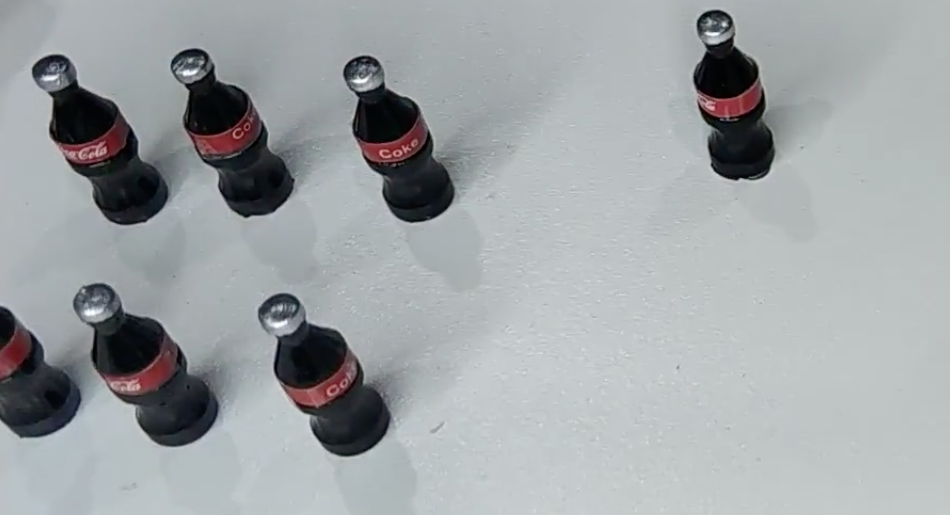

同级比较，深度优先
## 新节点创建 

旧的节点不存在，新的节点创建，意味着完整的创建（把树的所有dom节点完全创建即可）

## 节点删除

旧的节点存在，新的节点不存在，意味着真实节点完全删除

## 新旧节点同时存在

1. 两个节点是否是相同节点-- key和元素类型

2. 是相同节点 样式更新

::: tip
1. 旧的节点没有child  新节点有 追加

2. 旧的节点有child 新的没有child 旧的删除节点就可

3. 文本节点  新的元素  删除文本节点再做操作

4. 如果都是文本节点 更新文本即可
:::

3. 是否是元素DOM是否有child 比较child差别  深入优先

遍历查到--js

vue 假设 首尾比较
 
如果第一个相同就不需要循环第一个了 child按打补丁递归就可

剩余一个新增即可

### 旧节点删除
总体首尾比较之后批量删除即可

比较步骤
新的第一个节点查到旧节点所在的位置--找到后更新属性--移动位置

依次查到比较 旧节点多余删除  新的有新增的新增

